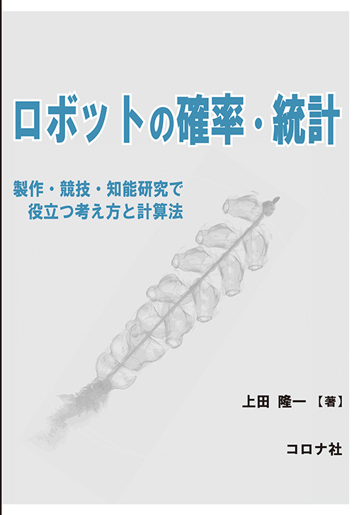

<!-- footer: 0mはアカン -->

# $\dagger$年末年始特別講義$\dagger$ なんで◯◯チャレンジ本番でロボットが動かないのか

千葉工業大学 上田 隆一

This work is licensed under a <a rel="license" href="http://creativecommons.org/licenses/by-sa/4.0/">Creative Commons Attribution-ShareAlike 4.0 International License</a>.

---

<!-- paginate: true -->

## このスライド作った理由

- 2024年のつくばチャレンジで、うちの学科のチームの複数台のロボットがほぼ0mで終了
    - 右の本の2章で釘を刺していたにもかかわらず
- 見ていて思ったこと
    - バグやミスの防ぎ方について勉強の途上
    - そもそも0mがどれだけアカンのか意識が薄いような気が（こっち先に説明します）

---

### なぜ0mはダメなのか ―その1: 主催者の思いをちゃんと受け取っているか？

- Q. たとえばつくばチャレンジでは「本走行」が1回に限定されているのはなぜ？
- A. 第11回ロボット大賞日本機械工業連合会会長賞の記事(https://www.robotaward.jp/winning/index.html) から
    - 「何が起こるかわからない実環境で、しかもやり直しのきかない1回の本走行で確実に走らせるためには、あらゆる状況を想定し、実験を繰り返して成功率を高めておかなければならず、これが各チームの技術力向上につながっています。」

チームの技術力向上に疑問が発生

---

## なぜ0mはダメなのか ―その2

- 引き継ぎの面
    - 先輩の積み上げを台無しに 
    - 後輩の指針にならない
- 時間がたつと本走行の記録しか残らなくなる
    - 実験ではどうだったとかは見られない

---

