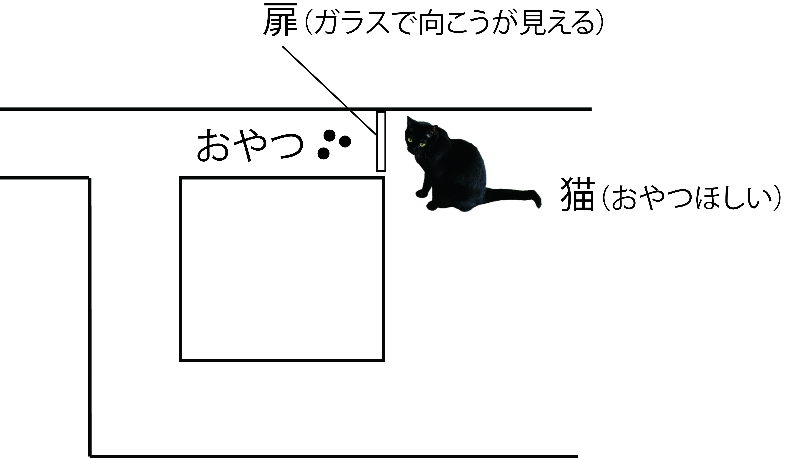
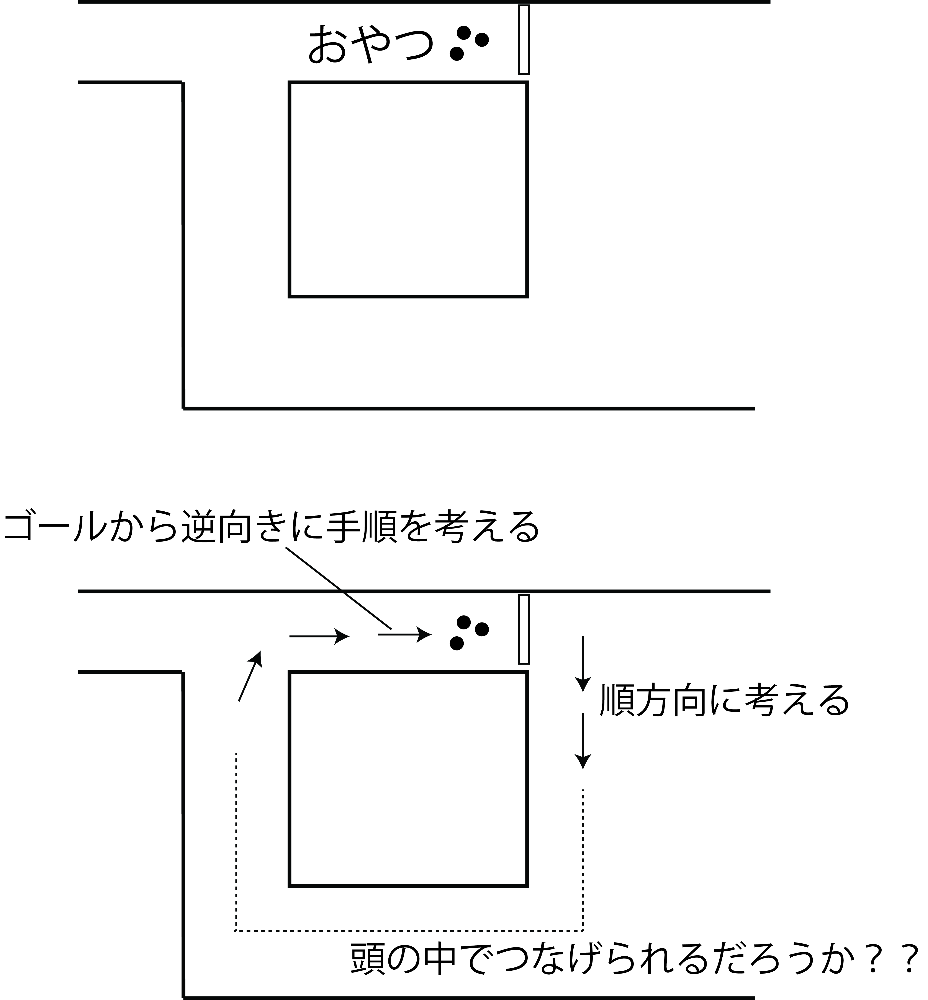

<!-- footer: 千葉工業大学・松本工業高校連携授業 -->

# 移動ロボット入門

千葉工業大学 上田 隆一

---

<!-- paginate: true -->

## 自己紹介

- 上田隆一という名前です
- ロボットの研究者です
- 長くなるので[続きはウェブで](https://ja.wikipedia.org/wiki/上田隆一)

---

## 宣伝: 本買って

- 左から順に
    - Linuxの本
    - ロボットの本（今日話する内容）
    - ロボットで使う数学の本

    

---

## 今日のテーマ

- 知能ってなんだろ？

---

## ある問題

- 登場人物（人物じゃないけど）
    - うちの猫様
    - 美味しいおやつ
    - 通路・扉
        - 扉は猫には開けられません
- 猫様はおやつまでたどり着けるだろうか？

---

## 答え: できない

- 扉の下に手を突っ込んでガリガリして諦める

<iframe width="560" height="315" src="https://www.youtube.com/embed/JmONWX1IWAk?si=kmL8VdtQict3X7Rn" title="YouTube video player" frameborder="0" allow="accelerometer; autoplay; clipboard-write; encrypted-media; gyroscope; picture-in-picture; web-share" referrerpolicy="strict-origin-when-cross-origin" allowfullscreen></iframe>

---

## ここで質問

- 人間なら簡単なのに猫には難しいのはなんで？
- 逆に言うと、おやつのところまで行くには何が必要？
    - 人間は何をしている？
    - 脳にどんな機能が必要？

---

## 答えあわせ

- 俯瞰ができていない（疑惑）
    - 猫の頭の中に地図はあるだろうか？
    - 自分の見ている風景が地図のどこに相当するか理解できてる？
- 計画ができていない（これは確実）
    - 頭の中でおやつの場所に行くまでの手順が思い浮んでなさそう

---

## 問題を難しくすると 人間にも難しい

- 複雑な迷路だと人間にも大変
- 迷路でなく人生だと？
    - 俯瞰できないから遊んでしまう
    - 俯瞰している親や先生の言うことを素直に聞かない
- 注意
    - 息抜きは大事・聞きすぎも問題
    - 親も先生も完全には俯瞰できてない

---

## 無駄話はこれまで

- 今の話をふまえると自分で考えるロボットをどう作ればよいでしょう？どうしたらロボットが自分で仕事ができるようになる？
    - 注意: 前のスライドは忘れましょう（ごめんなさい）
    - 猫と人間の差で考えたけど，そもそも猫の部分（身体や脳など）も作らなければならない

いっしょに考えていきましょう

---

## ・・・といいつつ最後の無駄話

- 実は動物は「地図」を頭に持っている

---

- 複雑な道を目的地まで行くロボットをプログラムしたい。どうやって？
    - 前のページと同じで「地図」と「手順の算出（計画）」が必要
    - さらには猫や人間の目に相当する機能を実装しなければならない
        - カメラだけじゃなくて画像から必要な情報を計算するソフトウェアも
- どうやって作るか想像してみましょう
    - 具体性もないのに「人を助けるロボットを作りたい」とか目を輝かせて夢みたいなことを無責任に言ってませんか？

とても大変・とても難しい

---

## 頭の中の地図

