<!-- footer: 2025翠陵1 day Campus -->

# 知能ってなんだろう

千葉工業大学 上田 隆一

This work is licensed under a <a rel="license" href="http://creativecommons.org/licenses/by-sa/4.0/">Creative Commons Attribution-ShareAlike 4.0 International License</a>.

---

<!-- paginate: true -->

## 自己紹介

- 上田隆一という名前です
- ロボットの研究者です
- 長くなるので[続きはウェブで](https://ja.wikipedia.org/wiki/上田隆一)

---

## 宣伝: 本買って

- 左から順に
    - Linuxの本
    - ロボットの本（今日話する内容）
    - ロボットで使う数学の本

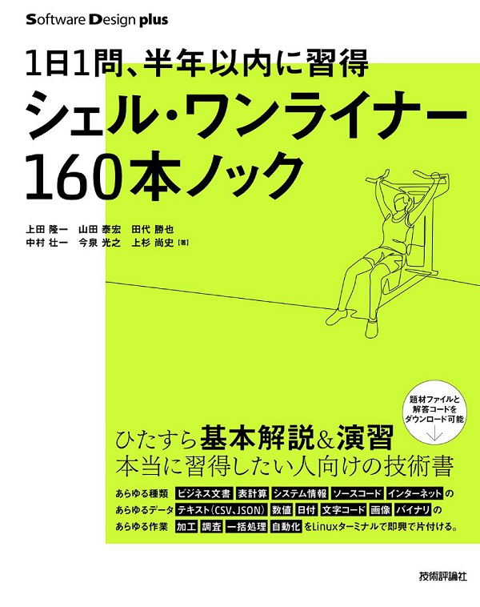  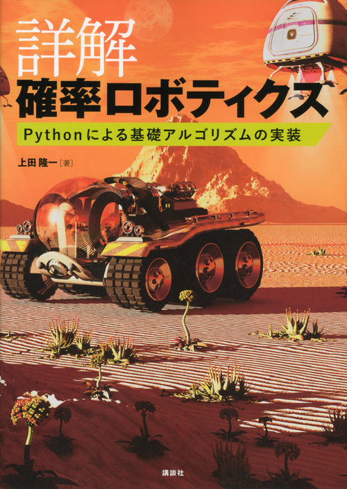  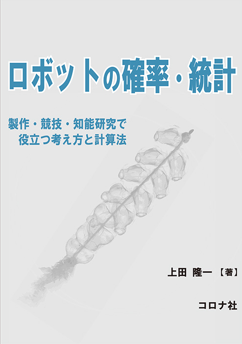

---

## 今日のテーマ

- 知能ってなんだろ？

---

## ある問題

- 登場人物（人物じゃないけど）
    - うちの猫様
    - 美味しいおやつ
    - 通路・扉
        - 扉は猫には開けられません
- 猫様はおやつまでたどり着けるだろうか？

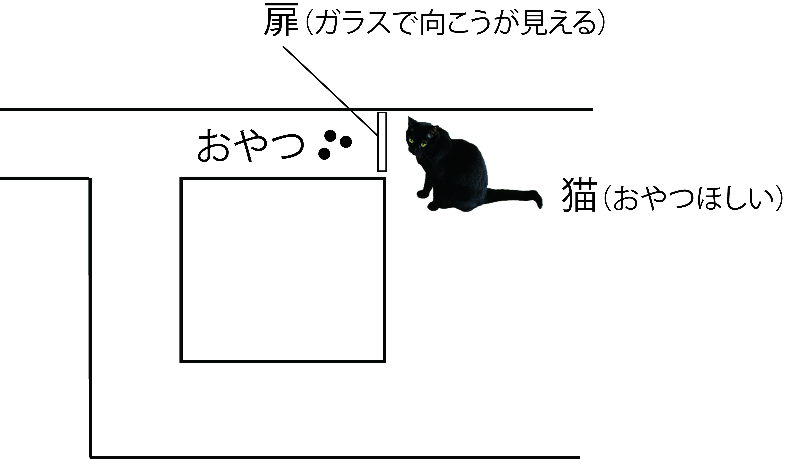

---

## 答え: できない

- 扉の下に手を突っ込んでガリガリして諦める

<iframe width="560" height="315" src="https://www.youtube.com/embed/JmONWX1IWAk?si=kmL8VdtQict3X7Rn" title="YouTube video player" frameborder="0" allow="accelerometer; autoplay; clipboard-write; encrypted-media; gyroscope; picture-in-picture; web-share" referrerpolicy="strict-origin-when-cross-origin" allowfullscreen></iframe>

---

## ここで質問

- 人間なら簡単なのに猫には難しいのはなんで？
- 逆に言うと、おやつのところまで行くには何が必要？
    - 人間は何をしている？
    - 脳にどんな機能が必要？

---

## 答えあわせ

- 俯瞰ができていない（疑惑）
    - 猫の頭の中に地図はある？
    - 自分の見ている風景が地図のどこに相当するか理解できてる？
- 計画ができていない（これは確実）
    - 頭の中でおやつの場所に行くまでの手順が思い浮んでない
- 補足
    - 猫は数キロ先から家に戻ってくる能力がある

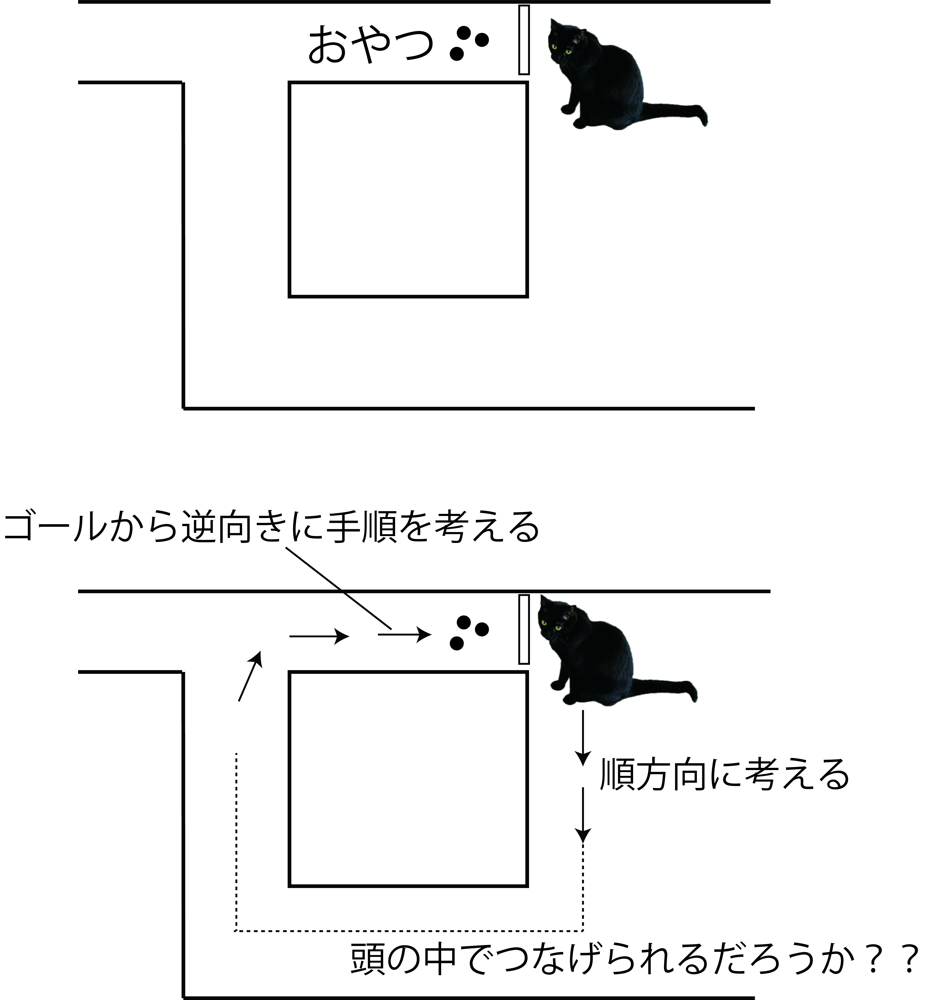

---

## 問題を難しくすると人間にも難しい

- 複雑な迷路だと人間にも大変
- 迷路でなく人生だと？
    - 俯瞰できないから遊んでしまう
    - 俯瞰している親や先生の言うことを素直に聞かない
- 注意
    - 息抜きは大事・聞きすぎも問題
    - 親も先生も完全には俯瞰できてない

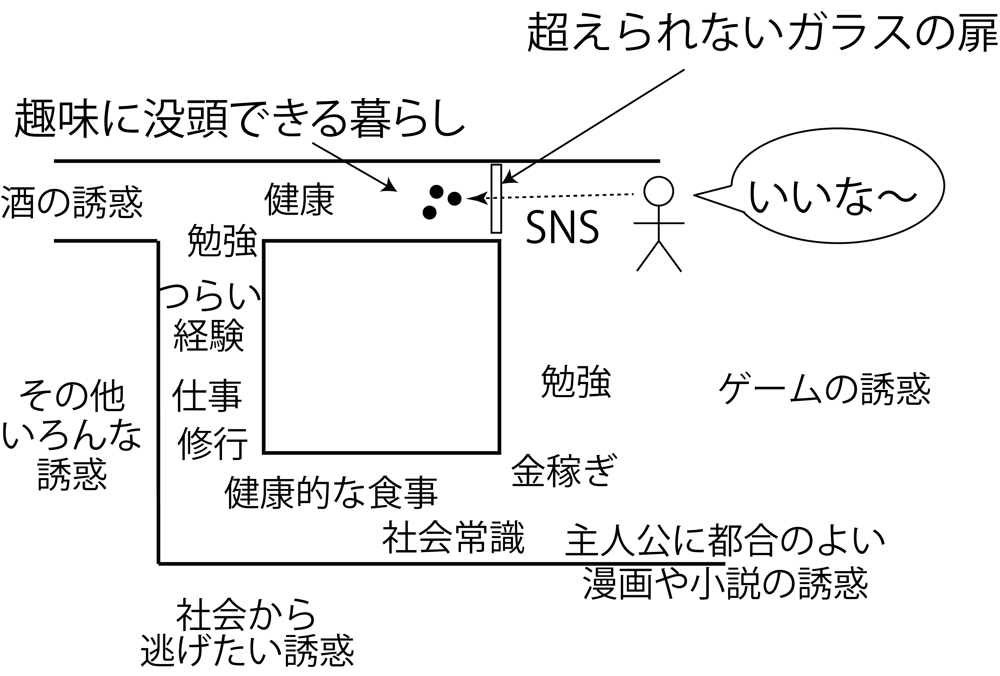

---

## ここまでのまとめ

- 今の話をふまえると、知能はこういうことをやる（移動に限らず）
    - 目標を把握する
    - 目標までの道のりを計画する
        - なにがあるかを知る必要がある
        - 自身の現在地を知る必要がある
        - 手順を考える必要がある

---

## 移動ロボットの話

- 仕事: 指定された場所に移動
   - さっき猫ができなかった問題
- とりあえず次のような問題を考える
   - ロボットがどこかに置かれる
       - 右図のようなやつ
   - ゴールがどこかロボットに教えられる
   - ロボットが自分でゴールまで行く

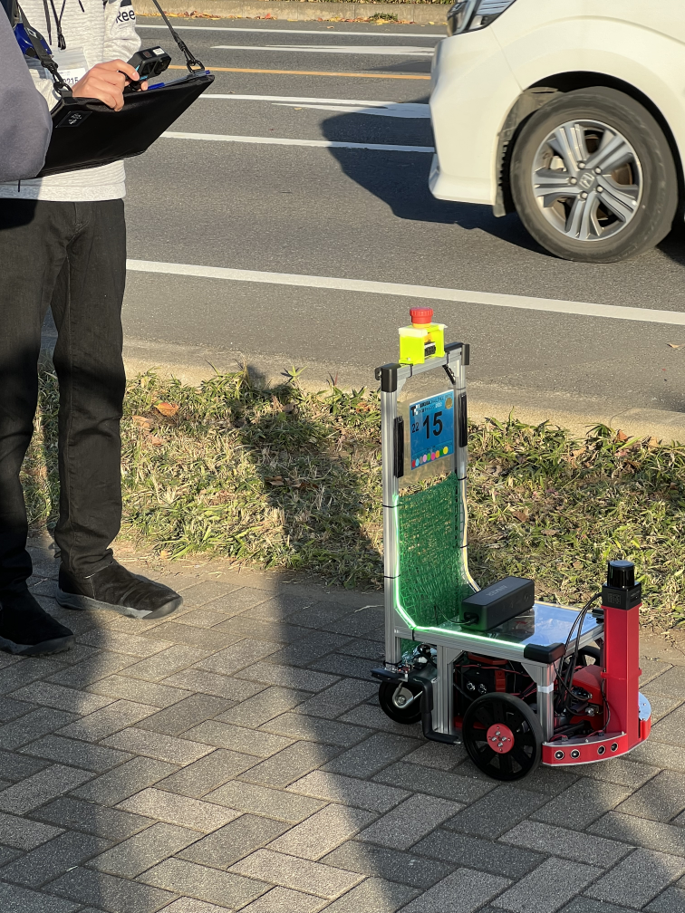

---

## 移動ロボットのハードウェア

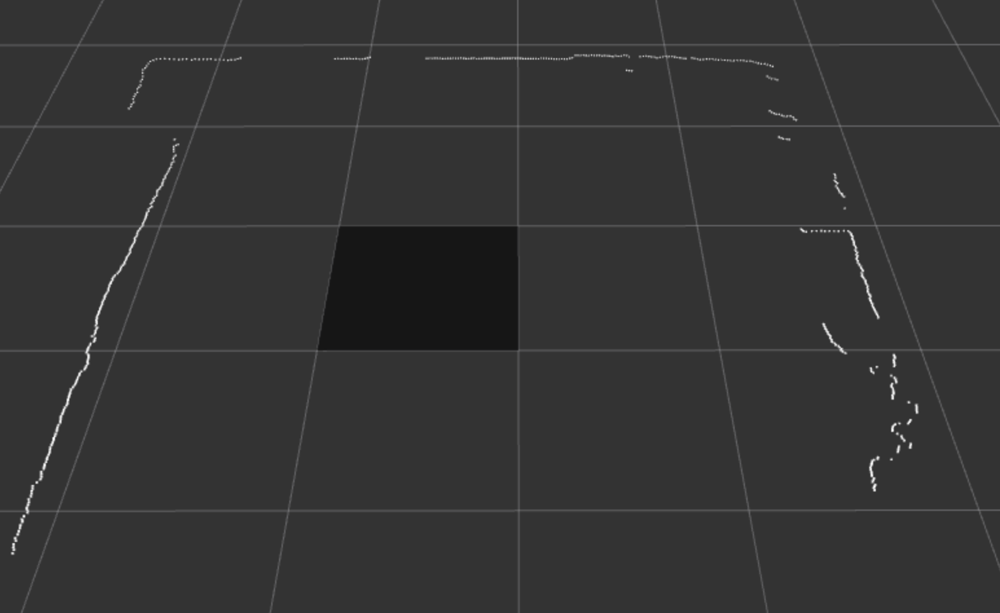

---

## 地図づくり

- ロボットを人間が操作してロボットのセンサでセンシング
- ずれないようにつなげていく
    - つなげかた（[大学の講義資料](https://ryuichiueda.github.io/slides_marp/prob_robotics_2024/lesson10.html)）
    - 右図: できた地図
        <iframe width="560" height="315" src="https://www.youtube.com/embed/b2kYQ11PUSI?si=3VsJxUuX92oP6DZT" title="YouTube video player" frameborder="0" allow="accelerometer; autoplay; clipboard-write; encrypted-media; gyroscope; picture-in-picture; web-share" referrerpolicy="strict-origin-when-cross-origin" allowfullscreen></iframe>

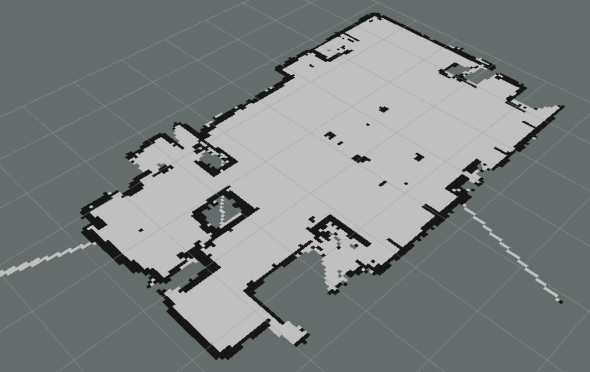

---

## 大きな地図の例

- 千葉工大の学内の地図
    - 左: 2次元のLiDARで作成
    - 右: 3次元のLiDARで作成
        - いずれもロボットを手動で走らせて作成、200m×300m

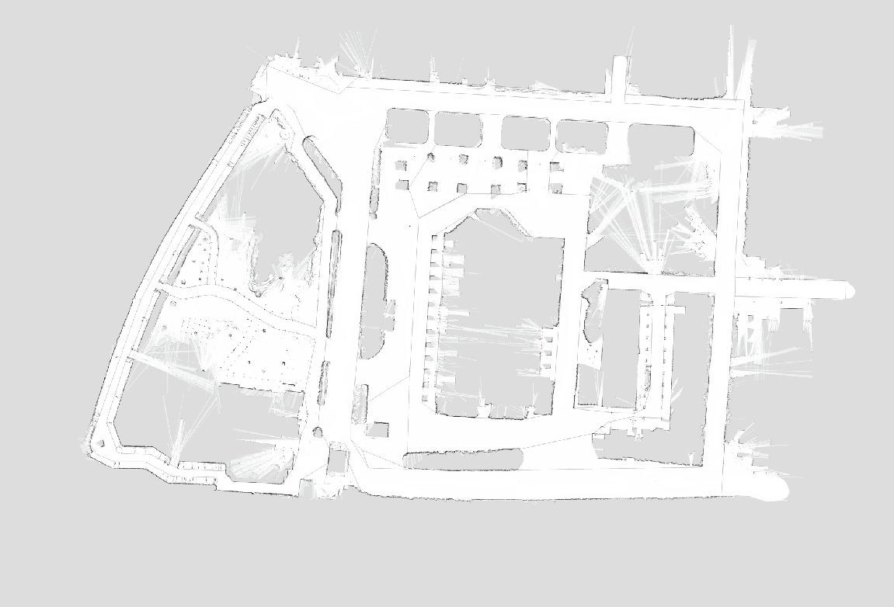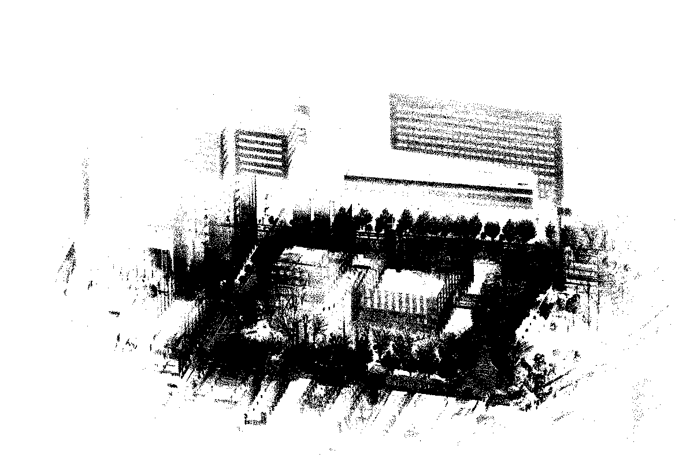

---

## 地図のなかでの位置計算

- よく使われる方法
    1. 地図のなかにロボットの分身をたくさんばらまく
    2. ロボットが動いたら分身も動かす
    3. センサのデータが入ったら、データと合わないところにいる分身を消す
        - 右図はLiDARではなくカメラで星を見たときの例
- 確率の計算となる（[講義資料](https://ryuichiueda.github.io/slides_marp/prob_robotics_2024/lesson7.html)）

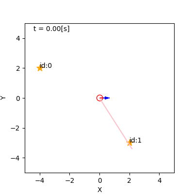

---

## 位置計算しながら走るロボット

- 動画の見かた
    - 緑が「分身」、赤が推定位置を基準に地図に描いたLiDARのデータ
    - 経路は人間が与えている
- 動画のみどころ: ウェイポイント26〜27間で分身が広がる
    - 坂道 + 十字路のはずが工事中で地図とセンサからのデータに不整合

<iframe width="560" height="315" src="https://www.youtube.com/embed/Dgd2tOCEYno?si=f7AvpZpB1w-TfSS_&amp;start=2211" title="YouTube video player" frameborder="0" allow="accelerometer; autoplay; clipboard-write; encrypted-media; gyroscope; picture-in-picture; web-share" referrerpolicy="strict-origin-when-cross-origin" allowfullscreen></iframe>

---

## 目的地への移動

- どうすれば行けるでしょうか？
    - 様々な方法がある

---

## **r**apidly exploring **r**andom **t**ree（RRT）[LaValle1998]

- スタートあるいはゴール地点から枝をのばしていき、スタートとゴール地点を結ぶ経路を見つける手法
    - 移動ロボットではあまり使わないが、ロボットの腕のようにもっと複雑な制御対象によく使われる
- 右の例: [AtsushiSakai/PythonRobotics](https://github.com/AtsushiSakai/PythonRobotics)で作成
    - 障害物$\circ$のなかにある2つのxの間を緑の枝で接続

---

## A*[Pearl1984]などの探索手法

- スタートあるいはゴール地点からもう片方の地点を少しずつ探していく
    - なるべく早くゴールが見つかりそうな向きを優先させる
    - $\rightarrow$優先方法の違いで様々な手法
        - 途中が迷路みたいになっていると、どの手法もたいして違いが出ない

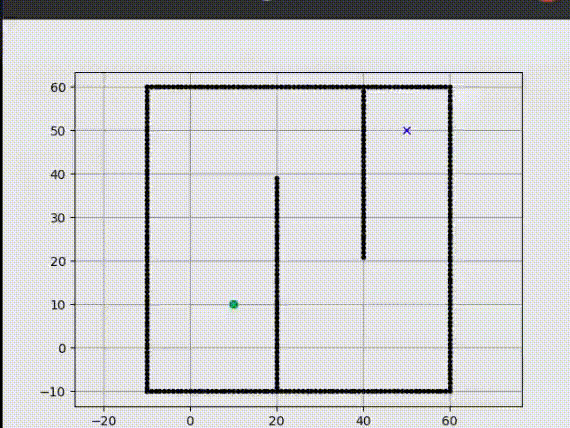

---

## もっと過激な方法[Ueda2023]

- 価値反復[Bellman1957]を利用
    - 全通りの位置や向きからゴールまでの時間を計算
        - 全部計算しないと正しい結果が出ないので
        - 時間がかかる$\rightarrow$高いコンピュータで制圧
    - 計算結果を使って時間が減る方向にロボットを誘導
- 例: 右図の環境で、水たまりを避けて🚩まで行く
    - 下図のように🚩から時間が決まっていく

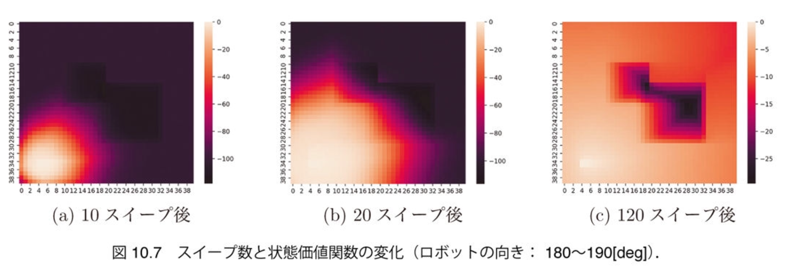

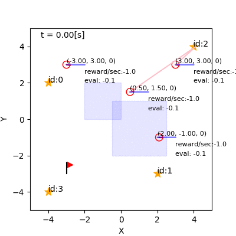

---

## 価値反復で動くロボット

- 左: 事前計算した結果を利用
    - ボールへの寄り付きとキーパーの守備に
- 右: 動く障害物も地図に取り入れて常に時間を計算
    - 効率よく確実に動く
    - ただしバッテリーがどんどん減る

<iframe width="560" height="315" src="https://www.youtube.com/embed/cqDU4zmgQSY?si=yhn73i65k2ombzvm" title="YouTube video player" frameborder="0" allow="accelerometer; autoplay; clipboard-write; encrypted-media; gyroscope; picture-in-picture; web-share" referrerpolicy="strict-origin-when-cross-origin" allowfullscreen></iframe><iframe width="560" height="315" src="https://www.youtube.com/embed/n7LXx50gl9g?si=4fcoDk3cdeUNf-uO" title="YouTube video player" frameborder="0" allow="accelerometer; autoplay; clipboard-write; encrypted-media; gyroscope; picture-in-picture; web-share" referrerpolicy="strict-origin-when-cross-origin" allowfullscreen></iframe>

---

## 最近の研究での話題1: end-to-end学習

- カメラやLiDARで何かを見せて人工ニューラルネットワークに決めさせる
    - 人工ニューラルネットワーク: 脳の回路や計算方法をコンピュータで再現したもの
- 「地図与えて位置計算して経路を計算して・・・」より手っ取り早い
- 下図: 林原研究室の実験 [岡田 SI2021]

<iframe width="560" height="315" src="https://www.youtube.com/embed/bifynZ13QE4?si=GRxeryk1tPV-lCOt" title="YouTube video player" frameborder="0" allow="accelerometer; autoplay; clipboard-write; encrypted-media; gyroscope; picture-in-picture; web-share" referrerpolicy="strict-origin-when-cross-origin" allowfullscreen></iframe>

---

## 最近の研究での話題2: 自由エネルギー原理（最近ではないけど）

- 動物はこの式の値を最小にするように動いているのではないか？
    - $F= D_\text{KL}[q(\boldsymbol{w}) || p(\boldsymbol{w} | \boldsymbol{z})] + \{ - \log_e p(\boldsymbol{z}) \}$
        - $\boldsymbol{z}$: いままでの五感での経験（見たものとか）
        - 右辺最初の項（認識・理解の項）: 認識と現実のズレ
            - $\boldsymbol{w}$: 知りたいこと
            - $p$: $\boldsymbol{z}$から導かれる、知りたいことに対する確率分布
            - $q$: 知りたいことに対する頭の中の認識
                - 確率分布であり、構造は神経回路で決まる
        - 右辺2番目の項（サプライズ項。行動の項）: 頭の中の認識と$\boldsymbol{z}$のズレ
            - 違和感があると値が増える$\rightarrow$違和感のないように行動
    - たぶん猫より人間のほうが$q$の表現力が高い

---

## まとめ

- ロボットの知能（特に移動する知能）について考えた
    - 移動に関する知能
        - 猫を見ていると動物の中でも高度な知能と気づく
            - 地図が頭にある
            - 地図の中でどこにいるのか把握する
            - 目的地まで行く計画を立てて（誘惑に負けずに）実行
    - 問題を人生のプランニングにまで拡張すると人間でも難しい
- ロボットが移動するための仕組みを勉強
    - 何をしているかは分かったはず
    - でも、自分で作れますか？（作るためのプランニングと実行が必要）

---

---

## ・・・といいつつ最後の無駄話

- 「地図」を頭に持っている動物がいる
    - 特定のところに行くと反応するようになる場所細胞
       - 自分の見ているものや動きの感覚（主観）を「場所」という客観的なものに変換
- 他，移動や環境の形状に反応する脳細胞が存在

出典: 場所細胞: Stuartlayton at English Wikipedia, CC BY-SA 3.0, via Wikimedia Commons, https://commons.wikimedia.org/wiki/File:Boundary_cell.png. 格子細胞: Khardcastle, CC BY-SA 4.0, via Wikimedia Commons, https://commons.wikimedia.org/wiki/File:Autocorrelation_image.jpg. ボーダー細胞: Tom Hartley, Colin Lever, Sarah Stewart, CC BY-SA, via Wikimedia Commons, https://commons.wikimedia.org/wiki/File:Boundary_cell.png

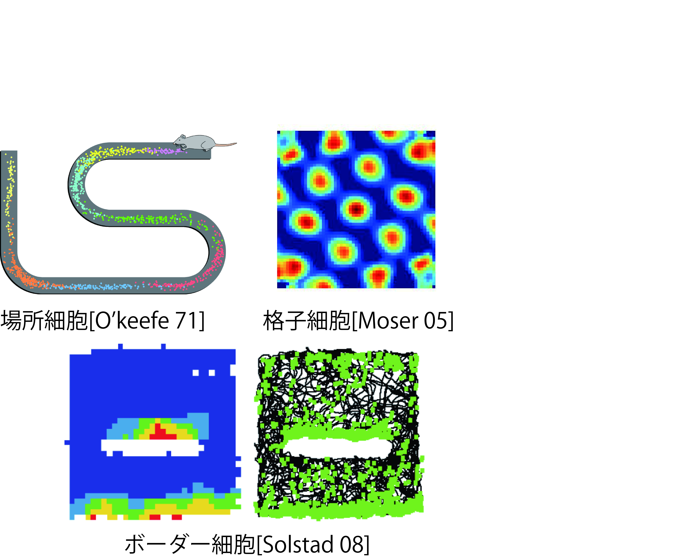
