<!-- footer: "2025年12月2日 RSJセミナー" -->

# 自律移動と最適制御

-大域計画, 障害物回避, 機械学習, 潜在空間, 伝統的な制御の統一的な理解のために-

千葉工業大学 上田 隆一

 

This work is licensed under a [Creative Commons Attribution-ShareAlike 4.0 International License](https://creativecommons.org/licenses/by-sa/4.0/).

---

<!-- paginate: true -->

## 今日やること

- 本日の話の動機（これだけで終わらないようにします）
- 探索問題と最適制御の接続
- ベルマン方程式とポントリャーギンの最大原理
- 潜在空間での制御
- その先

---

## この発表の動機: 「みんな仲良く」

- 自身の経験
    - 制御ゴリゴリの人と学習の人で会話が合わない
        - 同じはずなんだけどなあ・・・
    - 価値反復使ってたら「なんで学習でやらないんですか？」と質問された
        - 同じはずなんだけどなあ・・・
    - 制御をポントリャーギンの最大（最小）限理から考えている人とベルマン方程式から考えている人で会話が合わない
        - 同じはずなんだけどなあ・・・
- 自分の頭の中ではみんな同じ
    - 頭の中をさらけだして皆さんにお前はおかしいと叱ってもらいたい
    - もし今日の話に一理でもあるなら相互に理解が深まるはず

---

## 今日の話がうまくできるかどうか分からないので

- 考えはこの本の9章に書いてあります
    - 誰も9章まで辿り着いてないのではないか？
        - 青色の本でもオレンジ色の本でも同じ現象
    - お食事中の方すみません

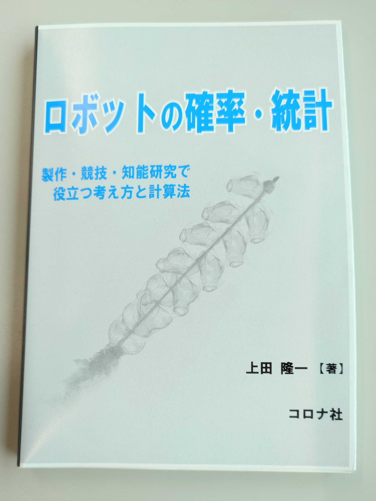

---

## 探索から制御問題へ

---

### 話の出発点: ロボットの大域経路計画（探索）

- 実空間中にロボットの現在地から目的地まで線を引く
    - ダイクストラ、A*、RRT、...
        - いまだ現役
- 一方、移動ロボットや自動車を自律移動させることは難しい
    - 自己位置推定がずれる（今回は直接扱わず）、 障害物をうまく避けれない、・・・

$\qquad\qquad$図: [AtsushiSakai/PythonRobotics](https://github.com/AtsushiSakai/PythonRobotics)で作成

---

### 一般的なアプローチ: 問題の分割

- 大域計画+諸問題の解決
    - 大域計画+障害物回避
- だいたいの場合、これで問題ない
    - 現場であれば問題が出たらまた潰せば良い
- 本当にこれで問題ない？
    - 理論上解決できないのか？
    - 根本から解決する方法はないのか？

$\Longrightarrow$問題を整理しましょう

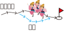

---

### ナビゲーション（大域+局所）の問題 = 制御

- 探索は手段であって、制御問題と考えることが妥当
- 制御: 好ましく無い状態$\boldsymbol{x}$を、好ましい状態の集合$\mathcal{X}_\text{f}$に持っていく
    - なにか力$\boldsymbol{u}$を加えて

|現象|制御|
|:---:|:---:|
|機械が振動している|振動してない状態に戻したい|
|ライントレースのロボットがラインからずれた|ライン中央に戻したい|
|洗濯物が洗濯機の中に|畳んで収納したい|
|ロボットが目的地でない場所に|目的地にいる状態にしたい|

大雑把に考えると全部同じ

---

### 大雑把な枠組みの制御問題: 最適制御問題

マルコフ決定過程（MDP）でもあるけど最適制御と言います

- 状態$\boldsymbol{x}$を終端状態の集合$\mathcal{X}_\text{f}$の任意の要素$\boldsymbol{x}_\text{f}$まで導きたい
    - $\boldsymbol{x}$には速度や時間、制御不可能なものの変数も入れられる
- $\boldsymbol{u} \in \mathcal{U}$という力をかけると次の時刻に状態$\boldsymbol{x}$が$\boldsymbol{x}'$に遷移
    - $\boldsymbol{x}' \sim p(\boldsymbol{x} |\boldsymbol{x}, \boldsymbol{u})$
         - ※とりあえず離散時関系で考えます
- 状態遷移にはコスト: $\ell(\boldsymbol{x}, \boldsymbol{u}, \boldsymbol{x}')$
    - 「時間消費」、「エネルギー消費」、「危険性」などを点数化
- 終端状態にも点数: $V(\boldsymbol{x}_\text{f})$
- コストの総和$\sum \ell + V(\boldsymbol{x}_\text{f})$を最小化したい

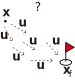

---

### 単純な大域計画の問題の場合

- 問題
    - $\boldsymbol{x}$: ロボットの位置（2次元）
    - $\boldsymbol{u}$: 前後左右（状態遷移: 決定論的）
    - $\ell(\boldsymbol{x}, \boldsymbol{u}, \boldsymbol{x}') = 1$step
    - $V(\boldsymbol{x}_\text{f}) = 0$
- 右図: 問題と解の例
- 重要
    - 状態ごとに終端状態までのコストが見積もれる
    - 最良の$\boldsymbol{u}$を選ぶと1ステップのコストとコストの見積もりの減少が釣り合う
    - いまの状態$\boldsymbol{x}$と解は無関係

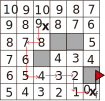

---

### 最適制御問題の解の性質（どう解くかという話とは別）

- 「釣り合い」の式: ベルマン方程式
    - $V^*(\boldsymbol{x}) = \min_\boldsymbol{u} \big\langle V^*(\boldsymbol{x}')+\ell(\boldsymbol{x}, \boldsymbol{u}, \boldsymbol{x}')\big\rangle_{p(\boldsymbol{x}'|\boldsymbol{u},\boldsymbol{x})}$
        - $V^*$: 最適状態価値関数（最適な値関数）
- $V^*$から各状態で最適な行動$\boldsymbol{u}^* = \boldsymbol{\pi}^*(\boldsymbol{x})$が得られる
    - $\boldsymbol{\pi}^*$: 最適方策
- もう一つ重要: 最適でなくても方策$\boldsymbol{\pi}$に対して$V^\boldsymbol{\pi}$が存在
    - $V^\boldsymbol{\pi}(\boldsymbol{x}) = \big\langle V^\boldsymbol{\pi}(\boldsymbol{x}')+\ell(\boldsymbol{x}, \boldsymbol{u}, \boldsymbol{x}')\big\rangle_{p(\boldsymbol{x}'|\boldsymbol{u},\boldsymbol{x})}$
        - ここで$\boldsymbol{u} = \boldsymbol{\pi}(\boldsymbol{x})$

---

### 探索で得られる大域計画の解の性質

- 1本道の方策$\boldsymbol{\pi}$ができている
    - 右図の矢印
    - 最適である保証はない
    - 経路からちょっと外れたところは基本無視
    - $p(\boldsymbol{x}'|\boldsymbol{x},\boldsymbol{u})$を決定論的に解釈
- $V^\boldsymbol{\pi}$は方策を求めるついでに計算されている
    - 単なる概算
    - 途中の計算で周辺の$V$も求められるが捨てられがち
- 状態遷移は確率的ではない

きっちり方策通りにロボットが動けば問題はない、が

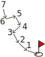

---

### よく問題になること: 経路のチャタリング

- 経路を再計算したら変わった/また計算したら戻った
    - 再計算が必要になる場合
        - 自己位置推定の結果がジャンプした
        - 障害物の出現
        - もっと良いルートの探求
- チャタリングは危険
    - 下手にプログラムすると中途半端な動きに
        - 自動車: 中央分離帯で死ぬ（よくある事故）
        - なぜか自動車より遅い移動ロボットでも起こる
            - ROSのNavigation Stackのサンプル

（小手先で解決できるかもしれないが）根本的な原因は？

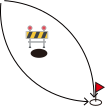

---

### 「事故もゴール（終端状態）」という考え方の欠如

終端状態$\mathcal{X}_\text{f}$の設計に問題がある

- 「ゴールに行く方策」だけを解いており、「何にもぶつからない方策」を、厳密な意味で解いていない
    - なにかあってぶつかりそうになったときに無策
- 「厳密に解く」: 危ない状態はゴール
    - $V(\boldsymbol{x}_\text{f})$を大きな値で固定
        - $\boldsymbol{\pi}$は危ない状態を避ける制御則に
        - ゴールに行く・危険回避を統一的に解ける
- 探索では「境界条件」として扱ってしまっている
    - 制御の分野でも無批判に「制約条件」と置いてしまいがち

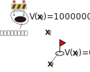

---

### 探索結果+危険回避の組み合わせはダメ？

- OK。ただし互いに矛盾しないように（難しい）
    - 矛盾がない: 両方の方策から計算される$V^\boldsymbol{\pi}$に停留点がない
        - 問題は1つなのに2つ別の方策$\rightarrow$矛盾
- よくある矛盾
    - 角曲がりたい↔角の壁から遠ざかりたいで無限ルーブに
    - 同じ状態で別の方策が混在
        - 1994年の名古屋空港での中華航空機の事故
            - 着陸したいパイロットと地面から離れたいオートパイロット

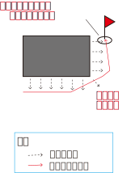

---

### 危険回避は確率的な状態遷移から自然に求めたほうがよい

計算量が大きいことはさておき

- 確率的な状態遷移を使う（探索では無理）
    - 自動車やロボットの動きには再現性がない
        - 路面の状況、風、内部のガタなど
    - 狭い通路の端を走るとぶつかる可能性を表現できる（右図上）
    - 通路中央に$V^*$の谷が計算される（右図下）$\rightarrow$ロボットが中央を自然に走る

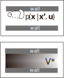

---

### そんなふうに制御問題を解いてる例はあるのか？

- 実はある（一長一短という話は一旦棚上げして）
    - 強化学習と価値反復
- 例: [白地図を持たせたロボットの価値反復でのナビゲーション](https://www.youtube.com/watch?v=v-oTxhL60DQ)[上田RSJ2022]
    - 価値反復
        - 強化学習をモデルベースで解く方法（説明が逆ですが）
        - MPCを最後まで解いてしまう方法（これも説明が逆ですが）
        - 確率的な状態遷移を扱える
    - 障害物を見つけると避けるように$V^\boldsymbol{\pi}$と$\boldsymbol{\pi}$が計算される
        - ゴールに行く経路はあとから計算される
- [実機での障害物回避の例](https://www.youtube.com/watch?v=n7LXx50gl9g)[Ueda2023]
    - 速度が状態に入る自動車でも、原理的には適用可能（計算量の点では困難）

---

### ここまでのまとめ

- 移動ロボットの経路計画を最適制御の観点から考えた
    - 探索を使う場合、次の問題への適切な対処が必要
        - チャタリングの問題
        - ゴールへの移動と危険回避行動が同時に扱えない問題
        - 確率的な状態遷移が考えられない問題
- さらに一言
    - 方策を貼り合わせる手法を論文に書くときは上記の問題にちゃんと触れてほしい
    - 「強化学習は安全性に疑問が・・・」という意見は本当か？
        - 学生のとき、MCLのときにもおんなじことを言われた

---

## 探索以外の手法について

- そもそもなんでこのような話をしているのか

---

### 制御問題の記述

- 確率ロボティクスの本質の個人的な解釈
    - 状態方程式を確率モデルで表すこと
        - 状態方程式: $\boldsymbol{x}_t = \boldsymbol{f}(\boldsymbol{x}_{t-1}, \boldsymbol{u}_t) + \boldsymbol{\varepsilon}_\text{motion}$
        $\Longrightarrow$$x_t \sim p(x|x_{t-1},u_t)$
        - 観測方程式: $\boldsymbol{z}_t = \boldsymbol{h}(\boldsymbol{x}_t) + \boldsymbol{\varepsilon}_\text{obs}$
        $\Longrightarrow$$z_t \sim p(z|x_t)$
            - 太字にしなかった理由: ベクトルから記号を一般化
    - 自己位置推定やSLAMはその派生であって本質ではない
        - 2005年ごろからそう思っているけど世の中はそう思ってない

---

### 確率モデルで表現することで失うもの/得られるもの

状態方程式: $x_t \sim p(x|x_{t-1},u_t)$
観測方程式: $z_t \sim p(z|x_t)$

- 失: 一般化されすぎていて既存の制御理論から離れるか、再解釈が必要になる
    - リアプノフやポントリャーギンの話、あらゆる微分方程式の話
    - 再解釈の例: グラフ上で微分を定義してなにかするなど（学部のときの指導教官の故湯浅先生の研究）
- 得: 状態$x$や制御（行動）$u$の解釈が自由に
    - 確率モデルが決められればなんでもよい
        - ややこしい実世界を扱うには都合がよい
    - 当時のロボット周辺で取り入れていた分野: （強化）学習と確率ロボティクス

---

### 確率モデル+ベルマン方程式の面白さ

- 「$p(x|u,x')$さえ決まっていれば状態$x$はなんでもよい」
    $\Longrightarrow$状態空間に距離や内積はいらないかもしれない
    - むしろ$\boldsymbol{\pi}^*$、$V^*$が距離のようなものの定義に
        - なめらかで矛盾がない
        - いずれかをうまく表現するとロボットが動く
- この面白さが出ている典型的な例（議論の余地あり）
    - 強化学習で脚ロボットがよく歩くのは、
    特異点の問題から解放されているから？
- ニューラルネットの内部状態が微分（誤差逆伝播）で生成されるのがまた面白い

---

### どこをモデル化するのか

- 実世界を厳密に、滑らかにモデル化するのではなく、内部状態の空間を滑らかにすることが正解かもしれない
    - 学習の分野の人が前から言っていたことで特に新しい視点でもないが、方法論が確立して顕在化
- 確率ロボティクス側からはこの考えが希薄だったかもしれない
    - ロボットを動かそうとすると、結局、状態をベクトルで表すことに

---

### 内部状態の構成（令和最新版）

- 変分オートエンコーダ、拡散モデル、フローマッチングが作る潜在空間や分布

---

## 以後ボツスライド

---

### 次の問題: 大域計画と局所計画との組み合わせ

- 問題: 突然の障害物の発見により$\boldsymbol{\pi}^*, V^*$が変化
    - いままで解いた$\boldsymbol{\pi}, V^\boldsymbol{\pi}$の見直しが必要
        - 完全に解き直してもよい
- よくやるアプローチ: 大域計画問題に局所計画問題を足す
    - 問題の2階建て
    - 何か問題でも？
        - だいたいの問題はこれまで話で説明できるが、もう1つ問題が増える
- 増える問題: 解くべき最適制御問題は1つなのにわざわざ別の問題を解き、そして解が矛盾

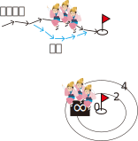

---

### 例: 大域計画器で経路生成、局所計画器で細かく制御する場合

（ROSのデファクトの方法）

1. 大域計画器の示すパスを局所計画器が履行しようとしたら無理だった（大域計画器が大雑把にしか環境を見ていない）
2. 局所計画器が大域計画器に無理だと伝える
3. 大域計画器は無理な理由が理解できないから再計画できない
- 上記は論外として、ナビゲーションと衝突回避のモード切替をするシステムでも、互いに矛盾させないことが重要

---

### 例: ウェイポイントナビゲーション

- ロボットの動作がぎこちなくなりがち
    - 自己位置推定がジャンプしてわざわざウェイポイントを踏みなおしに戻る
        - 実装が下手だと急旋回して自己位置推定が破綻
    - 経路がずれて途中飛ばしたほうがよさそうだが一応ウェイポイントを踏みに行く
        - これが実現できるくらいの制御器を持っていればウェイポイントはいらない

---

### 根本的な問題

- モード切り替えをするシステムでは、状態空間の次元が増える
    - $\boldsymbol{x}_\text{aug} = (\boldsymbol{x} ,$ mode$)$
        - 「mode」の例
            - 今はナビゲーションしているのか衝突回避しているのか
            - どのウェイポイントを目指しているのか
- 分けて簡単にしたつもりが逆に問題が難しく
    - $p(\boldsymbol{x}|\boldsymbol{x}', \boldsymbol{u})$が$p(\boldsymbol{x}|\boldsymbol{x}', \boldsymbol{u},$mode$)$に

---

- 「いまどの問題をロボットが解いているか」という状態変数が1つ増える
    - 気づきにくいが
- 軽く考えてはいけない
    - 航空機事故もこれで結構起こる（オートパイロットとマニュアルの切り替え）

---

### 探索と制御（本発表の結論？）

- 各地点のコストの計算: 制御問題
- 最適制御問題
    - 状態空間と状態を考える

---

## LLMでの制御

- Robotics Transformer 2
   - ひとつずつ動きを出力
- とりあえず少しでも価値が上がる行動をしていれば最終的にタスクは達成できる

---

## その先の話

- 次元の呪いが克服されたら？
- 現在の計算機と性能のオーダーが違う計算機の登場

---

- コスト: 状態（位置）$\boldsymbol{x}$に対して$V(\boldsymbol{x})$

---

### 最適制御問題の解の性質（どう解くかという話とは別）

最大原理で解くような問題でもうまく$\boldsymbol{x}$を設計すればこうなる

- ある制御則の解（方策）$\boldsymbol{u} = \boldsymbol{\pi}(\boldsymbol{x})$に対し、ひとつひとつの状態から終端状態までのコストの期待値が計算できる
    - 実数を返す関数$V^\boldsymbol{\pi}(\boldsymbol{x})$: 状態価値関数（値関数）
- 大域計画の問題で考えると、別に難しい話ではない
    - ある場所$\boldsymbol{x}$にいるとき、行き方$\boldsymbol{\pi}(\boldsymbol{x})$が決まっていれば、目的地までの時間の期待値$V^\boldsymbol{\pi}(\boldsymbol{x})$が見積もれる

$\qquad\qquad\qquad$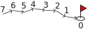

---

### $V$の性質（状態遷移が決定論的な場合）

- $\boldsymbol{x}$の価値は遷移先$\boldsymbol{x}'$の価値に遷移したときのコスト$\ell$を足したもの
    - $V^{\boldsymbol{\pi}}(\boldsymbol{x}) = V^{\boldsymbol{\pi}}(\boldsymbol{x}')+\ell(\boldsymbol{x}, \boldsymbol{u}, \boldsymbol{x}')$
       - ここで$\boldsymbol{u} = \boldsymbol{\pi}(\boldsymbol{x})$、$\boldsymbol{x}' = \boldsymbol{f}(\boldsymbol{x}, \boldsymbol{u})$
    - 例: ゴールまで7歩のところから1歩歩いたら、次の状態はゴールまで6歩に
- 補足: $\ell$は一般化できる
    - 「ここは悪路だからコストを倍に」ということをしても破綻しない（ので以後、歩数として話を単純化）

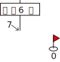

---

### 終端状態$\boldsymbol{x}_\text{f} \in \boldsymbol{X}_\text{f}$の扱い

- それ以上状態遷移しない状態
- $V^\boldsymbol{\pi}(\boldsymbol{x}_\text{f}) = 0$など、価値を固定しておく
- 他の状態の$V^\boldsymbol{\pi}$は$V^\boldsymbol{\pi}(\boldsymbol{x}_\text{f})$にしたがって決まる
    - $V^\boldsymbol{\pi}(\boldsymbol{x}_\text{f})$を底とするポテンシャル場に

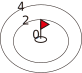

---

### 方策の改善と最適性

- もっと良い行き方$\boldsymbol{\pi}'(\boldsymbol{x})$があれば、時間の期待値が$V^{\boldsymbol{\pi}'}(\boldsymbol{x})$に短縮される
    - 方策を改善していくと収束
        - 収束した$V$: 最適状態価値関数$V^*$
            - $V^*(\boldsymbol{x}) = \min_\boldsymbol{u} \{ V^*(\boldsymbol{x}')+\ell(\boldsymbol{x}, \boldsymbol{u}, \boldsymbol{x}') \}$
            - まったく停留点のないポテンシャル関数に
        - $V^*$を与える方策: 最適方策$\boldsymbol{\pi}^*$
            - $\boldsymbol{\pi}^*(\boldsymbol{x}) = \arg\!\min_\boldsymbol{u} \{ V^*(\boldsymbol{x}')+\ell(\boldsymbol{x}, \boldsymbol{u}, \boldsymbol{x}') \}$

---

### 状態遷移が確率的な場合への拡張

- $V^{\boldsymbol{\pi}}(\boldsymbol{x}) = \big\langle V^{\boldsymbol{\pi}}(\boldsymbol{x}')+\ell(\boldsymbol{x}, \boldsymbol{u}, \boldsymbol{x}')\big\rangle_{p(\boldsymbol{x}|\boldsymbol{u},\boldsymbol{x}')}$
    - $\langle f(x) \rangle_{p(x)}$: 分布$p$のときの$f$の期待値
- 最適なとき（ベルマン方程式）
    - $V^*(\boldsymbol{x}) = \min_\boldsymbol{u} \big\langle V^*(\boldsymbol{x}')+\ell(\boldsymbol{x}, \boldsymbol{u}, \boldsymbol{x}')\big\rangle_{p(\boldsymbol{x}|\boldsymbol{u},\boldsymbol{x}')}$
    - $\boldsymbol{\pi}^*(\boldsymbol{x}) = \arg\!\min_\boldsymbol{u} \big\langle V^*(\boldsymbol{x}')+\ell(\boldsymbol{x}, \boldsymbol{u}, \boldsymbol{x}')\big\rangle_{p(\boldsymbol{x}|\boldsymbol{u},\boldsymbol{x}')}$
- この定式化のおもしろいところ
    - $\boldsymbol{x}$や$\boldsymbol{u}$はベクトルで表記しているけどその必要はない
    - $p(\boldsymbol{x}|\boldsymbol{u},\boldsymbol{x}')$さえ厳密に決まっていればよい
        - 距離の定義が空間になくてもよい
    - むしろ解の$V^*$が距離のようなものの定義になっている

