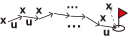

<!-- footer: "2025年12月2日 RSJセミナー" -->

# 自律移動と最適制御

-大域計画, 障害物回避, 機械学習, 潜在空間, 伝統的な制御の統一的な理解のために-

千葉工業大学 上田 隆一

 

This work is licensed under a [Creative Commons Attribution-ShareAlike 4.0 International License](https://creativecommons.org/licenses/by-sa/4.0/).

---

<!-- paginate: true -->

## 今日やること

- 本日の話の動機（これだけで終わらないようにします）
- 探索問題と最適制御の接続
- ベルマン方程式とポントリャーギンの最大原理
- 潜在空間での制御
- その先

---

## この発表の動機: 「みんな仲良く」

- 自身の経験
    - 制御ゴリゴリの人と学習の人で会話が合わない
        - 同じはずなんだけどなあ・・・
    - 価値反復使ってたら「なんで学習でやらないんですか？」と質問された
        - 同じはずなんだけどなあ・・・
    - 制御をポントリャーギンの最大（最小）限理から考えている人とベルマン方程式から考えている人で会話が合わない
        - 同じはずなんだけどなあ・・・
- 自分の頭の中ではみんな同じ
    - 頭の中をさらけだして皆さんにお前はおかしいと叱ってもらいたい
    - もし今日の話に一理でもあるなら相互に理解が深まるはず

---

## 今日の話がうまくできるかどうか分からないので

- 考えはこの本の9章に書いてあります
    - 誰も9章まで辿り着いてないのではないか？
        - 青色の本でもオレンジ色の本でも同じ現象
    - お食事中の方すみません

---

## 探索から制御問題へ

---

### 話の出発点: ロボットの計画問題（探索）

- 占有格子地図上にロボットの現在地から目的地まで線を引く
    - 次元が低く古典的な方法でも解ける
    - ダイクストラ、A*、RRT、...
        - いまだ現役
- 一方、移動ロボットや自動車を自律移動させることは難しい
    - 自己位置推定がずれる（今回は直接扱わず）、 障害物をうまく避けれない、・・・

$\qquad\qquad$図: [AtsushiSakai/PythonRobotics](https://github.com/AtsushiSakai/PythonRobotics)で作成

---

### 一般的なアプローチ: 問題の分割

- 大域計画+諸問題の解決
    - 大域計画+障害物回避
- だいたいの場合、これで問題ない
    - 現場であれば問題が出たらまた潰せば良い
- 本当にこれで問題ない？
    - 理論上解決できないのか？
    - 根本から解決する方法はないのか？

$\Longrightarrow$問題を整理しましょう

---

### 最適制御問題（計画からいきなり話が飛びますが・・・）

- 問題（とりあえず離散時関系で考えます）
    - いま、なにか制御したいものの状態が$\boldsymbol{x}$です
    - この状態を終端状態の集合$\mathcal{X}_\text{f}$の任意の要素$\boldsymbol{x}_\text{f}$まで変化させたいです
    - 制御対象には$\boldsymbol{u} \in \mathcal{U}$という力をかけると次の時刻に状態$\boldsymbol{x}$が$\boldsymbol{x}'$に遷移します
        - $\boldsymbol{x}' = \boldsymbol{f}(\boldsymbol{x}, \boldsymbol{u})$（決定論的）
        - $\boldsymbol{x}' \sim p(\boldsymbol{x} |\boldsymbol{x}, \boldsymbol{u})$（確率的）
    - 「時間消費」、「エネルギー消費」、「危険性」などの評価があるとき、評価を最小にするためには$\mathcal{U}$からどのように$\boldsymbol{u}$を選んでいけばいいでしょうか？

---

### 大域計画（や他の多くの制御問題）は最適制御問題のサブセット

- 今いるところは目的地じゃない$\rightarrow$目的地にいる状態に持っていきたい
    - なるべく悪路を走らないで最短時間で
- 制御の問題はほとんどが最適制御問題のサブセット
    - 機械が振動している$\rightarrow$振動してない状態に戻したい
    - ライントレースのロボットがラインからずれた$\rightarrow$ライン中央に戻したい
    - 洗濯物が洗濯機の中に$\rightarrow$畳んで収納したい
        - （※VLAは目的の状態を言葉から自律的に設定）

制御対象の見かけ、計算リソース・時間の制約、解法で違う問題に見えるだけ

---

### 最適制御問題の解の性質（どう解くかという話とは別）

- ある制御則の解（方策）$\boldsymbol{u} = \boldsymbol{\pi}(\boldsymbol{x})$に対し、ひとつひとつの状態から終端状態までのコストの期待値が計算できる
    - 実数を返す関数$V^\boldsymbol{\pi}(\boldsymbol{x})$: 状態価値関数（値関数）
- 大域計画の問題で考えると、別に難しい話ではない
    - ある場所$\boldsymbol{x}$にいるとき、行き方$\boldsymbol{\pi}(\boldsymbol{x})$が決まっていれば、目的地までの時間の期待値$V^\boldsymbol{\pi}(\boldsymbol{x})$が見積もれる

$\qquad\qquad\qquad$

---

### $V$の性質（状態遷移が決定論的な場合）

- $\boldsymbol{x}$の価値は遷移先$\boldsymbol{x}'$の価値に遷移したときのコスト$\ell$を足したもの
    - $V^{\boldsymbol{\pi}}(\boldsymbol{x}) = V^{\boldsymbol{\pi}}(\boldsymbol{x}')+\ell(\boldsymbol{x}, \boldsymbol{u}, \boldsymbol{x}')$
       - ここで$\boldsymbol{u} = \boldsymbol{\pi}(\boldsymbol{x})$、$\boldsymbol{x}' = \boldsymbol{f}(\boldsymbol{x}, \boldsymbol{u})$
    - 例
       - ゴールまで10歩のところから1歩歩いたら、次の状態はゴールまで9歩に
- もっと良い行き方$\boldsymbol{\pi}'(\boldsymbol{x})$があれば、時間の期待値が$V^{\boldsymbol{\pi}'}(\boldsymbol{x})$に短縮される
    - 方策を改善していくと収束
        - 収束した$V$: 最適状態価値関数$V^*$
            - $V^*(\boldsymbol{x}) = \min_\boldsymbol{u} \{ V^*(\boldsymbol{x}')+\ell(\boldsymbol{x}, \boldsymbol{u}, \boldsymbol{x}') \}$
        - $V^*$を与える方策: 最適方策$\boldsymbol{\pi}^*$
            - $\boldsymbol{\pi}^*(\boldsymbol{x}) = \arg\!\min_\boldsymbol{u} \{ V^*(\boldsymbol{x}')+\ell(\boldsymbol{x}, \boldsymbol{u}, \boldsymbol{x}') \}$

---

### $V$の性質（状態遷移が確率的な場合）

- $V^{\boldsymbol{\pi}}(\boldsymbol{x}) = \big\langle V^{\boldsymbol{\pi}}(\boldsymbol{x}')+\ell(\boldsymbol{x}, \boldsymbol{u}, \boldsymbol{x}')\big\rangle_{p(\boldsymbol{x}|\boldsymbol{u},\boldsymbol{x}')}$
    - $\langle f(x) \rangle_{p(x)}$: 分布$p$のときの$f$の期待値
- 最適なとき（ベルマン方程式）
    - $V^*(\boldsymbol{x}) = \min_\boldsymbol{u} \big\langle V^*(\boldsymbol{x}')+\ell(\boldsymbol{x}, \boldsymbol{u}, \boldsymbol{x}')\big\rangle_{p(\boldsymbol{x}|\boldsymbol{u},\boldsymbol{x}')}$
    - $\boldsymbol{\pi}^*(\boldsymbol{x}) = \arg\!\min_\boldsymbol{u} \big\langle V^*(\boldsymbol{x}')+\ell(\boldsymbol{x}, \boldsymbol{u}, \boldsymbol{x}')\big\rangle_{p(\boldsymbol{x}|\boldsymbol{u},\boldsymbol{x}')}$
- この定式化のおもしろいところ
    - $\boldsymbol{x}$や$\boldsymbol{u}$はベクトルで表記しているけどその必要はない
    - $p(\boldsymbol{x}|\boldsymbol{u},\boldsymbol{x}')$さえ厳密に決まっていればよい
        - 距離の定義が空間になくてもよい
    - むしろ解の$V^*$が距離のようなものの定義になっている

---

### 探索で得られる大域計画の解の性質

---

### 解が機能しないパターン

- パスがなにかにスレスレ
- パスがチャタリング
    - 中央分離帯にぶつかる問題

---

- $V^{\boldsymbol{\pi}}(\boldsymbol{x}) = \sum_{\boldsymbol{x}'} P(\boldsymbol{x}' | \boldsymbol{x}, \boldsymbol{u}) \left[ R(\boldsymbol{x}, \boldsymbol{u}, \boldsymbol{x}') + V^{\boldsymbol{\pi}}(\boldsymbol{x}') \right]$

---

- 罰則の与え方（評価関数）: $r(\boldsymbol{x}, \boldsymbol{u}, \boldsymbol{x}') \in \mathbb{R}$
    - 状態遷移全体の評価: $J(\boldsymbol{x}_{0:T}, \boldsymbol{u}_{1:T}) = \sum_{t=1}^T r(\boldsymbol{x}_{t-1}, \boldsymbol{u}_t, \boldsymbol{x}'_t) + V(\boldsymbol{x}_T \in \mathcal{X}_\text{f})$

---

### 最適制御問題の解

- 制御: 理想の状態まで状態を遷移させていく
    - 状態: 状態の集合$\mathcal{X}$の要素$\boldsymbol{x}$
    - 理想の状態: 終端状態の集合$\mathcal{X}_\text{f}$の任意の要素$\boldsymbol{x}_\text{f}$
- 状態を遷移させるもの
    - 行動（制御指令）: $\boldsymbol{u}$
- 状態と行動の関係（とりあえず離散時間系で）
    - 決定論的: $\boldsymbol{x}' = \boldsymbol{f}(\boldsymbol{x}, \boldsymbol{u})$
    - 確率的: $\boldsymbol{x}' \sim p(\boldsymbol{x}' | \boldsymbol{x}, \boldsymbol{u})$
        - 注意: $\boldsymbol{x}$はこの定式化を満たすように定義しないといけない（マルコフ性等）
        - 場合によっては時刻も$\boldsymbol{x}$の要素にできる

---

### 大域計画は制御問題のサブセット

- 探索問題はなにを解いているか？
    - （直接的、あるいは間接的に）ゴールまでのコストを計算
        - コスト: 通常は時間や距離、ステップ数
            - 危険やロボットが汚れる箇所には時間、距離換算でペナルティー
- 解けた解の構造
    - 一本道
    - 各地点でコストが（直接的/間接的に）概算されている
    - 経路を進むとコストが下がる（経路上でのコストの大小関係が解けている）

---

### 探索と制御（本発表の結論？）

- 各地点のコストの計算: 制御問題
- 最適制御問題
    - 状態空間と状態を考える

---

### 探索が考えない問題

- ゴールに行くことは考えるが危険を避けることは制御レベルでは考えていない
- 環境の変化や不確かさ

---

### 探索で問題を解くと起こる問題

- 中央分離帯への衝突
    - 経路のチャタリング
    - メモしないこと、終端状態が正規のゴールしかないことで起こる
- 帯域計画と障害物回避の競合
    - $V$に停留点
    - 最大原理からの制御にも同じ側面

---

### 障害物との接触もゴール

---

中央分離帯ぶつかる問題集

価値関数だとぶつかるリスクも計算されている

どっちかを選ぶと引き込まれない

---

## LLMでの制御

- Robotics Transformer 2
   - ひとつずつ動きを出力
- とりあえず少しでも価値が上がる行動をしていれば最終的にタスクは達成できる

---
## その先の話

- 次元の呪いが克服されたら？
- 現在の計算機と性能のオーダーが違う計算機の登場

---

- コスト: 状態（位置）$\boldsymbol{x}$に対して$V(\boldsymbol{x})$

