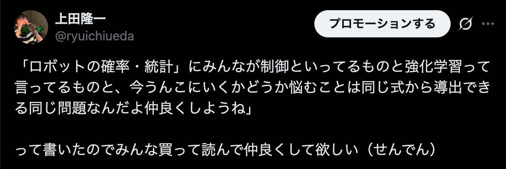
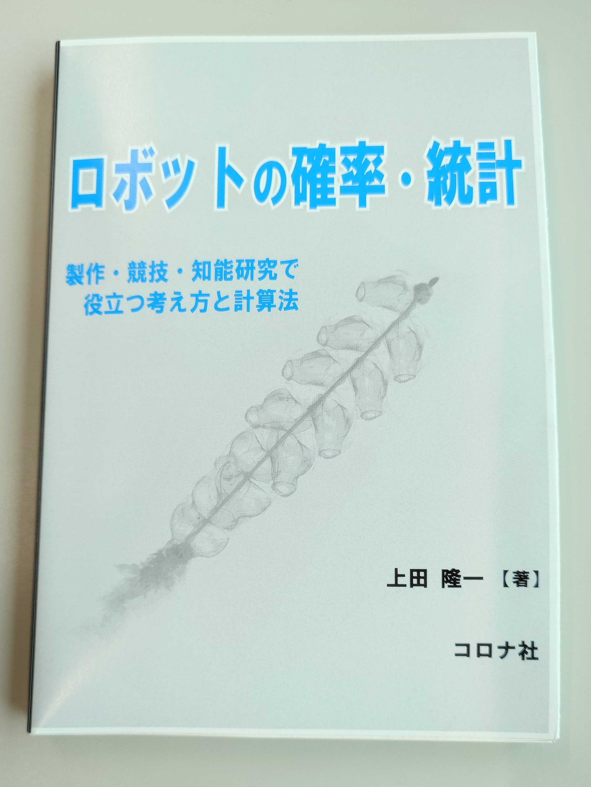

<!-- footer: "2025年12月2日 RSJセミナー" -->

# ロボットの制御問題の整理

千葉工業大学 上田 隆一

 

This work is licensed under a [Creative Commons Attribution-ShareAlike 4.0 International License](https://creativecommons.org/licenses/by-sa/4.0/).

---

<!-- paginate: true -->

## 今日やること

- 本日の話の動機（これだけで終わらないようにします）
- 探索問題と最適制御の接続
- ベルマン方程式とポントリャーギンの最大原理
- 潜在空間での制御
- その先

---

## この発表の動機: 「みんな仲良く」

- 自身の経験
    - 制御ゴリゴリの人と学習の人で会話が合わない
        - 同じはずなんだけどなあ・・・
    - 価値反復使ってたら「なんで学習でやらないんですか？」と質問された
        - 同じはずなんだけどなあ・・・
    - 制御をポントリャーギンの最大（最小）限理から考えている人とベルマン方程式から考えている人で会話が合わない
        - 同じはずなんだけどなあ・・・
- 自分の頭の中ではみんな同じ
    - 頭の中をさらけだして皆さんにお前はおかしいと叱ってもらいたい
    - もし今日の話に一理でもあるなら相互に理解が深まるはず

---

## 今日の話がうまくできるかどうか分からないので

- 考えはこの本の9章に書いてあります
    - お食事中の方すみません

---

## 話の出発点: 簡略化されたロボットの計画問題（探索）

---

## その先の話

- 次元の呪いが克服されたら？
- 現在の計算機と性能のオーダーが違う計算機の登場
