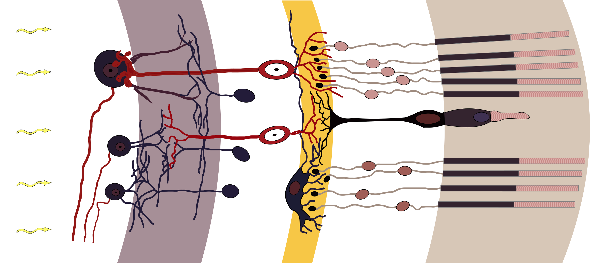
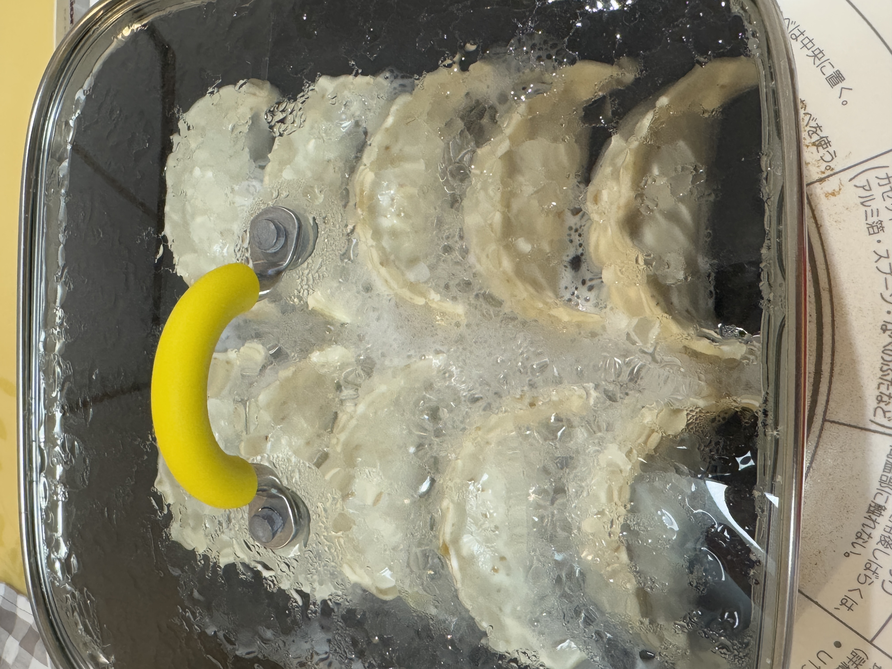
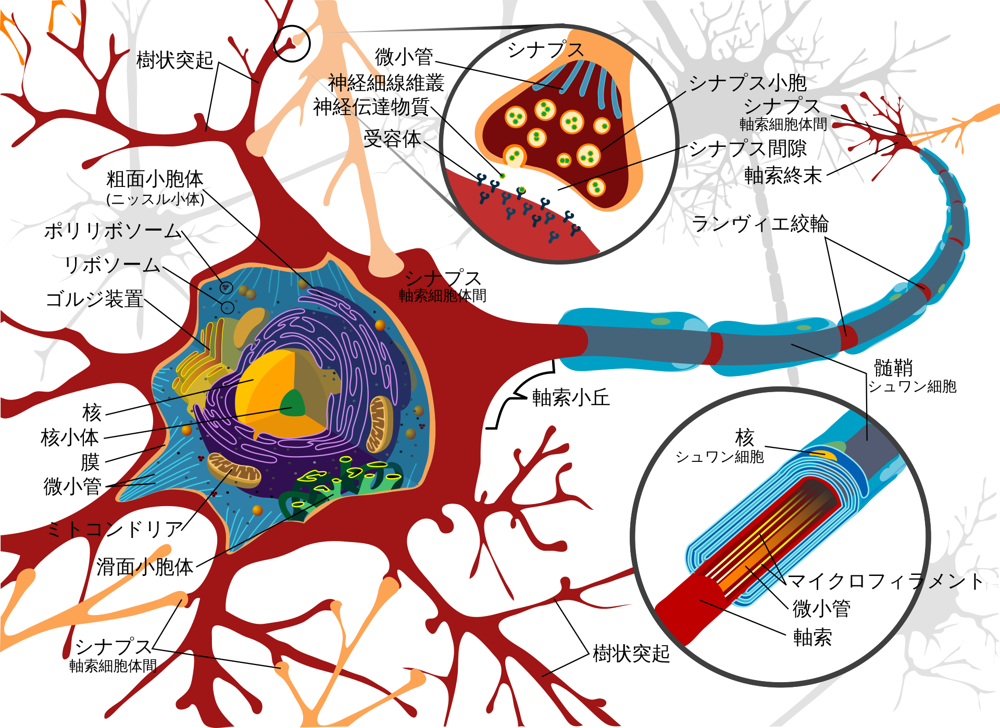
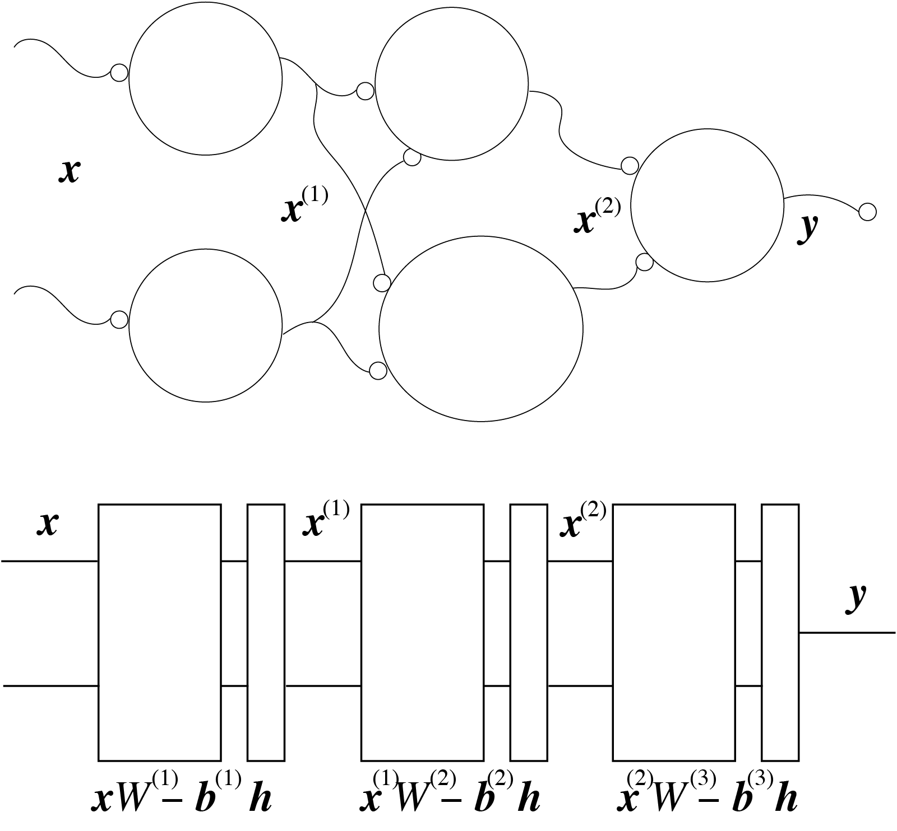

<!-- footer: "Advanced Vision Session 1" -->

# Advanced Vision

## Session 1: Guidance and Introduction

Ryuichi Ueda, Chiba Institute of Technology

 

This work is licensed under a [Creative Commons Attribution-ShareAlike 4.0 International License](https://creativecommons.org/licenses/by-sa/4.0/).

---

<!-- paginate: true -->

## Today's Talk

- Explanation of what will be covered in the lecture
- What's (artificial) neural networks?

---

### Human Vision and Cognitive Abilities

- What do you see in the image on the right?
* Why does it look like ◯◯?
(Let's discuss)

---

### How the Human Eye Works

- This is the structure
(https://commons.wikimedia.org/wiki/File:Retina-diagram.svg, by S. R. Y. Cajal and Chrkl, CC-BY-SA 3.0)
- Light enters from the left and is received by the photoreceptor cells (two types, 130 million) on the right, converting them into electrical signals.
- The electrical signals are processed to the right and sent to the brain via the downward red line in the diagram.
    - The red lines in each part of the retina form a bundle of "optic nerves (1 million)" that travel to the brain.

Why can we tell the shape from independent 130 million signals?

---

### Further Question 1 (about Shape and Size)

- We can tell the shape even if it's in a different location.
- We can tell the shape even if it's rotated.
- We can tell the shape even if it's different size.

- We can even tell how many cats there are.

Why? 

---

### Further Question 2 (about Object Identification and Naming)

- Why do we consider dots to be real objects?
    - On page 4, no one (unless they're extremely cynical like me) would have questioned anything.
- Would a mouse dislike a cat in a drawing?
    - What you see in a picture or mirror is not real.
- How do vision and language interact?
    - Associating the name of an object from what you see.
    - Associating a scene from a sentence.

---

### Summary

- The brain apparently receives stimuli through numerous switches.
    - In addition to the eyes, the ears, nose, and tongue also function.
    - It's surprisingly digital.
- The brain appears to interpret digital signals in some way.
    - Finding patterns in disparate stimulus signals
    - Identifying patterns (putting them into words)
        - Because of this ability, we can take actions for survival, such as eating, running away, or talking to others.
- Questions
    - How do we acquire these "abilities"?
    - How can we create similar capabilities in a computer?

---

### Past Attempts

- Considering the characteristics and definitions of objects in order to recognize them.
    - What is the range of colors?
    - What are features?
        - face size, ear shape, ...
- Problem: endless
    - What's the shape of a cat?

---

### Good Tool for Solving 1: Statistics

- Statistics sets aside the causes for the moment. 
    - Example: what are shown in the right picture?
        - 99 out of 100 people answered "dumplings"
        - one person answered "birds flying in flocks."
        → 99% probability of "dumplings"
           - "What exactly is a dumpling?" can be discussed later or never discussed.

---

### Good Tool 2: Machine Learning

- Tool 2-1: Artificial Neural Networks
- Tool 2-2: Bayesian Inference
- Why are they good?
    - They interpret the features of dumplings by themselves.
    - Automatically discover patterns through statistics, rather than logic.

---

### Good Tool 3: Optimization

- Theoretical Background of Machine Learning
- The method and principle are simple.
    - Just solve $\arg\!\min_{w_{1:N}} \mathcal{L}(w_{1:N} | d_{1:M})$ (it's hard, though).
        - $\mathcal{L}$: Loss Function
            - A function that quantifies how much the actual output deviates from the desired output.
        - $w_{1:N} = w_1, w_2, \dots, w_N$: Parameters
        - $d_{1:M} = d_1, d_2, \dots, d_M$: Data
    - Parameters
        - $w_0$ and $w_1$ in $y = w_1x + w_0$ (least squares method) 
        - weights of artificial neural networks
        - parameters of probability distributions (Bayesian inference)

---

### So, this lecture covers image processing based on machine learning.

- We will also study languages
- Contents 
    - Lesson 1: Introduction and Review of Artificial Neural Networks
    - Lesson 2: Training of Artificial Neural Networks
    - Lesson 3: The Basic of Image Classification and Generation I
    - Lesson 4: The Basic of Image Classification and Generation II
    - Lesson 5: Embedding and Context Addition for LLM
    - Lesson 6: Transformer Structure
    - Lesson 7: Transformer Applications
    - Further Topics: NeRF / 3D Gaussian Splatting, etc. (TBD)

---

## Review of artificial neural networks

---

### What is an artificial neural network?

- Why can we recognize cats and dogs?
   - We know that the brain does this.
   - We know that the brain has nerves.
- What is the structure of the brain and nerves?

---

### Neuron

- Cells that transmit signals
- How signals are transmitted
    1. When a certain amount of chemicals reach the dendrites, a voltage is generated. (firing)
        - Some neurons, like photoreceptors, fire in response to other stimuli.
    2. Voltage travels down the axon and urges synapses to release chemicals.
    3. Other cells fire.

(Figure: public domain)

---

### (Non-artificial) Neural Network

- Brain: Neurons gather to form circuits
     - Perform calculations (see below)
     - This is what we mean by a neural network
- Spinal cord: Nerves travel down the spine to every corner of the body
     - Calculations such as reflexes occur here
- Periphery: The end of the circuit is connected to the muscle and acts as a switch

 (Right image: CC BY-NC-SA 4.0, from the Neuroscience Dictionary)

---

## Neuronal "Calculations"

- They work as switches.
    - Receives signals from multiple cells
    - When the total signal exceeds a certain value, a voltage is generated
    - Voltage: axon$\rightarrow$synapse
    $\rightarrow$multiple other cells
- How can this calculation be performed?
    - Is there anything similar?
    - Let's discuss.

---

### Simplified model of a neuron

- Simplified to the structure shown on the right (artificial neuron)
    - Receives signals from $n$ other cells
        - $x_{1:n}$: Signal strength from other cells
        - $w_{1:n}$: "Weight" applied to the received signal
    - Emits only one value of signal $y$
        - $x = w_1 x_1 + w_2 x_2 + \dots + w_n x_n \ge b \Rightarrow 1$
            - $b$: Threshold (also known as bias)
        - Multiple connections, but the same value is transmitted.
- If other cells are modeled in the same way, $x_{1:n}$ also becomes $0, 1$ $\rightarrow$ creating a digital circuit.

---

### Building a Circuit with Artificial Neurons

- Problem: Check whether the signs of two numbers $x_1$ and $x_2$ are the same.
    - If the value is 0, consider it positive.
    * Answer

---
### (Artificial) Neural Network

- Neurons can be combined and programmed as shown on the previous page.
    - If NAND circuits can be created, they can be equivalent to a computer.
- [The human brain has 86 billion neurons](https://www.riken.jp/press/2018/20180326_1/index.html)
    - 86 billion neurons make each person act. 
        - If you see a cat, you shout "Cat!" (Eyes → Brain → Mouth muscles)
        - You move your hands to grab a snack in front of you
        (Eyes → Brain → Arm and Hand muscles)
        - The smell of curry makes you drool
        (Nose → Brain → Salivary glands)
- If a computer can perform calculations using artificial neurons, brain-like calculations can be realized. $\Longrightarrow$Artificial Neural Networks

---

### Identity of Artificial Neural Networks

- They are simple matrix operations.
- The leftmost layer in the previous example
    - Input: Expressed as $\boldsymbol{x} = (x_1 \ x_2)$
    - Weight: $W = \begin{pmatrix}1 & 0 \\ 0 & 1 \end{pmatrix}$
         - This means that the upper and lower neurons only use $x_1$ and $x_2$, respectively.
- Output calculation: $\boldsymbol{x}' = \boldsymbol{h}(\boldsymbol{x}W - \boldsymbol{b})$
     - $\boldsymbol{b}$ is the threshold: $\boldsymbol{b} = (0 \ 0)$
     - $\boldsymbol{h}$ is the thresholding process (activation function).

---

### Repeat of Calculations

- 1st layer output: $\boldsymbol{x}^{(1)} = \boldsymbol{h}(\boldsymbol{x}W^{(1)} - \boldsymbol{b}^{(1)})$
    - $W^{(1)} = \begin{pmatrix}1 & 0 \\ 0 & 1 \end{pmatrix}$, $\boldsymbol{b}^{(1)} = (0 \ 0)$
    - Input: $\boldsymbol{x} = (x_1 \ x_2)$
- 2nd layer output: $\boldsymbol{x}^{(2)} = \boldsymbol{h}(\boldsymbol{x}^{(1)}W^{(2)} - \boldsymbol{b}^{(2)})$
    - $W^{(2)} = \begin{pmatrix}1 & -1 \\ 1 & -1 \end{pmatrix}$, $\boldsymbol{b}^{(2)} = (1.1 \ -0.9)$
- Third layer output: $y = \boldsymbol{h}(\boldsymbol{x}^{(2)}W^{(3)} - \boldsymbol{b}^{(3)})$
    - $W^{(3)} = \begin{pmatrix}1 \\ 1 \end{pmatrix}$, $\boldsymbol{b}^{(3)} = (0.9)$

---

### Layer Representation

- Inputs and outputs are connected by lines, and operations are represented by boxes.
- In the previous examples, one layer becomes two layers.
    - One layer is created by weight reflection (and threshold subtraction).
        - Affine Layer (Fully Connected Layer)
    - One layer is created by thresholding.
        - Activation Function Layer

---

### Whole Calculations of an ANN

- Example on the previous page: The following function is created for $\boldsymbol{x}$.
- $\boldsymbol{f}(\boldsymbol{x}) = \boldsymbol{h} \{ \boldsymbol{h} [ \boldsymbol{h}(\boldsymbol{x}W^{(1)} - \boldsymbol{b}^{(1)}) W^{(2)} - \boldsymbol{b}^{(2)} ]W^{(3)} - \boldsymbol{b}^{(3)} \}$
$\qquad\qquad\qquad$
- General notation: $\boldsymbol{f}(\boldsymbol{x}) =
\boldsymbol{f}^{(n)}\circ
\boldsymbol{f}^{(n-1)}\circ\dots\circ
\boldsymbol{f}^{(1)}(\boldsymbol{x})$
    - $\boldsymbol{f}^{(i)}$: The function corresponding to the i-th affine layer and activation function layer pair
        - Note: The affine layer can be replaced by another one.
- This allows any function to be expressed.
    - Without activation functions, $\Longrightarrow$ nonlinear functions cannot be expressed using matrix multiplication alone.

---

### Variations of Activation Function Layers

- For the previous example, a step function is sufficient.
- It is insufficient for more complex functions.
    - It can only output $0$ and $1$ (poor expressiveness).
    - It cannot be differentiated.
- The basic function used as $\boldsymbol{h}$.
    - Sigmoid function (blue line in the right figure)
        - $h(x) = \dfrac{1}{1 + e^{-x}}$
    - ReLU (Rectified Linear Unit; red)
        - $h(x) = \begin{cases}
0 & (x<0) \\
x & (x \ge 0)
\end{cases}$
            - The differential value at $x=0$ is appropriately approximated, such as $0$.

---

### Remaining Problem: How ot Learn

- Animals are born with a certain degree of programming, but...
    - Neurons generally do not increase as they grow.
    - To identify cats, we need to modify the neural network.
    - We can't open our heads and wire them.

How do we do it? What do you usually do? (Let's discuss)

---

## Summary

- Artificial Neurons and Artificial Neural Networks
- Programmable
- Attempts to express arbitrary functions using simple linear algebra and activation functions
- How do we learn parameters? (Next time)
