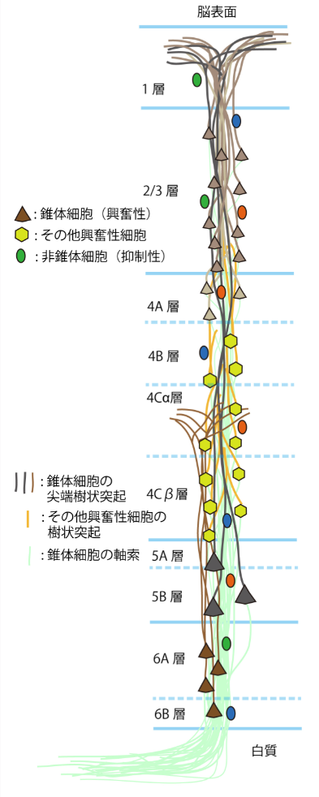

<!-- footer: "アドバンストビジョン 第1回" -->

# アドバンストビジョン

## 第1回: ガイダンス・イントロダクション

千葉工業大学 上田 隆一

 

This work is licensed under a [Creative Commons Attribution-ShareAlike 4.0 International License](https://creativecommons.org/licenses/by-sa/4.0/).

---

<!-- paginate: true -->

## 今日やること

- 急に講義をやることになったことの説明
- 講義でやることの説明

---

### 人間の視覚や認知能力

- 右の図は何に見えますか
* なんで◯◯に見えるんでしょう？
（話し合ってみましょう）

---

### 人間の眼の仕組み

- こんな構造
    （https://commons.wikimedia.org/wiki/File:Retina-diagram.svg, by S. R. Y. Cajal and Chrkl, CC-BY-SA 3.0）
    - 左から光が入って右側の視細胞（2種類、1.3億個）で受け止め電気信号に
    - 電気信号は右に向かって処理されて図の下向きの赤い線から脳へ
        - 網膜の各部分の赤い線が「視神経（100万個）」の束になって脳に
- こんな構造なので
    - 何か見ると1.3億のバラバラな信号として入る
        - 白黒の絵の場合は1.3億のスイッチのON/OFFの信号に単純化できる

なんでバラバラなのに形がわかるの？

---

### さらなる疑問1（形や大きさに関して）

- 別の場所に見えても形がわかる
- 回転していても形が分かる
- 大きさが違っても形が分かる 

- 何匹いるかも分かる

スイッチのON/OFFで考えると全然違う信号なのになんで？

---

### さらなる疑問2（ものの識別や名前に関して）

- そもそも点々を実物の◯◯とみなすのはなぜ？
    - p.4の議論では、（私みたいによほどひねくれてない限り）誰もなにも疑問に思ってなかったはず
- ネズミは絵に描いた猫を嫌がるだろうか？
    - 絵や鏡に写ったものは実物ではない
- 視覚と言語はどう連携している？
    - 見ているものから物の名前を連想
    - 文から風景を連想

---

### いまの話のまとめ

- 脳は刺激をたくさんのスイッチで受け取ってるらしい
    - 目のほか、耳や鼻や舌なども
    - おもいのほかデジタル
- 脳はデジタル信号になんらかの解釈を加えているらしい
    - バラバラな刺激の信号から法則性を見つける
    - 法則性のあるものを識別する（言葉にする）
        - 解釈ができるから、食べる、逃げる、他の人と話すなど
        自分に利益のある行動ができる
- 疑問
    - どうやってこのような「能力」を獲得したんだろう？
    - どうやってコンピュータで同等の能力を実現しましょう？

---

### 過去の試み

- あるものを認識させるために、そのものの特徴や定義を考える
    - 色の範囲は？
    - 特徴量はなにか
        - 猫の例: 顔の大きさ、耳の形・・・
- 問題: キリがない
    - 例: 猫の色はいろいろだし、光の具合で変わる
        - 色の他にも毛の長さや姿勢など、特徴量の項目も多い

---

### 良い道具1: 統計学

- 統計学はとりあえず原因は横に置いて、出てきたデータを扱う
    - 例: 右の写真を見せたら100人中99人が「餃子」、
    1人が「群れで飛ぶ鳥」と回答
    →99%の確率で餃子
        - 「なにが餃子なのか」は、あとから考える

---

### 良い道具2: 機械学習

- 道具
    - 2-1: 人工ニューラルネットワーク
    - 2-2: ベイズ推論
- 何が良いのか
    - みんなが餃子というものの特徴量を勝手に解釈してくれる
    - 理屈から考えていくのではなく、統計から法則性を自動で発見

---

### 良い道具3: 最適化

- 機械学習の理論的背景
- 方法、原理が単純
    - $\arg\!\min_{w_{1:N}} \mathcal{L}(w_{1:N} | d_{1:M})$を解くだけ（大変だけど）
        - $w_{1:N} = w_1, w_2, \dots, w_N$: パラメータ
        - $d_{1:M} = d_1, d_2, \dots, d_M$: データ
    - パラメータ
       - 直線の傾きと切片$y = w_1x + w_0$（最小二乗法）
       - 人工ニューラルネットの重み
       - 確率分布のパラメータ（ベイズ推定）

---

### ということで

- 本講義では機械学習に基づいた画像処理を扱います
- 途中言語も扱います
- 内容（メモ: 資料を書いてれば13回分にのびるはず）
    - 第1回: イントロダクションとニューラルネットワークのおさらい
    - 第2回: 数学のおさらい
    - 第3回: CNN、GAN
    - 第4回: オートエンコーダ・変分オートエンコーダ
    - 第5回: Transformer
    - 第6回: Vision Transformer、CLIP、SAM
    - 第7回: 拡散モデル、画像生成
    - 第8回: NeRF / 3D Gaussian Splatting

---

## 人工ニューラルネットのおさらい

---

### 人工ニューラルネットワークってなに？

- あらためて最初に提示した問題
    - なんで犬とか猫とか我々は認識できるのか?
        - 脳がやっているということは知っている
        - 脳に神経があることも知っている
    - 脳や神経は具体的にどういう構造なのか?

---

### 神経細胞

- 信号を伝える細胞
- 信号を伝える仕組み
   1. 樹状突起に化学物質をある量受けると電圧が発生
   （発火）
       - 視細胞のように他の刺激で発火するものも
   2. 電圧が軸索を伝って、その先のシナプスから化学物質を放出
   3. 他の細胞が発火

（図: public domain）

---

### （人工でない）ニューラルネットワーク

- 脳: 神経細胞が集まって回路を形成
    - 計算をしている（後述）
    - ニューラルネットワークというのはこれのこと
- 脊髄: 神経が背骨を伝わり体の隅々へ
    - もともと脳ではなくこちらが本体
    - 反射などの計算はここで
- 末端: 回路の先端が筋肉につながっていてスイッチに

（右図：CC BY-NC-SA 4.0, 脳科学辞典から）

---

## 神経細胞の「計算」

- スイッチの役割
    - 複数の細胞から信号を受信
    - 信号の総量がある一定値を超えると電圧が発生
    - 電圧: 軸索$\rightarrow$シナプス
    $\rightarrow$別の複数の細胞
- どうやってこんな仕組みで計算できるんでしょう?
    - 身近に似たものはないか?
    - 議論してみましょう

---

### 神経細胞を単純化したモデル

- 右図のような構造に簡略化（人工ニューロン）
    - 他の$n$個の細胞から信号を受け取る
        - $x_{1:n}$: 他の細胞からの信号の強さ
        - $w_{1:n}$: 信号を受け取った値にかける「重み」
    - ひとつの値だけ信号$y$を出す
        - $x = w_1 x_1 + w_2 x_2 + \dots + w_n x_n \ge b$
        なら$1$
            - $b$: 閾値（バイアスとも）
        - 接続先は複数だが同じ値を送信
- 他の細胞も同様にモデル化すると$x_{1:n}$も$0, 1$になってディジタル回路に

---

### 人工ニューロンで回路を組んでみる

- 問題: 2つの数字$x_1$と$x_2$の符号が同じかどうかを調べる
    - 値が0の場合は正としましょう
    * 答え

---

### （人工）ニューラルネットワーク

- 神経細胞は前ページのように組み合わせてプログラムできる
    - NAND回路が作れるとコンピュータと等価に（作れる）
- [人の脳には860億個の神経細胞](https://www.riken.jp/press/2018/20180326_1/index.html)
    - 860億個が組み合わさってさまざまな計算をしているのでいろいろできる
        - 目から入った光で猫がいたら「猫！」と叫ぶ（目→脳→口の筋肉）
        - 手を動かして目の前のお菓子をとる（目→脳→腕や手の筋肉）
        - カレーの匂いがしたらよだれが出る（鼻→脳→よだれを出す器官）
        - 講義中にゲームをする（？）
- コンピュータでも人工ニューロンで計算すれば or 人工ニューロンを実現するようなコンピュータを作れば、脳の計算が可能$\Longrightarrow$人工ニューラルネットワーク

---

### 人工ニューラルネットワークの正体

- やってることは単なる行列の演算
- 先ほどの例の一番左の「層」
    - 入力: $\boldsymbol{x} = (z_1 \ z_2)$と表現
    - 重み: $W = \begin{pmatrix}1 & 0 \\ 0 & 1 \end{pmatrix}$
        - 上、下のニューロンがそれぞれ$z_1, z_2$しか使わないという意味
    - 出力の計算: $\boldsymbol{x}' = \boldsymbol{h}(\boldsymbol{x}W - \boldsymbol{b})$
        - $\boldsymbol{b}$は閾値: $\boldsymbol{b} = (0 \ 0)$
        - $\boldsymbol{h}$は閾値処理（活性化関数）

---

### あとは繰り返し

- 1層目（再掲）
    - 入力: $\boldsymbol{x} = (x_1 \ x_2)$
    - $W = \begin{pmatrix}1 & 0 \\ 0 & 1 \end{pmatrix}$、$\boldsymbol{b} = (0 \ 0)$
- 2層目
    - 入力（1層目の出力）: $\boldsymbol{x}' = (x_1' \ x_2')$
    - $W = \begin{pmatrix}1 & -1 \\ 1 & -1 \end{pmatrix}$、$\boldsymbol{b} = (1.1 \ -0.9)$
- 3層目
    - 入力（2層目の出力）: $\boldsymbol{x}'' = (x_1'' \ x_2'')$
    - $W = \begin{pmatrix}1 \\ 1 \end{pmatrix}$、$\boldsymbol{b} = (0.9)$

---

### レイヤー（層）での表現

- 入出力を線でつなぎ、演算を箱で表現
- これまで使ってきた例だと1層分が2層に
     - 重みの反映（と閾値の引き算）で1層
         - アフィンレイヤー（全結合層）
     - 閾値処理で1層
         - 活性化関数層
- 注意: 右の図ではあまり入出力の数が変わってないが、実際はアフィンレイヤーの前後で変わる

