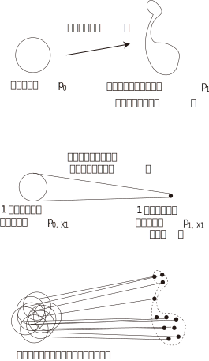

<!-- footer: "アドバンストビジョン第10回" -->

# アドバンストビジョン

## 第10回: 画像と言語、ロボット制御の融合II

千葉工業大学 上田 隆一

 

This work is licensed under a [Creative Commons Attribution-ShareAlike 4.0 International License](https://creativecommons.org/licenses/by-sa/4.0/).

---

<!-- paginate: true -->

## 今日やること

- 本題の前に
    - flow matching
- VLA（vision-language-action model）、ロボット基盤モデル
    - [河原塚先生のスライド](https://speakerdeck.com/haraduka/miru2025-tiyutoriarujiang-yan-robotutoji-pan-moderunozui-qian-xian)も参考になります

---

## Flow matching（FL）[[Lipman 2022]](https://arxiv.org/abs/2210.02747)

- 拡散モデルとは別のアプローチで分布の変換を実現
- 拡散モデル（下図。再掲）
    - 現実（実際には訓練データ）の分布をガウス分布に変換・逆変換
        - 変換にはノイズを乗せていく方法が取られた
- FL: 別にノイズを乗せなくても変形していけばいいんじゃないか？

---

### 前ページのアイデアの問題

- 任意の時刻のノイズ画像が生成できない
    - 下図（再掲）
    - 各時刻の学習に支障
- FMはこれをなんとかした

---

### FMのアイデア

- ガウス分布$p_0$と画像の分布など意味のある分布$p_1$の相互変換
    - ベクトル場$\boldsymbol{u}_t$（$0\le t \le 1$）で考える
        - 各時刻で分布をひっぱる速度場を仮定
    - このベクトル場を再現する関数$\boldsymbol{v}_t(\boldsymbol{w})$をANNが学習
    - $\boldsymbol{v}_t(\boldsymbol{w})$と$\boldsymbol{u}_t$の差（2乗誤差）を損失関数に
- 問題としては最適輸送問題をANNに解かせることに
    - 最適輸送問題: 分布を一番楽な方法で変形する問題
$\qquad\qquad$

---

### 問題の分解: 条件つきフローマッチング

- 拡散モデル同様、途中の$t$の画像（やデータ）が必要
    - 分布全体で考えると難しい
- $p_t$を条件付き確率に分解
    - $p_t(\boldsymbol{x}) = \int_{X_1} p_t(\boldsymbol{x} | \boldsymbol{x}_1)q(\boldsymbol{x}_1) \text{d}\boldsymbol{x}_1$
        - $q$: 訓練データの分布
            - $\boldsymbol{x}_1$の添え字: データの番号ではなく時刻
            - 訓練データごとに損失関数を最小化しても全体の損失関数を最小化できる
- ベクトル場$\boldsymbol{u}_t$も計算できる（重み付き平均）
    - $\boldsymbol{u}_t(\boldsymbol{x}) = \int_{X_1} \boldsymbol{u}_t(\boldsymbol{x}|\boldsymbol{x}_1) \dfrac{p_t(\boldsymbol{x} | \boldsymbol{x}_1)q(\boldsymbol{x}_1)}{p_t(\boldsymbol{x})} \text{d}\boldsymbol{x}_1$

---

### フローの設計

- ひとつの条件付き確率に対し、途中の経路（分布）の定式化が必要
- とりあえずガウス分布を選択
    - $p_t(\boldsymbol{x}|\boldsymbol{x}_1) = \mathcal{N}(\boldsymbol{x} | \boldsymbol{\mu}_t(\boldsymbol{x}_1), \sigma_t(\boldsymbol{x}_1)^2I)$
        - $\boldsymbol{\mu}_t(\boldsymbol{x}_1), \sigma_t(\boldsymbol{x}_1)$は時間の関数と解釈したほうがよい
        - $\boldsymbol{\mu}_0(\boldsymbol{x}_1) = \boldsymbol{0}, \sigma_0(\boldsymbol{x}_1) = 1$
        - $\boldsymbol{\mu}_1(\boldsymbol{x}_1) = \boldsymbol{x}_1, \sigma_1(\boldsymbol{x}_1) = \sigma_\text{min}$
    - このときのベクトル場
        - $\boldsymbol{u}_t(\boldsymbol{x}|\boldsymbol{x}_1) =\dfrac{\sigma_t(\boldsymbol{x}_1)'}{\sigma_t(\boldsymbol{x}_1)}\{\boldsymbol{x} - \boldsymbol{\mu}_t(\boldsymbol{x}_1)\} + \boldsymbol{\mu}_t'(\boldsymbol{x}_1)$
            - $'$は時間の微分

---

### 最適輸送による定式化

（まだ講師の頭の整理がついていないので雰囲気だけ）

- 途中（時間の関数としての$\boldsymbol{\mu}_t(\boldsymbol{x}_1)$と$\sigma_t(\boldsymbol{x}_1)$）には自由度がある
    - なるべく素直なフローで分布を移したい$\Longrightarrow$最適輸送問題
- 条件つき最適輸送パス
    - $\boldsymbol{\mu}_t(x)=t x_1, \sigma_t(x)=1 - (1- \sigma_\text{min})t$
        - とても単純
    $\Longrightarrow \boldsymbol{u}_t(\boldsymbol{x}|\boldsymbol{x}_1) = \dfrac{\boldsymbol{x}_1 - (1-\sigma_\min)\boldsymbol{x}}{1-(1-\sigma_\min)t}$
- 損失関数
    - $\mathcal{L}_\text{CFM}(\boldsymbol{w}) = \big\langle \{ \boldsymbol{v}_t(\boldsymbol{\psi}_t(\boldsymbol{x}_0))  - [ \boldsymbol{x}_1 - (1 - \sigma_\min)\boldsymbol{x}_0 ] \}^2 \big\rangle_{t \sim \mathcal{U},q(\boldsymbol{x}_1), p(\boldsymbol{x}_0 )}$
        - ここで$\boldsymbol{\psi}_t(\boldsymbol{x}) = \{1 - ( 1 - \sigma_\min)t\}\boldsymbol{x} + t \boldsymbol{x}_1$（フロー）

---

### FMでできること

- [[Lipman 2022]](https://arxiv.org/abs/2210.02747)の図1、6、11〜
    - アルゴリズムの説明のための図だけど図4も面白い
- Stable Diffusion 3
- ロボットの制御（これからやります）

---

### Robotics Transformer 2（RT-2）[[Brohan2023]](https://arxiv.org/abs/2307.15818)（[サイト](https://robotics-transformer2.github.io/)）

- この論文の概要: "We refer to such category of models as vision-language-action models (VLA) and ..."ということで、ここでVLAという言葉が出現
- 構造にPaLM-E（あるいはPaLI系統の別のもの）を使用
    - ここではPaLM-Eの使用を前提に話します
- PaLM-Eとの違い
    - ロボットの動作（言語レベルではなく数値レベルのもの）も一緒に学習
        - 数値レベル: 関節の回転角や移動量などのこと
    - PaLM-Eと違って直接的にロボットの動作を出力可能

---

- 構造の概要: 論文の図1（の中央のANNの図）
    - `<task>`という特殊トークンを入れた文を入力
    - ロボットの動きに関するトークンを出力
    - トークンをデコードするとロボットの制御指令に
- 達成事項: RT-1より未知の環境、問題に強くできた
    - 未知のタスクの成功率: 32\%$\rightarrow 62$\%

---

### 構造（RT-2-PaLI-X）

- vision-languageモデルを使用
    - PaLI-X（[[Chen2023]](https://arxiv.org/abs/2305.18565)） or PaLM-E（[[Driess2023]](https://arxiv.org/abs/2303.03378)）
        - PaLI: Pathways Language and Image Model
        - PaLM-E: ロボットのためにPaLMにViTをくっつけたもの（"E": embodied）

---

### OpenVLA

---

### $\pi_0$[[Black 2024]](https://arxiv.org/html/2410.24164v1)

- Physical Intelligence社が開発したVLAモデル
- 「ロボット基盤モデル」と呼ばれるもののひとつ

