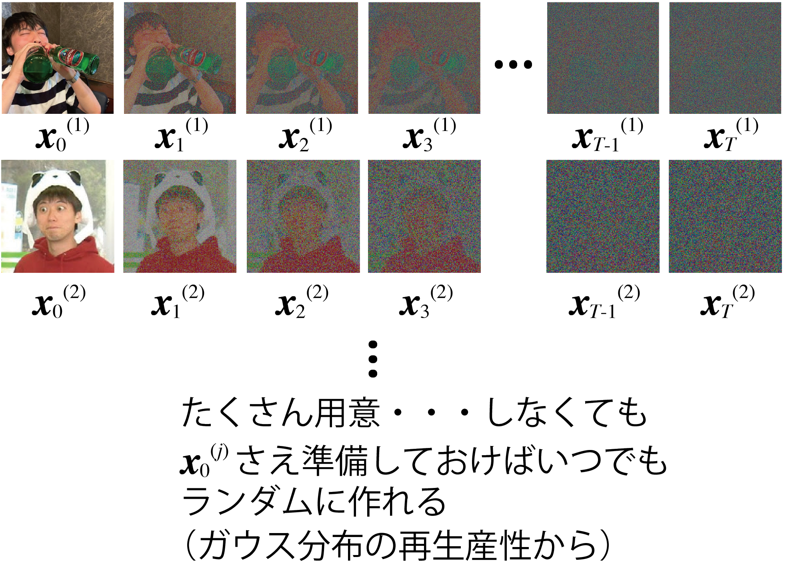
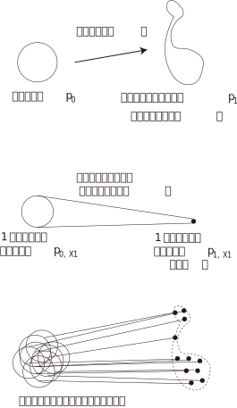
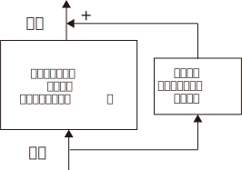
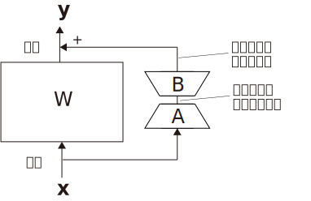

<!-- footer: "Advanced Vision Session 10" -->

# Advanced Vision

## Lesson 10: Integration of Images, Language, and Robot Control II

Ryuichi Ueda, Chiba Institute of Technology

 

This work is licensed under a [Creative Commons Attribution-ShareAlike 4.0 International License](https://creativecommons.org/licenses/by-sa/4.0/).

---

<!-- paginate: true -->

## What to do today

- Before we get to the main topic
    - Flow matching
    - LoRA (low-rank adaptation)
- VLA (vision-language-action model), robot platform model
    - [Prof. Kawarazuka's slides](https://speakerdeck.com/haraduka/miru2025-tiyutoriarujiang-yan-robotutoji-pan-moderunozui-qian-xian) are also useful references.

---

## Flow matching (FM) [[Lipman 2022]](https://arxiv.org/abs/2210.02747)

- Achieving distribution transformation using a different approach than the diffusion model
- Diffusion model (see below, recap)
    - Transforming the real distribution (actually the training data) to a Gaussian distribution and then back again
        - The transformation involves adding noise.
- FL: Can't we just transform the data without adding noise? 

---

### Problems with the idea on the previous page

- Unable to generate noise images at any time
    - Right figure (recap)
    - Impediments to learning at each time
- FM solved this problem

---

### Idea of FM 

- Mutual conversion between a Gaussian distribution $p_0$ and a meaningful distribution $p_1$, such as the distribution of an image
    - Consider the vector field $\boldsymbol{u}_t$ ($0\le t \le 1$)
        - Assume a velocity field that drives the distribution at each time
    - The ANN learns a function $\boldsymbol{v}_t(\boldsymbol{w})$ that reproduces this vector field.
- The difference (squared error) between $\boldsymbol{v}_t(\boldsymbol{w})$ and $\boldsymbol{u}_t$ is used as the loss function.

---

- The problem is to have the ANN solve the optimal transportation problem.
    - Optimal transportation problem: The problem of transforming the distribution in the easiest way.
$\qquad\qquad$

---

### Problem Decomposition: Conditional Flow Matching

- Like the diffusion model, intermediate images (or data) of $t$ are required.
    - Considering the entire distribution is difficult.
- Decomposing $p_t$ into conditional probabilities.
    - $p_t(\boldsymbol{x}) = \int_{X_1} p_t(\boldsymbol{x} | \boldsymbol{x}_1)q(\boldsymbol{x}_1) \text{d}\boldsymbol{x}_1$
        - $q$: Distribution of the training data
            - Subscript of $\boldsymbol{x}_1$: Time, not the data number
            - The overall loss function can be minimized even by minimizing the loss function for each training data point

---

- Vector field $\boldsymbol{u}_t$ can also be calculated (weighted average)
- $\boldsymbol{u}_t(\boldsymbol{x}) = \int_{X_1} \boldsymbol{u}_t(\boldsymbol{x}|\boldsymbol{x}_1) \dfrac{p_t(\boldsymbol{x} | \boldsymbol{x}_1)q(\boldsymbol{x}_1)}{p_t(\boldsymbol{x})} \text{d}\boldsymbol{x}_1$

---

### Flow Design

- For each conditional probability, the intermediate path (distribution) must be formulated.

---

- For now, we will select the Gaussian distribution.
    - $p_t(\boldsymbol{x}|\boldsymbol{x}_1) = \mathcal{N}(\boldsymbol{x} | \boldsymbol{\mu}_t(\boldsymbol{x}_1), \sigma_t(\boldsymbol{x}_1)^2I)$
        - Boundary Conditions
            - $\boldsymbol{\mu}_0(\boldsymbol{x}_1) = \boldsymbol{0}, \sigma_0(\boldsymbol{x}_1) = 1$
            - $\boldsymbol{\mu}_1(\boldsymbol{x}_1) = \boldsymbol{x}_1, \sigma_1(\boldsymbol{x}_1) = \sigma_\text{min}$
    - The flow is: $\boldsymbol{\psi}_t(\boldsymbol{x}) = \sigma_t(\boldsymbol{x}_1)\boldsymbol{x} + \boldsymbol{\mu}_t(\boldsymbol{x}_1)$
        - At $t=0$, $\boldsymbol{x}$ at various points moves toward $\boldsymbol{x}_1$ (right).
        - The shapes of $\sigma_t(\boldsymbol{x}_1)$ and $\boldsymbol{\mu}_t(\boldsymbol{x}_1)$ have not yet been determined.
            - Note: Both are functions of time, not $\boldsymbol{x}_1$.

---

### Design using optimal transportation

- We want to transfer distribution using the most straightforward flow, as shown in this diagram. $\Longrightarrow$ The optimal transportation problem, 

- Conditional optimal transportation path
    - Flow: $\boldsymbol{\psi}_t(\boldsymbol{x}) = \{1 - ( 1 - \sigma_\min)t\}\boldsymbol{x} + t \boldsymbol{x}_1$
        - $\boldsymbol{\mu}_t(\boldsymbol{x}_1)=t \boldsymbol{x}_1, \sigma_t(\boldsymbol{x}_1)=1 - (1- \sigma_\text{min})t$
- Vector field at this time
    - $\boldsymbol{u}_t(\boldsymbol{x}|\boldsymbol{x}_1) = \dfrac{\sigma_t'(\boldsymbol{x}_1)}{\sigma_t(\boldsymbol{x}_1)}\{ \boldsymbol{x} - \boldsymbol{\mu}_t(\boldsymbol{x}_1) \} + \boldsymbol{\mu}_t'(\boldsymbol{x}_1) = \dfrac{\boldsymbol{x}_1 - (1-\sigma_\min)\boldsymbol{x}}{1-(1-\sigma_\min)t}$
- loss function
    - $\mathcal{L}_\text{CFM}(\boldsymbol{w}) = \big\langle \{ \boldsymbol{v}_t(\boldsymbol{\psi}_t(\boldsymbol{x}_0)) - [ \boldsymbol{x}_1 - (1 - \sigma_\min)\boldsymbol{x}_0 ] \}^2 \big\rangle_{t \sim \mathcal{U},q(\boldsymbol{x}_1), p(\boldsymbol{x}_0 )}$

---

### What FM can do

- Figures 1, 6, and 11 in [[Lipman 2022]](https://arxiv.org/abs/2210.02747)
    - Figure 4 is also interesting, even though it is used to explain the algorithm.
- Stable Diffusion 3
- Robot Control (We will cover this later in this article)
- Supplementary Information
    - We have only discussed the case of optimal transportation, but there is room for other design possibilities.

---

## Low-Rank Adaptation (LoRA) [[Hu2021]](https://arxiv.org/abs/2106.09685)

- Highly Efficient Fine-Tuning Method
- Idea (commonly called an adapter)
- Fixing pre-trained matrix parameters
- Preparing a fine-tuning model next to it and calculating only the parameter differences
- Fewer parameters than the model below
- The computational complexity of backpropagation is reduced.
- See the next page for how to reduce it.

---

### Parameter Reduction Method

- For the pre-trained $\alpha \times \beta$ matrix $W$,
prepare the following matrix:
- Matrix $A$ ($d\times \beta$)
- Matrix $B$ ($\alpha \times d$)
- Fine-tuned matrix: $W' = W + BA$
- Number of parameters in $W$: $\alpha \beta$
- Number of parameters in $BA$: $(\alpha + \beta)d$
- Reduce the number of parameters with a small $d$
- The input dimensionality is reduced in $A$ and restored in $B$
- Similar to dimensionality reduction using latent space

---

### Robotics Transformer 2 (RT-2) [[Brohan2023]](https://arxiv.org/abs/2307.15818)([Site](https://robotics-trans
