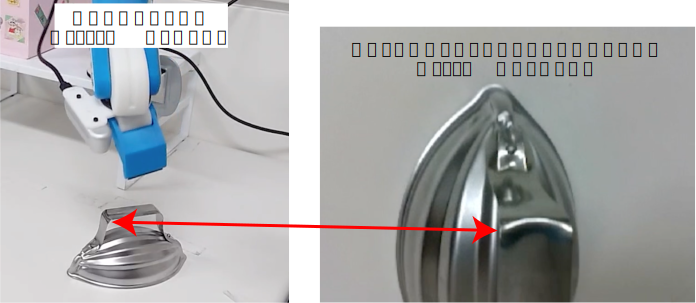
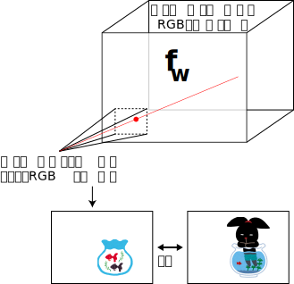
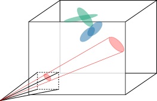

<!-- footer: "Advanced Vision No. 11" -->

# Advanced Vision

## Lesson 11: NeRF and 3DGS

Ryuichi Ueda, Chiba Institute of Technology

 

This work is licensed under a [Creative Commons Attribution-ShareAlike 4.0 International License](https://creativecommons.org/licenses/by-sa/4.0/).

---

<!-- paginate: true -->

## What to do today

- Structure from Motion (SfM)
   - Just an overview, even though it should be detailed
- NeRF (neural radiance fields)
- 3DGS (3D Gaussian splatting)

---
## SfM

- Problem and technics for recovering the camera position and orientation and the 3D shape of a subject from camera images.
   - Position and orientation will hereafter be referred to as "pose."
   - Reference: https://demuc.de/papers/schoenberger2016sfm.pdf

---

- Differences from SLAM
   - Not very different from Visual SLAM, but more interested in the shape of the subject.
       - Basic SfM attempts to determine the camera movement amount from images alone.
       - SLAM is also interested in the space in which the robot moves.
       - SLAM may not be able to capture the same subject in detail.
- This explanation is based on COLMAP [[Schönberger2016]](https://ieeexplore.ieee.org/document/7780814).
    - [Demo from another paper by the same author](https://www.youtube.com/watch?v=11awtGWSqQU)

---

### SfM Process Flow Using Feature Points

- Prepare a camera
- Capture images of the subject from various angles
    - Obtain images $I_{1:N_I}$
- Extract feature points from each image using SIFT or other methods
    - For image $I_i$, obtain $(\boldsymbol{x}, \boldsymbol{f})_{1:N_{F_i}}$
        - $\boldsymbol{x}$ is the image coordinate, and $\boldsymbol{f}$ is the feature vector

Image: [CC BY-SA 3.0 by Indif](https://commons.wikimedia.org/wiki/File:Matching_of_two_images_using_the_SIFT_method.jpg)

---

- Find pairs of images that share common feature points
    - Pair: $(I_a, I_b)_{1:N_\text{pair}}$ ($1 \le a < b \le N_I$)
    - Feature pairs can also be created
(Right image. Not from SfM.)

Image: [CC BY-SA 3.0 by Indif](https://commons.wikimedia.org/wiki/File:Matching_of_two_images_using_the_SIFT_method.jpg)

---

### SfM Processing Flow using Feature Points (continued)

- For each image pair: $(I_a, I_b)$, calculate the relative camera position when the two images were captured.
    - Method for calculating the relative position (varies by method).
        - Calculate the essential matrix $E$ (if the camera has been calibrated).
        - Calculate the fundamental matrix $F$ (if not already done above)
        - Other methods include the homography matrix and trifocal tensor.
---

- Place each camera pose in the world coordinate system.
- Bundle adjustment. $\Rightarrow$ Use this output in NeRF.
    - Adjust the poses of all cameras using the graph-based SLAM method (least squares method).
- Determine the pixel position of each image in the world coordinate system.

---

## NeRF (neural radiance fields) [[Mildenhall2020]](https://arxiv.org/abs/2003.08934)

- Reconstruct 3D space from camera pose and image pairs, as shown on the previous page.
- How is this different from traditional SfM methods?
    - It can also handle light transmission and has high reproducibility (there are many examples and comparisons in the paper).
- Example of use
    - https://youtu.be/0zE6NXpTNBQ
    - https://youtu.be/lR7XpLLbm0s

---

### How to represent color

- The light (radiance, brightness) of a point in a 3D space is expressed by the following function:
    - $(r, g, b) = \text{RGB}(x, y, z, \theta, \phi)$
       - The color is determined by the point's position and the direction of the line of sight.
        - Figure 4 shows an example of the effect of changing color depending on the viewpoint.
    - $\sigma = \sigma(x, y, z)$
        - The "density" is determined by the point's position.
            - The lower the density, the more light is transmitted.
- Overall, representing $(r, g, b, \sigma) =  \boldsymbol{f}_{\boldsymbol{w}}(x,y,z,\theta,\phi)$ using ANN

---

### Training Method

1. Prepare images from a known location using SfM.
2. Reconstruct the image using $\boldsymbol{f}_{\boldsymbol{w}}$ based on the pose at which the image was taken.
    - Determine the color of each pixel from the line-of-sight $(r,g,b,\sigma)$ values.
3. Use the squared error for each pixel between image 1 and image 2 as the loss function.

---

### Structure (Figure 7 in the [paper](https://arxiv.org/abs/2003.08934))

- The basic structure is a fully connected layer + ReLU
    - The "$\gamma$" in the diagram will be explained later.
- Input (3 locations)
    - First, input the position $\boldsymbol{x} = (x,y,z)$.
    - In the middle, connect the position $\boldsymbol{x} = (x,y,z)$ again.
    - In the subsequent layer, connect $\boldsymbol{d} = (\theta, \phi)$.
- Output (2 locations)
    - One of the layers connecting $\boldsymbol{d}$ is set to the $\sigma$ value.
    - The output of the final layer is set to the $(r,g,b)$ value.

---

### "$\gamma$" in the diagram

- Expand the position and orientation vectors by a factor of $2L$.
    - In the paper's implementation, $L=10$
        - $\boldsymbol{x}$ (3D) becomes 60-dimensional
        - $\boldsymbol{d}$ (2D) becomes 40-dimensional
- Expansion formula (similar to positional embedding)
    - $\boldsymbol{\gamma}(p) = [\sin (2^0\pi p), \cos(2^0\pi p), \sin (2^1\pi p), \cos(2^1\pi p), \dots,$
$\qquad\qquad\sin (2^{L-1}\pi p), \cos(2^{L-1}\pi p)]$
         - $p$ contains $x, y, z, \theta$, and $\phi$
- Why do we expand?
    - Emphasize small values and increase the resolution of areas with large color changes (compare to Figure 4).

---

## 3D Gaussian splatting (3DGS) [[Kerbl2023]](https://arxiv.org/pdf/2308.04079)

- Express light like NeRF by placing a Gaussian distribution in space.
    - Does not use an artificial neural network (it was unnecessary).
        - Instructor's interpretation: Since local calculations are sufficient, it is unnecessary to express such a complex function (ANN).
        - Short computation time (Figure 1 in the paper): 6 minutes compared to 48 hours for NeRF.

---

- [Example of use](https://www.youtube.com/watch?v=mD0oBE9LJTQ)
    - Focus on reflections on the water surface.
- [NVIDIA tutorial](https://www.youtube.com/watch?v=zLIOZ7g4kfA)

---

### Gaussian distribution in space and associated parameters

Uses millions of elements (Gaussian distribution + associated parameters) with dozens of parameters, such as the following:

- $\mathcal{N}(\boldsymbol{\mu}, \Sigma)$
    - $\boldsymbol{\mu}$: Position in 3D space (center; 3 parameters)
    - $\Sigma$: Covariance matrix (7 parameters; see below)
- Value $\alpha$ ($0\le \alpha \le 1$) represents (opacity) (1 parameter)
    - Represented using a sigmoid function to correct errors through differentiation
- Parameters of spherical harmonics (27 or 48 parameters, etc.; see below)
    - Used to change color depending on the viewing direction, similar to NeRF
    - An ANN would calculate this automatically, but since it's not an ANN, modeling is required.

---

### Representation of the covariance matrix $\Sigma$

- For calculations, we use the expression $\Sigma = RSS^\top R^\top$.
    - $S$: Scaling matrix (3D diagonal matrix, so 3 parameters)
    - $R$: Rotation matrix (quaternion parameterized, 4 parameters)
- Reason: To meet the requirements for a covariance matrix.
    - Why is this appropriate as a covariance matrix?
        - $SS^\top$: A matrix with diagonal elements greater than or equal to $0$ (the variances for each axis of the ellipsoid are aligned).
        - By enclosing $SS^\top$ between $R$ on both sides, you can rotate it in any direction.
    - See also [Probabilistic Robotics Slides](https://ryuichiueda.github.io/slides_marp/prob_robotics_2025/lesson4-3.html#9)

---

### Representing Color (Radiance) Using Spherical Harmonics [[Sloan2002]](https://dl.acm.org/doi/10.1145/566654.566612)

- Spherical Harmonics
    - Rough explanation: similar to a Fourier transform on a sphere
    - By preparing a function for each of the RGB colors, you can represent the RGB of any point on the sphere
    - Constructed from the solution of the Laplace equation (same as electron orbits)
        - Increasing the high-frequency components allows for more detailed representation

$\qquad\qquad\qquad$(Image: [Image by Daigokuz CC BY-SA 3.0](https://commons.wikimedia.org/wiki/File:Cubicharmonics_3840x2160.png))

---

- Illustration
    - Left: Numerical values are represented by shading on a sphere
    - Right: Numerical values are represented by elevation from the center

$\qquad\qquad\qquad$(Image: [Image by Daigokuz CC BY-SA 3.0](https://commons.wikimedia.org/wiki/File:Cubicharmonics_3840x2160.png))

---

### Color Representation Using Spherical Harmonics (Details)

- For one color, $f(\theta,\varphi) = \sum_{\ell=0}^{n-1}\sum_{m=-\ell}^\ell w_\ell^m y_\ell^m(\theta, \varphi)$
    - $w_\ell^m$: Parameters
    - $y_\ell^m$: Basis functions (components of a function)
    - Polar coordinates $(\theta, \varphi)$
        - $(x,y,z) = (\sin\theta \cos\varphi, \sin\theta \sin\varphi, \cos\theta )$
        - Polar coordinates of a point on a sphere are expressed as $(\theta, \varphi)$
- In atoms, the number $n$ corresponds to the number of electron orbitals
    - $\ell$ is the orbital
    - The number of parameters is $3n^2$ for $n$
        - For $n=3$ and $4$, the number is $27$ and $48$, respectively

---

### Basis functions

- Complex number representation
    - $Y_\ell^m(\theta, \varphi) = K_\ell^m e^{im\varphi} P_\ell^{|m|}(\cos\theta)$
        - $K_\ell^m = \sqrt{\dfrac{(2\ell + 1)(\ell - |m|)!}{4\pi(\ell + |m|)!}}$ (normalization constant)
        - $P_\ell^{|m|}$: [Associated Legendre functions](https://en.wikipedia.org/wiki/Associated_Legendre_polynomials)
            - Reference: [Lecture materials by Professor Nakatani of Tokyo Metropolitan University](https://theochem.fpark.tmu.ac.jp/hada/lecture_information/Chap07.pdf) (7.6) shows the actual formula (chemistry textbook)
- Real number representation (use this)
    - $y_\ell^m = \begin{cases}
\sqrt{2}\text{Re}(Y_\ell^m) & (m > 0) \\
\sqrt{2}\text{Im}(Y_\ell^m) & (m < 0) \\
Y_\ell^0 & m = 0
\end{cases}$

---

### Learning

- As with NeRF, create an image from the model and compare it with the original image to modify the parameters.
- Adjust the number of Gaussian distributions.
- Initialize the number of feature points used in the SfM calculation, which is less than the required number.
- Increase the number.
- Add or subtract Gaussian distributions.
- Add operation (when the error of a Gaussian distribution is large): clone and split.
- Clone (when the Gaussian distribution is small): Duplicate the Gaussian distribution and place it nearby.
- Split (when the Gaussian distribution is large): Split the Gaussian distribution.
- Pruning operation: Pruning.
- Eliminate if $\alpha$ is below a threshold or the covariance is too large.

---

## Summary

- A quick overview of SfM, NeRF, and 3DGS.
- Sorry for the brief summary.
- NeRF and 3DGS
- Unlike SfM, which assigns a single color to each point, changing the color based on the line of sight increases expressiveness.
