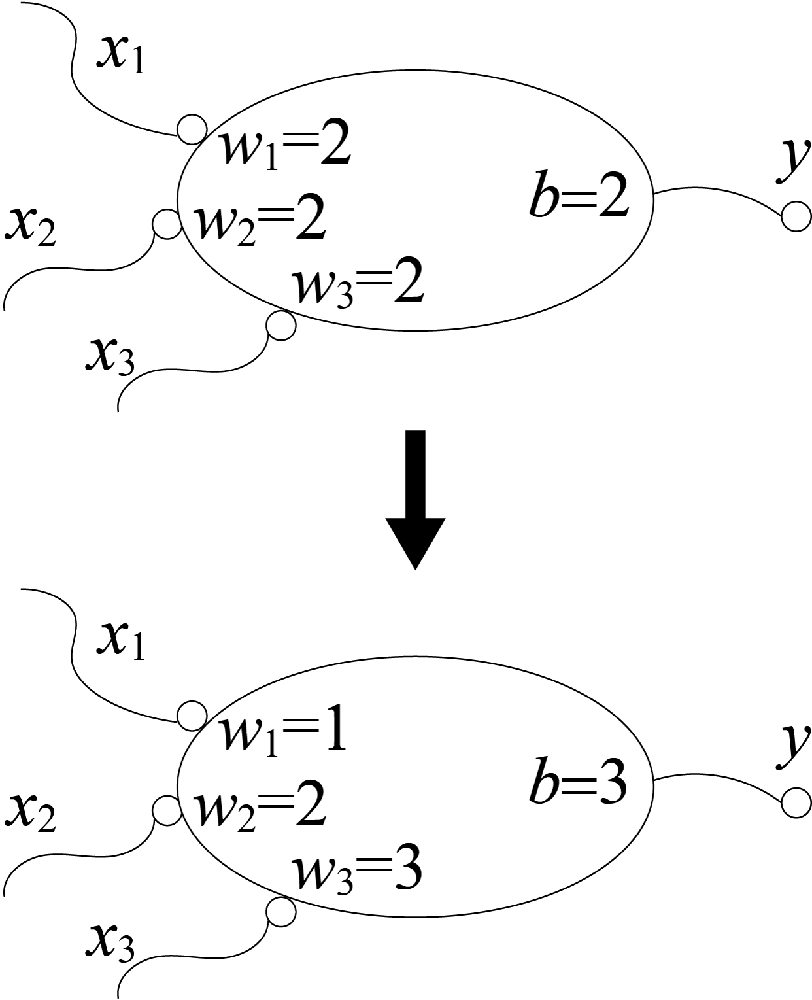
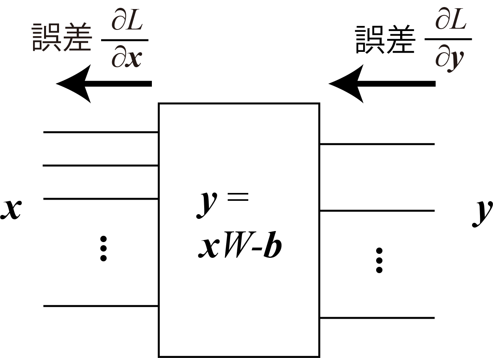

<!-- footer: "Advanced Vision Session 2" -->

# Advanced Vision

## Session 2: Training of Artificial Neural Networks

Ryuichi Ueda, Chiba Institute of Technology

 

This work is licensed under a [Creative Commons Attribution-ShareAlike 4.0 International License](https://creativecommons.org/licenses/by-sa/4.0/).

---

<!-- paginate: true -->

## Today's Tasks

- How to train artificial neural networks

---

### The summary from last session

- Animals are born with a certain degree of programming, but...
    - Neurons generally do not increase as they grow.
    - To identify cats, we need to make changes to our neural network.
    - We can't open our heads and wire them.

How do we do it?

---

### Learning Method: Varying Parameters

- Example: An artificial neuron that outputs $1$ if $x_1 + 2 x_2 + 3 x_3 \ge 3$, and $0$ otherwise.
    - Initially, the parameters are randomly chosen (top right).
- Basic Method
    1. Input something and observe the "difference" between the output and the correct answer.
        - Example: if $(x_1, x_2, x_3) = (1, 0, 0)$ is input to the neuron above, $1$ is output (whereas $0$ is desired).
    2. Vary the parameters to reduce the difference.
        - In this case, for example, it becomes $0$ when $w_1 = 1.9$

Do this for all neurons (hereafter referred to as layers).

---

### How do we change the parameters?

- Option 1: If the output is incorrect, just change it randomly.
$\rightarrow$With many parameters, it's impossible to get the correct answer.
- Option 2: Change the parameters to minimize the difference.
    - How??
        - There are a lot of neurons.

Let's discuss.

---

## Backpropagation

- The output error (loss function value) is sent from the output side to the input side.
    - The magnitude of the value is adjusted based on the influence of each layer.
        - "Consider the influence."
            - Example: A layer doubles the input and outputs it.
            $\rightarrow$The upstream value has twice the influence on the result.
- After that: Change the parameters so that the error decreases.

$\qquad\qquad\qquad\qquad$

---

### Simple Example

- Top right: A simple layer with one input and one output.
    - $9/10$ is input and $17/10$ is output.
$\rightarrow$ The error in $y$ is $1/3$.
(The output $17/10$ should be smaller.)
        - Since $w=2$, multiply it by $2$ and send the error (returning $2/3$).
- Theortical background: Partial differentiation (the change in $y$ when $x$ changes slightly).
    - $y=2x-1/10$
    - $\dfrac{\partial y}{\partial x}=2$

---

### For affine layers

- Growth rate of the output loss function: $\partial \mathcal{L} / \partial \boldsymbol{y}$
    - The influence of $\boldsymbol{y}$ on the increase in $\mathcal{L}$
- Growth rate of the error in the input loss function: $\partial \mathcal{L} / \partial \boldsymbol{x}$
    - $\dfrac{\partial \mathcal{L}}{\partial \boldsymbol{x}} = \dfrac{\partial \mathcal{L}}{\partial \boldsymbol{y}} \dfrac{\partial \boldsymbol{y}}{\partial \boldsymbol{x}} = \dfrac{\partial \mathcal{L} }{\partial \boldsymbol{y}} W^\top$
        - Chain rule of partial derivatives
        - The influence increases by the weight $W$
        - The value of $\partial \mathcal{L} / \partial \boldsymbol{y}$ is determined based on the error in $\mathcal{L}$.$\rightarrow$The magnitude of the error is determined by a specific value at each layer.

---

### Summary of Backpropagation

- Upstream layers (regardless of layer type) can calculate the error using the chain rule.
    - However, they should be differentiable. 
- The error of a given layer can be calculated based on the error propagated from downstream layers.
    - Each layer can calculate the error using only its own partial derivative.

---

### Sigmoid layer with $n$ inputs

- $\boldsymbol{y} = \text{Sigmoid}(\boldsymbol{x}) = \left[ h(x_1) \quad h(x_2) \quad \dots \quad h(x_n) \right]$
    - $h(x) = (1 + e^{-x})^{-1}$
- Let's (partially) differentiate the sigmoid function $h$.
    * $\dfrac{\text{d} h}{\text{d} x} = -1\cdot(1 + e^{-x})^{-2}(-e^{-x})$
$= (1+e^{-x})^{-2}e^{-x} = h^2(h^{-1}-1) = h(1 - h)$
- Specific values ​​of each element: $h$ is the output value $y_i = h(x_i)$, so...
- $\dfrac{\partial \boldsymbol{y}}{\partial \boldsymbol{x}} = \left[ y_1(1-y_1) \quad y_2(1-y_2) \quad \dots \quad y_n(1-y_n) \right]$

---

## Parameter Modification

- Update to minimize the error transmitted from downstream
- Update equation for one parameter
    - $w \longleftarrow w - \alpha \dfrac{\partial \mathcal{L}}{\partial w} = w - \alpha \dfrac{\partial \mathcal{L}}{\partial \boldsymbol{y}}\dfrac{\partial \boldsymbol{y}}{\partial w}$
        - $\alpha$ is the discount rate (avoid adjusting parameters all at once based on a single result)
- Simple example (right figure. $y=wx-b$, $\alpha = 0.1$)
    - $\partial \boldsymbol{y}/ \partial w = x = 9/10$, $\partial \boldsymbol{y}/ \partial b = -1$
    - $w \longleftarrow 2 - 1/10 \cdot 1/3 \cdot 9/10 = 1.97$ (decreased)
    - $b \longleftarrow 1/10 - 1/10 \cdot 1/3 \cdot (-1) = 0.13$ (increase)

---

### Parameter Adjustments for Affine Layers

- Effect of parameters on error
    -  $W$: $\dfrac{\partial \mathcal{L}}{\partial W} = \dfrac{\partial \mathcal{L}}{\partial \boldsymbol{y}} \dfrac{\partial \boldsymbol{y}}{\partial W} = \boldsymbol{x}^\top\dfrac{\partial \mathcal{L} }{\partial \boldsymbol{y}}$
        - [Why does the order of partial derivatives change?](https://qiita.com/kinkalow/items/2a229cf855df828e4c39)
        (The instructor is unverified. Sorry!)
    - $\boldsymbol{b}$: $\dfrac{\partial \mathcal{L}}{\partial \boldsymbol{b}} = \dfrac{\partial \mathcal{L}}{\partial \boldsymbol{y}} \dfrac{\partial \boldsymbol{y}}{\partial \boldsymbol{b}} = - \dfrac{\partial \mathcal{L} }{\partial \boldsymbol{y}}$
- Update equation (common to all layers)
    - $\boldsymbol{w} \longleftarrow \boldsymbol{w} - \alpha \dfrac{\partial \mathcal{L}}{\partial \boldsymbol{w}} = \boldsymbol{w} - \alpha \dfrac{\partial \mathcal{L}}{\partial \boldsymbol{y}}\dfrac{\partial \boldsymbol{y}}{\partial \boldsymbol{w}}$

---

### Modify the parameters of the neural network on p. 14

- If $x_1 + 2 x_2 + 3 x_3 \ge 3$, output $1$; otherwise, output $0$.
    - Move from the state at the top right to the state at the bottom right.
- Equation for modification (from p. 11):
    - $w_i \leftarrow w_i- \alpha \cdot$ input value $\cdot$ error
    - $b \leftarrow b+ \alpha \cdot$ error
- $\alpha=0.5$ (large for fast convergence)
- Enter $(x_1, x_2, x_3) = (1, 0, 0)$ to modify the parameters.

---

### Answer

- Calculation (reprinted)
- $w_i \leftarrow w_i- \alpha$ input value $\cdot$ error
- $b \leftarrow b + \alpha$ error

- Input $(x_1, x_2, x_3) = (1, 0, 0)$. $\rightarrow$ output $1$, error $1$
- $w_1 = 2 - 1/2 \cdot 1 \cdot 1 = 1.5$ (approaching $1$)
- $w_2 = w_3 = 2$ (remaining the same)
- $b = 2 + \alpha1 = 2.5$ (approaching $3$)
- Next, what happens if $(x_1, x_2, x_3) = (0, 0, 1)$ is input?

---

### Answer

- Calculation (Reposted)
- $w_i \leftarrow w_i- \alpha$ Input value $\cdot$ Error
- $b \leftarrow b+ \alpha$ Error

- $(x_1, x_2, x_3) = (0, 0, 1)$ Input $\rightarrow$ Output $0$, Error $-1$
- $w_1 and w_2$ remain unchanged
- $w_3 = 2 - 0.5 \cdot 1 \cdot (-1) = 2.5$ (approaching $3$)
- $b = 2.5 + 0.5 (-1) = 2$
- $b$ moves away from $3$. This can happen.
- Those who can do so should also calculate the error sent to the previous neuron.

---

## Supplement: Skip (Residual) Connections

- A connection method in which the output of one layer is input not only to the next layer but also to other layers.
- Layers sandwiched between inputs learn the difference between the input and output.
- Presence or absence of skip connections: Affects the ease of initial learning.
- Without skip connections: Initially, $\boldsymbol{y}$ is random.
- With skip connections: (If the output of an intermediate layer is initially zero) Initially, $\boldsymbol{y}=\boldsymbol{x}$.
- ResNet (2015)

---

## Summary

- Artificial Neural Networks
- Can be programmed by combining neurons.
- Backpropagation can be used for learning.
- We'll look at applications in future lectures.
