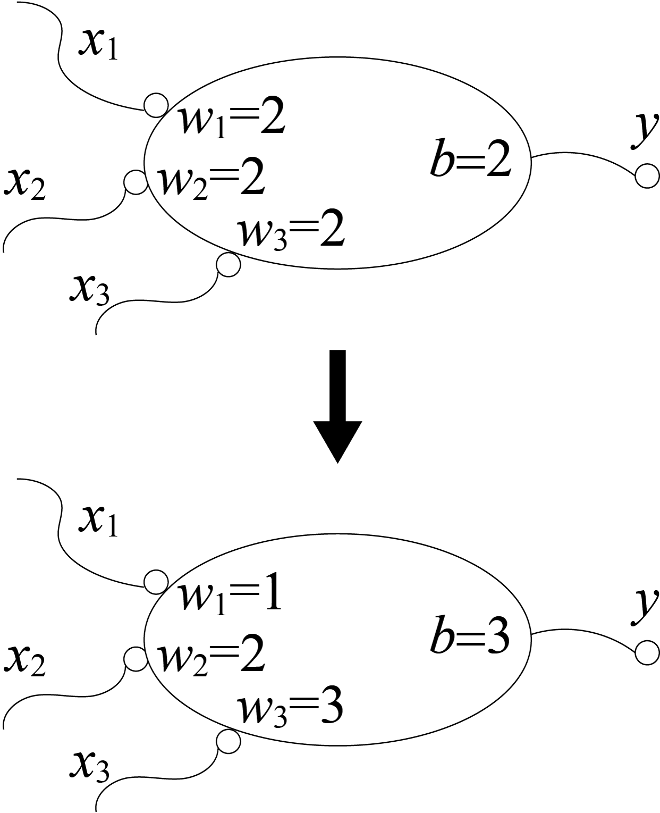
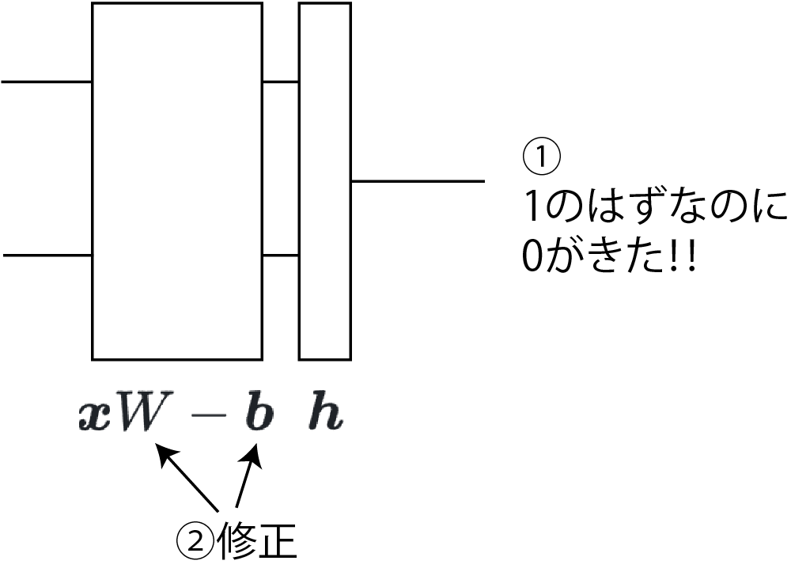
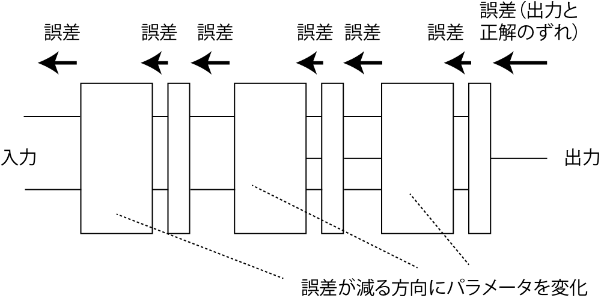
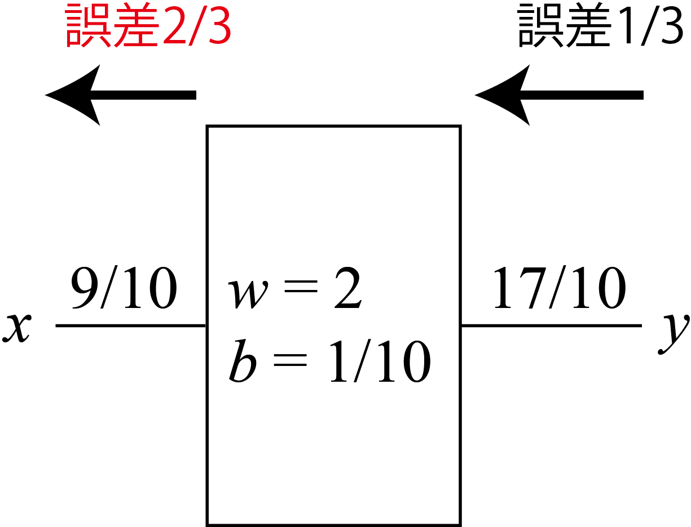
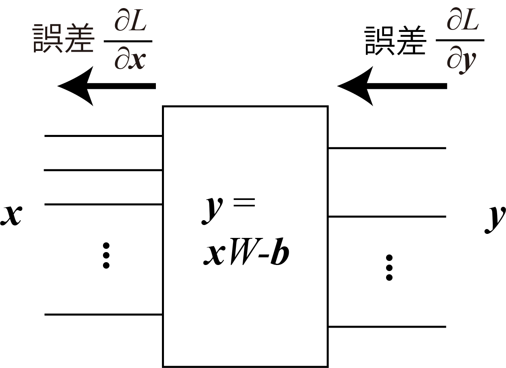
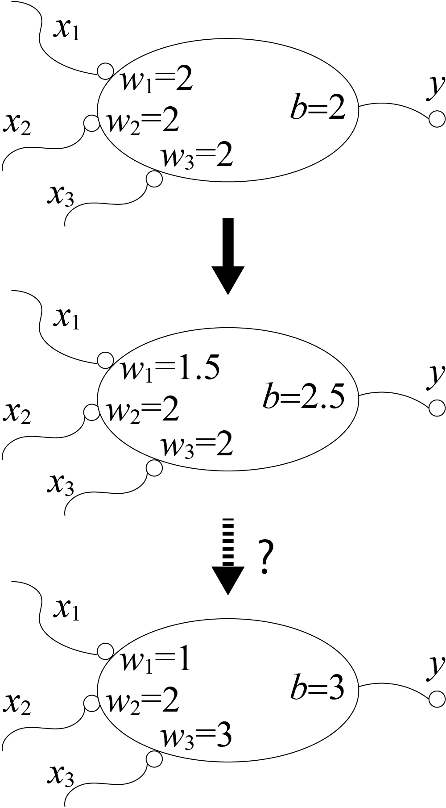
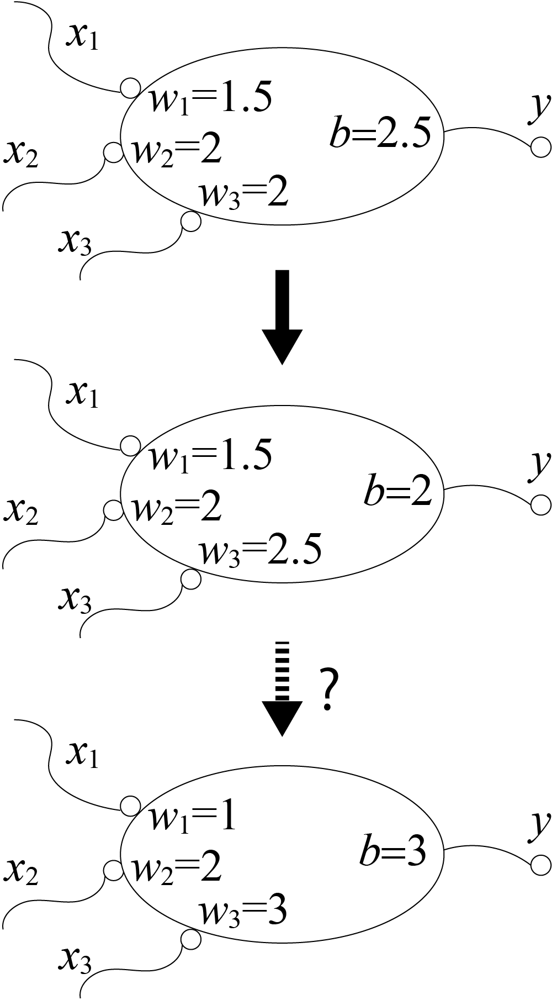
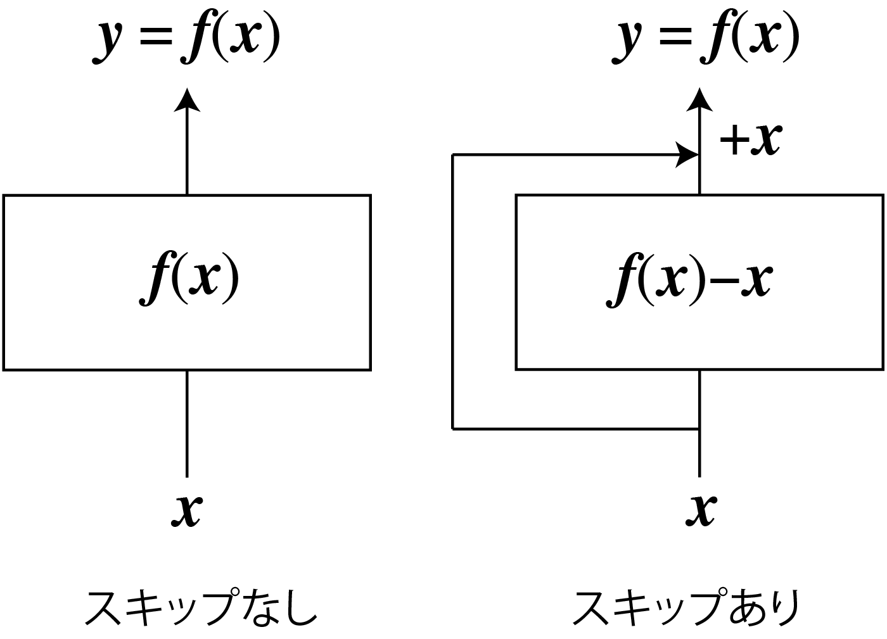

<!-- footer: "アドバンストビジョン第2回" -->

# アドバンストビジョン

## 第2回: 人工ニューラルネットワークの学習

千葉工業大学 上田 隆一

 

This work is licensed under a [Creative Commons Attribution-ShareAlike 4.0 International License](https://creativecommons.org/licenses/by-sa/4.0/).

---

<!-- paginate: true -->

## 今日やること

- 人工ニューラルネットワークをどのように学習させるか

---

### 前回のまとめ前のスライド

- 動物は生まれたときにある程度プログラミングされた状態だが・・・
    - そのあと成長しても神経細胞は基本的に増えない
    - 猫を識別するにはニューラルネットワークに変更を加えないといけない
    - 頭を開けて配線するわけにはいかない

どうやるの?

---

### 学習の方法: パラメータを変える

- 例題: $x_1 + 2 x_2 + 3 x_3 \ge 3$なら$1$を出力、そうでなければ$0$を出力する人工ニューロン
    - 最初、パラメータはあてずっぽ（右図上）
- 基本的な方法
    1. 何か入力して出力と正解の「ずれ」を観測する
        - 例えば上のニューロンに$(x_1, x_2, x_3) = (1, 0, 0)$を入れると$1$が出てくる（$0$が出てきてほしいのに）
    2. ずれを小さくするようにパラメータを変える
        - この場合はたとえば$w_1 = 1.9$とすると$0$に

これを全ニューロンに対してやる（以後はレイヤー表記）

---

### パラメータをどう変えるか?

- 案1: 出力を間違えたらあてずっぽで変える
    $\rightarrow$たくさんパラメータがあると正解は無理
- 案2: ずれが小さくなるようにパラメータを変える
    - ニューロンはたくさんある
    - どうやって？？

どうすればいいか議論してみましょう

---

## 誤差逆伝播法

- 出力側の誤差（評価関数の誤差）をどんどん入力側に送っていく
    - 誤差の大きさは、そのニューロン（層）の影響を考えて加減する
        - 「影響を考えて」
            - 例: ある層が入力を2倍して出力
            $\rightarrow$その上流の値は結果に対して2倍の影響力
- その後: 送られてきた誤差が一定の割合で小さくなる方向にパラメータを変更

$\qquad\qquad\qquad\qquad$

---

### 単純な例

- 右図上: 1入力1出力の単純なレイヤー
    - $9/10$が入力されて$17/10$を出力
    $\rightarrow y$の誤差$1/3$が返ってきた
        （出力$17/10$はもっと小さいべき）
        - $w=2$なので$2$倍して誤差を送信（$2/3$を返す）
- 理屈: 偏微分（$x$が少し変化したときの$y$の変化）
    - $y=2x-1/10$
    - $\dfrac{\partial y}{\partial x}=2$

---

### アフィン層の場合

- 出力側の評価関数の誤差の拡大率: $\partial \mathcal{L} / \partial \boldsymbol{y}$
    - $\mathcal{L}$の誤差に対して$\boldsymbol{y}$が与える影響度
- 入力側の評価関数の誤差の拡大率: $\partial \mathcal{L} / \partial \boldsymbol{x}$
    - $\dfrac{\partial \mathcal{L}}{\partial \boldsymbol{x}} = \dfrac{\partial \mathcal{L}}{\partial \boldsymbol{y}} \dfrac{\partial \boldsymbol{y}}{\partial \boldsymbol{x}} = \dfrac{\partial \mathcal{L} }{\partial \boldsymbol{y}} W^\top$
        - 偏微分の連鎖律
        - 重み$W$の分だけ影響力が増大
        - $\partial \mathcal{L} / \partial \boldsymbol{y}$の値を$\mathcal{L}$の誤差に基づいて決定$\rightarrow$どの層でも具体的な値で誤差の大きさが決まる

---

### 誤差逆伝播法のまとめ

- （層の種類によらず）上流の層はどこでも連鎖律を利用して誤差を計算可能
    - ただし微分できることが必要
- ある層の誤差は下流の層から伝わってきた誤差に基づいて計算可能
    - 各層は、自身の偏微分の式だけで誤差を計算可能

---

### シグモイド層の場合

- シグモイドレイヤーも同様に計算すると
    - $\dfrac{\partial L}{\partial \boldsymbol{x}} = \dfrac{\partial L}{\partial \boldsymbol{y}} \dfrac{\partial \boldsymbol{y}}{\partial \boldsymbol{x}} = \dfrac{\partial L }{\partial \boldsymbol{y}} y^2 e^{-x}$となる

---

- パラメータの修正（計算式の根拠は次ページ）
    - $w = 2$$- \alpha 9/10\cdot 1/3$（重みが減る）
    - $b = 1/10$$+ \alpha 1/3$（閾値が上がる）

---

### アフィンレイヤーのパラメータ修正

- 誤差に対するパラメータの影響
    - $W$について: $\dfrac{\partial L}{\partial W} = \dfrac{\partial L}{\partial \boldsymbol{y}} \dfrac{\partial \boldsymbol{y}}{\partial W} = \boldsymbol{x}^\top\dfrac{\partial L }{\partial \boldsymbol{y}}$
    - $\boldsymbol{b}$について: $\dfrac{\partial L}{\partial \boldsymbol{b}} = \dfrac{\partial L}{\partial \boldsymbol{y}} \dfrac{\partial \boldsymbol{y}}{\partial \boldsymbol{b}} = - \dfrac{\partial L }{\partial \boldsymbol{y}}$
- これらの値を$\alpha$だけ割り引いて元のパラメータから引く
    - 割り引くのはひとつの入力だけでパラメータを大きく変えないため

---

### 問題: p. 14のニューラルネットワークのパラメータ修正

- $x_1 + 2 x_2 + 3 x_3 \ge 3$なら$1$を出力、そうでなければ$0$を出力させたい
    - 右図上の状態から右図下の状態にもっていきたい
- 修正のための式（p. 19のもの）: 
    - $w_i \leftarrow w_i- \alpha$入力値$\cdot$誤差
    - $b \leftarrow b+ \alpha$誤差
- $\alpha=0.5$で（早く収束させるため大きめ）
- $(x_1, x_2, x_3) = (1, 0, 0)$を入力してパラメータを修正してみましょう

---

### 答え

- 計算（再掲）
    - $w_i \leftarrow w_i- \alpha$入力値$\cdot$誤差
    - $b \leftarrow b+ \alpha$誤差

- $(x_1, x_2, x_3) = (1, 0, 0)$を入力$\rightarrow$出力$1$、誤差$1$
    - $w_1 = 2 - 1/2 \cdot 1 \cdot 1 = 1.5$（$1$に近づく）
    - $w_2 = w_3 = 2$（そのまま）
    - $b = 2 + \alpha1 = 2.5$（$3$に近づく）
- 次に$(x_1, x_2, x_3) = (0, 0, 1)$を入力すると？

---

### 答え

- 計算（再掲）
    - $w_i \leftarrow w_i- \alpha$入力値$\cdot$誤差
    - $b \leftarrow b+ \alpha$誤差

- $(x_1, x_2, x_3) = (0, 0, 1)$を入力$\rightarrow$出力$0$、誤差$-1$
    - $w_1, w_2$はそのまま
    - $w_3 = 2 - 0.5 \cdot 1 \cdot (-1) = 2.5$（$3$に近づく）
    - $b = 2.5 + 0.5 (-1) = 2$
        - $b$は$3$から遠ざかる。そういう場合もある。
- できる人は前方のニューロンに送る誤差も計算を

---

## 補足: スキップ接続

- あるレイヤーの出力を次の層だけでなく、
別の層にも入力する接続方法
    - 入力に挟まれた層は入出力の差分を
    学習することに
- スキップ接続の有無: 初期の学習の容易さに影響
    - スキップ接続なし: 最初は$\boldsymbol{y}$がランダム
    - スキップ接続あり: （途中の層の出力が最初ゼロだと）最初は$\boldsymbol{y}=\boldsymbol{x}$に

---

## まとめ

- 人工ニューラルネットワーク
    - ニューロンの組み合わせでプログラムできる
    - 誤差逆伝播で学習ができる
- 次回、次々回で応用を見ていきましょう

