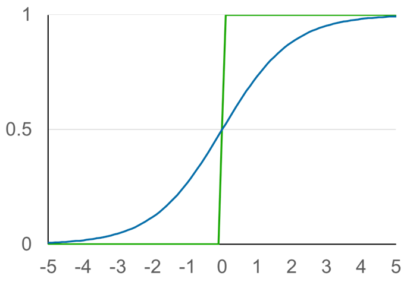

<!-- footer: "アドバンストビジョン第2回" -->

# アドバンストビジョン

## 第2回: 人工ニューラルネットワークの基礎1

千葉工業大学 上田 隆一

 

This work is licensed under a [Creative Commons Attribution-ShareAlike 4.0 International License](https://creativecommons.org/licenses/by-sa/4.0/).

---

<!-- paginate: true -->

## 今日やること

- 人工ニューラルネットワークってなに？
---

### 人工ニューラルネットワークの正体

- やってることは単なる行列の演算
- 先ほどの例の一番左の「層」
    - 入力: $\boldsymbol{x} = (z_1 \ z_2)$と表現
    - 重み: $W = \begin{pmatrix}1 & 0 \\ 0 & 1 \end{pmatrix}$
        - 上、下のニューロンがそれぞれ$z_1, z_2$しか使わないという意味
    - 出力の計算: $\boldsymbol{x}' = \boldsymbol{h}(\boldsymbol{x}W - \boldsymbol{b})$
        - $\boldsymbol{b}$は閾値: $\boldsymbol{b} = (0 \ 0)$
        - $\boldsymbol{h}$は閾値処理

---

### あとは繰り返し

- 1層目（再掲）
    - 入力: $\boldsymbol{x} = (x_1 \ x_2)$
    - $W = \begin{pmatrix}1 & 0 \\ 0 & 1 \end{pmatrix}$、$\boldsymbol{b} = (0 \ 0)$
- 2層目
    - 入力（1層目の出力）: $\boldsymbol{x}' = (x_1' \ x_2')$
    - $W = \begin{pmatrix}1 & -1 \\ 1 & -1 \end{pmatrix}$、$\boldsymbol{b} = (1.1 \ -0.9)$
- 3層目
    - 入力（2層目の出力）: $\boldsymbol{x}'' = (x_1'' \ x_2'')$
    - $W = \begin{pmatrix}1 \\ 1 \end{pmatrix}$、$\boldsymbol{b} = (0.9)$

---

### レイヤーでの表現

- 入出力を線でつなぎ、演算を箱で表現
- これまで使ってきた例だと1層分が2層に
     - 重みの反映（と閾値の引き算）で1層
         - アフィンレイヤー
     - 閾値処理で1層
         - ステップ関数レイヤー
- 注意: 右の図ではあまり入出力の数が変わってないが、実際はアフィンレイヤーの前後で変わる

---

### 残った問題: どう学習するか?

- 動物は生まれたときにある程度プログラミングされた状態だが・・・
    - そのあと成長しても神経細胞は基本的に増えない
    - 猫を識別するにはニューラルネットワークに変更を加えないといけない
    - 頭を開けて配線するわけにはいかない

どうやるの?みなさんは普段どうしてます?（話し合ってみましょう）

---

### 学習の方法: パラメータを変える

- 例題: $x_1 + 2 x_2 + 3 x_3 \ge 3$なら$1$を出力、そうでなければ$0$を出力する人工ニューロン
    - 最初、パラメータはあてずっぽ（右図上）
- 基本的な方法
    1. 何か入力して出力と正解の「ずれ」を観測する
        - 例えば上のニューロンに$(x_1, x_2, x_3) = (1, 0, 0)$を入れると$1$が出てくる（$0$が出てきてほしいのに）
    2. ずれを小さくするようにパラメータを変える
        - この場合はたとえば$w_1 = 1.9$とすると$0$に

これを全ニューロンに対してやる（以後はレイヤー表記）

---

### パラメータをどう変えるか?

- 案1: 出力を間違えたらあてずっぽで変える
    $\rightarrow$たくさんパラメータがあると正解は無理
- 案2: ずれが小さくなるようにパラメータを変える
    - $\rightarrow$少し$W$や$\mathcal{b}$を変えても$\boldsymbol{h}$に$0$か$1$にされるので効果が分からない
        - ちょっと変えたらちょっとでもいいので
        誤差が減ってほしい
        （どうすればいいか議論してみましょう）

---

### 対策

- 方法1: 出力をアナログ値に（次のページ）
- 方法2: たくさん入力して期待値をとる
    - バッチ、ミニバッチと呼ばれる方法で方法1と共に使われる

---

### シグモイド関数で微妙にアナログに

- $y = \dfrac{1}{1 + e^{-x}}$という関数を使用
- シグモイド関数のグラフ
    - 青線
    - 緑はこれまでのステップ関数
    

これでパラメータを少し変えると出力も少し変わるのでずれの修正ができる（メモ: 1, 0でもあとのスライドのように修正ができるので、ここは説明が少し違う。）

---

### 次なる問題: ずれに対してどれだけパラメータを修正するか

- 誤差逆伝播法
    - 出力側の誤差をどんどん入力側に送っていく
        - 誤差の大きさは、そのニューロン（層）の影響を考えて加減する
        
    - 送られてきた誤差が小さくなる方向にパラメータを変える

---

### 単純な例

- 送る誤差の大きさ
    - ある層で誤差が$t$倍になるなら、$t$かけて上流に送る
        - 上の層での値の違いが$t$倍だけ影響するので
    - 右図上: 1入力1出力の単純なレイヤー
        - $9/10$が入力されて$17/10$を出力
        $\rightarrow$誤差$1/3$が返ってきた
        （出力$17/10$はもっと小さいべき）
        - $w=2$なので$2$倍して誤差を送信（$2/3$を返す）
- パラメータの修正（計算式の根拠は次ページ）
    - $w = 2$$- \alpha 9/10\cdot 1/3$（重みが減る）
    - $b = 1/10$$+ \alpha 1/3$（閾値が上がる）

---

### アフィンレイヤーの誤差逆伝播

- 出力の誤差: $\partial L / \partial \boldsymbol{y}$と書ける
    - 最終的な誤差$L$に対して$\boldsymbol{y}$が与える影響度
- 入力（前の層の出力）の誤差: 同様に$\partial L / \partial \boldsymbol{x}$
    - $\dfrac{\partial L}{\partial \boldsymbol{x}} = \dfrac{\partial L}{\partial \boldsymbol{y}} \dfrac{\partial \boldsymbol{y}}{\partial \boldsymbol{x}} = \dfrac{\partial L }{\partial \boldsymbol{y}} W^\top$
        - （行列の計算はさておき）重み$W$の分だけ影響力が増すので、これを上流に送る
- シグモイドレイヤーも同様に計算すると
    - $\dfrac{\partial L}{\partial \boldsymbol{x}} = \dfrac{\partial L}{\partial \boldsymbol{y}} \dfrac{\partial \boldsymbol{y}}{\partial \boldsymbol{x}} = \dfrac{\partial L }{\partial \boldsymbol{y}} y^2 e^{-x}$となる

---

### アフィンレイヤーのパラメータ修正

- 誤差に対するパラメータの影響
    - $W$について: $\dfrac{\partial L}{\partial W} = \dfrac{\partial L}{\partial \boldsymbol{y}} \dfrac{\partial \boldsymbol{y}}{\partial W} = \boldsymbol{x}^\top\dfrac{\partial L }{\partial \boldsymbol{y}}$
    - $\boldsymbol{b}$について: $\dfrac{\partial L}{\partial \boldsymbol{b}} = \dfrac{\partial L}{\partial \boldsymbol{y}} \dfrac{\partial \boldsymbol{y}}{\partial \boldsymbol{b}} = - \dfrac{\partial L }{\partial \boldsymbol{y}}$
- これらの値を$\alpha$だけ割り引いて元のパラメータから引く
    - 割り引くのはひとつの入力だけでパラメータを大きく変えないため

---

### 問題: p. 14のニューラルネットワークのパラメータ修正

- $x_1 + 2 x_2 + 3 x_3 \ge 3$なら$1$を出力、そうでなければ$0$を出力させたい
    - 右図上の状態から右図下の状態にもっていきたい
- 修正のための式（p. 19のもの）: 
    - $w_i \leftarrow w_i- \alpha$入力値$\cdot$誤差
    - $b \leftarrow b+ \alpha$誤差
- $\alpha=0.5$で（早く収束させるため大きめ）
- $(x_1, x_2, x_3) = (1, 0, 0)$を入力してパラメータを修正してみましょう

---

### 答え

- 計算（再掲）
    - $w_i \leftarrow w_i- \alpha$入力値$\cdot$誤差
    - $b \leftarrow b+ \alpha$誤差

- $(x_1, x_2, x_3) = (1, 0, 0)$を入力$\rightarrow$出力$1$、誤差$1$
    - $w_1 = 2 - 1/2 \cdot 1 \cdot 1 = 1.5$（$1$に近づく）
    - $w_2 = w_3 = 2$（そのまま）
    - $b = 2 + \alpha1 = 2.5$（$3$に近づく）
- 次に$(x_1, x_2, x_3) = (0, 0, 1)$を入力すると？

---

### 答え

- 計算（再掲）
    - $w_i \leftarrow w_i- \alpha$入力値$\cdot$誤差
    - $b \leftarrow b+ \alpha$誤差

- $(x_1, x_2, x_3) = (0, 0, 1)$を入力$\rightarrow$出力$0$、誤差$-1$
    - $w_1, w_2$はそのまま
    - $w_3 = 2 - 0.5 \cdot 1 \cdot (-1) = 2.5$（$3$に近づく）
    - $b = 2.5 + 0.5 (-1) = 2$
        - $b$は$3$から遠ざかる。そういう場合もある。
- できる人は前方のニューロンに送る誤差も計算を

---

## まとめ

- 人工ニューラルネットワーク
    - ニューロンの組み合わせでプログラムできる
    - 誤差逆伝播で学習ができる
- 次回、次々回で応用を見ていきましょう

