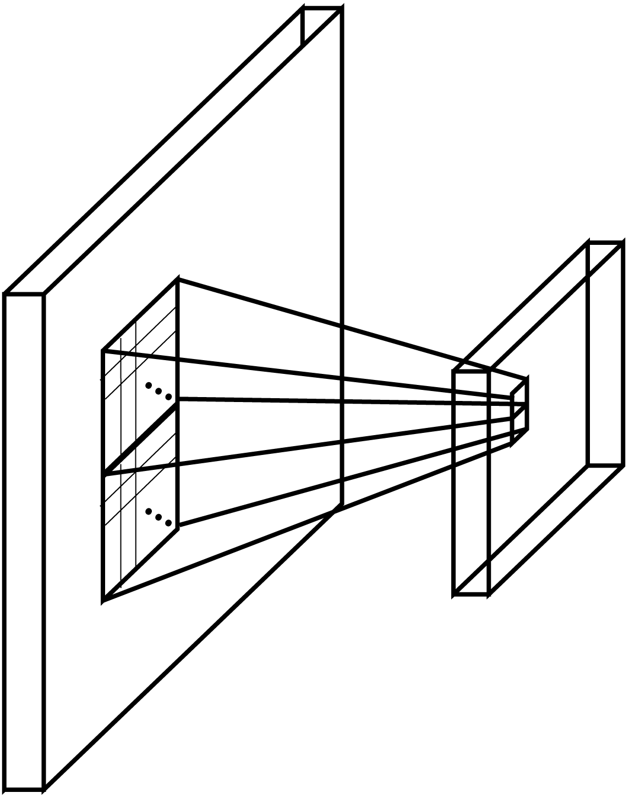
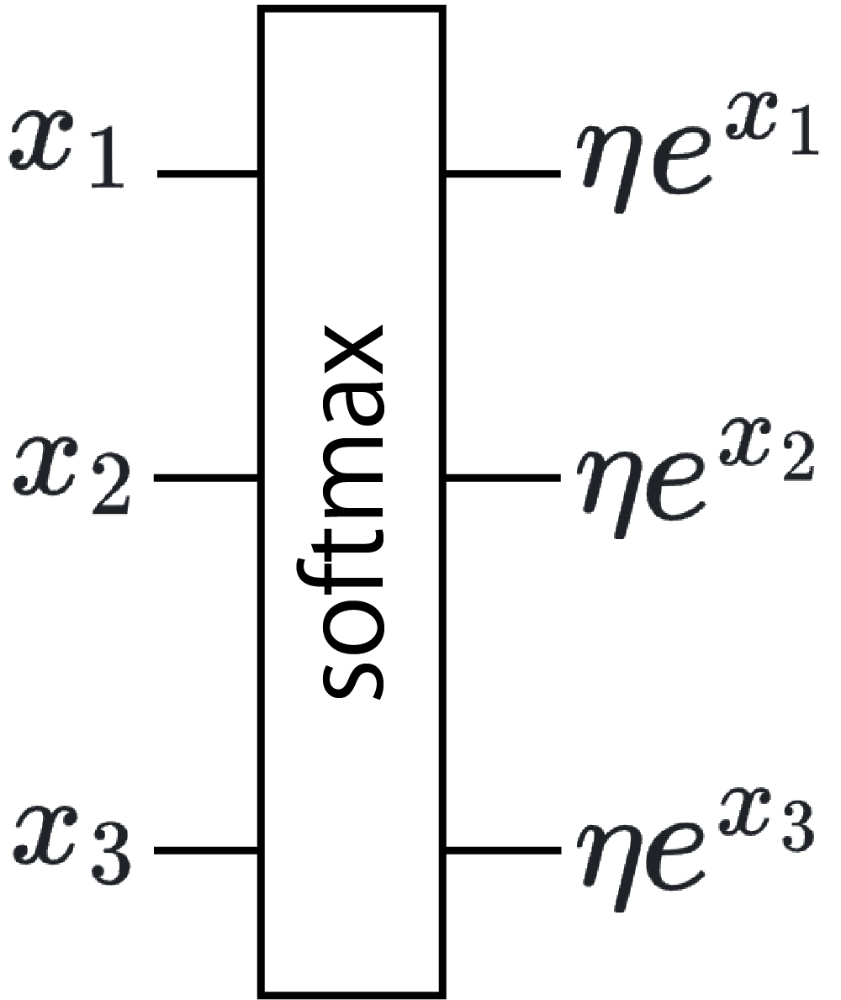

<!-- footer: "アドバンストビジョン第3回" -->

# アドバイストビジョン

## 第3回: 画像と人工ニューラルネットワーク

千葉工業大学 上田 隆一

 

This work is licensed under a [Creative Commons Attribution-ShareAlike 4.0 International License](https://creativecommons.org/licenses/by-sa/4.0/).

---

<!-- paginate: true -->

## 今日やること

- CNN
- U-Net

---

### 以前から触れていた話題

- 動物は視覚をどう行動や判断に必要な情報に変えているか
- それをコンピュータで再現できるか

（https://commons.wikimedia.org/wiki/File:Retina-diagram.svg, by S. R. Y. Cajal and Chrkl, CC-BY-SA 3.0）

人工ニューラルネットワーク（ANN）でできる?$\rightarrow$できる

---

### もうひとつの話題: なんか自動で絵を描くやつが出現

- 実例は世の中に氾濫しているので各自調査を
- こいつらはどういう仕組み?

---

## 視覚・画像とANN（CNN）

- 映像、画像の特性に特化したANNが存在
    - 画像の特性
       - 2次元（深度があれば3次元、動画でも時間軸を入れると3次元）
       - ある画素の周囲に似た画素がある
- おさらい: ディジタル画像
    - 平面が格子状に分割されて、数字の大小で色の濃さが表される
    （例: 右図。数字はてきとう）
    - カラーの場合はR、G、Bそれぞれについて格子状の数値データ

---

### 画像認識の難しさ

- 同じものが大きく写ったり小さく写ったり回転して写ったり
- 変形したり抽象化されたりデフォルメされたり

---

### CNN（convolutional neural network）

- テレビ局ではないです
- convolutional: 「畳み込みの」
-  画像の近いところの画素値を入力して
出力するニューロンを多用（右図）
    - 画像の近いところ: $n\times n$画素の正方形領域
    - 小領域の画素の特徴や変化を出力
    - さらに下の層でも畳み込みすることで全体の特徴を捕捉
- 「畳み込み層」と他の層の組み合わせで画像を処理

---

### CNNの部品1: 畳み込み層

- 画像の一部（n$\times$n画素の「窓」）領域にフィルタをかけて出力を足し、ひとつの値に置き換えて下流に送る（右上図）
- フィルタを1つずつずらして適用（右下図）$\rightarrow$下流も画像に
    - 下流の画素数を変えたくない場合$\rightarrow$縁をパディング
    - 2つ以上ずらすこともあり
- 畳み込みの演算（下図）
    - $\odot$: アダマール積（要素ごとに掛け算）

$\qquad\qquad$

--- 

### フィルタの意味

- フィルタ: 従来の画像処理に使われてきたものと同じ
    - 局所的な特徴（エッジなど）を検出
    - 畳み込み層の学習=フィルタの学習

---

### フィルタの計算式

- $y = \sum_{i=1}^n\sum_{j=1}^n w_{(i,j)}x_{(i,j)} + b$
    - $(i,j)$: フィルタの座標系での画素の位置
    - $x_{(i,j)}$: 画素の値
    - $w_{(i,j)}$: 重み（学習対象）
    - $b$: バイアス（学習対象）
        - 前回までは$-b$だったが同じこと
- 2次元になっただけでこれまでと同じ
    - ただし「全結合」ではない
    - アフィン層（+活性化関数層）のことを「全結合層」ということがある

---

### CNNの部品2: プーリング層 

- 窓のなかで特徴の高い画素だけを残して画素数を減らす層
    - 最大値を残す「maxプーリング」が主に使われる
- 学習はしない

---

### CNNの部品3: ソフトマックス層
（注意: CNN以外にも使われます）

- softmax（softな最大値）: 1つに決めないということ
- 使用例: 画像に映ったものを判別
    - 答えを断定せず確率で出力（例: 犬90%、猫9%、他1%）
    - 実世界は微妙な場面が多いので、1つに決めないで曖昧に出力したほうが都合よい
- 数式
    - 入力$\boldsymbol{x} = (x_1, x_2, \dots, x_n)$に対し$y_i = \eta e^{x_i}$を出力
        - $\eta$は正規化定数

---

### CNNの構成

<a style="font-size:80%" href="https://commons.wikimedia.org/wiki/File:Comparison_image_neural_networks.svg">画像: Cmglee, CC BY-SA 4.0</a>

- 例: 画像に写っているものが何かを答えるための構成
    - Dense: 全結合層
    - flatten: 配列状のデータを1列にすること
- [AlexNetの論文](https://proceedings.neurips.cc/paper_files/paper/2012/file/c399862d3b9d6b76c8436e924a68c45b-Paper.pdf)
    - 学習した中間層や認識結果が見られる

---

## まとめ

- CNN、GAN、拡散モデルなど画像を扱うANNを勉強
    - 他、vision transformerなど2, 3年に一度、画期的な手法が発表されている
        - transformerは次回
