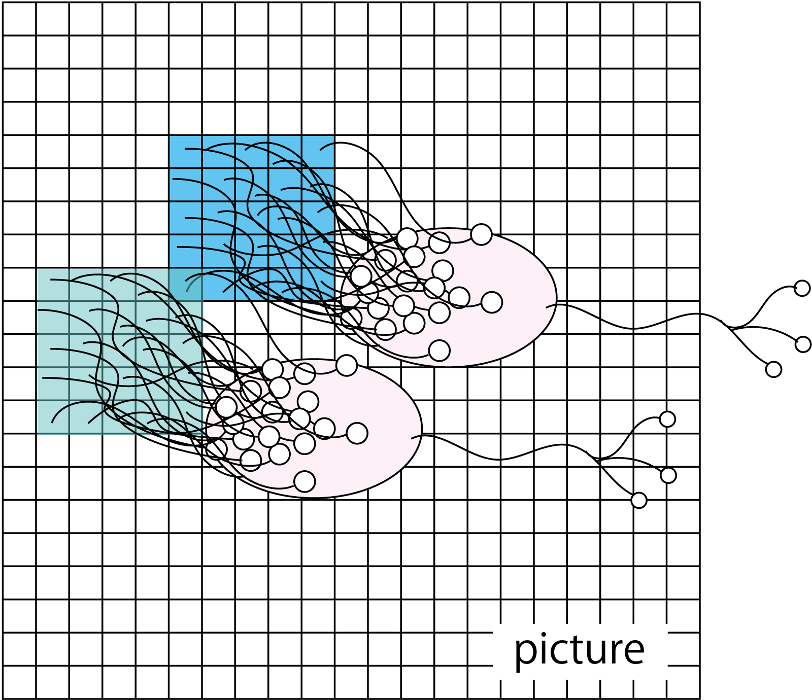
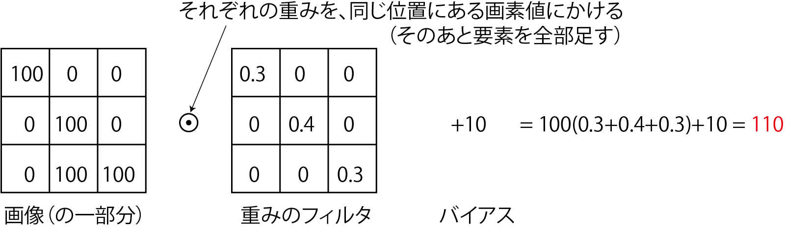
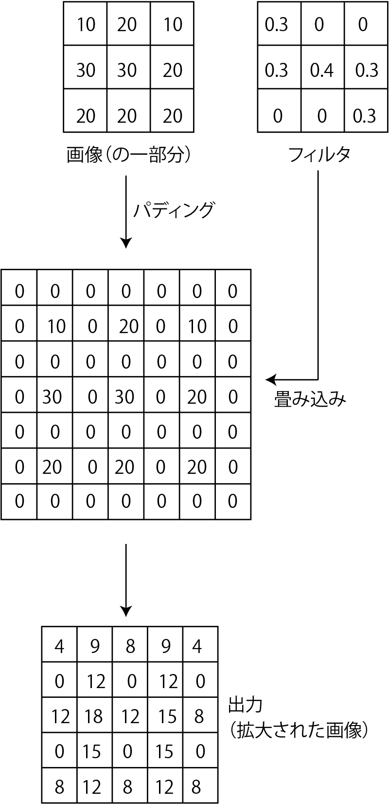
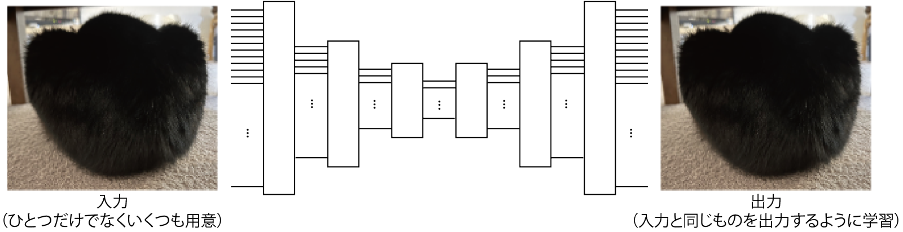
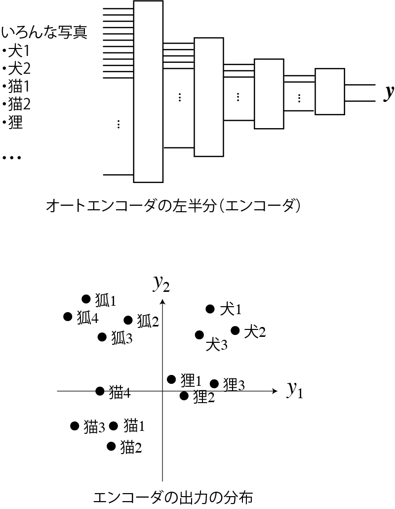
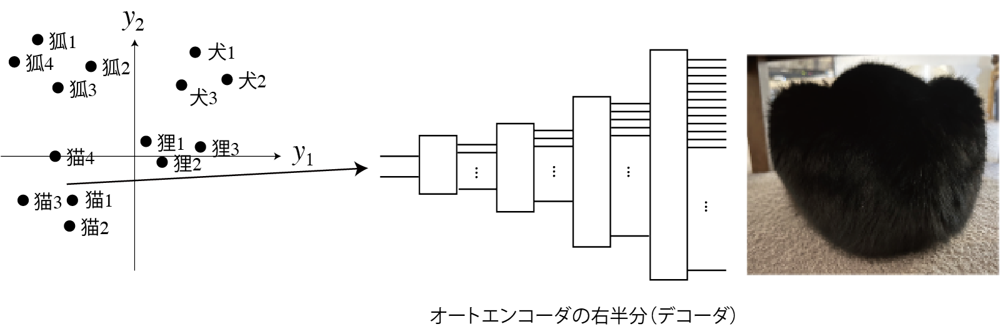

<!-- footer: "アドバンストビジョン第3回" -->

# アドバイストビジョン

## 第3回: 画像と人工ニューラルネットワーク

千葉工業大学 上田 隆一

 

This work is licensed under a [Creative Commons Attribution-ShareAlike 4.0 International License](https://creativecommons.org/licenses/by-sa/4.0/).

---

<!-- paginate: true -->

## 今日やること

- CNN
- U-Net
- オートエンコーダ

---

### 以前から触れていた話題

- 動物は視覚をどう行動や判断に必要な情報に変えているか
- それをコンピュータで再現できるか

（https://commons.wikimedia.org/wiki/File:Retina-diagram.svg, by S. R. Y. Cajal and Chrkl, CC-BY-SA 3.0）

人工ニューラルネットワーク（ANN）でできる?$\rightarrow$できる

---

### もうひとつの話題: なんか自動で絵を描くやつが出現

- 実例は世の中に氾濫しているので各自調査を
- こいつらはどういう仕組み?

---

## 視覚・画像とANN（CNN）

- 映像、画像の特性に特化したANNが存在
    - 画像の特性
       - 2次元（深度があれば3次元、動画でも時間軸を入れると3次元）
       - ある画素の周囲に似た画素がある
- おさらい: ディジタル画像
    - 平面が格子状に分割されて、数字の大小で色の濃さが表される
    （例: 右図。数字はてきとう）
    - カラーの場合はR、G、Bそれぞれについて格子状の数値データ

---

### 画像認識の難しさ

- 同じものが大きく写ったり小さく写ったり回転して写ったり
- 変形したり抽象化されたりデフォルメされたり

---

### CNN（convolutional neural network）

- テレビ局ではないです
- convolutional: 「畳み込みの」
-  画像の近いところの画素値を入力して
出力するニューロンを多用（右図）
    - 画像の近いところ: $n\times n$画素の正方形領域
    - 小領域の画素の特徴や変化を出力
    - さらに下の層でも畳み込みすることで全体の特徴を捕捉
- 「畳み込み層」と他の層の組み合わせで画像を処理

---

### CNNの部品1: 畳み込み層

- 画像の一部（n$\times$n画素の「窓」）領域にフィルタをかけて出力を足し、ひとつの値に置き換えて下流に送る（右上図）
- フィルタを1つずつずらして適用（右下図）$\rightarrow$下流も画像に
    - 下流の画素数を変えたくない場合$\rightarrow$縁をパディング
    - 2つ以上ずらすこともあり（ずらす量のことをストライドという）
- 畳み込みの演算（下図）
    - $\odot$: アダマール積（要素ごとに掛け算）

$\qquad\qquad$

--- 

### フィルタの意味

- フィルタ: 従来の画像処理に使われてきたものと同じ
    - 局所的な特徴（エッジなど）を検出
    - 畳み込み層の学習=フィルタの学習

---

### フィルタの計算式

- $y = \sum_{i=1}^n\sum_{j=1}^n w_{(i,j)}x_{(i,j)} + b$
    - $(i,j)$: フィルタの座標系での画素の位置
    - $x_{(i,j)}$: 画素の値
    - $w_{(i,j)}$: 重み（学習対象）
    - $b$: バイアス（学習対象）
        - 前回までは$-b$だったが同じこと
- 2次元になっただけでこれまでと同じ
    - ただし「全結合」ではない
    - アフィン層（+活性化関数層）のことを「全結合層」ということがある

---

### CNNの部品2: プーリング層（サブサンプリング層） 

- 窓のなかで特徴の高い画素だけを残して画素数を減らす層
    - 最大値を残す「maxプーリング」が主に使われる
- 学習はしない
- 画素が減って後段（ものを分類するネットワーク）が学習しやすく
- 写ってる物体の位置のズレに少し強くなる
    - 冒頭の「難しさ」についてはCNNではそんなに解決できてないので学習で様々な大きさ、位置、向きの画像を使う

---

### CNNの部品3: ソフトマックス層
（注意: CNN以外にも使われます）

- softmax（softな最大値）: 1つに決めないということ
- 使用例: 画像に映ったものを判別
    - 答えを断定せず確率で出力（例: 犬90%、猫9%、他1%）
    - 実世界は微妙な場面が多いので、1つに決めないで曖昧に出力したほうが都合よい
- 数式
    - 入力$\boldsymbol{x} = (x_1, x_2, \dots, x_n)$に対し$y_i = \eta e^{x_i}$を出力
        - $\eta$は正規化定数

---

### チャンネル

- カラー（RGB）画像を扱う場合
    - 画素の縦横方向の他に3つの「チャンネル」を持つ
        - 画素ごとにベクトルがあると考えても良い
    - RGBそれぞれにフィルタを用意すると出力も3chに
- 1つのチャンネルに複数のフィルタも適用可能
    - 下図[LeNet[LeCun1989]](https://direct.mit.edu/neco/article-abstract/1/4/541/5515/Backpropagation-Applied-to-Handwritten-Zip-Code)の構造（画像: Zhang et al. [CC BY-SA 4.0](https://creativecommons.org/licenses/by-sa/4.0/)）
        - 画像から手書きの数字を識別するCNN（1ch $\rightarrow$ 6ch $\rightarrow$ 16ch）
            

---

### 代表的なCNN

- LeNet: 前ページの構成で手書き文字を識別
    - 畳み込み・プーリング$\rightarrow$全結合層
        - シグモイド関数を活性化関数に使用
- AlexNet: 畳み込みを5層に深く
    - 右図: LeNet（左）とAlexNet（右）の比較
    - LeRUを活性化関数に使用
    - 1000種類の識別
    - [AlexNetの論文](https://proceedings.neurips.cc/paper_files/paper/2012/file/c399862d3b9d6b76c8436e924a68c45b-Paper.pdf)
        - 学習した中間層や認識結果が見られる

<a style="font-size:70%" href="https://commons.wikimedia.org/wiki/File:AlexNet_block_diagram.svg">右図: Zhang et al., CC BY-SA 4.0</a>

---

### CNNのまとめ

- 畳み込み層で模様の特徴を抽出
- LeNet、AlexNet: 画像から物体を識別 
    - CNNにはさらなる用途が

---

## U-Netと潜在空間

- U-Net: CNNの後ろに逆向きのCNNをつけたもの
    - 当初の用途: セグメンテーション
        - 画像に写っているものごとに画像の領域を分割
        （右図: [[三上他 2022]](https://www.jstage.jst.go.jp/article/jrsj/40/2/40_40_143/_article/-char/ja)）
- 「逆向きのCNN」
    - 「転置畳み込み（後から説明）」という操作で画像を大きくしていく（構造は次ページ）

---

### U-Netの構造

- 左半分: CNN（物体の識別のような処理）
- 右半分: 逆向きのCNN（識別結果からの画像の構築）
- スキップ接続を使用
    - 途中で次元が落ちているので単なる差分学習以上の意味

<a style="font-size:70%" href="https://commons.wikimedia.org/wiki/File:Example_architecture_of_U-Net_for_producing_k_256-by-256_image_masks_for_a_256-by-256_RGB_image.png">画像: Mehrdad Yazdani, CC BY-SA 4.0</a>

---

### 転置畳み込み

- 画像の解像度を上げる操作
    - 画像をパディングして大きくし、フィルタを適用$\rightarrow$画像が大きく
    - この操作とスキップ接続で得た元の画像の情報からセグメンテーション
- U-Netについての説明はこれで終わりだが、単にセグメンテーションができる以上にこの構造は重要

---

## オートエンコーダと潜在空間

---

### オートエンコーダ

- 入力と出力を一致させるように学習されたANN [[Hinton 2006]](chrome-extension://efaidnbmnnnibpcajpcglclefindmkaj/https://www.cs.toronto.edu/~hinton/absps/science.pdf)
    - 学習のためのラベル付けは不要（教師無し）
    - 構成はCNNでも全結合でもよいが、U-Net状に中間の次元を小さく
        - 入力側: どんどん情報を落としていく
        - 出力側: どんどん情報を増やしていく
    - 疑問: 何の意味があるの？

---

### 入力側（エンコーダ）のやっていること

- 入力されたデータの分類
    - （学習がうまくいった場合は）似たような画像から似たような出力が得られる
    - うしろに全結合層（とソフトマックス層）をくっつけて追加で学習させると分類器に
- 右図の例: 出力を2次元まで縮小した場合の
出力の分布の例
（注意: 実用的なものはもっと高次元）
    - 分布している空間を潜在空間と言う

---

### 出力側（デコーダ）のやっていること

- 潜在空間のベクトルからデータを復元
    - 例: 「犬」のベクトルが来たら犬の写真や絵を描画
    - 復元方法（絵の描き方）を学習
        - 転置畳み込みのフィルタなどのパラメータに
    - 復元しやすいようにエンコーダ側が学習される
        - 潜在空間でのベクトルの分布が決まる

---

### オートエンコーダの利用

- エンコーダとデコーダを分離して利用
- エンコーダ
    - 先に前結合層などを取り付けて分類器に
    - 先に別のデコーダを取り付けると別のものが生成される
- デコーダ
    - 学習に用いたもの以外のエンコーダを取り付けると変換器に
        - 例「犬」と入力$\rightarrow$犬の絵を生成

ちまたで生成AIと言われるものの原型

---

## まとめ

- CNNからオートエンコーダまで学習
    - 画像の識別から生成までの流れを見てきた
        - CNNによる物体の識別: エンコーダ+識別器
        - U-Netによるセグメンテーション: オートエンコーダに似た構造
    - 次回以降にいくつかの応用
        - 台形の図がよく出てくる

