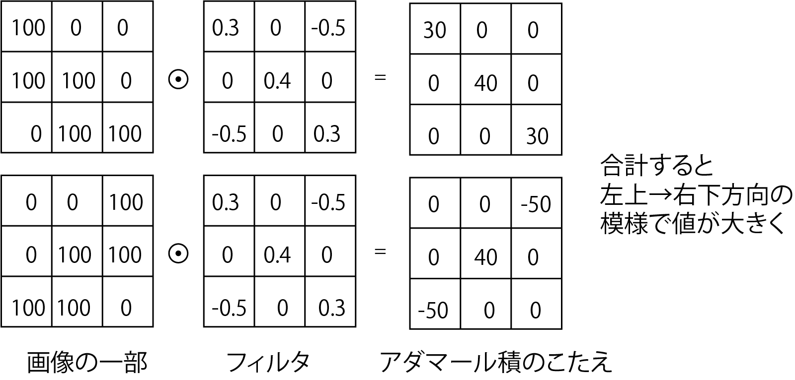

<!-- footer: "Advanced Vision Session 3" -->

# Advice on Vision

## Lesson 3: Fundamentals of Image Classification and Generation I

Ryuichi Ueda, Chiba Institute of Technology

 

This work is licensed under a [Creative Commons Attribution-ShareAlike 4.0 International License](https://creativecommons.org/licenses/by-sa/4.0/).

---

<!-- paginate: true -->

## Contents

- CNN
- U-Net
- Autoencoder

---

## Before we get to that, a follow-up question:

- Problem: How can we mathematically describe an artificial neural network that can distinguish between dogs and cats (and other things) in digital images?
    - Considering an artificial neural network as a function
    - How do we express the inputs, outputs, and parameters?

---

### Example Answer 1

- $y = f(\boldsymbol{x} | \boldsymbol{w})$
    - $\boldsymbol{x}$: A vector of pixel values (highly multidimensional)
        - Dimensions: Number of vertical pixels $\times$ Number of horizontal pixels $\times$ Color channels (RGB: 3, RGBD: 4)
    - $y = 0$: Dog, $y=1$: Cat, $y=2$: Other
        - $\boldsymbol{w}$: A vector of parameters (also multidimensional)
        - Sometimes written as $y = f_\boldsymbol{w}(\boldsymbol{x})$ (in ANN circles)
       - It can also be written as $y = f(\boldsymbol{x} ; \boldsymbol{w})$ (traditional).

Problem: Integer values like $0, 1, 2$ can't be output from the end of a neural network.

---

### Example Answer 2

- $\boldsymbol{y} = \boldsymbol{f}(\boldsymbol{x} | \boldsymbol{w})$
    - $\boldsymbol{x}$ and $\boldsymbol{w}$: Same
    - $\boldsymbol{y} = (1$ if cat,1 if dog, 1 otherwise$)$
        - Since only one element is 1, it's called a "one-hot vector."

Question: Is it okay to be definitive when it's subtle?

---

### Example Answer 3

- $\boldsymbol{y} = \boldsymbol{f}(\boldsymbol{x} | \boldsymbol{w})$
    - $\boldsymbol{x}$ and $\boldsymbol{w}$ are the same
    - $\boldsymbol{y} = (P_\text{cat}, P_\text{dog}, P_\text{other})$
        - $\boldsymbol{y}$ is a probability distribution
- This format is commonly used for the output of ANNs for classification
    - To settle on one, select the one with the highest probability

---

## Another Question

- What should the loss function be during training?
    - Consider Example 3 on the previous page.
    - Output: $\boldsymbol{y} = (\hat{P}_1, \hat{P}_2, \dots, \hat{P}_N)$
    - Correct answer: $\boldsymbol{y}^* = (P_1, P_2, \dots, P_N)$
        - The correct answer is often a one-hot vector with the correct element $=1$.

---

### Common answer

- Use cross entropy
    - $\mathcal{L}(\boldsymbol{w}) = H(\boldsymbol{y}^*, \boldsymbol{y}) = -\sum_{i=1}^N P_i \log \hat{P}_i$
        - $\log$ is the natural logarithm (base $e$)
    - A side note for math buffs: This is equivalent to minimizing the Kullback-Leibler divergence.
- Let's calculate the probability of the correct answer when it's high (e.g., $0.9$) and low (e.g., $0.1$).
    - Answer omitted.
- The essence of ANN learning is adjusting $\boldsymbol{w}$ so that the value of $\mathcal{L}$ (loss) approaches $0$.

---

### A topic we've touched on before.

- How do animals convert their vision into information needed for action and decision-making?
- Can this be replicated on a computer?

(https://commons.wikimedia.org/wiki/File:Retina-diagram.svg, by S. R. Y. Cajal and Chrkl, CC-BY-SA 3.0)

Can this be done with artificial neural networks (ANNs)? $\rightarrow$ Yes.

---

### Another topic: Someone has appeared that can automatically draw pictures.

- Examples are everywhere, so please do your own research.
- How do they work?

---

## Vision, Images, and ANNs (CNNs)

- ANNs specialize in images and video.
    - Image Characteristics
        - 2-D (3-D with depth, and 3-D with video if a time axis is added).
        - Similar pixels are present around a certain pixel.
- Recap: Digital Images
    - A plane is divided into a grid, and the color intensity is represented by the number. (e.g. right figure)
    - In the case of color images, the data is a grid of numerical data for R, G, and B.

---

### The Difficulty of Image Recognition

- The same object may appear enlarged, small, or rotated.
- It may be deformed, abstracted, or distorted.

---

### CNN (Convolutional Neural Network)

- This is not a TV station.
- It uses many neurons that input and output pixel values ​​from nearby areas of the image (right image).
    - Nearby areas of the image: a square region of $n\times n$ pixels.
    - It outputs pixel characteristics and changes in the small region.
    - Further convolutions are used in lower layers to capture overall features.
- It recognizes images using a combination of "convolutional layers" and other layers.

---
### CNN component 1: Convolutional layer

- Apply a filter to a portion of the image (a "window" of n$\times$n pixels), add the output, replace it with a single value, and send it downstream (upper right).
- Apply the filter by shifting it one pixel at a time (lower right). $\rightarrow$ Downstream also applies to the image.
    - To maintain the number of downstream pixels $\rightarrow$ pad the edges
    - Shifting by more than two pixels is also possible (the amount of shift is called the stride).

---

- Convolution operation (lower).
    - $\odot$: Hadamard product (element-wise multiplication).

$\qquad\qquad$

---

### Meaning of Filter

- Filter: Same as those used in traditional image processing
    - Detect local features (edges, etc.)
    - Convolutional layer training = Filter training

---

### Filter calculation formula

- $y = \sum_{i=1}^n\sum_{j=1}^n w_{(i,j)}x_{(i,j)} + b$
    - $(i,j)$: Pixel position in the filter coordinate system
    - $x_{(i,j)}$: Pixel value
    - $w_{(i,j)}$: Weight (Learning target)
    - $b$: Bias (Learning target)
        - Previously, it was $-b$, but it's the same thing.
- It's the same as before, just in 2D.
    - However, it's not "fully connected."
    - An affine layer (plus activation function layer) is sometimes called a "fully connected layer."

---

### CNN Component 2: Pooling Layer (Subsampling Layer)

- A layer that reduces the number of pixels within a window, retaining only the most distinctive pixels.
    - "Max pooling," which retains the maximum value, is mainly used.
- No learning is performed.
- The reduced number of pixels makes it easier for the subsequent stage (the object classification network) to learn.
- It becomes slightly more tolerant to shift of the objects in the image.
    - CNNs do not fully address the "difficulties" mentioned at the beginning, so images of various sizes, positions, and orientations are used for training.

---

### CNN Component 3: Softmax Layer
(Note: This layer is also used in applications other than CNNs.)

- Softmax (soft maximum): Not settling on a single answer
- Example: Identifying objects in an image
    - Outputting a probability without a definitive answer (e.g., 90% dog, 9% cat, 1% other)
    - Because the real world is full of ambiguous situations, it is more convenient to output an ambiguous answer without a single answer.
- Mathematical formula
    - For input $\boldsymbol{x} = (x_1, x_2, \dots, x_n)$, output $y_i = \eta e^{x_i}$
        - $\eta$ is a normalization constant

---

### Channels

- When working with color (RGB) images
    - There are three "channels."
       - Each pixel can be thought of as a three-dimensional vector
    - If a filter is prepared for each RGB, the output will be three channels
- Multiple filters can also be applied to a single channel
    - The structure of [LeNet[LeCun1989]](https://direct.mit.edu/neco/article-abstract/1/4/541/5515/Backpropagation-Applied-to-Handwritten-Zip-Code) shown below (Image: Zhang et al. [CC BY-SA 4.0](https://creativecommons.org/licenses/by-sa/4.0/))
        - CNN for identifying handwritten digits from images (1 channel $\rightarrow$ 6 channels $\rightarrow$ 16 channels)

---

### Representative CNNs

- LeNet: Handwritten character recognition using the configuration shown on the previous page
    - Convolutional pooling $\rightarrow$ fully connected layer
        - Sigmoid activation function
- AlexNet: Five deep convolutional layers
    - Right: Comparison of LeNet (left) and AlexNet (right)
    - LeRU activation function
    - Classification of 1,000 types
    - [paper of AlexNet](https://proceedings.neurips.cc/paper_files/paper/2012/file/c399862d3b9d6b76c8436e924a68c45b-Paper.pdf)
    - We can see the trained intermediate layers and recognition results

<a style="font-size:70%" href="https://commons.wikimedia.org/wiki/File:AlexNet_block_diagram.svg">Right: Zhang et al., CC BY-SA 4.0</a>

---

### Summary of CNNs

- Extracting pattern features using convolutional layers
- LeNet, AlexNet: Identifying objects from images
   - Further uses of CNNs

---

## U-Net and Latent Space

- U-Net: A reversed CNN added to a CNN
    - Original use: Segmentation
        - Dividing image regions into regions based on the objects in the image (Right: [[Mikami et al. 2022]](https://www.jstage.jst.go.jp/article/jrsj/40/2/40_40_143/_article/-char/ja))
- "Reverse CNN"
    - Enlarge the image using an operation called "transposed convolution" (explained later) (structure shown on the next page)

---

### U-Net Structure

- Left half: CNN (processing such as object identification)
- Right half: Reverse CNN (construction of an image from the identification results)
- Uses skip connections
- Dimensionality is lost along the way, making it more than just differential learning

<a style="font-size:70%" href="https://commons.wikimedia.org/wiki/File:Example_architecture_of_U-Net_for_producing_k_256-by-256_image_masks_for_a_256-by-256_RGB_image.png">Image: Mehrdad Yazdani, CC BY-SA 4.0</a>

---

### Transpose convolution

- Image resolution increase operation
- Image enlargement by padding and applying a filter $\rightarrow$ Image enlargement
- Segmentation is performed using the information from the original image obtained through this operation and skip connections.
- This concludes the explanation of U-Net, but this structure is important for more than just segmentation.

---

## Autoencoder and Latent Space

---

### Autoencoder

- ANN trained to match input and output [[Hinton 2006]](chrome-extension://efaidnbmnnnibpcajpcglclefindmkaj/https://www.cs.toronto.edu/~hinton/absps/science.pdf)
- Loss function: Mean square error (MSE) of input and output
- No labeling required for training (unsupervised)
- The structure can be either CNN or fully connected, but the intermediate dimension is reduced like U-Net.
- Input side: Information is gradually removed.
- Output side: Information is gradually added.
- Question: What does it mean?

---

### What the Input Side (Encoder) Does

- Classifies input data
- (If training is successful) Similar images produce similar outputs
- Adding a fully connected layer (and softmax layer) to the end and training it further turns it into a classifier
- Example on the right: Example of output distribution when output is reduced to 2 dimensions
(Note: Practical implementations are higher dimensional)
- The space in which the distribution occurs is called the latent space

---

### What the Output Side (Decoder) Does

- Reconstructs data from vectors in the latent space
- Example: If a "dog" vector is received, draw a photo or drawing of a dog
- Learns how to restore (draw) pictures
- Parameters for transposed convolution filters, etc.
- The encoder is trained to facilitate restoration
- The distribution of vectors in the latent space is determined

---

### Using an Autoencoder

- Separate the Encoder and Decoder
- Encoder
- Attach a pre-connected layer first to create a classifier
- Attaching a different decoder first will generate a different result
- Decoder
- Attaching an encoder other than the one used for training will create a converter
- Example: Input "dog" $\rightarrow$ Generate a picture of a dog

The prototype of what is commonly referred to as generative AI

---

## Summary

- Learning from CNN to autoencoder
- We've looked at the process from image classification to generation.
- Object classification using CNN: Encoder + classifier
- Segmentation using U-Net: A structure similar to an autoencoder
- Several applications will be covered in future articles.
- Trapezoid diagrams appear frequently.

