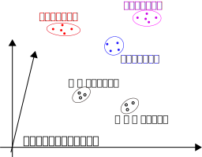
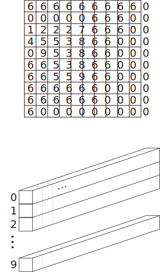

<!-- footer: "アドバンストビジョン第4.5回" -->

# アドバンストビジョン

## 第4.5回: 画像の識別と生成の基礎II（の補足）

千葉工業大学 上田 隆一

 

This work is licensed under a [Creative Commons Attribution-ShareAlike 4.0 International License](https://creativecommons.org/licenses/by-sa/4.0/).

---

<!-- paginate: true -->

## 内容

- さらに次の技術、モデルを見ていきましょう
    - 拡散モデルの誘導
    - discrete VAE
    - PixelCNN 
    - VQ-VAE
- なんで？
    - 実用されている画像の生成モデルで使われる技術なので

---

## 拡散モデルの誘導

- 拡散モデルでも出力をコントロールしたい
- 生成したいものが生成されるようにノイズを誘導
    - 分類器あり
    - 分類器なし
- （[講師が参考というかカンニングした動画](https://www.youtube.com/watch?v=90GlJcpMrm8) ）

---

### 分類器ありガイダンス[[Dhariwal 2021]](https://arxiv.org/abs/2105.05233)

- 準備: 訓練データ（雑音入り）を分類してラベルを出力する分類器を学習
- 分類器が出力するラベルに応じてデコーダに入力するノイズを少しいじる
    - ラベルに対応する画像が生成されやすくなる（ように学習）
- ADM-G[[Dhariwal 2021]](https://arxiv.org/abs/2105.05233)
    - ADM: ablated diffusion model; G: with classifier guidance
    - 生成の例: 論文の図3, 6
        - ラベルをどれだけ反映するかをパラメータで指定可能
    - U-Netを大きくしたり各部分を改良したりして
    当時のGANより良い画像を生成

---

### 分類器なしガイダンス[[Ho 2022]](https://arxiv.org/abs/2207.12598)

- 前ページの分類器を使わない（不要にする）
- 方法
    1. ラベルを入力できる拡散モデルを用意
    2. ラベルがない（ゼロベクトルを入れる）場合とある場合を学習
    $\Rightarrow$ラベルがある/ない場合の雑音除去量の差$\times$係数で、
    ラベルの影響を制御可能
- 係数を$\lambda$としましょう（$0 \le \lambda \le 1$）
    - $\lambda = 0$: 画像をランダムに生成
    - $\lambda = 1$: ラベルに対応する画像を生成
    - $0 < \lambda < 1$: 中間的な画像を生成
- 出力: 論文の図1

---

## discrete VAE[[Rolfe 2017]](https://arxiv.org/abs/1609.02200)

現在の画像生成技術に使用される

- 動機: VAEの出力はぼやけやすい$\rightarrow$そもそも1つのガウス分布にするのが悪いのではないか？
- 混合分布を使う
    - 分布が$K$個ある
        - 右図の場合: 5個の分布
    - 入力は$K$個ある分布のどれかから発生
- 出力の例（[[Rolfe 2017]](https://arxiv.org/abs/1609.02200)）の図5
    - ラベルを入力しなくても分類

---

### 画像$\boldsymbol{x}$が訓練データに選ばれるという事象の数理モデル

- $K$個の分布: $p_{1:K}$
- 画像$\boldsymbol{x}$が訓練データに選ばれるという事象: 
    - $\boldsymbol{x} \sim p_k$
        - ここで$k \sim \text{Cat}(\textbf{w}_\text{cat})$
- $\text{Cat}$: カテゴリカル分布
    - ベルヌーイ分布の多値版
    - 要は出目の確率が全部違うサイコロ

---

### 潜在空間の構成

- 潜在空間のベクトル$\boldsymbol{z}$がone-hot-vectorに
    - $\boldsymbol{z} = (0 \ 0 \ 0 \dots 1 \dots 0)$
       - $k$番目の要素が1に
- デコーダには$\boldsymbol{z}$と分布ぜんぶ（のパラメータ）を入力
    - 学習方法については未調査（ごめんなさい）

---

## PixelCNN（PixcelRNN）[[Oord 2016]](https://arxiv.org/abs/1601.06759)

- 途中までの画像から次のピクセルを推定
    - 利用例
        - 画像の補完: 上記論文の図1
        - 画像の生成: 同論文図7, 8
- 自己回帰モデルをCNN/RNNで実現
    - 自己回帰モデル: いままでの時系列データ
    $y=f(t)$から次の時刻の値を予測（右図）
        - 株価の予測などに使われてきた

---

### PixelCNNの構成

- いくつかの実装例あり
- 基本的な構成（画像の大きさは変わらず）
    - 最初の畳み込み層のフィルタに上のようなマスク
        - 上・左の画素から真ん中のピクセルの画素値を予想
    - あとの複数の畳み込み層（残差接続）のフィルタで下のようなマスク
        - 予想した画素値を利用して画像を復元
    - 出力: 画素値であったり画素値の分布であったり
- 学習: 出力と元の画像を比較
- 使用: 左上から1ピクセルごとに出力

---

### VQ-VAE[[Oord 2017]](https://arxiv.org/abs/1711.00937)（Vector Quantizatized Variational Autoencoder）

- 構造: VQ-VAE[[Oord 2017]](https://arxiv.org/abs/1711.00937)の図1
    - discrete VAEの一種
- ベクトル量子化（Vector Quantization、VQ）を利用
- 出力の画像をぼやけさせずシャープに
    - 例: [[Oord 2017]](https://arxiv.org/abs/1711.00937)の図2

---

### ベクトル量子化

- 画像をパッチワーク状に区切って似たものをまとめて圧縮する方法
    - 講師の博士論文でも使った
- 画像は次の2つのデータで表現される
    - コードブック
        - 全パッチを記録したデータ
            - 図の2段目にある色付きの正方形や棒状の画像の切れ端
    - 符号列
        - どこにどのパッチを当てはめるかを指示する配列
            - 図の2段目左にある数字の表

図: [上田博論2007]から

---

### 潜在空間とコードブック

- 潜在空間: 符号列の空間
    - 右上の画像状の配列をベクトル$\boldsymbol{z}$とみなす
- コードブックに相当するものはPixelCNNで作成
    - 畳み込み層から、各パッチの領域に対応する画素のパラメータを集めてベクトルに（右下の棒）
        - つまり、そのパッチの画素を予測する分布のパラメータでベクトルを構成

---

## まとめ

- 拡散モデルの誘導、discrete VAE、PixelCNN、VQ-VAEをざっと見た
- 第8回に続く
