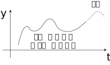

<!-- footer: "Advanced Vision, Part 4.5" -->

# Advanced Vision

## Part 4.5: Image Classification and Generation Fundamentals II (Supplement)

Ryuichi Ueda, Chiba Institute of Technology

 

This work is licensed under a [Creative Commons Attribution-ShareAlike 4.0 International License](https://creativecommons.org/licenses/by-sa/4.0/).

---

<!-- paginate: true -->

## Contents

- Let's look at the following models.
    - Derivation of a diffusion model
    - Discrete VAE
    - PixelCNN
    - VQ-VAE
- Why?
    - They are used in practical image generative models.

---

## Guidance for Diffusion Models

- Controlling the output even with a diffusion model
- Inducing noise to generate the desired results
    - with a classifier
    - classifier-free guidance
- ([Video the instructor used for reference](https://www.youtube.com/watch?v=90GlJcpMrm8) )

---

### Guidance with Classifiers [[Dhariwal 2021]](https://arxiv.org/abs/2105.05233)

- Preparation: Train a classifier that classifies training data (containing noise) and outputs labels.
- The noise input to the decoder is adjusted depending on the labels output by the classifier.
    - to make it easier to generate images corresponding to the labels.
- ADM-G [[Dhariwal 2021]](https://arxiv.org/abs/2105.05233)
    - ADM: ablated diffusion model; G: with classifier guidance
    - Generation example: Figures 3 and 6 in the paper
        - The extent to which labels are reflected can be specified using parameters
    - By enlarging the U-Net and improving each part, better images can be generated than with GANs at the time.

---

### Classifier-free guidance [[Ho 2022]](https://arxiv.org/abs/2207.12598)

- Do not use (or make unnecessary) the classifier from the previous page.
- Method
    1. Prepare a diffusion model that accepts labels as input.
    2. Train on cases with and without labels (by inputting a zero vector).
$\Rightarrow$The difference in noise removal amount between cases with and without labels can be calculated. (derived from Bayes' theorem).
- Let the coefficient be $\lambda$ ($0 \le \lambda \le 1$).
    - $\lambda = 0$: Randomly generate an image
    - $\lambda = 1$: Generate an image corresponding to the label
    - $0 < \lambda < 1$: Generate an intermediate image
- Output: Figure 1 in the paper

---

## Discrete VAE [[Rolfe 2017]](https://arxiv.org/abs/1609.02200)

Used in current image generation application

- Motivation: The output of VAEs is prone to blurring.$\rightarrow$ Isn't it bad to use a single Gaussian distribution?
- Uses a mixture distribution
    - There are $K$ distributions
        - In the case of the right figure: 5 distributions
    - The input is generated from one of the $K$ distributions
- Example output (Figure 5 in [[Rolfe 2017]](https://arxiv.org/abs/1609.02200))
    - Classification without inputting labels

---

### Mathematical model of the event that image $\boldsymbol{x}$ is selected as training data

- $K$ distributions: $p_{1:K}$
- The event that image $\boldsymbol{x}$ is selected as training data: $\boldsymbol{x} \sim p_k$
    - Here, $k \sim \text{Cat}(\textbf{w}_\text{cat})$
- $\text{Cat}$: Categorical distribution
    - The multivalued version of the Bernoulli distribution
    - Basically, it's a die with different probabilities for each roll.

---

### Latent space construction

- The latent space vector $\boldsymbol{z}$ is converted to a one-hot vector.
    - $\boldsymbol{z} = (0 \ 0 \ 0 \dots 1 \dots 0)$
        - The $k$th element is set to 1.
- The decoder is fed $\boldsymbol{z}$ and all the distribution parameters.
    - The training method has not yet been investigated (sorry).

---
## PixelCNN (PixelRNN) [[Oord 2016]](https://arxiv.org/abs/1601.06759)

- Estimating the next pixel from an intermediate image
    - Usage example
        - Image completion: Figure 1 in the paper
        - Image generation: Figures 7 and 8 in the paper
- Implementing an autoregressive model using CNN/RNN
    - Autoregressive model: Predicting the next value from previous time series data
$y=f(t)$ (right figure)
        - Used for stock price prediction, etc.

---
### PixelCNN Configuration

- Several implementation examples available
- Basic configuration (image size remains unchanged)
    - Applying the mask like the one above to the filter in the first convolutional layer
       - Predict the pixel value of the center pixel from the pixels above and left.
    - Applying the mask like the one bottom to the filter to subsequent layers. 
        - Reconstruct the image using the predicted pixel values.
    - Output: Pixel values or distributions of pixel values.
- Training: Compare the output with the original image.
- Usage: Output pixel by pixel from the top left.

---

### VQ-VAE[[Oord 2017]](https://arxiv.org/abs/1711.00937) (Vector Quantizatized Variational Autoencoder)

- Structure: Figure 1 of VQ-VAE[[Oord 2017]](https://arxiv.org/abs/1711.00937)
    - A type of discrete VAE
- Vector quantization (Vector Vector Quantization (VQ) is used.
- Sharpens the output image without blurring.
    - Example: Figure 2 in [[Oord 2017]](https://arxiv.org/abs/1711.00937)

---

### Vector Quantization

- A method for dividing an image into patchworks and compressing similar patches together.
    - Used in my doctoral thesis.
- An image is represented by the following two pieces of data:
    - Codebook: data recording all patches
        - Square or bar-shaped image fragments in 2nd row of the figure
    - Code sequence
        - Array indicating which patch is assigned where
            - Number tables in 2nd row (left) of the figure

Figure: From [上田2007]

---

### Latent Space and Codebook

- Latent Space: The space of code sequences
    - The image-like array in the upper right corner is considered to be the vector $\boldsymbol{z}$
- The equivalent of a codebook is created using PixelCNN
    - From the convolutional layer, the parameters of the pixels corresponding to each patch region are collected into a vector (bottom right bar)
        - In other words, a vector is constructed using the parameters of the distribution that predicts the pixels of that patch.

---

## Summary

- A quick look at diffusion model derivation, discrete VAE, PixelCNN, and VQ-VAE
- Continued in Part 8
