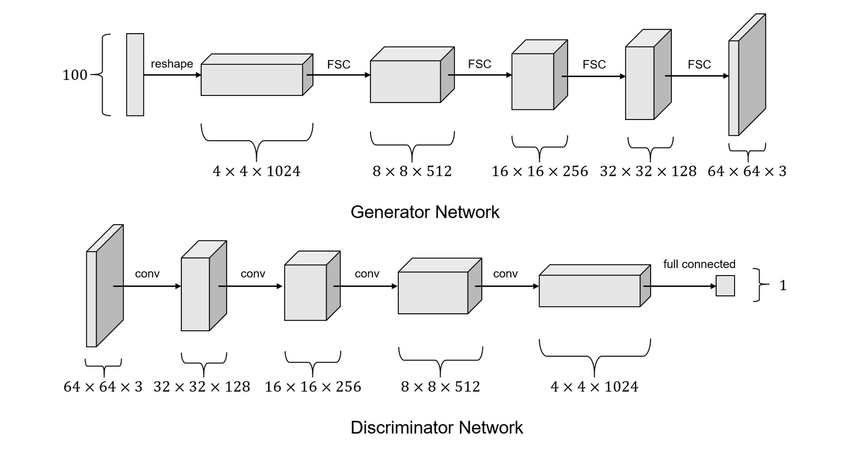

<!-- footer: "アドバンストビジョン第3回" -->

# アドバイストビジョン

## 第4回: 画像の識別と生成の基礎II

千葉工業大学 上田 隆一

 

This work is licensed under a [Creative Commons Attribution-ShareAlike 4.0 International License](https://creativecommons.org/licenses/by-sa/4.0/).

---

<!-- paginate: true -->

## 今日やること

- GAN
- 変分オートエンコーダ
- 条件付き変分オートエンコーダ

---

## GAN（generative adversarial networks）

- 敵対的生成ネットワーク
    - 「絵を描く人工ニューラルネットワーク」のブームの発端
    - それ以外にも音声やソフトウェアを作り出すなどの用途
- 「敵対的」とは何?（人類の敵ではない）
    - ふたつのANNを準備
        - 生成ネットワーク（generator）: 何かを作るANN
        - 識別ネットワーク（discriminator）: 入力が生成ネットワークの生成物かどうかを判断するANN
    - 生成ネットワークと識別ネットワークが互いに競う
- [元の論文](https://papers.nips.cc/paper_files/paper/2014/file/f033ed80deb0234979a61f95710dbe25-Paper.pdf)

---

### ネットワーク構造の例

- Deep Convlutional GAN（DCGAN）[[Radford 2015]](https://arxiv.org/pdf/1511.06434) <a href="https://www.researchgate.net/figure/The-architecture-of-the-generator-and-the-discriminator-in-a-DCGAN-model-FSC-is-the_fig4_343597759">画像: Zhang et al. CC-BY 4.0</a>
    - 上: 生成ネットワーク（FSC: fractionally-strided convolution)
    - 下: 識別ネットワーク

---

### ネットワーク構造の例（続き）

- 生成ネットワークの構造: デコーダ
    - 入力: ランダムなベクトル（100次元）
        - 潜在空間のベクトルに相当
            - ↑わからん人は前回のオートエンコーダに戻りましょう
    - 出力: 画像

---

- 識別ネットワークの構造
    - エンコーダに似ている
        - 入力: 生成ネットワークの画像 or 訓練のために用意した画像
        - 出力: 「本物」or「偽物」

---

### 生成/識別ネットワークの競い方

- 準備: 生成ネットワークが生成を目指すべき「本物」のデータを用意
    - こんな絵を描いて欲しいという絵の見本（たくさん準備）
- 識別ネットワーク
    - 本物と生成ネットワークの生成物（便宜的に偽物と呼ぶ）を入力され、
    本物か偽物かを判別
    - 判別結果の誤差から自身を学習
- 生成ネットワーク
    - 識別ネットワークの判別結果の誤差から学習
        - より見破られにくい偽物を作って識別ネットワークに挑戦

---

### GANの応用

- [pix2pix](https://arxiv.org/pdf/1611.07004): 入力にノイズではなく画像を入力$\rightarrow$画像を変換するように学習
- ロボットでの使用例（深度カメラに映った植物の茎と葉を分別）
    
 
---

### 拡散モデル

- GANと同じく画像を生成する技術
    - [Stable Diffusion](https://stablediffusionweb.com/ja/app/image-generator)の理論的な背景（の半分）
        - もう半分（言葉による指示）は来週
- 画像生成するANNの作り方
    - ANNに画像のノイズを消す訓練をさせる
    - ランダムなノイズ画像を入力すると元の画像を無理やり想像して画像を生成する

---

## まとめ

- CNN、GAN、拡散モデルなど画像を扱うANNを勉強
    - 他、vision transformerなど2, 3年に一度、画期的な手法が発表されている
        - transformerは次回
