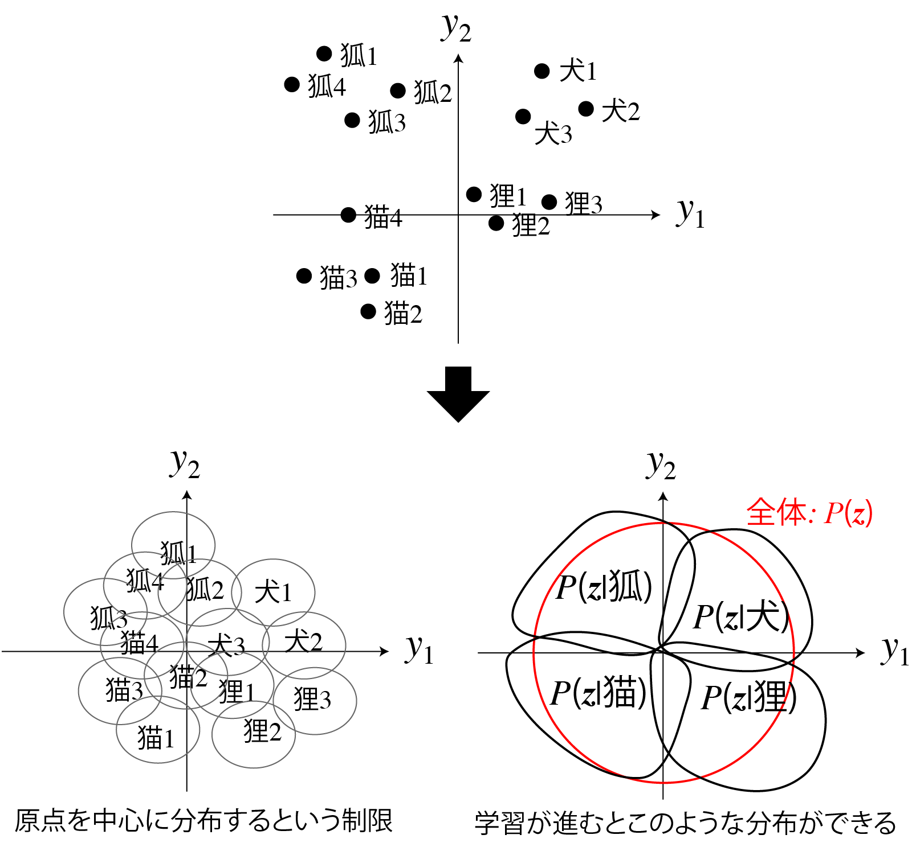
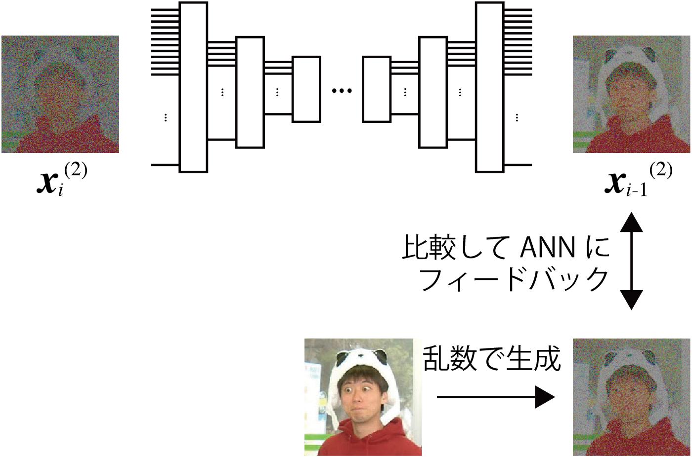

<!-- footer: "アドバンストビジョン第3回" -->

# アドバンストビジョン

## 第4回: 画像の識別と生成の基礎II

千葉工業大学 上田 隆一

 

This work is licensed under a [Creative Commons Attribution-ShareAlike 4.0 International License](https://creativecommons.org/licenses/by-sa/4.0/).

---

<!-- paginate: true -->

## 今日やること

- 敵対的生成ネットワーク（GAN）
- 変分オートエンコーダ（VAE）
- GAN、VAEの応用

---

## GAN（generative adversarial networks）[[Goodfellow2014]](https://papers.nips.cc/paper_files/paper/2014/file/f033ed80deb0234979a61f95710dbe25-Paper.pdf)

- 敵対的生成ネットワーク
    - 「絵を描く人工ニューラルネットワーク」のブームの発端
    - それ以外にも音声やソフトウェアを作り出すなどの用途
- 「敵対的」とは何?（人類の敵ではない）
    - ふたつのANNを準備
        - 生成ネットワーク（generator）: 何かを作るANN
        - 識別ネットワーク（discriminator）: 入力が生成ネットワークの生成物かどうかを判断するANN
    - 生成ネットワークと識別ネットワークが互いに競う

---

### ネットワーク構造の例（DCGAN）

- Deep Convlutional GAN（DCGAN）[[Radford 2015]](https://arxiv.org/pdf/1511.06434) <a href="https://www.researchgate.net/figure/The-architecture-of-the-generator-and-the-discriminator-in-a-DCGAN-model-FSC-is-the_fig4_343597759">画像: Zhang et al. CC-BY 4.0</a>
    - 上: 生成ネットワーク（FSC: fractionally-strided convolution)
    - 下: 識別ネットワーク

---

### DCGANの生成ネットワーク

- 構造: オートエンコーダのデコーダ
    - 入力: ランダムなベクトル（100次元）
        - 潜在空間のベクトルに相当
            - ↑わからん人は前回のオートエンコーダに戻りましょう
    - 出力: 画像
- 出力の画像は最初はでたらめ
    - ある訓練をすると画像が生成されるように

---

### DCGANの識別ネットワーク

- 構造: エンコーダに似ているが出力は1bit
    - 入力: 生成ネットワークの画像 or 訓練のために用意した画像
    - 出力: 「本物（訓練に用意した画像）」である確率
        - 偽物: 生成ネットワークの出力
- 出力は最初はでたらめ
    - 当てずっぽう

---

### 生成/識別ネットワークを競わせる

- 損失関数（次ページで詳しく）
    - 識別ネットワークが正解したら生成ネットワークの損失
    - 識別ネットワークが不正解だったら識別ネットワークの損失
- 学習の進行
    - 生成ネットワーク: ノイズ画像$\rightarrow$識別ネットワークの確率を下げる模様を生成
$\rightarrow$精緻な画像
    - 識別ネットワーク: 模様に負けない識別性能を得ようとする 
    - [学習が進んでいく様子](https://qiita.com/miya_ppp/items/f1348e9e73dd25ca6fb5)

これで生成ネットワークが画像を出力できるようになる <a href="https://arxiv.org/pdf/1511.06434">例</a>

---

### GANの損失関数

- 生成ネットワークの評価関数（損失関数に$-1$をかけたもの）
    - $V_D(G) = \frac{1}{m}\sum_{i=1}^m \log \{ 1 - D[G(\boldsymbol{z}^{(m)})]\ \}$
        - $G(\boldsymbol{z}^{(i)})$: 生成ネットワークが生成したデータ（$m$個用意）
        - $D(\boldsymbol{x})$: 識別ネットワークの識別結果（確率）
- 識別ネットワークの評価関数
    - $V_G(D)= \frac{1}{m}\sum_{i=1}^m \Big[ \log\{ D(\boldsymbol{\boldsymbol{x}}^{(m)}) \} + \log \{ 1 - D[G(\boldsymbol{z}^{(m)})]\ \} \Big]$
        - $\boldsymbol{x}^{(i)}$: 訓練データ（こちらも$m$個用意）
        - $V_D(G)$に訓練データに対する識別の成績の項も加算

---

## 変分オートエンコーダ[[Kingma 2013]](https://arxiv.org/abs/1312.6114)

- オートエンコーダをより表現力豊かにする方法
- 改善したいオートエンコーダの性質
    - 潜在空間でのベクトルの分布に隙間
        - 訓練データに対応するベクトルの間に
    - 隙間の問題
        - 隙間のベクトルをデコーダに渡すと、中間というよりは重ね合わせのような出力
            - 例: 犬と猫の中間のベクトルから、その中間のような動物の画像を出力したい
            $\rightarrow$単に足して2で割ったような不自然なものに

---

### 変分オートエンコーダでの潜在空間の扱い

- 仮定
    - 潜在空間のベクトル$\boldsymbol{z}$の分布は標準正規分布に従う
        - 空間が無限なのでデータが散らないように縛りを設ける
    - エンコーダへの入力$\boldsymbol{x}$に対し、$P(\boldsymbol{z}|\boldsymbol{x})$の分布も正規分布に従う
        - これは学習のための仮定
- 仮定に基づいて学習すると
    - $\boldsymbol{z}$の隙間があかずに原点付近に集まる
    - $P(\boldsymbol{z})$の分布のなかに$P(\boldsymbol{z}|$物の種別$)$のような分布ができる

---

### 隙間の問題の解決

- デコーダで生成されるデータに隙間ができにくい
    - [[Kingma 2013]](https://arxiv.org/abs/1312.6114)の中の図4
    - [Kingma氏のデモサイトの例](https://dpkingma.com/sgvb_mnist_demo/demo.html)
- ただしGANよりぼやけやすい

---

### 変分オートエンコーダの構造

- 右図
    - エンコーダの先に雑音の層を追加
    - $P(\boldsymbol{z})$を標準正規分布に制限するための項を損失関数に追加
    - 作りは簡単だがベイズ推論の理論が背景に
        - 確率ロボティクスの講義で一部説明

---

### AE、VAE学習の確率的な解釈

- 確率分布$p$の圧縮と復元を学習している
    - なんの分布？: データや画像の数値を並べたベクトル$\boldsymbol{x}$
    - 訓練に使うデータや画像の$\boldsymbol{x}$は、$p$にしたがって選ばれる（$\boldsymbol{x} \sim p$）
        - $p$: 人間の興味で決まる
            - 例: 猫の絵を生成したいなら猫の画像ばかりになるなど
- エンコーダ: $p$を潜在空間の分布$q$に変換
    - AEの場合は$p$からの点を潜在空間に写像
- デコーダ: エンコーダと逆の変換を学習
    - 出力の分布: $p$（誤差あり）

---

### Denoising Diffusion Probabilistic Models（DDPM）[[Ho2020]](https://arxiv.org/abs/2006.11239)

- 一般に（機械学習の文脈で）「拡散モデル」と呼ばれるもの
- 拡散モデル（拡散過程）
    - 集まっているものや模様がだんだん散らばっていく過程を定式化したもの
    - 下の例: 各画素に対し、同じガウス分布に従う雑音を繰り返し足したもの
    

これがなんで生成と関係あるの？

---

### 拡散モデルを使った生成の考え方

- 画像: 人間がなにか意味のある画像だと思う画像の分布$P$からドローされたもの
    - $\boldsymbol{x} \sim P$（$\boldsymbol{x}$: 画素を並べたベクトル）
- $P$の拡散
    - 何度も同じガウス分布状の雑音を何度も足していくと
    最終的にガウス分布$Q$に
$\Longrightarrow$逆（逆拡散過程）をすれば$P$が復元できる（どうやって？）
$\Longrightarrow Q$からノイズをドローして逆に拡散$\rightarrow$$P$から新たな絵がドローできる
 

---

### 理論的な裏付け

- 先ほど用いた拡散過程: 同じガウス分布を$T$回適用
    - 少しずつの雑音であれば、$T$回、同じノイズ除去の処理を繰り返すと元に戻すことができる（時間を巻き戻すことができる）
        - 非平衡熱力学の知見から
- DDPM
    - 「ノイズの除去処理」をANNに学習させる
    $\rightarrow$このANNに雑音を$T$回通すと画像が生成される
    （Stable Diffusionなどに用いられるなど高品質）
    - 集めた画像でノイズの除去処理を訓練

---

### DDPMの学習方法（訓練用のデータの準備）

- 学習データ: 様々な画像$\boldsymbol{x}^{(j)}_0$$\ (j=1,2,\dots,N)$を準備
- 拡散させかたの定義
    - 各画素にガウス分布にしたがうノイズを付加
        - $x_{i+1}^{(j)} \sim \mathcal{N}(\sqrt{1-\beta_i}x_{i}^{(j)}, \beta_i)$
            - $x_{i+1}^{(j)}$: $\boldsymbol{x}_{i+1}^{(j)}$の任意の画素
            - $\beta_i$: 拡散率（原著では$T=1000$までに$0.0001$から$0.02$まで線形に増加）
- 任意の段階の画像を生成できるプログラムを作成
    - $x_{i}^{(j)} \leftarrow \sqrt{\bar{\alpha_i}}x_0^{(j)} + \sqrt{1-\bar{\alpha_i}}\ \varepsilon$
        - $\alpha_i = 1-\beta_i$、$\bar\alpha_i = \prod_{k=1}^i \alpha_k$
        - $\varepsilon \sim \mathcal{N}(0, 1)$

---

### DDPMの学習方法（ANN）

- U-Netを拡張したものを準備
（Transformerを使ったものについては後日）
    - 元の画像からどれだけ拡散したか（時刻）も入力できるように
    - 他にも仕掛け
- 損失関数と学習
    - ノイズ画像の1ステップ前を出力するよう学習
    - 前ページのプログラムで作ったノイズ画像と↑を比較（二乗誤差）
        - 互いに$\boldsymbol{x}_0^{(j)}$の値を引くとノイズ同士の比較に
        - ベイズ推論の難しい式からに二乗誤差がよいと導出される

---

- [実装例](https://qiita.com/pocokhc/items/5a015ee5b527a357dd67)
    - 出力例
        - [[Ho2020]](https://arxiv.org/abs/2006.11239)の図14など
        - https://learnopencv.com/denoising-diffusion-probabilistic-models/

---

## GAN、VAEの応用

- CGAN
- pix2pix
- cVAE

---

### 条件付きGAN（Conditional GAN、CGAN）[[Mirza2014]](https://arxiv.org/abs/1411.1784)

- GANの生成ネットワークはランダムにデータを出力するだけ
    - 何を出力するかコントロールしたい
- 条件付きGAN [図](https://www.researchgate.net/figure/Architecture-of-the-Conditional-adversarial-net_fig3_366684170)
    - 生成ネットワークに何を作って欲しいかラベルで指示
        - データのもとになるベクトル$\boldsymbol{z}$と共にラベル$\boldsymbol{y}$を入力
    - 識別ネットワークにも、生成ネットワークの出力と共に$\boldsymbol{y}$を入力
        - 条件$\boldsymbol{y}$に合った生成データか判定
- 補足: ラベルの表現
    - $\boldsymbol{y}=(0,0,\dots,1,\dots,0,0,0)$というone-hot ベクトルがよく用いられる
        - $1$が立っている位置を特定のものと対応づけ
            - 例: 1番目が猫、2番目が犬、など
    - 他のANNでもよく用いられる

---

### pix2pix

- CGANの一種とみなせる
- pix2pix[[Isora 2016]](https://arxiv.org/abs/1611.07004)（構造は論文のFigure 2に）
    - 生成ネットワーク: 入力にノイズではなく画像を入力し、画像を出力させる
        - 入力をX、出力をYとしましょう
    - 識別ネットワーク: XとYのペア、あるいはXと対応する学習用画像Y'のペアを入力して真贋を識別
    $\rightarrow$画像を変換するように学習
- どんなことができるか
    - 線画をカラーの絵や写真のように（図: [[Isora 2016]](https://arxiv.org/abs/1611.07004)）
    - 葉に隠れた枝をつなぐ[[三上2022]](https://www.jstage.jst.go.jp/article/jrsj/40/2/40_40_143/_article/-char/ja)

---

### 条件つき変分オートエンコーダ （Conditional VAE、CVAE）

- CGANと同様、エンコーダとデコーダにラベルも入力
    - デコーダはラベルにしたがってデータを生成できる
- 入力の識別情報が、潜在空間内で必要なくなる
    - [VAEとCVAEの分布の比較の例](https://towardsdatascience.com/conditional-variational-autoencoders-for-text-to-image-generation-1996da9cefcb/)
    - 画像の生成の場合、画像の描き方に関する情報が潜在空間内に分布
    $\rightarrow$より出力にバリエーション

