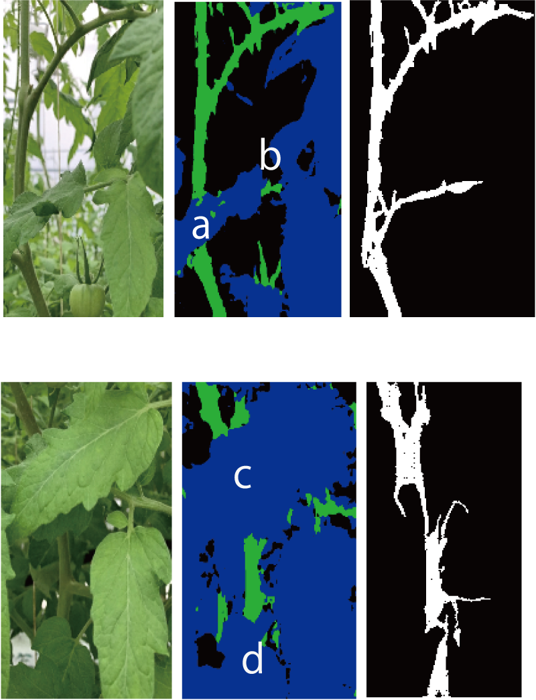

<!-- footer: "Advanced Vision, Lesson 4" -->

# Advanced Vision

## Part 4: Fundamentals of Image Classification and Generation II

Ryuichi Ueda, Chiba Institute of Technology

 

This work is licensed under a [Creative Commons Attribution-ShareAlike 4.0 International License](https://creativecommons.org/licenses/by-sa/4.0/).

---

<!-- paginate: true -->

## Contents

- Generative Adversarial Networks (GANs)
- Variational Autoencoders (VAEs)
- Applications of GANs and VAEs

---

## GAN (generative adversarial networks) [[Goodfellow2014]](https://papers.nips.cc/paper_files/paper/2014/file/f033ed80deb0234979a61f95710dbe25-Paper.pdf)

- The origin of the "artificial neural network for drawing pictures" boom
- Other applications include creating voice and software
- What is "adversarial"? (It's not the enemy of humanity)
    - Preparing two ANNs
        - Generator: an ANN that creates something
        - Discriminator: an ANN that determines whether the input is the product of the generator or not
    - The generator and discriminator compete against each other

---

### Example of Network Architecture (DCGAN)

- Deep Convolutional GAN ​​(DCGAN) [[Radford 2015]](https://arxiv.org/pdf/1511.06434) <a href="https://www.researchgate.net/figure/The-architecture-of-the-generator-and-the-discriminator-in-a-DCGAN-model-FSC-is-the_fig4_343597759">Image: Zhang et al. CC-BY 4.0</a>
    - Top: Generative network (FSC: fractionally-strided convolution)
    - Bottom: Discriminative network

---

### DCGAN generative network

- Structure: Autoencoder decoder
    - Input: Random vector (100 dimensions)
        - Equivalent to a vector in the latent space
            - ↑If you don't understand, go back to Lesson 3
    - Output: Image
- The output image is random at first
    - After some training, images are generated

---

### DCGAN discriminative network

- Structure: Similar to an encoder, but with 1-bit output
    - Input: Image from the generator or an image prepared for training
    - Output: Probability of being "real" (the image prepared for training)
        - Fake: Output from the generative network
- The output is random at first

---

### Competition between generator and discriminator

- Loss function (details on the next page)
    - If the discriminator is correct, the generator's loss
    - If the discriminator is incorrect, the discriminator's loss
- Training progression
    - Generatior: Generates a pattern that reduces the probability of the discriminator's correct answer $\rightarrow$ Detailed image
   - Discriminator: Attempts to achieve discrimination performance that is not affected by the pattern
   - [Learning progress](https://qiita.com/miya_ppp/items/f1348e9e73dd25ca6fb5)

The generator is able to output images. <a href="https://arxiv.org/pdf/1511.06434">Example</a>

---

### GAN loss function

- Evaluation function for the generator (loss function multiplied by $-1$)
    - $V_D(G) = \frac{1}{m}\sum_{i=1}^m \log \{ 1 - D[G(\boldsymbol{z}^{(m)})]\ \}$
        - $G(\boldsymbol{z}^{(i)})$: Data from the generator ($m$ pieces prepared)
        - $D(\boldsymbol{x})$: Classification result (probability) of the discriminator
- Evaluation function for the discriminator
    - $V_G(D)= \frac{1}{m}\sum_{i=1}^m \Big[ \log\{ D(\boldsymbol{\boldsymbol{x}}^{(m)}) \} + \log \{ 1 - D[G(\boldsymbol{z}^{(m)})]\ \} \Big]$
        - $\boldsymbol{x}^{(i)}$: Training data (also prepare $m$ pieces)
        - Add a term for the classification performance on the training data to $V_D(G)$

---

## Variational Autoencoder [[Kingma 2013]](https://arxiv.org/abs/1312.6114)

- Made autoencoders more expressive
- The properties of the autoencoder we want to improve
    - Gaps in the distribution of vectors in the latent space
        - between vectors corresponding to the training data
    - The gap problem
        - Passing gap vectors to the decoder results in an output that looks more like a superposition than an original image
            - Example: From a vector halfway between a dog and a cat, we want to output an image of an animal that is halfway between them

---

### Latent Space Handling in Variational Autoenc.

- Assumptions
    - The distribution of the latent space vector $\boldsymbol{z}$ follows a standard normal distribution.
        - Because the space is infinite, we impose constraints to prevent data clutter.
    - For the encoder input $\boldsymbol{x}$, the distribution of $P(\boldsymbol{z}|\boldsymbol{x})$ also follows a normal distribution.
        - This is an assumption for learning.
- When learning based on this assumption,
    - There are no gaps in $\boldsymbol{z}$, and they cluster near the origin.
    - A distribution like $P(\boldsymbol{z}|$type of object$)$ appears in the distribution of $P(\boldsymbol{z})$.

---

### Solving the gap problem

- The data generated by the decoder is less likely to have gaps.
    - Figure 4 in [[Kingma 2013]](https://arxiv.org/abs/1312.6114)
    - [Example from Kingma's demo site](https://dpkingma.com/sgvb_mnist_demo/demo.html)
- However, it is more prone to blurring than GANs.

---

### Structure of Variational Autoencoder

- Right
    - Add a noise layer after the encoder.
    - Add a term to the loss function to restrict $P(\boldsymbol{z})$ to a standard normal distribution.
    - Simple to implement, but based on the theory of Bayesian inference.
        - Partially explained in a lecture on probabilistic robotics.

---

### Probabilistic Interpretation of AE and VAE Learning

- Learning to compress and recover the probability distribution $p$.
    - What distribution? $\boldsymbol{x}$: A vector of data or image values.
    - The training data or image $\boldsymbol{x}$ is selected according to $p$ ($\boldsymbol{x} \sim p$).
        - $p$: Determined by human interest.
            - Example: If you want to generate pictures of cats, you will only get images of cats.

---

- Encoder: Converts $p$ into a latent space distribution $q$.
    - In the case of AE, maps points from $p$ to the latent space.
- Decoder: Learns the inverse transformation of the encoder.
    - Output distribution: $p$ (with error).

---

### Denoising Diffusion Probabilistic Models (DDPM) [[Ho2020]](https://arxiv.org/abs/2006.11239)

- What is commonly called a "diffusion model" (in the context of machine learning)
- Diffusion model (diffusion process)
    - A formulation of the process by which a collection of objects or patterns gradually disperses.
    - Example below: Repeatedly adding noise with the same Gaussian distribution to each pixel.

How does this relate to generation? 

---

### Idea of generation using a diffusion model

- Image: Drawn from the distribution $P$ of images that humans perceive as meaningful
    - $\boldsymbol{x} \sim P$ ($\boldsymbol{x}$: vector of pixels)
- Diffusion of $P$
    - Adding the same Gaussian-distributed noise repeatedly will eventually result in a Gaussian distribution $Q$.
$\Longrightarrow$ By inverting (de-diffusion process), $P$ can be reconstructed (how?)
$\Longrightarrow$ By drawing noise from $Q$, we can inversely draw a new image from the diffusion $P$

---

### Theoretical Backing

- The diffusion process used above: Applying the same Gaussian distribution $T$ times
    - If the noise is small, repeating the same noise removal process $T$ times can restore it (rewind time)
        - Based on knowledge of non-equilibrium thermodynamics
- DDPM
    - Training an ANN to perform "noise removal (denoising)"
$\rightarrow$ Passing noise through this ANN $T$ times generates an image
(High-quality, such as used in stable diffusion)
    - Training the noise removal process using collected images

---

### DDPM Training Method (Preparing Training Data)

- Training Data: Various images $\boldsymbol{x}^{(j)}_0$$(j=1,2,\dots,N)$
- Define the diffusion method
    - Add noise according to a Gaussian distribution to each pixel
        - $x_{i+1}^{(j)} \sim \mathcal{N}(\sqrt{1-\beta_i}x_{i}^{(j)}, \beta_i)$
            - $x_{i+1}^{(j)}$: Any pixel in $\boldsymbol{x}_{i+1}^{(j)}$
            - $\beta_i$: Diffusion coefficient (in the original paper, it increases linearly from $0.0001$ to $0.02$ by $T=1000$)

---

- Create a program that can generate images at any stage
    - $x_{i}^{(j)} \leftarrow \sqrt{\bar{\alpha_i}}x_0^{(j)} + \sqrt{1-\bar{\alpha_i}}\ \varepsilon$
        - $\alpha_i = 1-\beta_i$, $\bar\alpha_i = \prod_{k=1}^i \alpha_k$
        - $\varepsilon \sim \mathcal{N}(0, 1)$

---

### DDPM Training Method (ANN)

- Prepare an extended U-Net
    - Allows input of the amount of diffusion (time) from the original image
- Loss function and training
    - Train to output the previous step of the image
    - Compare the noisy image created in the program on the previous page with the above (squared error)
        - Subtracting the values of $\boldsymbol{x}_0^{(j)}$ from each other allows for comparison of noise.
        - Squared error is derived from the complex Bayesian inference formula.

---

### Example

- [Implementation Example](https://qiita.com/pocokhc/items/5a015ee5b527a357dd67)
- Example Output
- Figure 14 in [[Ho2020]](https://arxiv.org/abs/2006.11239)
- https://learnopencv.com/denoising-diffusion-probabilistic-models/

---
## Applications of GAN and VAE

- CGAN
- pix2pix
- cVAE

---

### Conditional GAN (CGAN) [[Mirza2014]](https://arxiv.org/abs/1411.1784)

- GAN generative networks simply output random data
    - We want to control what gets output.
- Conditional GAN [Figure](https://www.researchgate.net/figure/Architecture-of-the-Conditional-adversarial-net_fig3_366684170)
    - Tell the generative network what to create using labels.
        - Input the label $\boldsymbol{y}$ along with the source vector $\boldsymbol{z}$.
    - Input $\boldsymbol{y}$ along with the output of the generator to the discriminator.
        - Determine whether the generated data meets the condition $\boldsymbol{y}$.
- Supplement: Label Representation
    - A one-hot vector such as $\boldsymbol{y}=(0,0,\dots,1,\dots,0,0,0)$ is often used.
        - Associate the location of $1$ with a specific object.
            - Example: 1 is a cat, 2 is a dog, etc.
    - Commonly used in other ANNs.

---

### pix2pix

- Can be considered a type of CGAN
- pix2pix[[Isora 2016]](https://arxiv.org/abs/1611.07004) (The structure is shown in Figure 2)
    - Generator: Inputs an image instead of noise as input and outputs an image.
        - Let's say the input is X and the output is Y.
    - Discriminator: Inputs a pair of X and Y, or a pair of X and the corresponding training image Y', and discriminates whether fake or not. $\rightarrow$ Learns to transform images.
- What it can do
    - Turns line drawings into color paintings or photographs (Figure: [[Isora 2016]](https://arxiv.org/abs/1611.07004))
    - Connecting hidden branches to leaves [[三上 2022]](https://www.jstage.jst.go.jp/article/jrsj/40/2/40_40_143/_article/-char/ja)

---

### Conditional Variational Autoencoder  (Conditional VAE, CVAE)

- As with CGAN, labels are also input to the encoder and decoder.
- The decoder can generate data based on the labels.
- Input discriminative information is no longer needed in the latent space.
- [Example of a comparison of VAE and CVAE distributions](https://towardsdatascience.com/conditional-variational-autoencoders-for-text-to-image-generation-1996da9cefcb/)
- In the case of image generation, information about how an image is drawn is distributed within a latent space.

$\rightarrow$ leads to variation in the output.

---

## Summary

- Various generation methods
- Generative adversarial networks (GANs)
- Using variational autoencoders and diffusion models$\rightarrow$ probability distributions
- Applications of GANs and VAEs
- Labeling
- Image-to-image translation
