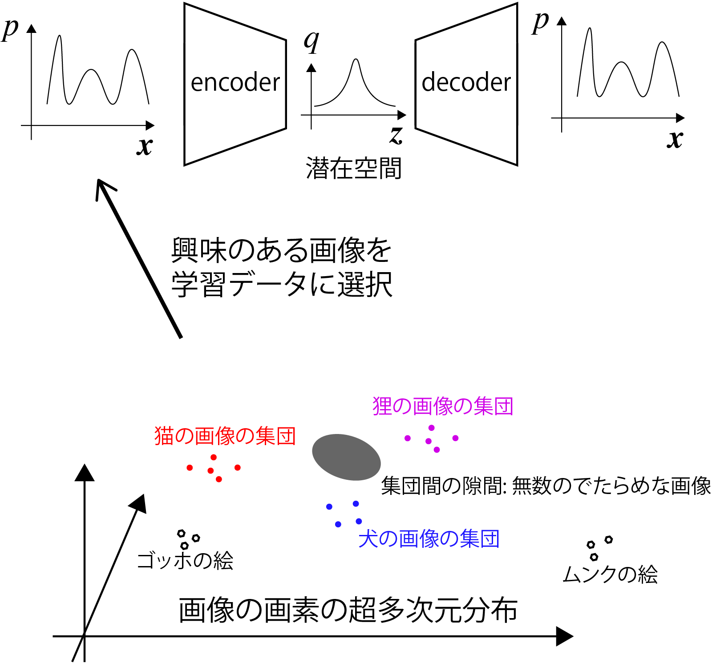
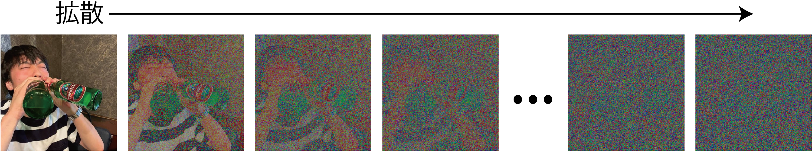

<!-- footer: "Advanced Vision, Part 3" -->

# Advanced Vision

## Part 4: Fundamentals of Image Classification and Generation II

Ryuichi Ueda, Chiba Institute of Technology

 

This work is licensed under a [Creative Commons Attribution-ShareAlike 4.0 International License](https://creativecommons.org/licenses/by-sa/4.0/).

---

<!-- paginate: true -->

## Contents

- Generative Adversarial Networks (GANs)
- Variational Autoencoders (VAEs)
- Applications of GANs and VAEs

---

## GAN (generative adversarial networks) [[Goodfellow2014]](https://papers.nips.cc/paper_files/paper/2014/file/f033ed80deb0234979a61f95710dbe25-Paper.pdf)

- The origin of the "artificial neural network for drawing pictures" boom
- Other applications include creating voice and software
- What is "adversarial"? (It's not the enemy of humanity)
    - Preparing two ANNs
        - Generator: an ANN that creates something
        - Discriminator: an ANN that determines whether the input is the product of the generator or not
    - The generator and discriminator compete against each other

---

### Example of Network Architecture (DCGAN)

- Deep Convolutional GAN ​​(DCGAN) [[Radford 2015]](https://arxiv.org/pdf/1511.06434) <a href="https://www.researchgate.net/figure/The-architecture-of-the-generator-and-the-discriminator-in-a-DCGAN-model-FSC-is-the_fig4_343597759">Image: Zhang et al. CC-BY 4.0</a>
- Top: Generative network (FSC: fractionally-strided convolution)
- Bottom: Discriminative network

---

### DCGAN generative network

- Structure: Autoencoder decoder
- Input: Random vector (100 dimensions)
- Equivalent to a vector in the latent space
- ↑If you don't understand, go back to the previous autoencoder
- Output: Image
- The output image is random at first
- After some training, images are generated

---

### DCGAN discriminative network

- Structure: Similar to an encoder, but with a 1-bit output
- Input: Image from the generative network or an image prepared for training
- Output: Probability of being "real" (the image prepared for training)
- Fake: Output from the generative network
- The output is random at first
- Guessing

---

### Compete between generative and discriminative networks

- Loss function (details on the next page)
- If the discriminative network is correct, the generative network's loss
- If the discriminative network is incorrect, the discriminative network's loss
- Training progress
- Generative network: Generates a pattern that reduces the probability of the discriminative network being affected by a noisy image $\rightarrow$
$\rightarrow$ Detailed image
- Discriminative network: Attempts to achieve discrimination performance that is not affected by the pattern
- [Learning progress](https://qiita.com/miya_ppp/items/f1348e9e73dd25ca6fb5)

The generative network will now be able to output images. <a href="https://arxiv.org/pdf/1511.06434">Example</a>

---

### GAN loss function

- Evaluation function for the generative network (loss function multiplied by $-1$)
- $V_D(G) = \frac{1}{m}\sum_{i=1}^m \log \{ 1 - D[G(\boldsymbol{z}^{(m)})]\ \}$
- $G(\boldsymbol{z}^{(i)})$: Data generated by the generative network ($m$ pieces prepared)
- $D(\boldsymbol{x})$: Classification result (probability) of the discriminative network
- Evaluation function for the discriminative network
- $V_G(D)= \frac{1}{m}\sum_{i=1}^m \Big[ \log\{ D(\boldsymbol{\boldsymbol{x}}^{(m)}) \} + \log \{ 1 - D[G(\boldsymbol{z}^{(m)})]\ \} \Big]$
- $\boldsymbol{x}^{(i)}$: Training data (also prepare $m$ pieces)
- Add a term for the classification performance on the training data to $V_D(G)$

---

## Variational Autoencoder [[Kingma 2013]](https://arxiv.org/abs/1312.6114)

- How to make autoencoders more expressive
- The properties of the autoencoder we want to improve
- Gaps in the distribution of vectors in the latent space
- Between vectors corresponding to the training data
- The gap problem
- Passing gap vectors to the decoder results in an output that looks more like a superposition than an intermediate image
- Example: From a vector that is halfway between a dog and a cat, we want to output an image of an animal that is halfway between them
$\rightarrow$ This results in an unnatural result, like simply adding them and dividing by two

---

### Handling the Latent Space in Variational Autoencoders

- Assumptions
- The distribution of the latent space vector $\boldsymbol{z}$ follows a standard normal distribution.
- Because the space is infinite, we impose constraints to prevent data clutter.
- For the encoder input $\boldsymbol{x}$, the distribution of $P(\boldsymbol{z}|\boldsymbol{x})$ also follows a normal distribution.
- This is an assumption for learning.
- When learning based on this assumption,
- There are no gaps in $\boldsymbol{z}$, and they cluster near the origin.
- A distribution like $P(\boldsymbol{z}|$type of object$)$ appears in the distribution of $P(\boldsymbol{z})$.

---

### Solving the gap problem

- The data generated by the decoder is less likely to have gaps.
- [[Kingma Figure 4 in [2013]](https://arxiv.org/abs/1312.6114)
- [Example from Kingma's demo site](https://dpkingma.com/sgvb_mnist_demo/demo.html)
- However, it is more prone to blurring than GANs.

---

### Structure of Variational Autoencoder

- Right
- Add a noise layer after the encoder.
- Add a term to the loss function to restrict $P(\boldsymbol{z})$ to a standard normal distribution.
- Simple to implement, but based on the theory of Bayesian inference.
- Partially explained in a lecture on probabilistic robotics.

---

### Probabilistic Interpretation of AE and VAE Learning

- Learning to compress and recover the probability distribution $p$.
- What distribution? $\boldsymbol{x}$: A vector of data or image values.
- The training data or image $\boldsymbol{x}$ is selected according to $p$ ($\boldsymbol{x} \sim p$).
- $p$: Determined by human interest.
- Example: If you want to generate pictures of cats, you will only get images of cats.
- Encoder: Converts $p$ into a latent space distribution $q$.
- In the case of AE, maps points from $p$ to the latent space.
- Decoder: Learns the inverse transformation of the encoder.
- Output distribution: $p$ (with error).

---

### Denoising Diffusion Probabilistic Models (DDPM) [[Ho2020]](https://arxiv.org/abs/2006.11239)

- What is commonly called a "diffusion model" (in the context of machine learning)
- Diffusion model (diffusion process)
- A formulation of the process by which a collection of objects or patterns gradually disperses.
- Example below: Repeatedly adding noise with the same Gaussian distribution to each pixel.

How does this relate to generation? 

---

### Concept of generation using a diffusion model

- Image: Drawn from the distribution $P$ of images that humans perceive as meaningful
- $\boldsymbol{x} \sim P$ ($\boldsymbol{x}$: vector of pixels)
- Diffusion of $P$
- Adding the same Gaussian-distributed noise repeatedly
will eventually result in a Gaussian distribution $Q$.
$\Longrightarrow$ By inverting (de-diffusion process), $P$ can be reconstructed (how?)
By drawing noise from $\Longrightarrow Q$, we can inversely draw a new image from the diffusion $\rightarrow$$P$

![w:900](./figs/ddpm.
