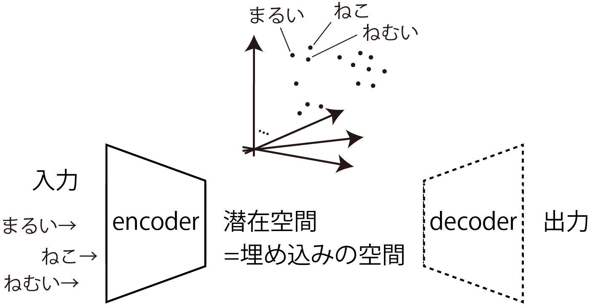
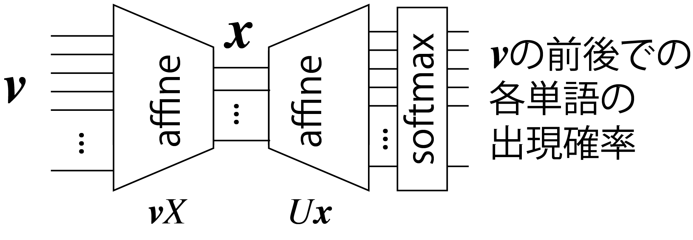
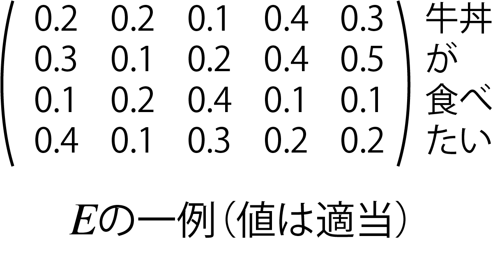

<!-- footer: "アドバンストビジョン第5回" -->

# アドバンストビジョン

## 第5回: Word2vecとTransformer

千葉工業大学 上田 隆一

 

This work is licensed under a [Creative Commons Attribution-ShareAlike 4.0 International License](https://creativecommons.org/licenses/by-sa/4.0/).

---

<!-- paginate: true -->

## 今日やること

- なんでビジョンの講義で言葉（自然言語）を扱うのか
- Word2vec
- Transformer
- Transformerの応用例

---

## なんでビジョンの講義で自然言語を扱うのか

- 画像$\leftrightarrow$言葉のアプリケーションの存在
    - 画像説明文生成
    - プロンプトへの指示$\rightarrow$画像の生成や指定した物体の認識
        - Stable Diffusion
        - Segment Anything Model
        ↑いずれも今回扱うTransformerを使用
- 言語処理の手法の画像処理への転用
    - Transformer$\rightarrow$Vision Transformer
    - データの種類が異なるだけで本質的な違いは少ない（？）
- Transformerの普及: 上記のように様々なところで利用

やらざるをえない

---

## Word2vec[[Mikolov2013]](https://arxiv.org/abs/1301.3781)

- 単語をベクトル表現するためのモデル群や枠組み
- Word2vecで作られたベクトル表現はTransformerの入力に

---

### 単語のベクトル表現（単語の埋め込み、分散表現）

- 近い単語は似たベクトルに
    - 例（適当。上記のように次元はもっと必要）
        - おじさん$= (0.9, 0.32, 0.07)$
        - おばさん$= (0.7, 0.55, 0.08)$
        - 不動産$= (0.1, 0.05, 0.88)$
    - 類似度が内積で計算できる
        - おじさん$\cdot$おばさん$=0.77$
        - おじさん$\cdot$不動産$=0.07$
    - 次元を大きくすると、様々な切り口で類似度を計算可能
- 分散表現（埋め込み表現）: 上記のような単語のベクトル表現
- 埋め込み: 分散表現を作ること

---

### 埋め込みとこれまでの内容の関係

- 分散表現の空間=潜在空間
    - 入力をエンコーダで別の空間に写像
    - （Word2vecの場合は確率は考えない）
- 疑問
    - 単語同士の類似度を潜在空間に作り出すには？
        - エンコーダ側の構造は？
        - デコーダ側の構造は？
        - 何を学習させる？

---

### 分布仮説（distributional hypothesis）

- "You shall know a word by the company it keeps!" [[Firth1957]](https://cs.brown.edu/courses/csci2952d/readings/lecture1-firth.pdf)
    - ある単語の意味は周辺の単語が担っているということ
- つまり、ある単語のベクトルの値は、文の前後の単語から決めるとよい
（仮説が正しいならば）
    - [Mikolov2013]では、この性質を利用した分散表現の作成方法が
    2つ示されている

順に見ていきましょう

---

### 埋め込みの方法1: skip-gram

- 右図の構造のANNを準備
    - アフィン層2つとソフトマックス層
- 受け付ける入力: $\boldsymbol{v} = (0\ 0\ \cdots\ 1\ 0\ \cdots\ 0)$
    - ある単語について、その単語に対応する要素が$1$になったone-hotベクトル
    - 単語の種類だけ次元がある
- アフィン層間のベクトル$\boldsymbol{x}$: 数百〜数千次元
    - これが分散表現に
- 出力: 入力と同じ次元のベクトル
    - 各単語に対応する確率

---

### skip-gramの学習

- ある単語$w$のone-hotベクトル$\boldsymbol{v}_{w}$に対し、ある範囲内に別の単語$\boldsymbol{w}'$がある確率を学習
    - お詫び: 「範囲内」なのか位置を具体的に指定するのかは何を読んでもよく分からないのでコードを読まないといけないんですがまだです
    - たくさんの文献から訓練データを作成
    - 単語間の関係を反映した埋め込みが可能
- $X$の各行が分散表現に
    - $X = [\boldsymbol{x}_{w_1}\ \boldsymbol{x}_{w_2}\ \dots\ \boldsymbol{x}_{w_N}]^\top$
    - $\boldsymbol{x}_{w_i} = \boldsymbol{v}_{w_i}X$
        - ある単語$w_i$のone-hotベクトル$\boldsymbol{v}_{w_i}$を入力すると、$\boldsymbol{x}_{w_i}$が得られる

---

### 埋め込みの方法2: Continuous Bag-of-Words（CBoW）

- 下図のANNに次の学習をさせる
    - 文のなかの単語を隠して、周辺の$C$個の単語から隠した単語を当てる
        - 例: "Tokyo Skytree is the __ tower in Japan."（$C=2$）
        $\rightarrow$ is、the、tower、inからtallestを推測させる
- ANNの入出力
    - 入力: 前後$C$範囲内の単語のone-hotベクトルを平均したもの
    - 出力: 各単語について、隠された文字である確率を記録したもの
        - skip-gramと同じく次元は単語の種類の数
- skip-gramと同様、$X$の各行が潜在表現のベクトルに

$\qquad\qquad\qquad\qquad$

---

## Transformer

---

### 埋め込みができればコンピュータが文章を認識する?

・・・ことはできない

- 最尤な単語をskip-gramで予想して並べていけばそれっぽい文は作れるけど、たぶん無意味な文ができる
    - [マルコフ連鎖ジェネレータ](https://lorem.sabigara.com/?source=ginga-tetsudo&format=plain&sentence_count=5)のようなもの
- 単純な埋め込みには限界
    - 語順に関する情報は、完全にはない
    - 文脈依存な情報を持っていない
        - 同音異義語に1つのベクトル$\rightarrow$区別してない
            - 例: チンチラ（げっ歯類にも猫にもいる）

どうしましょう？

<a href="https://commons.wikimedia.org/wiki/Chinchilla_lanigera#/media/File:Chinchilla_lanigera_(Wroclaw_zoo)-2.JPG">写真上 by Guérin Nicolas（CC BY-SA 3.0）</a>
<a href="https://commons.wikimedia.org/wiki/File:Chinchilla_cat_(3228221937).jpg">写真下 by allen watkin（CC BY-SA 2.0）</a>

---

### どうすればいいか?

- 埋め込みに語順と文脈の情報を付加してやるとよい
    - 潜在表現のベクトルに位置情報を付加
    - さらに注意機構で文脈を考慮
- Transformer[[Vaswani2017]](https://arxiv.org/abs/1706.03762)で考案された
    - これらの仕組みで既存のANNを凌駕
        - Transformerの概略と入力を説明してから順に説明していきます

---

### Transformer

- 翻訳のためにGoogleで開発された
    - [使ってみましょう](https://translate.google.co.jp/?hl=ja&sl=en&tl=ja&op=translate)
- 正体: 右のような構造のANN
    - エンコーダ（左側）とデコーダ（右側）で構成
- 画像にも応用されている
    - Vision Transformer（ViT）
- その他言葉を扱うもので新しいものは、だいたいこれの応用

[画像: CC-BY-4.0 by dvgodoy](https://commons.wikimedia.org/wiki/File:Transformer,_full_architecture.png)

---

### Transformer（エンコーダ）への入力

- 文章: サブワード単位のトークン（単語をより細かく文を区切って埋め込みをしたもの）の分散表現でのベクトルを並べたもの
    - $E=[\boldsymbol{e}_{w_1}\ \boldsymbol{e}_{w_2}\ \dots\ \boldsymbol{e}_{w_N}]^\top$という行列に
    - 右の例では省略されているが`<EOS>`（文の終わり）などの特殊なトークンも入力として並べる

---

### 位置情報の追加

- エンコーダに入力する$E$の各トークンに、文章中での位置情報を付加
    - 行列$H = \sqrt{D}E + P = [\boldsymbol{p}_1\ \boldsymbol{p}_2\ \dots\ \boldsymbol{p}_N]^\top$を作成
        - $p_i = (p_{i,0} \quad p_{i,1} \quad \cdots \quad p_{i,D})^\top$
           - $p_{i,j} = \begin{cases}
            \sin ( i \beta^{-j/D})  & (i\%2 = 0) \\
            \cos ( i \beta^{-(j-1)/D}) & (i\%2 = 1) 
\end{cases}$
                - 原著: $\beta = 10000$

$\qquad\qquad$

とりあえずこれで入力に位置情報が加わる

---

### 文脈の考慮の必要性

- 必要な例
    - 例1: 「ガラス窓を割ったのは私です。」を英語に翻訳
        - "It's me who broke the ..."まで翻訳したとき、次に注目すべきは「ガラス」
    - 例2: 右上の丸を月と認識させたい
- 既存の時系列情報や画像を扱うANNは苦手
    - 「近い位置にある=関連性が大きい」と捉えるので
        - 日本語と英語で語順が違っているので難しい
        - 丸が他の手がかりが丸と離れていて難しい

---

### 注意機構（attention機構）

- なにかを出力する際、文脈上、入力のどこに注目するかを
決める（決めるように訓練される）機構
    - brokeと言ったらガラス、theがついたら次は名詞に注目
    - 丸が分からないので画像の別の特徴も注意して見る
- 注意機構の層がやること
    - 注目すべき埋め込みのベクトルに重みをかけて後段の層に伝達
        - $\boldsymbol{w}$を$\alpha\boldsymbol{w}$に
        - ↑どうやって？（次ページ）

---

### キー・バリュー・クエリを使った注意機構

- クエリ: 問い合わせのこと（例: 翻訳の例のIt's me who broke the）
    - $Q= W_\text{Q}H$という行列を作る
        - 以下、$W_\text{X}$は学習で獲得する行列

---

### Transformerのエンコーダ: 文脈情報の付加1

- 自己注意機構という仕組みで文脈の情報を付加
    - 行列$W_Q, W_K, W_V$という3つの行列を使う
        - これらの行列は学習の対象で、ここでは学習が済んでいると仮定
    - $H$のなかのベクトル$\boldsymbol{h}_i$に対して次のベクトルを作成
        - $\boldsymbol{k}_i = W_K\boldsymbol{h}_i$（キー埋め込み）
        - $\boldsymbol{v}_i = W_V\boldsymbol{h}_i$（バリュー埋め込み）
        - $\boldsymbol{q}_i = W_Q\boldsymbol{h}_i$（クエリ埋め込み）
    - 3つのベクトルを使う自己注意機構なので特に
    「キー・クエリ・バリュー注意機構」と呼ばれる方法（次のスライドに続く）

---

### Transformerのエンコーダ: 文脈情報の付加2

- $\boldsymbol{k}_i, \boldsymbol{v}_i, \boldsymbol{q}_i$から、文脈を考慮した埋め込みベクトルを計算
    - 手順
        - $i$番目のトークンと$j$番目のトークンの関連性の強さを次のように計算
            - $s_{ij} = \boldsymbol{q}_i^\top \boldsymbol{k}_j/\sqrt{D}$（内積）
        - $s_{ij}$をソフトマックス関数で合計1に正規化
            - $\alpha_{ij} = e^{s_{ij}}/\sum_{j'=1}^Ne^{s_{ij'}}$
        - 次の$\boldsymbol{o}_i$を$i$番目のトークンの埋め込みベクトルとして出力
            - $\boldsymbol{o}_i = \sum_{j=1}^N \alpha_{ij} \boldsymbol{v}_j$

---

### Transformerのエンコーダ: 文脈情報の付加3

- $\boldsymbol{o}_i$をフィードフォワード層に通す
    - このあと2層のニューラルネットワークを通ってさらに文脈が強化された文脈化トークン埋め込みに

- 全体で$O=[\boldsymbol{o}_{w_1}\ \boldsymbol{o}_{w_2}\ \dots\ \boldsymbol{o}_{w_N}]^\top$という行列が出力される

---

## エンコーダの出力を使った翻訳

- 問題の定式化: 条件付き確率の問題にする
（例: 日本語から英語への翻訳）
    - 問題1: 先頭のトークンを選ぶ
        - $p(w_1 |$私 は 牛丼 を 食べ ます 。$)$
    - 問題2: 2番目のトークンを選ぶ
        - $p(w_2 |$私 は 牛丼 を 食べ ます 。, I$)$
    - 問題3: 3番目のトークンを選ぶ
        - $p(w_3 |$私 は 牛丼 を 食べ ます 。, I eat$)$
- Transformerのデコーダがこれを解く
$\Rightarrow$どうやって?

---

### デコーダ側の処理1

- 自己注意機構で翻訳途中の文の文脈を埋め込みに反映
    - 途中の文なので計算のときに少し細工が必要だけど、
    エンコーダと同じ

---

### デコーダ側の処理2: 交差注意機構

- もとの言語の文脈を翻訳中の文に持ち込む
    - クエリ埋め込み$\boldsymbol{q}_i = W_Q\boldsymbol{h}_i$だけデコーダの埋め込みから計算
    - キー埋め込み、バリュー埋め込みは、エンコーダ側の出力から計算

---

### デコーダ側の処理3: 次の単語の出力

- 全単語について次の単語になる確率を計算して、
その確率が最も高いものを出力
    - 文脈がしっかり考慮されているので、かつての
    マルコフ連鎖ジェネレータのようにはならない
    - その文脈に最もふさわしい単語が出てくる

---

## Transformerの応用例

---

### 分類

- 文を「楽しい」、「悲しい」などいくつかの感情に結びつける
- ANNの構造
    - 文の頭に「クラストークン」をつける
        - 埋め込みベクトルと同じ次元
        - 注意機構
    - エンコーダに通すとクラストークンにもなにか値が入る
    - クラストークンの値の並びから感情を分類するANNをつける
- 学習
    - 全体を教師あり学習
    - 文がエンコーダを通るとクラストークンに分類のための情報が集まるようになる

---

### Vision Transformer (ViT）

- Transformerを画像に転用
    - 画像をブロック状に切って単語のように扱う（右図）
    - 右図のCLS: クラストークン
        - 文の分類と同じ
- 画像をブロック状に扱うのはCNNと同じだが、そのあとが違う
    - CNNは遠くのブロックの関係性を見るのが苦手

[画像: CC-BY-4.0 by Daniel Voigt Godoy](https://commons.wikimedia.org/wiki/File:Vision_Transformer.png)

---

### GPT（Generative Pre-trained Transformer）

- 途中の文から次の単語を予測
    - デコーダだけで構成
- ChatGPTの一部に使われる

[画像: CC0 (public domain)](https://commons.wikimedia.org/wiki/File:Full_GPT_architecture.svg)

---

### ChatGPT

- GPTを使ってテキスト（人の質問や発言）に答える
    - （構造に関する決定的な文献なし）

---

### [Segment Anything](https://segment-anything.com/)

- [コードや説明](https://github.com/facebookresearch/sam2)
- プロンプトの指示で画像から特定の部分を切り出す（セグメンテーション）
- 画像のエンコードにはViTを使う
- プロンプトのエンコードにはCLIPを使う

---

### Stable Diffusion

- プロンプトを画像に変換
    - プロンプトから画像のタネを作るためにCLIPを利用
    - 画像を復元するときにも注意機構
- [図](https://medium.com/data-science/what-are-stable-diffusion-models-and-why-are-they-a-step-forward-for-image-generation-aa1182801d46)

---

## まとめ

- Transformer
    - 埋め込みに文脈を反映させる仕組み
- 埋め込み
    - 次元の高いベクトルで、単語やトークンの様々な関係性を表現可能
    - skip-gramなどの学習方法で実用性のある埋め込みが作成可能
    - ViTなどでは画像に対しても作られる
- 埋め込みを使うと性質の異なるデータを交差注意機構で関連させることが可能
    - ある言語$\rightarrow$別の言語
    - 画像$\leftrightarrow$言語
- 参考文献: [[菊田2025]](https://gihyo.jp/book/2025/978-4-297-15078-5)

---

### どうすればいいか?

- 埋め込みに語順と文脈の情報を付加してやるとよい
- Transformer（のエンコーダ）
    - 入力: 潜在表現のベクトルに位置情報を加えたもの
        - さらに注意機構で文脈を考慮
    - 出力: 文脈化トークン埋め込み
        - 各単語の関係性（文脈）に応じて各ベクトルの位置を変更
        - 次の単語の予測などにより有用な埋め込み（使い方はあとで）

---

## Transformerのエンコーダ: 入力

- 入力: 文
    - トークン（単語をより細かく文を区切ったもの）の分散表現でのベクトルを並べたもの
        - $E=[\boldsymbol{e}_{w_1}\ \boldsymbol{e}_{w_2}\ \dots\ \boldsymbol{e}_{w_N}]^\top$という行列に
- 文への位置情報の付加（右図Positional Encoding）
    - 行列$H = \sqrt{D}E + P = [\boldsymbol{h}_{w_1}\ \boldsymbol{h}_{w_2}\ \dots\ \boldsymbol{h}_{w_N}]^\top$を作成
       - $D$: ベクトルの次元（正規化のため）
       - $P$にはトークンが文の何番目にあるかの情報が入る
           - 単純に「何番目か」ではなく三角関数を使ったややこしもの

とりあえずこれで入力に位置情報が加わる

