<!-- footer: "Advanced Vision Lecture 5" -->

# Advanced Vision

## Lecture 5: Embeddings and Adding Context

Ryuichi Ueda, Chiba Institute of Technology

 

This work is licensed under a [Creative Commons Attribution-ShareAlike 4.0 International License](https://creativecommons.org/licenses/by-sa/4.0/).

---

<!-- paginate: true -->

## Contents

- Why should we handle language models in vision lectures?
- Word2vec
- Transformer
- Applications of the Transformer

---

## Why do we learn natural language in vision courses?

- Existence of image $\leftrightarrow$ language applications
    - Image generation and object recognition in response to prompts
        - Stable diffusion
        - Segment Anything Model
↑ All of these use the Transformer discussed here.
- Applying language processing techniques to image processing
    - Transformer$\rightarrow$Vision Transformer
    - The only difference is the type of data, with few essential differences (?)
- The popularity of the Transformer: Used in a variety of places, as mentioned above

We have no choice

---

## Word2vec[[Mikolov2013]](https://arxiv.org/abs/1301.3781)

- Models and frameworks for representing words as vectors
- The vector representations created by Word2vec are used as input for the Transformer

---

### Word Embedding, Distributed Representation

- Similar words are represented by similar vectors.
    - Example (more dimensions are needed)
        - Uncle$= (0.9, 0.32, 0.07)$, Aunt$= (0.7, 0.55, 0.08)$, Estate$= (0.1, 0.05, 0.88)$
    - Similarity can be calculated using the dot product.
        - Uncle$\cdot$Aunt$= 0.77$
        - Uncle$\cdot$Estate$= 0.07$
    - Increasing the dimension allows for calculation of similarity from various perspectives.
- Distributed Representation (Embedding): A vector representation of words like the one above.
- Embedding: Creating a distributed representation.

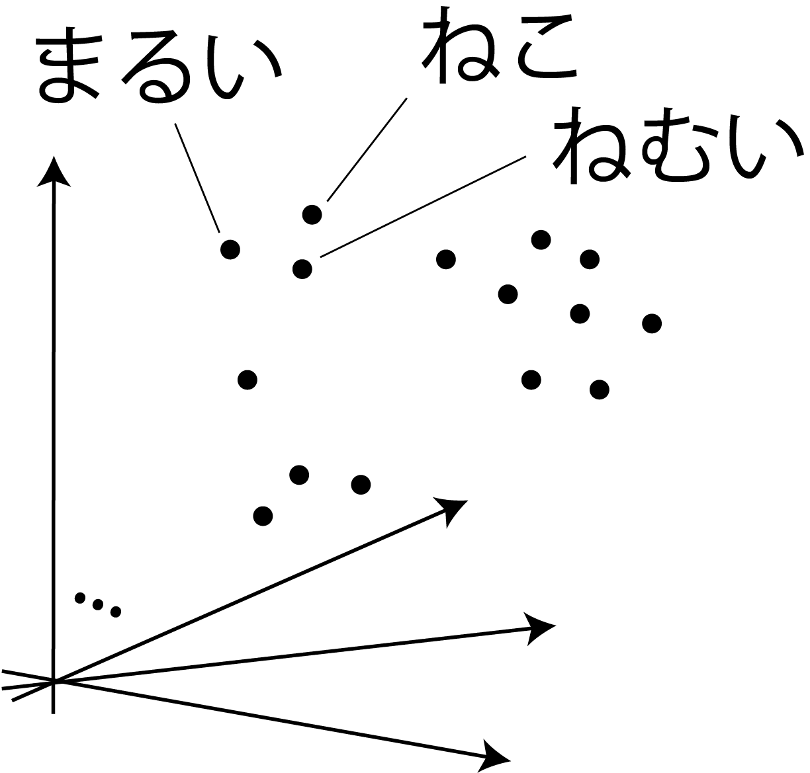

---

### Relationship between embeddings and what we've discussed so far

- Space of distributed representations = latent space
    - The input is mapped to a different space using an encoder
    - (Probability is not considered in the case of Word2vec)
- Question
    - How do we create similarity between words in the latent space?
        - What is the encoder's structure?
        - What is the decoder's structure?
        - What should we train?

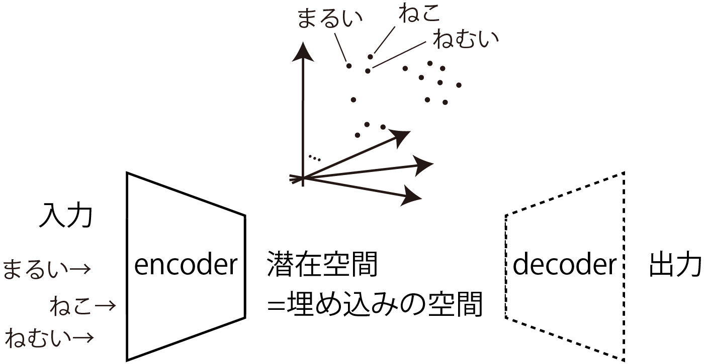

---

### Distributional Hypothesis

- "You shall know a word by the company it keeps!" [[Firth1957]](https://cs.brown.edu/courses/csci2952d/readings/lecture1-firth.pdf)
    - 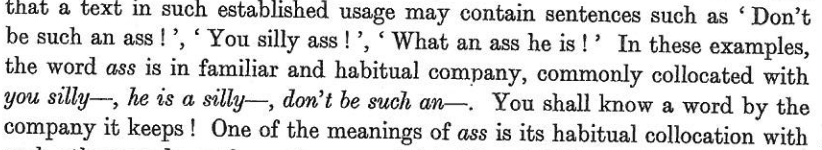
        - The author seems to like "ass."
    - The meaning of a word is carried by the surrounding words.
- In other words, the vector value of a word can be determined from the words before and after it in a sentence. (If the hypothesis is correct.)
    - [Mikolov2013] presents two methods for creating distributed representations that utilizes this property.

Let's go through them one by one

---

### Embedding Method 1: Skip-gram

- Prepare an ANN shown on the right.
    - Two affine layers and a softmax layer
- Accepted input: $\boldsymbol{v} = (0\ 0\ \cdots\ 1\ 0\ \cdots\ 0)$
    - For a given word, a one-hot vector with the corresponding element set to $1$
    - Dimensions equal to the number of words
- Vector $\boldsymbol{x}$ between affine layers: Hundreds to Thousands of dimensions
    - This becomes the distributed representation
- Output: Vector of the same dimensions as the input
    - Probability corresponding to each word

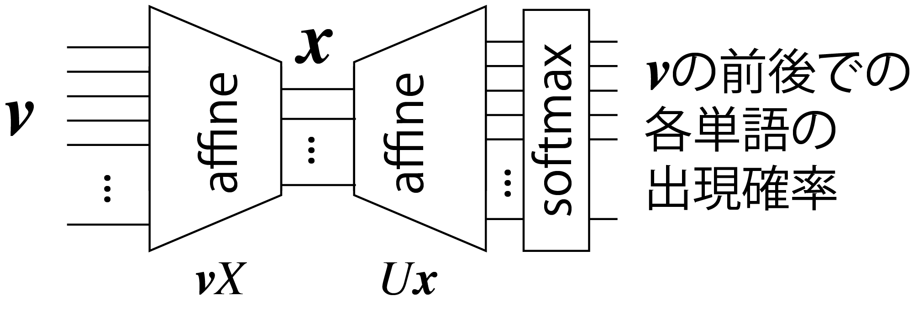

---

### Skip-gram training

- Given a one-hot vector $\boldsymbol{v}_{w}$ for a given word $w$, learn the probability that another word $\boldsymbol{w}'$ exists within a certain range
    - Create training data from a large amount of literature.
    - Embedding that reflects the relationships between words can be made.
- Each row of $X$ is a distributed representation.
    - $X = [\boldsymbol{x}_{w_1}\ \boldsymbol{x}_{w_2}\ \dots\ \boldsymbol{x}_{w_N}]^\top$
    - $\boldsymbol{x}_{w_i} = \boldsymbol{v}_{w_i}X$
        - Input the one-hot vector $\boldsymbol{v}_{w_i}$ for a given word $w_i$, and you get $\boldsymbol{x}_{w_i}$.

---
### Embedding Method 2: Continuous Bag-of-Words (CBoW)

- Train the ANN shown below as follows:
    - Hide a word in a sentence and guess the hidden word from $C$ surrounding words.
        - Example: "Tokyo Skytree is the __ tower in Japan." ($C=2$)
$\rightarrow$ Infer "tallest" from "is," "the," "tower," and "in."
- ANN Input/Output
    - Input: Mean of the one-hot vectors of words within $C$ surrounding words.
    - Output: Record the probability that each word is the hidden character.
        - Like skip-gram, the dimension is the number of different words.
- Like skip-gram, Each row of $X$: a vector of latent representations

$\qquad\qquad\qquad\qquad$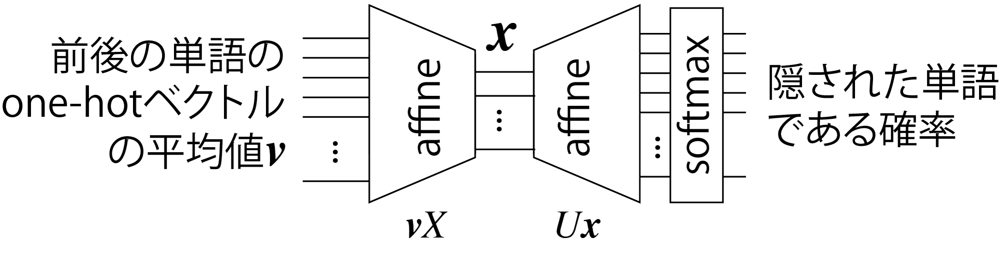

---

## Transformer

---

### Can embeddings help computers recognize sentences?

...can't

- Predicting the most likely words using skip-grams and arranging them can create sentences, but they'll probably end up being nonsensical.
    - Something like a [Markov chain generator](https://lorem.sabigara.com/?source=ginga-tetsudo&format=plain&sentence_count=5)
- Simple embeddings have limitations
    - No complete information about word order
    - No context-dependent information
        - No distinction between homonyms using a single vector $\rightarrow$
            - Example: chinchilla (both rodents and cats)

What should we do? 

<a href="https://commons.wikimedia.org/wiki/Chinchilla_lanigera#/media/File:Chinchilla_lanigera_(Wroclaw_zoo)-2.JPG">Top photo by Guérin Nicolas (CC BY-SA 3.0)</a>
<a href="https://commons.wikimedia.org/wiki/File:Chinchilla_cat_(3228221937).jpg">Bottom photo by Allen Watkin (CC BY-SA 2.0)</a>

---

### What should I do?

- Adding word order and context information to the embedding
    - Adding location information to the latent representation vector.
    - Further, considers context using an attention mechanism.
- Transformer [[Vaswani2017]](https://arxiv.org/abs/1706.03762)
    - includes these mechanisms

---

### Transformer

- Developed by Google for translation.
    - [Let's try it](https://translate.google.co.jp/?hl=ja&sl=en&tl=ja&op=translate)
- What it is: An ANN with the structure shown on the right.
    - Consists of an encoder (left) and a decoder (right).
- It has also been applied to images.
    - Vision Transformer (ViT), ...
- Most other new language or image models are applications of this.

[Image: CC-BY-4.0 by dvgodoy](https://commons.wikimedia.org/wiki/File:Transformer,_full_architecture.png)

---

### Input to Transformer (Encoder)

- Sentence: Vectors representing the distributed representation of subword tokens
    - tokens: subwords
    - Matrix $E=[\boldsymbol{e}_{w_1}\ \boldsymbol{e}_{w_2}\ \dots\ \boldsymbol{e}_{w_N}]^\top$
    - Although omitted in the example on the right, special tokens such as `<EOS>` (end of sentence) are also included as input.

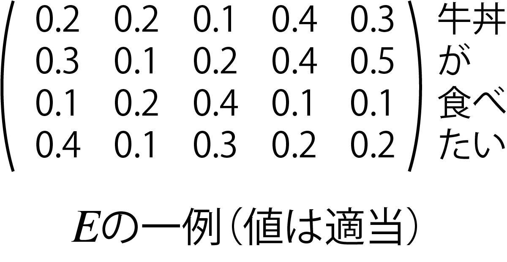

---

### Input to the Transformer (Decoder)

- For the decoder, input a partial sentence.
    - For example, `<SOS> I want to eat`
        - (`<SOS>`: start of sentence)
- Start with `<SOS>` and pass the translated string to the next input.
    - First input: `<SOS>`
    - Next input: `<SOS> I`
    - Next input: `<SOS> I want`
    - ...and so on. The sentence is created.

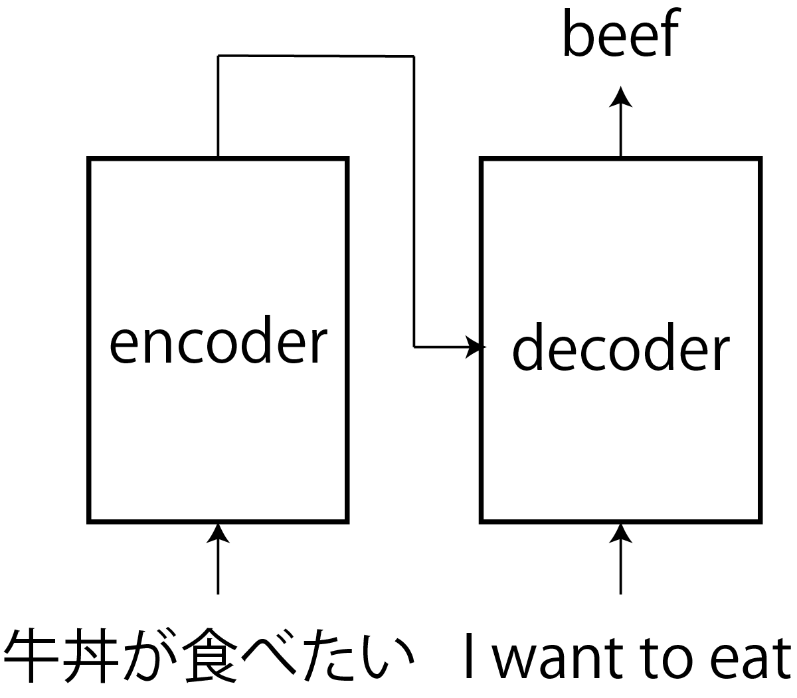

---

### Adding Location Information

- Add location information (location code) within the sentence to each token of $E$ input to the encoder.
    - $H = \sqrt{D}E + P$
        - Location information: $P = [\boldsymbol{p}_1\ \boldsymbol{p}_2\ \dots\ \boldsymbol{p}_N]^\top$
- How to add position information
    - Original Transformer: Fixed values (next page)
    - Training

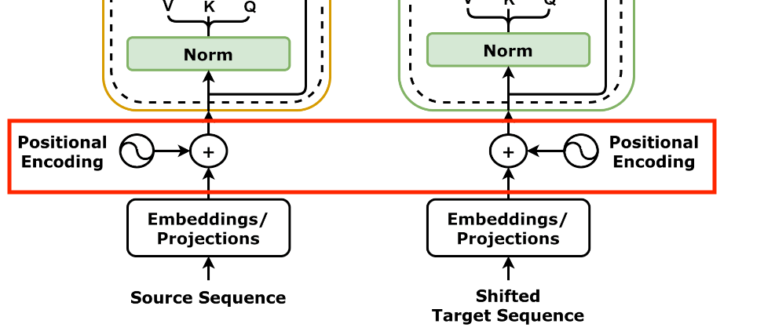

---

### Original Transformer position encoding

- Position information: $P = [\boldsymbol{p}_1\ \boldsymbol{p}_2\ \dots\ \boldsymbol{p}_N]^\top$
    - $p_i = (p_{i,0} \quad p_{i,1} \quad \cdots \quad p_{i,D})^\top$
        - $p_{i,j} = \begin{cases}
\sin ( i \beta^{-j/D}) & (i\%2 = 0) \\
\cos ( i \beta^{-(j-1)/D}) & (i\%2 = 1)
\end{cases}$
- example
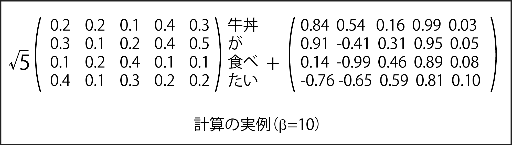
    - $\beta=10$. In the original paper, $\beta = 10000$
- The closer the dot product, the larger the value. [[山田2023]](https://gihyo.jp/book/2023/978-4-297-13633-8)

---

### The Need to Consider Context

- Required Examples
   - Example 1: Translating "It's me who broke the glass window" into English
       - After translating "It's me who broke the...", the next thing to focus on is the thing that breaks (= glass)
    - Example 2: Recognizing the circle in the upper right corner as the moon
- Existing ANNs that handle time series data and images are not good at this
    - Because "close proximity = strong relevance" is perceived
        - Difficult because word order is different between Japanese and English
        - Difficult because the circle is far from other cues

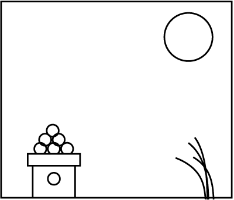

---

### Attention Mechanism

- A mechanism that decides (and is trained to decide) which part of the input to focus on in the context when outputting something.
    - When outputting "glass," it focuses on "broke" and "the."
    - Since it doesn't know what a circle is, it also pays attention to other features of the image.
- What the attention layer does
    - It changes the embedding depending on the context and transmits it to subsequent layers.
        - ↑How? (Next page)

---

### Attention Mechanism Using Key-Value Queries

- Query: A query
- Example: "It's me who broke the" in the translation example
- Key-Value: Database terminology
- An example of a key-value database where a value is attached to a key
- In cases where a decoder is present, it is created from the pre-translation language embedding (there are also cases where this is not the case, so we will explain this in more detail next time).
- The key reacts to the query, and the vector position changes due to the corresponding value.
- Example: A Japanese word closely related to "broke" in the query reacts, changing the weight of "broke."

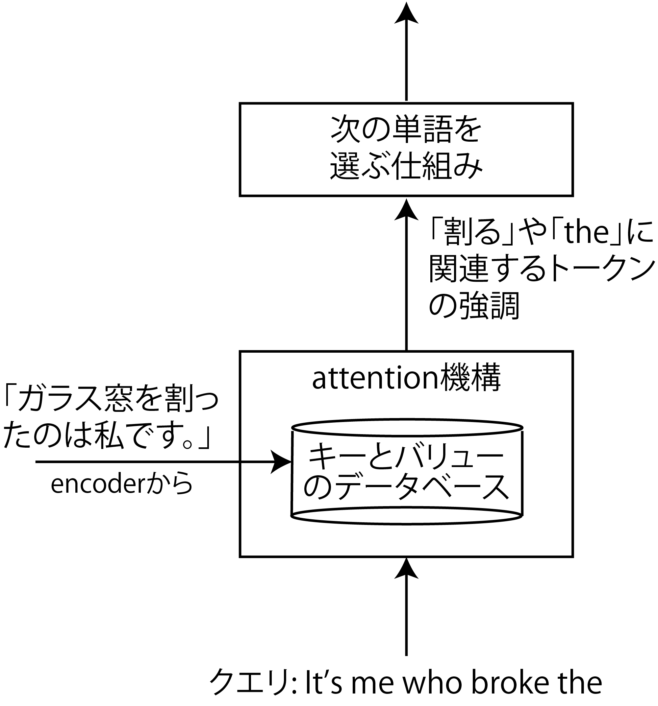

---

### Specific Calculation

- Query: A matrix $Q = W_\text{Q}H_\text{dec}$
- Below, $W_\text{X}$ is a matrix acquired through training.
- Key: Selects the token that responds to the query.
- $K= Prepare W_\text{K}H_\text{enc}$ and calculate $QK^\top$
- Value: Weighting value
- $V= W_\text{V}H_\text{enc}$
- Output: Softmax$\Big(\dfrac{QK^\top}{\sqrt{D}}\Big)V$

No human being is telling us to do this, but providing this structure will help it learn in this way.

---

## Summary

- Embedding
- High-dimensional vectors can represent various relationships between words and tokens.
- Practical embeddings can be created using learning methods such as skip-grams.
- Applications such as ViT can also create embeddings for images.
- Transformer
- In short, it is a mechanism that incorporates context into the embedding using an attention mechanism.
- More details next time
- Note: Location information can also be learned rather than hard-coded.
- Reference: [[Kikuta 2025]](https://gihyo.jp/book/2025/978-4-297-15078-5)
