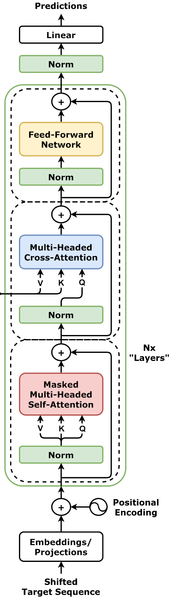
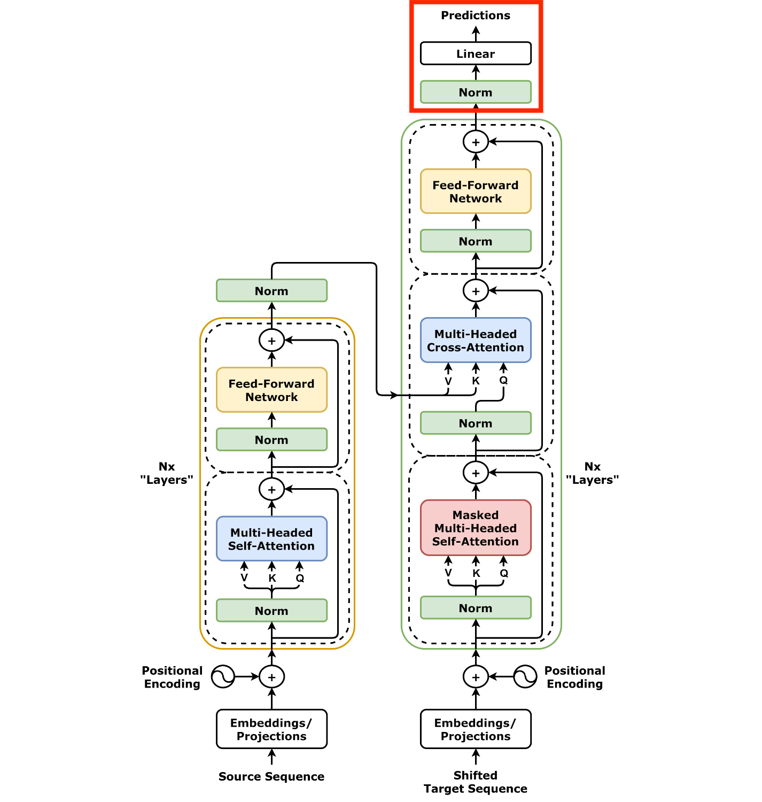
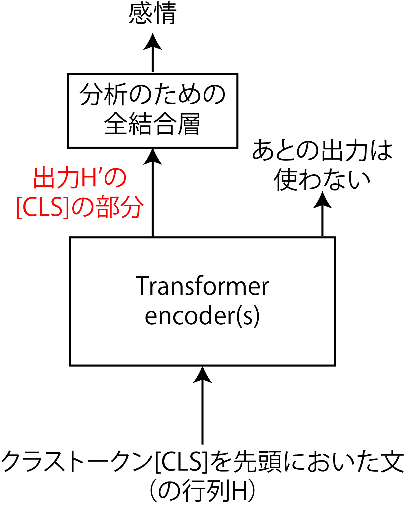
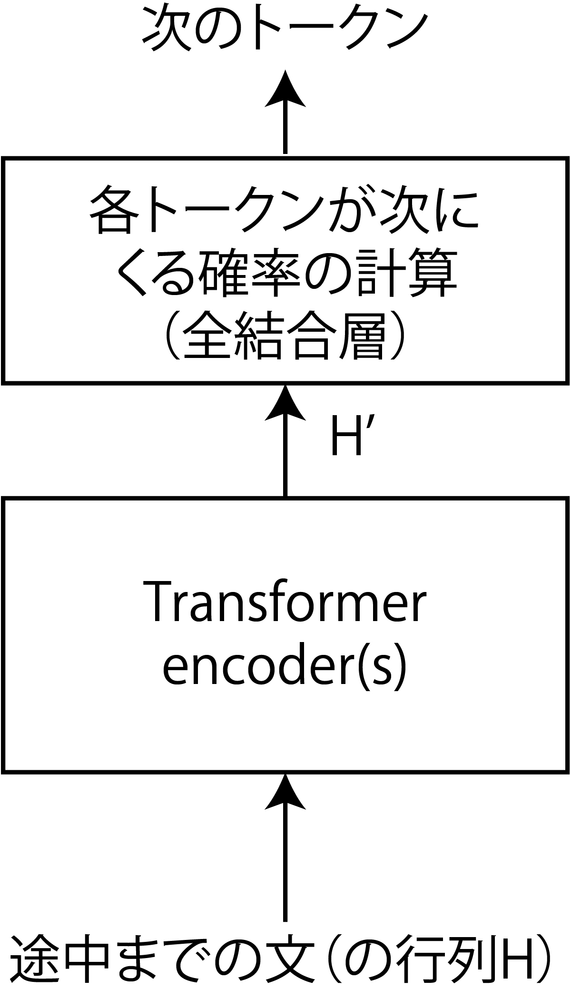

<!-- footer: "アドバンストビジョン第6回" -->

# アドバンストビジョン

## 第6回: Transformerの構造

千葉工業大学 上田 隆一

 

This work is licensed under a [Creative Commons Attribution-ShareAlike 4.0 International License](https://creativecommons.org/licenses/by-sa/4.0/).

---

<!-- paginate: true -->

## 今日やること

- Transformerの構造
- Transformerの簡単な応用

（簡単じゃない応用は次回以降）

---

## Transformer（翻訳用途）の構造

- エンコーダ、デコーダで構成される
    - 右図の左: エンコーダ
        - 入力: 翻訳前の文
        （例: これはペンです。）
    - 右図の右: デコーダ
        - 入力: 「翻訳開始」を表すトークンあるいは途中まで翻訳した文（例: This is）
        - 出力: 次の単語（例: a）

順に見ていきましょう

[画像: CC-BY-4.0 by dvgodoy](https://commons.wikimedia.org/wiki/File:Transformer,_full_architecture.png)

---

### エンコーダ

- 濃い黄色の枠が本体
    - 「Nx layers」: 何個も連結するということ
    - 詳しくは次のページ以降で
- 入力（図の下方）: $H_\text{enc} = \sqrt{D}E + P$
    - $E=[\boldsymbol{e}_{w_1}\ \boldsymbol{e}_{w_2}\ \dots\ \boldsymbol{e}_{w_N}]^\top$
        - 文（$D$次元ベクトルで表現されたトークンを並べたもの）
- 出力: デコーダでの仕事に応じて重みの変わった$H_\text{enc}'$
    - 文脈が反映されている

---

### 層正則化（layer normalization）

- 図中に3つある「Norm」
- 各ベクトル$\boldsymbol{h}=(h_1 \ h_2 \ \cdots \ h_D)^\top$の要素を正規化してベクトルごとの影響力を揃える
    - どう正規化するか？
        - 1: $h_{1:D}$の平均値が$0$、標準偏差が$1$に
        - 2: $h_i$ごとに$\gamma_i, \beta_i$（学習対象）というパラメータを用意して$\gamma_ih_i + \beta_i$に変換
            - 要素の位置ごとに重要度が異なるため

---

### 自己注意機構

- 自分自身の情報でトークンのベクトルを変える
    - 文脈が反映される（詳しくは次ページ）
- 仕組み: Q、K、Vをすべて自身への入力から作成
    - クエリ: $Q= W_\text{Q}H$$_\text{enc}$（前回は$H_\text{dec}$だった）
    - キー: $K= W_\text{K}H$$_\text{enc}$（同上）
    - バリュー: $V= W_\text{V}H_\text{enc}$
    - 出力: $H'=$Softmax$\Big(\dfrac{QK^\top}{\sqrt{D}}\Big)V$
- 前回の注意機構は交差注意機構

---

### 自己注意機構の補足[[Google2017]](https://research.google/blog/transformer-a-novel-neural-network-architecture-for-language-understanding/)

- 単に代名詞と名詞を関連づけるだけなら、
次の「it」は「dog」か「street」か分からない
    - 1: The animal didn't cross the street because it was too tired. 
        - it: dog
    - 2: The animal didn't cross the street because it was too wide.
        - it: street
- KVQ: クエリ（it）に対して、名詞だけではなく行列$K$で全てのトークンを作用させることで、itがどちらに近いかまでを計算可能に
    - "You shall know a word by the company it keeps!" [[Firth1957]](https://cs.brown.edu/courses/csci2952d/readings/lecture1-firth.pdf)（再掲）

---

### マルチヘッド注意機構

- Transformerの実装では注意機構が複数に分割される
    - $W_\text{K}, W_\text{V}, W_\text{Q}$（$D \times D$行列）が分割される
        - $Q^{(m)}= W_\text{Q}^{(m)}H$
        - $K^{(m)}= W_\text{K}^{(m)}H$
        - $V^{(m)}= W_\text{V}^{(m)}H\quad$（$m=1,2,\dots,M$）
            - $W_X^{(m)}$: $W_X$を横に切った$(D/M) \times D$行列
    - ANN的には、$m$ごとに結合が切れて独立
        - それぞれが文の解釈方法を変える
        （ように学習されるらしい）
- 出力の$Q^{(m)}, K^{(m)}, V^{(m)}$を結合$\rightarrow$元の$D \times D$行列に

---

### フィードフォワード層（全結合層）

- 自己注意機構を通った文が通される
    - 右図の2つの点線の枠のうち上のほう
    - 非線形な活性化関数（オリジナルはReLU）を通して特徴をより強調

---

### その他補足1

- 注意機構もフィードフォワード層もスキップ接続を使用
    - 各層で学習/出力されるのは差分
    - 学習初期に各層にわかりやすい入力をするため
        - 層が深いので必要
- 図に描かれていないがドロップアウト層
が何ヶ所かに使用されている
    - ドロップアウト: 学習の単位（バッチ）ごとに一定割合のニューロンを働かなくする処理
        - 特定のニューロンに特定の役割を背負わせないで過学習を防止

---

### その他補足2

- 活性化関数として、ReLUの代わりにGELU（Gaussian Error Linear Unit）が使用されることも
    - $h(x) = x\cdot \frac{1}{2}\big\{ 1 + \text{erf}(x/\sqrt{2})\big\}$
        - $\text{erf}(a) = \frac{2}{\sqrt{\pi}}\int_0^a e^{-t^2}\text{d}t$
    - 素直に微分可能

（[画像by Ringdongdang CC BY-SA 4.0](https://commons.wikimedia.org/wiki/File:ReLU_and_GELU.svg)）

---

### エンコーダのまとめ

- 次のような挙動を実現するように学習される
    - 文をトークンのベクトルを並べて位置の情報を加えた行列$H_\text{enc}$で受け取る
    - 自己注意機構と全結合層で$H$中の各ベクトルを文脈にあわせて操作
        - ↑繰り返し
    - 文脈の反映された$H'_\text{enc}$を出力
- 受け取る逆伝播誤差がどんなものかは
デコーダ側による

---

### デコーダ（とデーコーダの先）

- 本体は緑の枠内
    - 途中までの作文に対応する行列$H_\text{dec}$を受け取り
- デコーダの先に具体的な仕事をするためのANNが接続される
    - 翻訳の場合は次の単語を予測するための全結合層
    - デコーダはこの仕事がしやすいように$H_\text{dec}$を$H'_\text{dec}$に変更

---

### デコーダの本体

- （自己注意機構+交差注意機構+フィードフォワード層）$\times N$
- 自己注意機構
    - 翻訳途中の文の文脈を考慮して$H_\text{dec}$を操作
    - 図中の「Masked」の意味: 文の後半にマスクをかける仕組み
        - 学習の際、完成された翻訳例が入力されてくるので必要に
        - 例: 「This is」の次を考える訓練をするときに、「This is a pen.」が入力されてくるので、$W_X$の「a pen」に対応する要素にマスク
- 交差注意機構
    - デコーダの出力$H'_\text{enc}$を反映

---

### デコーダの先

- 全結合層でデーコーダの入力の次の単語を予測
    - skip-gramのように学習可能
    - 出力は各トークンが次にくる確率
        - トークンの種類だけ次元がある
- この部分の誤差を逆伝播することで学習が進行
    - 損失関数: 交差エントロピー
        - $-\sum_{i=1}^{N_\text{token}} P(\boldsymbol{e}_i)\log Q(\boldsymbol{e}_i)$
        $= - \log Q(\boldsymbol{e}^*)$
            - $P$が正解で$Q$が出力
            - $\boldsymbol{e}^*$: 正解のトークン

---

### Transformer（翻訳用途）の構造のまとめ

- 結局どんな問題を解いていたのか？$\rightarrow$こういう確率の問題
    - $\Pr\{$次に来る単語$|$翻訳前の文章$,\quad\!\!\!\!$翻訳途中の文章$\}$
- Transformerの工夫
    - 翻訳前の文章、翻訳途中の文章に位置情報を付加
    - 文脈の考慮
        - 翻訳前の文章から注目すべき箇所を自己注意機構で
        発見して埋め込みに反映（エンコーダ）
        - 翻訳途中の文章を自己注意機構にかけて文脈を考慮した上で、
        さらにエンコーダからの文脈を交差注意機構で反映

---

## Transformerの応用

- 感情分析
- 文章生成

（より高度なものは次回以降）

---

### Transformerエンコーダによる感情分析

- Transformerを分類タスクに応用することを考える
    - 入力: 文（例: 今日、100円を拾いました。）
    - 出力: 感情（楽しい、嬉しい、悲しいなど）
- エンコーダで構成可能[[中井2025]](https://gihyo.jp/book/2025/978-4-297-14972-7)
    - 文の先頭に`[CLS]`というトークン（クラストークン）を加えて学習
    - 学習すると出力のクラストークンに分析のための情報が集まるように
- Vision Transformerによる物体認識は基本この構造がこのまま使える（次回）

---

### Transformerエンコーダによる文章生成

こちらも[[中井2025]](https://gihyo.jp/book/2025/978-4-297-14972-7)から（4.3.2項）

- 右図の構成で訓練すると文章をランダムに生成していける
    - 文脈が考慮されているので、かなり自然な出力が得られる（内容が正しい保証はなにもなし）
- GPTはデコーダを使用（次々回以降にやります）

---

## まとめ

- Transformerエンコーダ
    - 埋め込みに文脈を反映
        - 位置情報の付加$\rightarrow$自己注意機構
- Transformerデコーダ
    - エンコーダの機能+交差注意機構で別の言語を文脈に反映可能
    - 学習の際にマスク
- その他の参考文献: [[菊田2025]](https://gihyo.jp/book/2025/978-4-297-15078-5)

