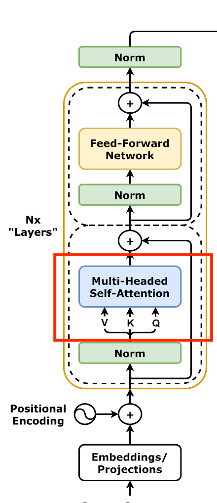

<!-- footer: "アドバンストビジョン第6回" -->

# アドバンストビジョン

## 第6回: Transformerの構造と用途

千葉工業大学 上田 隆一

 

This work is licensed under a [Creative Commons Attribution-ShareAlike 4.0 International License](https://creativecommons.org/licenses/by-sa/4.0/).

---

<!-- paginate: true -->

## 今日やること

- Transformerの構造
- Transformerの基本的な使い方

---

## Transformerの構造

- エンコーダ、デコーダで構成される
    - 右図の右: エンコーダ
    - 右図の左: デコーダ
        - [画像: CC-BY-4.0 by dvgodoy](https://commons.wikimedia.org/wiki/File:Transformer,_full_architecture.png)

順に見ていきましょう

---

### エンコーダ

- 濃い黄色の枠が本体
    - 「Nx layers」: 何個も連結するということ
    - 詳しくは次のページ以降で
- 入力（図の下方）: $H = \sqrt{D}E + P$
    - $E=[\boldsymbol{e}_{w_1}\ \boldsymbol{e}_{w_2}\ \dots\ \boldsymbol{e}_{w_N}]^\top$
        - 文（$D$次元ベクトルで表現されたトークンを並べたもの）
- 出力: デコーダでの仕事に応じて重みの変わった$E$
    - 文脈が反映されている

---

### 層正則化（layer normalization）

- 図中に3つある「Norm」
- 各ベクトル$\boldsymbol{h}=(h_1 \ h_2 \ \cdots \ h_D)^\top$の要素を正規化してベクトルごとの影響力を揃える
    - どう正規化するか？
        - 1: $h_{1:D}$の平均値が$0$、標準偏差が$1$に
        - 2: $h_i$ごとに$\gamma_i, \beta_i$（学習対象）というパラメータを用意して$\gamma_ih_i + \beta_i$に変換
            - 要素の位置ごとに重要度が異なるため

---

### 自己注意機構

- 自分自身の情報でトークンの重みを変える
    - 例: 「ガラス窓を割ったのは私です。」ならガラスと私を強調する等の働き
- 仕組み: Q、K、Vをすべて自身への入力から作成
    - クエリ: $Q= W_\text{Q}H$$_\text{enc}$（前回は$H_\text{dec}$だった）
    - キー: $K= W_\text{K}H$$_\text{enc}$（同上）
    - バリュー: $V= W_\text{V}H_\text{enc}$
    - 出力: $H'=$Softmax$\Big(\dfrac{QK^\top}{\sqrt{D}}\Big)V$
- 前回の注意機構は交差注意機構

---

### マルチヘッド注意機構

- Transformerの実装では複数の分割された注意機構が並列で動く
    - $W_\text{K}, W_\text{V}, W_\text{Q}$が分割される

---

### フィードフォワード層（全結合層）

- 自己注意機構を通った文が通される
    - 右図の2つの点線の枠のうち上のほう
    - ここで非線形な活性化関数を通って特徴のある部分がより強調される
- 活性化関数: GELU（Gaussian Error Linear Unit）の使用

---

## エンコーダの出力を使った翻訳

- 問題の定式化: 条件付き確率の問題にする
（例: 日本語から英語への翻訳）
    - 問題1: 先頭のトークンを選ぶ
        - $p(w_1 |$私 は 牛丼 を 食べ ます 。$)$
    - 問題2: 2番目のトークンを選ぶ
        - $p(w_2 |$私 は 牛丼 を 食べ ます 。, I$)$
    - 問題3: 3番目のトークンを選ぶ
        - $p(w_3 |$私 は 牛丼 を 食べ ます 。, I eat$)$
- Transformerのデコーダがこれを解く
$\Rightarrow$どうやって?

---

### デコーダ側の処理1

- 自己注意機構で翻訳途中の文の文脈を埋め込みに反映
    - 途中の文なので計算のときに少し細工が必要だけど、
    エンコーダと同じ

---

### デコーダ側の処理2: 交差注意機構

- もとの言語の文脈を翻訳中の文に持ち込む
    - クエリ埋め込み$\boldsymbol{q}_i = W_Q\boldsymbol{h}_i$だけデコーダの埋め込みから計算
    - キー埋め込み、バリュー埋め込みは、エンコーダ側の出力から計算

---

### デコーダ側の処理3: 次の単語の出力

- 全単語について次の単語になる確率を計算して、
その確率が最も高いものを出力
    - 文脈がしっかり考慮されているので、かつての
    マルコフ連鎖ジェネレータのようにはならない
    - その文脈に最もふさわしい単語が出てくる

---

## Transformerの応用例

---

### 分類

- 文を「楽しい」、「悲しい」などいくつかの感情に結びつける
- ANNの構造
    - 文の頭に「クラストークン」をつける
        - 埋め込みベクトルと同じ次元
        - 注意機構
    - エンコーダに通すとクラストークンにもなにか値が入る
    - クラストークンの値の並びから感情を分類するANNをつける
- 学習
    - 全体を教師あり学習
    - 文がエンコーダを通るとクラストークンに分類のための情報が集まるようになる

---

### Vision Transformer (ViT）

- Transformerを画像に転用
    - 画像をブロック状に切って単語のように扱う（右図）
    - 右図のCLS: クラストークン
        - 文の分類と同じ
- 画像をブロック状に扱うのはCNNと同じだが、そのあとが違う
    - CNNは遠くのブロックの関係性を見るのが苦手

[画像: CC-BY-4.0 by Daniel Voigt Godoy](https://commons.wikimedia.org/wiki/File:Vision_Transformer.png)

---

### GPT（Generative Pre-trained Transformer）

- 途中の文から次の単語を予測
    - デコーダだけで構成
- ChatGPTの一部に使われる

[画像: CC0 (public domain)](https://commons.wikimedia.org/wiki/File:Full_GPT_architecture.svg)

---

### ChatGPT

- GPTを使ってテキスト（人の質問や発言）に答える
    - （構造に関する決定的な文献なし）

---

### [Segment Anything](https://segment-anything.com/)

- [コードや説明](https://github.com/facebookresearch/sam2)
- プロンプトの指示で画像から特定の部分を切り出す（セグメンテーション）
- 画像のエンコードにはViTを使う
- プロンプトのエンコードにはCLIPを使う

---

### Stable Diffusion

- プロンプトを画像に変換
    - プロンプトから画像のタネを作るためにCLIPを利用
    - 画像を復元するときにも注意機構
- [図](https://medium.com/data-science/what-are-stable-diffusion-models-and-why-are-they-a-step-forward-for-image-generation-aa1182801d46)

---

## まとめ

- Transformer
    - 埋め込みに文脈を反映させる仕組み
- 埋め込み
    - 次元の高いベクトルで、単語やトークンの様々な関係性を表現可能
    - skip-gramなどの学習方法で実用性のある埋め込みが作成可能
    - ViTなどでは画像に対しても作られる
- 埋め込みを使うと性質の異なるデータを交差注意機構で関連させることが可能
    - ある言語$\rightarrow$別の言語
    - 画像$\leftrightarrow$言語
- 参考文献: [[菊田2025]](https://gihyo.jp/book/2025/978-4-297-15078-5)

---

### どうすればいいか?

- 埋め込みに語順と文脈の情報を付加してやるとよい
- Transformer（のエンコーダ）
    - 入力: 潜在表現のベクトルに位置情報を加えたもの
        - さらに注意機構で文脈を考慮
    - 出力: 文脈化トークン埋め込み
        - 各単語の関係性（文脈）に応じて各ベクトルの位置を変更
        - 次の単語の予測などにより有用な埋め込み（使い方はあとで）

---

## Transformerのエンコーダ: 入力

- 入力: 文
    - トークン（単語をより細かく文を区切ったもの）の分散表現でのベクトルを並べたもの
        - $E=[\boldsymbol{e}_{w_1}\ \boldsymbol{e}_{w_2}\ \dots\ \boldsymbol{e}_{w_N}]^\top$という行列に
- 文への位置情報の付加（右図Positional Encoding）
    - 行列$H = \sqrt{D}E + P = [\boldsymbol{h}_{w_1}\ \boldsymbol{h}_{w_2}\ \dots\ \boldsymbol{h}_{w_N}]^\top$を作成
       - $D$: ベクトルの次元（正規化のため）
       - $P$にはトークンが文の何番目にあるかの情報が入る
           - 単純に「何番目か」ではなく三角関数を使ったややこしもの

とりあえずこれで入力に位置情報が加わる

