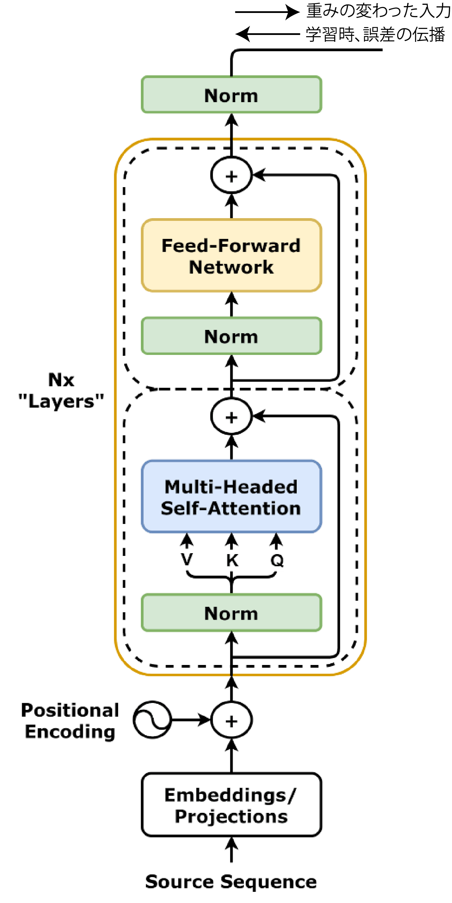

<!-- footer: "Advanced Vision Lesson 6" -->

# Advanced Vision

## Lesson 6: The Structure of the Transformer

Ryuichi Ueda, Chiba Institute of Technology

 

This work is licensed under a [Creative Commons Attribution-ShareAlike 4.0 International License](https://creativecommons.org/licenses/by-sa/4.0/).

---

<!-- paginate: true -->

## Contents

- The Structure of Transformer
- A Simple Application of Transformer

(More complex applications will be discussed next lesson.)

---

## Structure of Transformer (for translation)

- Consists of an encoder and a decoder
    - Left: Encoder
        - Input: Sentence before translation (e.g., "This is a pen.")
    - Right: Decoder
        - Input: Token indicating "start of translation" or partially translated sentence (e.g., "This is")
        - Output: Next word (e.g., "a")

Let's take a look at it step by step

[Image: CC-BY-4.0 by dvgodoy](https://commons.wikimedia.org/wiki/File:Transformer,_full_architecture.png)

---

### Encoder

- Main part: in the dark yellow frame
    - "Nx layers": Concatenating multiple layers.
    - See the next page for details.
- Input (bottom of the figure): $H_\text{enc} = \sqrt{D}E + P$
    - $E=[\boldsymbol{e}_{w_1}\ \boldsymbol{e}_{w_2}\ \dots\ \boldsymbol{e}_{w_N}]^\top$
        - Sentence (a sequence of tokens represented as a $D$-dimensional vector)
- Output: $H_\text{enc}'$ with weights changed according to the decoder's work.
    - Context is reflected.

---

### Layer normalization

- The three "Norm"s in the figure
- Normalize the elements of each vector $\boldsymbol{h}=(h_1 \ h_2 \ \cdots \ h_D)^\top$ to equalize the influence of each vector.
    - How to normalize?
        - 1: The mean of $h_{1:D}$ is $0$ and the standard deviation is $1$.
        - 2: For each $h_i$, parameters $\gamma_i, \beta_i$ (training target) are prepared and transformed into $\gamma_ih_i + \beta_i$.
            - Because the importance of each element varies depending on its position.

---

### Self-Attention Mechanism

- Changes token vectors based on the system's own information.
    - Reflects context (see next page for details).
- Mechanism: Q, K, and V are all generated from the input to the system.
    - Query: $Q= W_\text{Q}H$$_\text{enc}$ (previously it was $H_\text{dec}$).
    - Key: $K= W_\text{K}H$$_\text{enc}$ (same as above)
    - Value: $V= W_\text{V}H_\text{enc}$
    - Output: $H'=$Softmax$\Big(\dfrac{QK^\top}{\sqrt{D}}\Big)V$
- The previous attention mechanism was Cross Attention Mechanism

---

### Supplementary information on self-attention mechanisms [[Google2017]](https://research.google/blog/transformer-a-novel-neural-network-architecture-for-language-understanding/)

- If we simply associate pronouns with nouns, we cannot tell whether the next "it" is "dog" or "street."
    - 1: The animal didn't cross the street because it was too tired.
        - it: dog
    - 2: The animal didn't cross the street because it was too wide.
        - it: street
- KVQ: By applying not only nouns but also all tokens to a matrix $K$, we can calculate the proximity of the query (it) to the other.
    - "You shall know a word by the company it keeps!" [[Firth1957]](https://cs.brown.edu/courses/csci2952d/readings/lecture1-firth.pdf) (Reprinted)

---

### Multi-head Attention

- Transformer implementations split the attention mechanism into multiple parts.
- $W_\text{K}, W_\text{V}, W_\text{Q}$ ($D \times D$ matrix) is divided.
- $Q^{(m)}= W_\text{Q}^{(m)}H$
- $K^{(m)}= W_\text{K}^{(m)}H$
- $V^{(m)}= W_\text{V}^{(m)}H\quad$ ($m=1, 2, \dots, M$)
- $W_X^{(m)}$: $(D/M) \times D$ matrix obtained by cutting $W_X$ horizontally.
- In terms of ANNs, connections are broken every $m$ and become independent.
- Each one changes how it interprets the sentence.
(Apparently, it is trained to do so.)
- The output $Q^{(m)}, K^{(m)}, and V^{(m)}$ are combined$\rightarrow$ to return the original $D \times D$ matrix.

---

### Feedforward layer (fully connected layer)

- Text passed through the self-attention mechanism is passed through.
- The upper of the two dotted boxes in the right figure.
- Features are further emphasized through a nonlinear activation function (the original was ReLU).

---

### Additional Notes 1

- Both the attention mechanism and the feedforward layer use skip connections.
- Each layer learns and outputs differentials.
- To provide easy-to-understand input to each layer at the beginning of learning.
- Necessary because the layers are deep.
- Although not shown in the figure, dropout layers are used in several places.
- Dropout: A process that disables a certain percentage of neurons per learning unit (batch).
- Prevents overfitting by not assigning specific roles to specific neurons.

---

### Additional Notes 2

- GELU (Gaussian Error Linear Unit) is sometimes used instead of ReLU as the activation function.
- $h(x) = x\cdot \frac{1}{2}\big\{ 1 + \text{erf}(x/\sqrt{2})\big\}$
- $\text{erf}(a) = \frac{2}{\sqrt{\pi}}\int_0^a e^{-t^2}\text{d}t$
- Trivially differentiable

([Image by Ringdongdang CC BY-SA 4.0](https://commons.wikimedia.org/wiki/File:ReLU_and_GELU.svg))

---
### Encoder Summary

- Trained to achieve the following behavior:
- Receives a sentence as a matrix $H_\text{enc}$, which is a list of token vectors and adds positional information.
- Operates each vector in $H$ according to the context using a self-attention mechanism and a fully connected layer.
- Repeats the above steps.
- Outputs $H'_\text{enc}$, which reflects the context.
- The backpropagation error received depends on the decoder.

---
### Decoder (and Beyond the Decoder)

- The main body is in the green box.
- Receives a matrix $H_\text{dec}$ corresponding to the sentence up to that point.
- An ANN is connected after the decoder to perform the specific task.
- In the case of translation, a fully connected layer is used to predict the next word.
- The decoder changes $H_\text{dec}$ to $H'_\text{dec}$ to make this task easier.

---

### The Decoder Body

- (Self-Attention + Cross-Attention + Feedforward Layer) $\times N$
- Self-Attention
- $H_\text{dec}$ is manipulated by taking into account the context of the sentence being translated.
- "Masked" in the diagram means: A mechanism for masking the latter half of a sentence.
- During training, completed translation examples are input, so it is necessary to mask the latter half.
- Example: When training to think of what comes after "This is," the input is "This is a pen.", so the corresponding "a pen" in $W_X$ is used.
