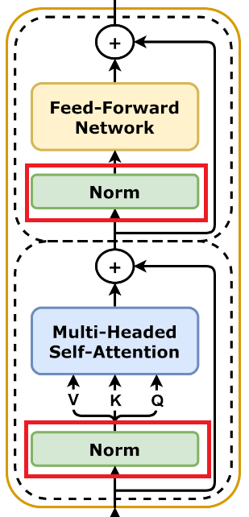
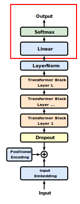

<!-- footer: "Advanced Vision Lesson 7" -->

# Advanced Vision

## Lesson 7: Applications of Transformer

Ryuichi Ueda, Chiba Institute of Technology

 

This work is licensed under a [Creative Commons Attribution-ShareAlike 4.0 International License](https://creativecommons.org/licenses/by-sa/4.0/).

---

<!-- paginate: true -->

## Contents

- Supplementary notes from last session
- BERT
- GPT

---

## Layer Normalization

- Normalize the output of a layer
- Method: For each vector $\boldsymbol{x}=(x_1, x_2, \dots, x_d)$ passed,
    - Normalize the vector elements so that their mean is $0$ and variance is $1$.
    - Multiply the $i$th element by $\gamma_i$ and shift it by $\beta_i$.
        - $\gamma_i$ and $\beta_i$ are the parameters to be trained.
- Role
    - Prevent values from becoming extreme.
    - Emphasize or weaken certain elements of the vector (manipulate the degree of attention).
        - Later, we will introduce a mechanism to learn $\gamma_i$ and $\beta_i$ from other information.

---

## [BERT](https://aclanthology.org/N19-1423/) (Bidirectional Encoder Representations from Transformers) [Devlin2019]

- Model using Transformer encoder
- Application: Google Search
- BERTBASE and BERTLARGE
- Number of encoders: 12 for the former, 24 for the latter
- Number of parameters: 110M for the former, 340M for the latter
- Training method (ANN configuration: [Fig. 1 in the original paper](https://aclanthology.org/N19-1423.pdf))
- Pre-training: Sentence fill-in (masked LM, MLM) and next-sentence prediction tasks simultaneously
- Wikipedia + 7,000 books
- Fine-tuning: Tasks tailored to each application

---

### Input format

- In addition to the standard positional embedding, each token is assigned a segment embedding, indicating the sentence position.
- The later [RoBERTa](https://arxiv.org/abs/1907.11692) does not use segment embeddings.
(It also does not predict the next sentence.)
- Special tokens
- `[CLS]`: Class token (attached to the beginning)
- `[SEP]`: Sentence separator
- `[MASK]`: Mask used to hide tokens during training.

---

### Pre-training

- Masked LM (also known as bidirectional tasks): Use a Transformer encoder to solve a sentence fill-in-the-blank problem.
- Example: `[CLS]` I went to Doutonbori `[MASK]` bus. `[SEP]`
- The embeddings output by the encoder are followed by a fully connected layer that outputs the probability of each word. This is the learning process.
- Occasionally, the system will ask the user to answer using the existing word without masking, or to swap tokens to answer the correct answer.
- Next-Sentence Prediction: Two sentences are connected with a `[sep]` and the user is asked to guess whether they are a continuation or not.
- 50% of the training data is continuation sentences, and the other 50% is separate sentences.
- A fully connected layer that probabilistically determines continuity/discontinuity is attached to the output class token, which is the learning process.

---

### How to Use BERT

There are various ways to use BERT, and they are fine-tuned to suit the purpose (see [Reference](https://wandb.ai/mukilan/BERT_Sentiment_Analysis/reports/An-Introduction-to-BERT-And-How-To-Use-It--VmlldzoyNTIyOTA1)).
- Classification, Sentiment Analysis
- Class token output is passed to a classifier.
- Question Answering
- First, the system reads a sentence containing the answer, then asks a one-word quiz to answer.
- For questions that require predicting the next word in the quiz.
- Named entity recognition
- Classifying unknown words into categories such as "person's name," "place name," "organization name," etc.
- Converting sentences into labels (a rough explanation)

---

### How to use BERT (continued)

- Extractive summarization
- Extracting important parts from a sentence and summarizing them
- Example configuration [[Liu2019]](https://aclanthology.org/D19-1387.pdf): Add an encoder on top of BERT, and output a binary value indicating whether to output the sentence in the class token at the beginning of each sentence.
- Abstractive summarization
- Properly rewriting and summarizing
- It seems possible, but we're still investigating.

---
## GPT (Generative Pre-trained Transformer)

- GPT-1
- GPT-2
- GPT-3
- ChatGPT
- GPT-4

---

### [GPT-1 [Radford2018]](https://cdn.openai.com/research-covers/language-unsupervised/language_understanding_paper.pdf)

- Making the Transformer decoder work like BERT
- (BERT is the encoder)
- Decoder in this case: A Transformer decoder with masked self-attention, without cross-attention
- Masked: In other words, pre-training with next-word prediction

[Image: CC0 (public domain)](https://commons.wikimedia.org/wiki/File:Full_GPT_architecture.svg)

---

### GPT-1 Training Method (Pre-training Part 1)

- Pre-training Data: 4.5GB of text from 7,000 unpublished books across various genres ([BookCorpus](https://github.com/soskek/bookcorpus))
- Predict the next word from the unmasked portion
- As described on the previous page
- Loss function: $\mathcal{L}(\boldsymbol{\Theta}) = -\sum_i \log P(w_i | w_{{i-k}:{i-1}}, \boldsymbol{\Theta})$
- $w_i$: Token to predict
- $w_{i-k:i-1}$: Token used for prediction
- $k$: Range of past tokens to read (truncation threshold)

---

### GPT-1 Training Method (Pre-training Part 2)

- Adding special tokens: `<s>` at the beginning of a sentence and `<e>` at the end
- Connecting a fully connected layer to the output $\boldsymbol{h}_\text{<e>}$ corresponding to `<e>`
to calculate the occurrence probability for all words
- $P(w_i) = $softmax$(W\boldsymbol{h}_\text{<e>})$
- The idea is that the meaning of the read sentence is summarized in the `<e>` part, like a class token

---

### GPT-1 Training Method (Fine Tuning)

- Adding a head to the part of the pre-trained decoder corresponding to `<e>` to specialize it for a specific task
- Problems similar to those handled by BERT (although GPT-1 was developed earlier)
- Demonstrates high performance (omitted)
- High performance is important, but the results on the next page are even more significant

---

### Considering use with zero-shot

- Use GPT without fine-tuning
- Method used in the GPT-1 paper (example of having the machine answer a multiple-choice quiz)
- Ask a question and ensure the answer is the last token
- Compare the probability of occurrence of the answer token and select the one with the highest probability as the answer
- If you input a question instead of just a single token and prompt the machine for output, perhaps it will provide a written answer?
- GPT is essentially a model that continuously produces words.
$\Longrightarrow$Continues with GPT-2

---

### [GPT-2 [Radford2019]](https://cdn.openai.com/better-language-models/language_models_are_unsupervised_multitask_learners.pdf)

- Scaling up GPT-1
- 10x the number of parameters and training data
- Collected 45 million links from the internet and acquired 80GB of text
- The paper pursues zero-shot learning
- Instead of changing the model depending on the task, the task is also input
- $P($Answer$|$Task$,$Input$)$
- Example: "Translate into Japanese: This is a pen.", "Summary: (long sentence)"
- Is it possible? Try increasing the $\rightarrow$ parameters and training volume (GPT-1's performance improved with training volume).

---

### GPT-2 Capabilities

- As mentioned above, it receives task instructions such as "◯◯:" as input and responds.
- It achieves the versatility to complete tasks without fine-tuning.
- However, fine-tuning may still be necessary for some tasks.
- It writes fictional articles. [[Radford2019]](https://cdn.openai.com/better-language-models/language_models_are_unsupervised
