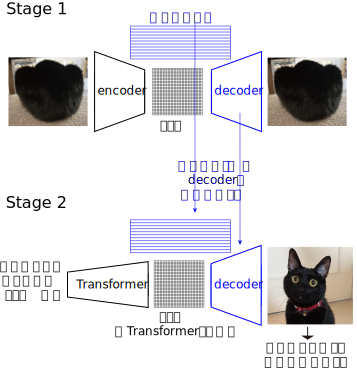

<!-- footer: "アドバンストビジョン第8回" -->

# アドバンストビジョン

## 第8回: 画像とTransformer

千葉工業大学 上田 隆一

 

This work is licensed under a [Creative Commons Attribution-ShareAlike 4.0 International License](https://creativecommons.org/licenses/by-sa/4.0/).

---

<!-- paginate: true -->

## 今日やること

- Vision Transformer
- Image GPT
- Diffusion Transformer
- CLIP
- DALL·E
- GLIDE
- unCLIP（DALL·E 2）

---

## Vision Transformer（ViT）[[Dosovitskiy 2020]](https://arxiv.org/abs/2010.11929)

- Transformerのエンコーダを画像に転用
    - 画像をブロック状に切って単語のように扱う（右図）
    - 右図のCLS: クラストークン
        - 文の分類と同じ
        - 全結合層（MLP Head）に通す
- 画像をブロック状に扱うのはCNNと同じだが、そのあとが違う
    - CNNは遠くのブロックの関係性を見るのが苦手

[画像: CC-BY-4.0 by Daniel Voigt Godoy](https://commons.wikimedia.org/wiki/File:Vision_Transformer.png)（[[Dosovitskiy 2020]](https://arxiv.org/abs/2010.11929)のFig.1にも構成図）

---

### ViTの大きさ

- オリジナルの論文には大きさの異なる複数のモデル
    - ViT-Base: 層の数12、ベクトルの次元: 768、パラメータ数: 8600万
    - ViT-Large: 層の数24、ベクトルの次元: 1024、パラメータ数: 3.07億
    - ViT-Huge: 層の数32、ベクトルの次元: 1280、パラメータ数: 6.32億

---

### トークンに対応するベクトルの作り方

- 画像を$P \times P$画素のブロックに区切る
    - 例: $P=16$: ベクトルの次元は$16\times 16 \times 3 = 768$に
        - 3はチャンネルの数（RGB）
    - 位置の埋め込みも行う
        - ただし固定値ではなく、パラメータは学習対象
- 画像の理解
    - 局所的な理解: ベクトルの中
    - 大域的な理解: 自己注意機構で学習

---

### 事前学習の方法 

- 教師あり学習で分類問題を解く
    - 言語と違って教師なし（BERTのような穴埋め）はあまり効果がない
- オリジナルの論文で用いられた訓練データ
    - JFT-300M
        - 3億枚の画像、18291クラスのデータセット
    - ImageNet-21k
        - 1400万枚の画像、21841クラスのデータセット
- 訓練データが多いと高い性能を発揮（JFT-300Mのほうがよかった）

---

### ViTの機能のしかた

- 位置の埋め込みに関して
    - [[Dosovitskiy 2020]](https://arxiv.org/abs/2010.11929)のFig. 7左
    - 画像処理で使われる基底関数のようなものができている
- どこを見て判断しているか
    - [[Dosovitskiy 2020]](https://arxiv.org/abs/2010.11929)のFig. 6、Fig. 7右
    - 自己注意機構のヘッド（マルチヘッド注意機構のヘッド）には、入力に近い層ですでに大域的なものとローカルなものなどバリエーションが出る
        - 大域的なものはCNNの入力に近い方のたたみ込み層に類似
    - 入力から遠ざかるとより大域的に

---

## Image GPT[[Chen 2020]](https://proceedings.mlr.press/v119/chen20s.html)（[サイト](https://openai.com/ja-JP/index/image-gpt/)）（[動画](https://www.youtube.com/watch?v=7rFLnQdl22c)）

- GPTの画像版
    - GPT-2の構造を使用
    - パラメータ数: iGPT-Lというモデルで$13.6$億
- 画像を途中まで入力して、次の画素を当てさせる
    - [PixelCNN](https://ryuichiueda.github.io/slides_marp/advanced_vision/lesson5.html#6)と同じ問題
- GPT同様、ヘッドをつけてファインチューニングすると他のタスクに利用可能

---

### Image GPTの学習

- 2種類の訓練方法
    - 次の画素の予測（GPT的）
    - 穴埋め問題（BERT的）
- 埋め込みに相当するベクトル: 画像の解像度を下げて1列に並べたもの
    - サイト: $32^2$, $48^2$ or $64^2$pixel
    - 論文: $32^2$, $48^2$, $96^2$ or $192^2$pixel
        - $32^2$ or $48^2$の時は色をRGBからカラーパレットに（昔の計算機の方式）
        - $96^2$, $192^2$pixelのときはVQ-VAEで圧縮（それぞれ$16^2, 34^2$の符号列に）

---

## Diffusion Transformer（DiT）[[Peebles 2022]](https://arxiv.org/abs/2212.09748)

- 拡散モデル+Transformer
    - さらに潜在空間に情報を圧縮する潜在拡散モデルも使用
    - ラベルを入力して出力をコントロール（分類器なしガイダンス）
- 構造
    - [[Peebles 2022]](https://arxiv.org/abs/2212.09748)の図3
        - 入力: 画像のトークンの他、ラベルを表すベクトルと時刻を表すベクトルを足したトークン1つ
            - 後者はadaLN-Zeroという仕組みで画像に作用させる
                - 層正則化のラベルつきバージョン（？）
        - 出力: 画素ごとのノイズの平均値と分散
    - 画像のサイズを落とすためにVAEを使用

---

## CLIP（Contrastive Language-Image Pre-training）[[Radford 2021]](https://arxiv.org/abs/2103.00020)

- contrastive: 「対照的な」という意味
    - 対照学習（あとで説明）でテキストと画像を結びつけ
- [図](https://en.wikipedia.org/wiki/Contrastive_Language-Image_Pre-training)
- CLIPでできること
    - 画像に何が写っているかを認識（ある意味ではラベルの数に制限がない）
    - テキストから画像を生成するときの部品
        - unCLIP（あとで扱います）

---

## CLIPに関する背景

- よく行われてきた画像認識の方法の手順
    1. 写真をあつめる
    2. 写真に写っているものをラベル付けする
    3. 学習
- 上記方法の問題
    - めんどくさい
    - ラベルのあるものしか認識できない

なんとかラベルの付いている画像を集められないか？

---

### ラベル（ではなくキャプション）のついた画像の収集

- 画像にはキャプションのついたものがある（論文はそうですよね？）
$\Longrightarrow$画像とキャプションをいろんなところから大量に集めてくることは可能
    - 原論文: 4億組の画像とキャプションのセットを収集
- 問題: キャプションは単語ではなく文や句になっている
    - 単純なラベルではない

Transformerを使ってなんとかならないか？

---

### CLIPの学習方法

1. 前ページの方法で学習用のデータを準備
2. ViTを使って画像をエンコーディング
3. Transformerを使って文をエンコーディング
4. エンコーディングされたデータ（埋め込み）同士の相関を学習
$\Longrightarrow$画像から文、文から画像などの変換が可能なANNができる
- 補足: 必ずしもViT、Transformerである必要はない（が、Transformerを使ったほうが性能が高くなる）

---

### CLIPの構造

- [全体像](https://en.wikipedia.org/wiki/Contrastive_Language-Image_Pre-training)
- image encoder: ViT
    - 入力は画像
    - クラストークンを出力として使う（数百次元のベクトル）
- text encoder: Transformerのデコーダから交差注意機構を除いたもの
    - 入力は画像のキャプション
    - 出力をimage encoderに合わせる
-  数理的に重要な点: マルチモーダルであること
    - text encoderとimage encoderの出力が同じ潜在空間にプロットされる
        - キャプション（文、句）と画像が同じ空間に配置され、似たものが近くに配置される

---

### 評価方法（対照学習、contrastive learning）

- $N$ペア（バッチ）の画像とキャプションをエンコーダに入力
    - image encoderの出力: ベクトル$\boldsymbol{i}_1, \boldsymbol{i}_2, \dots, \boldsymbol{i}_N$
    - text encoderの出力: ベクトル$\boldsymbol{t}_1, \boldsymbol{t}_2, \dots, \boldsymbol{t}_N$
- ペアとなっている画像とキャプションのベクトルを同じにしたい
    - $\boldsymbol{i}_j$と$\boldsymbol{t}_j$のコサイン類似度を大きくしたい
        - コサイン類似度: $\boldsymbol{i}_j\cdot \boldsymbol{t}_j/(|\boldsymbol{i}_j| |\boldsymbol{t}_j|)$
- ペアでない画像とキャプションのベクトルを違うものにしたい
    - $\boldsymbol{i}_j$と$\boldsymbol{t}_k (i\neq k)$のコサイン類似度を小さく
- $\Rightarrow$損失関数: $\mathcal{L} = -\dfrac{1}{N} \sum_{j=1}^N \ln\mu_{j,k}
e^{\boldsymbol{i}_j\cdot\boldsymbol{t}_j /T}
-\dfrac{1}{N} \sum_{k=1}^N \ln\mu_{j,k}
e^{\boldsymbol{i}_k\cdot\boldsymbol{t}_k /T}$ 
    - $\mu(j,k) = (\sum_{k=1}^N e^{\boldsymbol{i}_j\cdot\boldsymbol{t}_k /T})^{-1}$
    - $T$は「温度」で学習が進むにつれて下げていく

---

### 学習したモデルの使い方

- 例: 画像の分類
    - 分類したいものに対してラベルを$N$個準備
    - 「a photo of <ラベル>」という句を$N$通り作って、それぞれをtext encoderに通して特徴ベクトル$T_{1:N}$を得る
    - 画像をimage encoderに通して特徴ベクトル$I$を得る
    - $I$と$T_i (i=1,2,\dots,N)$それぞれを比較し、最もコサイン類似度が高い$T_i$を選択

---

## DALL·E（ダリ）[[Ramesh 2021]](https://arxiv.org/abs/2102.12092)

- 句や文から画像を生成
    - [[Ramesh 2021]](https://arxiv.org/abs/2102.12092)の図2、図8
    - https://openai.com/ja-JP/index/dall-e/
- Transformerに、文章の続きとして画像を考えさせる
- 使うもの
    - Transformer（デコーダ）
        - GPT-3の改造版
        - 画像も埋め込みベクトルにして入力できるように
    - [VQ-VAE](https://ryuichiueda.github.io/slides_marp/advanced_vision/lesson5.html#8)（論文では[discrete VAE（dVAE）](https://ryuichiueda.github.io/slides_marp/advanced_vision/lesson5.html#3)といっている）
        - $256 \times 256$の画像を$32 \times 32$の画像（というより符号列）にエンコード

---

### DALL·Eの学習

- キャプションと画像がペアになったものを訓練データに
    - CLIPと同じ
- Stage 1: 集めてきた画像を使ってdVAEに学習させる
    - 学習済みのデコーダに[符号列](https://ryuichiueda.github.io/slides_marp/advanced_vision/lesson5.html#6)を入力すると画像が生成されるように
- Stage 2: 入力文の後ろに符号列を生成するようにTransformerを学習

---

### DALL·Eによる画像の生成

- 前ページステージ2の構成で
    - https://openai.com/ja-JP/index/dall-e/ のサイト
       - 512枚の画像を生成して、CLIPでランク付けして上位32枚を出力
       - 遊んでみましょう

---

## GLIDE[[Nichol 2021]](https://arxiv.org/abs/2112.10741)

- Guided Language to Image Diffusion for generation and Editingの頭文字
    - generationがかわいそう
    - 「言語で誘導された画像の生成、編集のための拡散モデル」
- 自然言語+分類器なしガイダンスで拡散モデルに画像を生成させる
    - 自然言語をエンコードしたものを分類器なしガイダンスのラベルに利用

---

## unCLIP[[Ramesh 2022]](https://arxiv.org/abs/2204.06125)（DALL·E 2） 

https://www.youtube.com/watch?v=qTgPSKKjfVg&t=104s

- テキストから画像を生成
- 基本的なアイデア
    - CLIPを使う
    - テキストと画像が同じ潜在空間にいるので、
    潜在空間のベクトル$\rightarrow$画像でテキストも画像に変換可能
        - ただし、整った画像を出力するためにいろいろ工夫

---

### 構造

- 点線の上: CLIP（学習のときに使う）
- 点線の下: 生成の部分
    - 事前モデル（prior）とデコーダ（ほぼGLIDE）で構成

[画像: CC-BY-4.0 by Ramesh et al.](https://www.researchgate.net/figure/A-high-level-overview-of-unCLIP-Above-the-dotted-line-we-depict-the-CLIP-training_fig2_359936873)

---

### 事前モデルとデコーダ

- 事前モデル
    - テキストのベクトル（潜在空間にある）を画像の種に変換
        - 画像の種: 拡散モデルに使うベクトル
        - テキストのベクトルはCLIPの潜在空間（テキストと画像が混在）にあるので、そのまま画像が作れそうだが、それだと性能が出ない（らしい）
    - 構成: 拡散モデル+Transformerデコーダ
        - 入力はテキストのベクトルだがテキストも入力
- デコーダ
    - 事前モデルの出力と、テキスト
    - 構成: 拡散モデル

テキストを何度も入力

