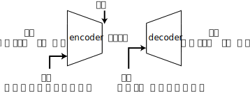
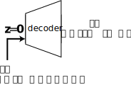

<!-- footer: "アドバンストビジョン第9回" -->

# アドバンストビジョン

## 第9回: 画像と言語、ロボット制御の融合I

千葉工業大学 上田 隆一

 

This work is licensed under a [Creative Commons Attribution-ShareAlike 4.0 International License](https://creativecommons.org/licenses/by-sa/4.0/).

---

<!-- paginate: true -->

## 今日やること

- 本題の前に
    - PaLM
    - PaLI
- ANNによるロボットの制御
    - VLA（vision-language-action model）という言葉ができる以前のもの
        - VLAという言葉が出た後の話については次回

---

## PaLM[[Chowdhery2022]](https://arxiv.org/abs/2204.02311)

- Pathways Language Model（Googleの大規模言語モデル）
    - Transformerのデコーダで構成されているのでGPTのように機能
    - 後述のようにGoogleのロボット制御モデルに用いられている
    - 新しいバージョンのPaLM 2[[Anil2023]](https://arxiv.org/abs/2305.10403)は100以上の言語を使いこなす（多言語翻訳が可能）

---

## PaLI[[Chen2022]](https://arxiv.org/abs/2209.06794)

- Pathways Language and Image model
    - 構造: 論文の図1（ViT+Transformerエンコーダ+Transformerデコーダ）
        - 言葉のトークンもViTの出す画像の特徴量のトークンも同じ長さのベクトルにしてTransformerに入力
        - 交差注意機構も使うらしい（未調査）

---

## ANNによるロボットの制御

---

### 基本的な考え方

- 様々な種類の情報を動作に変換するANNを構築
    - 画像、センサ
    - 言葉による指示
    - 自身の内部状態や構造
- 方針: これまでのvision-languageモデルを拡張して・・・
    - 画像以外の情報を入力できるように
    - 動作を出力できるように

---

### ANNによるロボットの制御の課題

- 訓練データどうするの？
    - たぶんCLIPのときのようなネットのデータはない
    - 先に答えを言うと、人間がひたすらデータを生成
    - もちろんシミュレータ（ディジタルツイン）も使える
        - 上記2つの方法の例: https://www.youtube.com/watch?v=S4tvirlG8sQ
- 方策（制御則）等の表現方法や出力方法
    - アクチュエータへの出力？
    - Transformerベースだと1つずつ順番に出していく？
- 汎化
    - 教えた動作から外れた動作もできる
    - おそらく言葉の存在（意味の理解）が可能にする

---

### Robotics Transformer-1（RT-1）[[Brohan 2022]](https://arxiv.org/abs/2212.06817)（[動画](https://www.youtube.com/watch?v=UuKAp9a6wMs)）

- 構造・入出力の概要: 論文の図3
    - Universal Sentence Encoder: [FiLM](lesson8.html#3)のパラメータを出力
    - FiLM EfficientNet-B3とTokenLearner
        - 入力: 時間差のある6枚の画像と言葉によるロボットへの指示
        - 出力: 512次元の48個のトークン
    - Transformer（デコーダー）
        - 入力: 48個のトークンに位置埋め込みしたもの
        - 出力: ロボットの行動（11次元の離散空間中の点）
            - ロボット: モバイルマニピュレータ（[Everyday Robots](https://x.company/projects/everyday-robots/)）
            - モード1次元、腕の動き7次元、位置・向き3次元
            - 3Hz

---

### RT-1の訓練データ（力づく）

- 図2のようなキッチン（3種類）やテーブルのような環境で
ロボットを動かして訓練データを採取
    - 人が遠隔操作
    - やった作業に人間がテキストの解説をつける
        - これで画像とテキストと動作のセットができる
- 採取した訓練データ
    - 744タスク（論文は「skill」と表現）（論文の表1）
    - 13のロボット
    - 13万エピソード

---

### Universal Sentence Encoder（[[Cer 2018]](https://arxiv.org/abs/1803.11175)）

（重要そうだけど概要だけ）

- 文をベクトルにする
    - 似たような文のベクトルの内積が大きくなるように
- 構造: Transformer（エンコーダ）or Deep Average Network Encoder（[[Iyyer 2015]](https://aclanthology.org/P15-1162/)）
- 学習方法
    - 前後の文の予測
    - 質問文への返答文の予測
    - 前提と仮説の文が矛盾しているかどうか

---

### Transformerより前の部分

- FiLM EfficientNet-B3とTokenLearnerの2つの部分
    - FiLM EfficientNet-B3: 各画像からトークンへの変換
        - EfficientNetというネットワークで画像の特徴量を抽出
            - 言葉をFiLMで変換して特徴量に強弱をつける
        - 1つの画像に対し、512次元の81個のベクトル（vision-language tokens）を出力
    - TokenLearner[[Ryoo 2021]](https://research.google/pubs/tokenlearner-adaptive-space-time-tokenization-for-videos/)
        - トークンの数を減らす（圧縮する）役割
            - もともとViTの入力ベクトル数を減らすためのもの
        - $81\rightarrow8$（6枚の画像で48トークン。512次元）

---

### Transformerの部分

- 8個の自己注意機構の層、1900万パラメータ
- 6枚の画像の各8トークンが順番に並べられて文のような入力に
    - これが何をすべきかを示す時系列情報に
- 出力: 先述のようにロボットを動かすために必要な次元分のパラメータとモード
    - モード: arm, base, terminate
- 訓練データでの学習
    - 言語による指示と画像から次のステップの行動を予測
        - デコーダのマスク機能を使った学習と思われる
        （注意: Transformerだけでなくモデル全体が学習）

---

### RT-1の達成事項

- 学習した種類のタスクを97\%の成功率で達成
    - 動作の例: 論文の図5
- ロバスト性
    - 学習したキッチンと異なるキッチンでのタスク
    - 様々なテーブルクロス
- 学習したものより長い/抽象化されたタスクへの対応
    - 例
        - "how would you throw away all the items on the table?"
        - "near a sink"などの直接的でない場所の指定

---

### PaLM-E[[Driess2023]](https://arxiv.org/abs/2303.03378)（[動画](https://research.google/blog/palm-e-an-embodied-multimodal-language-model/)）

- 身体性マルチモーダル言語モデル
    - 身体性: ロボットの身体の情報を織り込むということ
- PaLMに画像やロボットの知覚情報を入力できるようにして、タスクのやりかたを作文できるようにしたモデル
    - 例（論文の図1から引用）
        - 入力: "Given `` Task: Sort colors into corners."
            - ``: 画像（この場合は机の上に様々な色の物体）
        - 出力: "Step 1. Push the green star to the bottom left. Step 2. Push the green circle to the green star."
- RT-1との違い: PaLMの持っている言語的な知識を利用可能
    - 動作と関係なく「画像に何がある？」や「この画像とこの画像の間に何が起こった？」などの質問にも答えてくれる

---

### PaLM-E（PaLM-E-562B）の構成（[論文](https://arxiv.org/abs/2303.03378)の図1）（その1）

- PaLMへの入力の部分
    - ViT（220億パラメータ）: 画像をPaLMへのトークンに変換
    - 「?」: 他の情報をPaLMへのトークンに変換
        - 入力のタイプによって変わるので、おそらく「?」と表記
            - 基本、トークンが出力できればなんでもよい
- 「?」に入力する情報の例
    - 画像以外のセンサ値
    - 画像中の物体にラベル付けしたり名前をつけたり、位置を推定した結果（[[Sajjadi2022]](https://arxiv.org/abs/2206.06922)などを使用）
    - 他にもいろいろ入力できそう

---
### PaLM-E（PaLM-E-562B）の構成（[論文](https://arxiv.org/abs/2303.03378)の図1）（その2）

- 本体
    - PaLM（5400億パラメータ）: 言葉をトークンで受けつけ
        - 出力: 身体性（ロボット自身の体の構造）を考慮した作文
            - 手順を出力できる
- コントローラ: ロボットを動かしたかったら図の紫色の部分が必要
    - [[Lynch2020]](https://arxiv.org/abs/2005.07648)やRT-1など
    - アクチュエータへの指示をPaLMに直接出力させたかったら、そのように学習すればよいが、あんまり長いシーケンスはだせなさそう（論文を読んだ限りでは）

---

### PaLM-Eの学習方法

- 訓練データ（論文の表6）
    - 文章と他のデータのセット
        - 文章: 質問と答えをつなげたもの
            - 何トークン目までがタスクの内容なのかを示す値も準備
        - 画像やセンサのデータ
            - 時系列で決められたセット数だけ入力
- 損失関数: 答えと出力のクロスエントロピー誤差
- 特記事項
    - ほとんどが画像の内容を答えるもので、ロボット関連のものは10\%未満
        - [Webli]([[Chen2022]](https://arxiv.org/html/2410.23676v1))というデータセットのものが半分以上

---

### ロボット関連の訓練データ

3種類

- Task and Motion Planning（TAMP）: 論文のB.1
    - シミュレータ環境で、机の上の様々な色の積み木に対する質問に答える
        - 物体の関係性
        - プランニング
- Language-Table: 論文のB.2（[[Lynch2022]](https://arxiv.org/abs/2210.06407)のデータ）
    - マニピュレータの関節角の遷移と作業の様子の動画と説明文のセット
    - [Lynch2022]では60万セットが作られた
- キッチン環境のデータセット
    - 上記2つは机の上の積み木しか見ないので、それを補うために
    - [[Ahn2022]](https://arxiv.org/abs/2204.01691)の訓練データに類似

---

## ALOHA, ACT[[Zhao2023]](https://arxiv.org/abs/2304.13705)

- 模倣学習の枠組みの提案
    - 基本的に1つのタスクを学習
- ALOHA: A Low-cost Open-source Hardware System for Bimanual Teleoperation
    - 訓練データ取得用の遠隔操作システム
        - [訓練データ取得の様子](https://youtu.be/VOpTZBwN7xs?si=IT14vfsjEirvKfKF&t=52)
        - [買えるものの例](https://www.tegtks.net/products/case10.html)
        - [移動マニピュレータ版](https://www.youtube.com/watch?v=zMNumQ45pJ8)
- ACT: 次のページ

---

### ACT: Action Chunking with Transformers

- 離散ではなく連続量で制御を出力するモデル
- 1ステップずつではなく、数ステップ先まで一度に出力して制御周期を上げ、滑らかな制御を実現
- ロボットの動きの例
    - [小さいカップの蓋を開ける](https://youtu.be/VOpTZBwN7xs?si=9tmS5TD94stPVUOF&t=214)
    - [電池の挿入など](https://youtu.be/VOpTZBwN7xs?si=7zIrDrnEHrqJYWfx&t=252)
    - https://www.youtube.com/watch?v=VUxFhtGWD7w

---

### ACTの計算（学習時）

構成: Transformerで作った条件付きVAE（CVAE, [[Zhao2023]](https://arxiv.org/abs/2304.13705)の図11上）

- エンコーダの作る分布: $q_\phi(\boldsymbol{z}|\boldsymbol{a}_{t:t+k},$ 画像以外の時刻$t$のセンサ値$)$
    - $\boldsymbol{z}$: 潜在空間のベクトル（スタイル変数と呼ばれる。後述。）
    - $\boldsymbol{a}_{t:t+k}$: 時刻$t$から$t+k$までの動作シーケンス（位置埋め込みあり）
    - 「画像以外」: 内界センサなど。画像を抜くのは時短のため
- デコーダの作る分布: $\pi_\phi(\hat{\boldsymbol{a}}_{t:t+k} |\boldsymbol{z},$ 画像を含む$t$のセンサ値$)$
    - $\hat{\boldsymbol{a}}_{t:t+k}$: 復元した動作シーケンス
$\qquad\qquad\qquad$

---

### 学習に関する補足

- スタイル変数と潜在空間の役割
    - 同じタスクでもロボットの動きが何通りもある（いくつもモードがある）ので、それらが混ざらないようにする
        - エンコーダが潜在空間中のガウス分布に様々なモードを配置
            - ガウス分布は共分散ゼロの単純なもの
        - デコーダに$\boldsymbol{z} = \boldsymbol{0}$を指定$\rightarrow$潜在空間の中心の動作シーケンスが得られる
            - 画像やセンサ値の条件付けでタスクに対して適切な動作に
- 損失関数: $\hat{\boldsymbol{a}}_{t:t+k}$のL1誤差（誤差の絶対値を足したもの）
    - 平均的に最適というより、最良のものを断定的に選ぶときに使われる（画像からの個人の特定など）
        - 最適化の講義で習います
        - ACTでの使用: ソリッドな動作を出力したいものと思われる

---

### ACTの計算（使用・推論時）

[[Zhao2023]](https://arxiv.org/abs/2304.13705)の図11下

- 前ページの説明通り、次のようにデコーダだけを使用
    - $\hat{\boldsymbol{a}}_{t:t+k} \sim \pi_\phi(\boldsymbol{z} = \boldsymbol{0},$ 画像を含むセンサ値$)$
- $\hat{\boldsymbol{a}}_{t:t+k}$の平滑化
    - 出力された行動のシーケンスが終わるまでにデコーダからまた出力
    $\rightarrow$重み付き平均をとってアクチュエータに入力

---

### ACTの実装

- [論文](https://arxiv.org/abs/2304.13705)の図4
- CVAEのエンコーダ: 「BART-like」なTransformerエンコーダ
    - `[CLS]`を入力につけて、`[CLS]`の出力を$\boldsymbol{z}$に
- CVAEのデコーダ: Transformerのエンコーダ・デコーダ構成
    - デコーダにエンコーダが使われていてややこしい
    - Transformerのエンコーダへの入力
        - 4つのカメラ画像、2本のマニピュレータの関節角14個、スタイル変数$\boldsymbol{z}$
            - 次ページで詳しく
    - Transformerのデコーダへの入力: 位置埋め込みだけ
        - 交差注意機構でTransformerのエンコーダの出力を反映
    - Transformerデコーダの出力: $\hat{\boldsymbol{a}}_{t:t+k}$（$14$次元のベクトル$k$個）

---

### ACTの実装（Transformerエンコーダへの入力の詳細）

- カメラ画像
    - 4方向からの$480\times640$pixelのRGB画像
        - 1枚あたりResNetで$300$個、$512$次元の埋め込みのベクトルに
            - 全部で$1200$個のベクトルに
- 関節角14個
    - まとめて1つの$512$次元のベクトルに
- スタイル変数$\boldsymbol{z}$
    - これも1つの$512$次元のベクトル

以上、1202個の$512$次元ベクトルを入力

---

## まとめ

- ロボットが自然言語にしたがって作業できるようになった
    - RT-1: ロボットの動きの生成
    - PaLM-E: RT-1より上層の作業計画
    - vision-languageモデルと組み合わせることで、新しい状況にも対応可能に
- ロボットが細かい作業をできるようになった
    - ACT
- 今回の内容でまだできてないこと
    - 複数の種類のロボットが複数の種類のタスクをできるようにするには？
