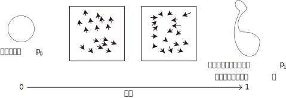

<!-- footer: "アドバンストビジョン第9回" -->

# アドバンストビジョン

## 第9回: 画像と言語、ロボット制御の融合

千葉工業大学 上田 隆一

 

This work is licensed under a [Creative Commons Attribution-ShareAlike 4.0 International License](https://creativecommons.org/licenses/by-sa/4.0/).

---

<!-- paginate: true -->

## 今日やること

- 本題の前に
    - flow matching
- VLA（vision-language-action model）

---

## Flow matching（FL）[[Lipman 2022]](https://arxiv.org/abs/2210.02747)

- 拡散モデルとは別のアプローチで分布の変換を実現
- 拡散モデル（下図。再掲）
    - 現実（実際には訓練データ）の分布をガウス分布に変換・逆変換
        - 変換にはノイズを乗せていく方法が取られた
- FL: 別にノイズを乗せなくても変形していけばいいんじゃないか？

---

### 前ページのアイデアの問題

- 任意の時刻のノイズ画像が生成できない
    - 下図（再掲）
    - 各時刻の学習に支障
- FMはこれをなんとかした

---

### FMのアイデア

- ガウス分布$p_0$と画像の分布など意味のある分布$p_1$の相互変換
    - にベクトル場$u_t$（$0\le t \le 1$）で考える
    - 各時刻で分布をひっぱる速度場を仮定
    - このベクトル場を再現する関数$v_t(\boldsymbol{w})$をANNが学習
    - $v_t(\boldsymbol{w})$と$u_t$の差（2乗誤差）を損失関数に
- 問題としては最適輸送問題をANNに解かせることに
    - 最適輸送問題: 分布を一番楽な方法で変形する問題

---

### 訓練データの作成

- 拡散モデル同様、途中の$t$の画像が必要

