<!-- footer: "機械学習第8回" -->

# 機械学習

## 第9回: 言語と人工ニューラルネットワークI

千葉工業大学 上田 隆一

 

This work is licensed under a [Creative Commons Attribution-ShareAlike 4.0 International License](https://creativecommons.org/licenses/by-sa/4.0/).

---

<!-- paginate: true -->

## 今日やること

- Word2vec
- Transformer
- Transformerの応用例

---

### 本題に入る前に: ソフトマックス層

- 入力を$y_i = \eta e^{x_i}$で正規化する層
- 使用例: 画像に映ったものを判別
    - 答えを確率分布で出力（例: 犬90%、猫9%、他1%）
- softmax（softな最大値）: 1つに決めないということ
    - 実世界は微妙な場面が多いので、1つに決めないで曖昧に出力したほうが都合よい
- 数式
    - 入力$\boldsymbol{x} = (x_1, x_2, \dots, x_n)$に対し$y_i = \eta e^{x_i}$を出力
        - $\eta$は正規化定数

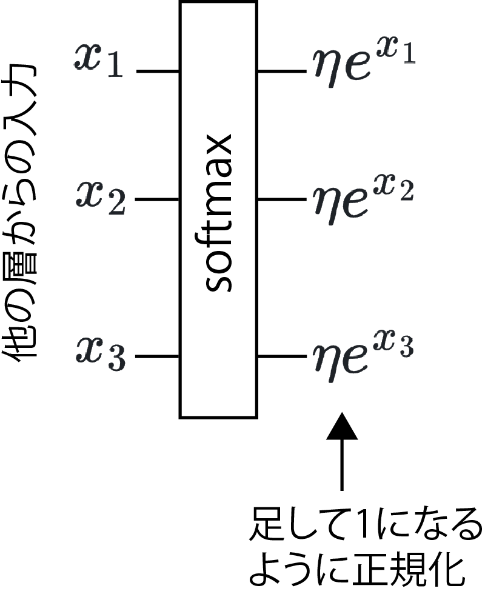

---

## Word2vec[[Mikolov2013]](https://arxiv.org/abs/1301.3781)

- 単語をベクトル表現するためのモデル群や枠組み
- Word2vecで作られたベクトル表現はTransformerの入力に

---

### 単語のベクトル表現（単語の埋め込み、分散表現）

- 近い単語は似たベクトルに
    - 例（適当。上記のように次元はもっと必要）
        - おじさん$= (0.9, 0.32, 0.07)$
        - おばさん$= (0.7, 0.55, 0.08)$
        - 不動産$= (0.1, 0.05, 0.88)$
    - 類似度が内積で計算できる
        - おじさん$\cdot$おばさん$=0.77$
        - おじさん$\cdot$不動産$=0.07$
    - 次元を大きくすると、様々な切り口で類似度を計算可能
- 分散表現（埋め込み表現）: 上記のような単語のベクトル表現
- 埋め込み: 分散表現を作ること

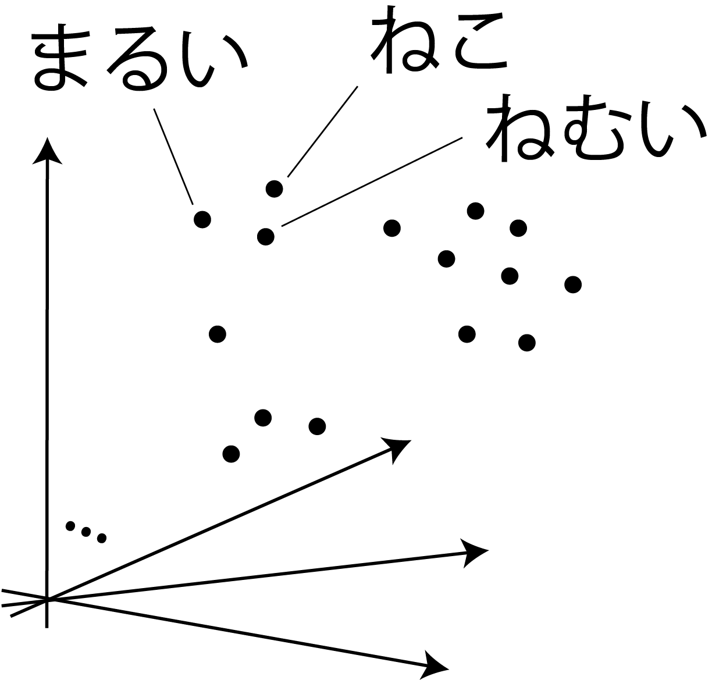

---

### 分布仮説（distributional hypothesis）

- "You shall know a word by the company it keeps!" [[Firth1957]](https://cs.brown.edu/courses/csci2952d/readings/lecture1-firth.pdf)
    - 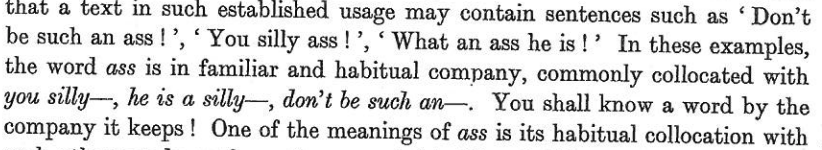
        - ass言い過ぎ
    - ある単語の意味は周辺の単語が担っているということ
- つまり、ある単語のベクトルの値は、文の前後の単語から決めるとよい
（仮説が正しいならば）
    - [Mikolov2013]では、この性質を利用した分散表現の作成方法が
    2つ示されている
 
---

### 埋め込みの方法の例: skip-gram

- 右図の構造のANNを準備
    - アフィン層2つとソフトマックス層
- 受け付ける入力: $\boldsymbol{v} = (0\ 0\ \cdots\ 1\ 0\ \cdots\ 0)$
    - ある単語について、その単語に対応する要素が$1$になったone-hotベクトル
    - 単語の種類だけ次元がある（数千）
- アフィン層間のベクトル$\boldsymbol{x}$: 512や1024など
- 出力: 入力と同じ次元のベクトル
    - 各単語に対応する確率

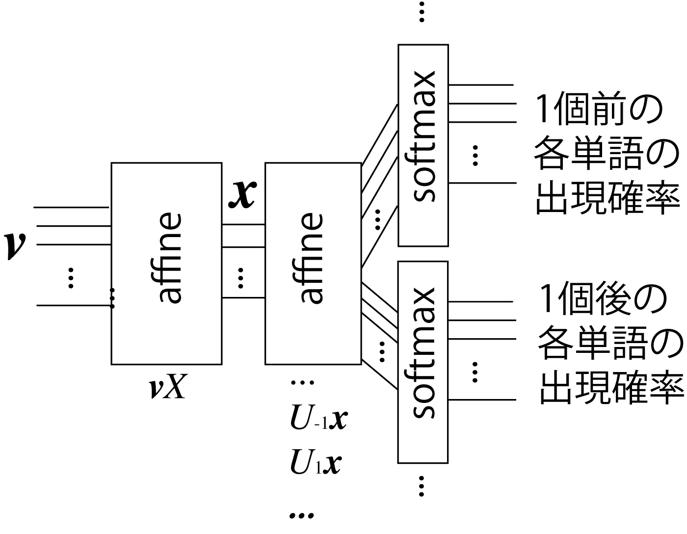

---

### skip-gramの学習

- ある単語$w$のone-hotベクトル$\boldsymbol{v}_{w}$に対し、ある範囲内に別の単語$\boldsymbol{w}'$がある確率を学習
    - たくさんの文献から訓練データを作成
    - 単語間の関係を反映した埋め込みが可能
- $X$の各行が分散表現に
    - $X = [\boldsymbol{x}_{w_1}\ \boldsymbol{x}_{w_2}\ \dots\ \boldsymbol{x}_{w_N}]^\top$
    - $\boldsymbol{x}_{w_i} = \boldsymbol{v}_{w_i}X$
        - ある単語$w_i$のone-hotベクトル$\boldsymbol{v}_{w_i}$を入力すると、$\boldsymbol{x}_{w_i}$が得られる

予想するタスクをこなす$\rightarrow$単語の関係がANN内に

---

## Transformer

---

### 埋め込みができればコンピュータが文章を認識する?

・・・ことはできない

- 最尤な単語をskip-gramで予想して並べていけばそれっぽい文は作れるけど、たぶん無意味な文ができる
    - [マルコフ連鎖ジェネレータ](https://lorem.sabigara.com/?source=ginga-tetsudo&format=plain&sentence_count=5)のようなもの
- 単純な埋め込みには限界
    - 語順に関する情報は、完全にはない
    - 文脈依存な情報を持っていない
        - 同音異義語に1つのベクトル$\rightarrow$区別してない
            - 例: チンチラ（げっ歯類にも猫にもいる）

どうしましょう？

<a href="https://commons.wikimedia.org/wiki/Chinchilla_lanigera#/media/File:Chinchilla_lanigera_(Wroclaw_zoo)-2.JPG">写真上 by Guérin Nicolas（CC BY-SA 3.0）</a>
<a href="https://commons.wikimedia.org/wiki/File:Chinchilla_cat_(3228221937).jpg">写真下 by allen watkin（CC BY-SA 2.0）</a>

---

### どうすればいいか?

- 埋め込みに語順と文脈の情報を付加してやるとよい
    - 潜在表現のベクトルに位置情報を付加
    - さらに注意機構で文脈を考慮
- Transformer[[Vaswani2017]](https://arxiv.org/abs/1706.03762)で考案された
    - これらの仕組みで既存のANNを凌駕
        - Transformerの概略と入力を説明してから順に説明していきます

---

### Transformer

- 翻訳のためにGoogleで開発された
    - [使ってみましょう](https://translate.google.co.jp/?hl=ja&sl=en&tl=ja&op=translate)
- 正体: 右のような構造のANN
    - エンコーダ（左側）とデコーダ（右側）で構成
- 画像にも応用されている
    - Vision Transformer（ViT）
- その他言葉を扱うもので新しいものは、だいたいこれの応用

[画像: CC-BY-4.0 by dvgodoy](https://commons.wikimedia.org/wiki/File:Transformer,_full_architecture.png)

---

### Transformerへの入力（エンコーダ）

- 文章: サブワード単位のトークン（単語をより細かく文を区切って埋め込みをしたもの）の分散表現でのベクトルを並べたもの
    - $E=[\boldsymbol{e}_{w_1}\ \boldsymbol{e}_{w_2}\ \dots\ \boldsymbol{e}_{w_N}]^\top$という行列に
    - 右の例では省略されているが`<EOS>`（文の終わり）などの特殊なトークンも入力として並べる

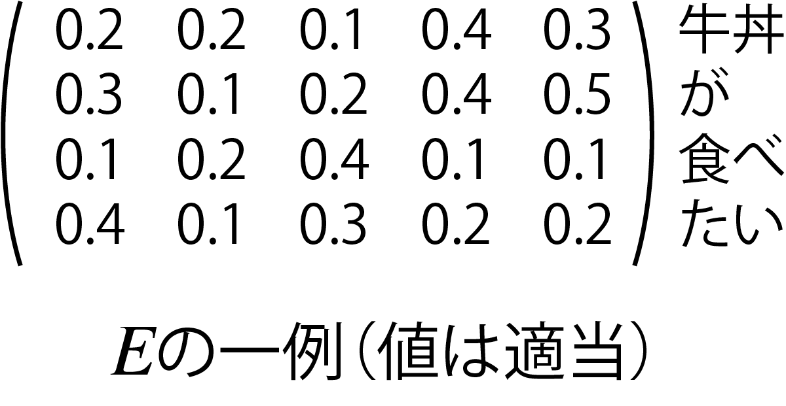

---

### Transformerへの入力（デコーダ）

- デコーダの場合は途中までの文を入力
    - `<SOS> I want to eat`など
        - （`<SOS>`: start of sentence）
- `<SOS>`から始めて、翻訳したものを次に入力に回す
    - 最初の入力: `<SOS>`
    - 次の入力: `<SOS> I`
    - 次の入力: `<SOS> I want`
    - ・・・と文ができていく
    （実際はエンコーダと同じく行列$E$を入力）

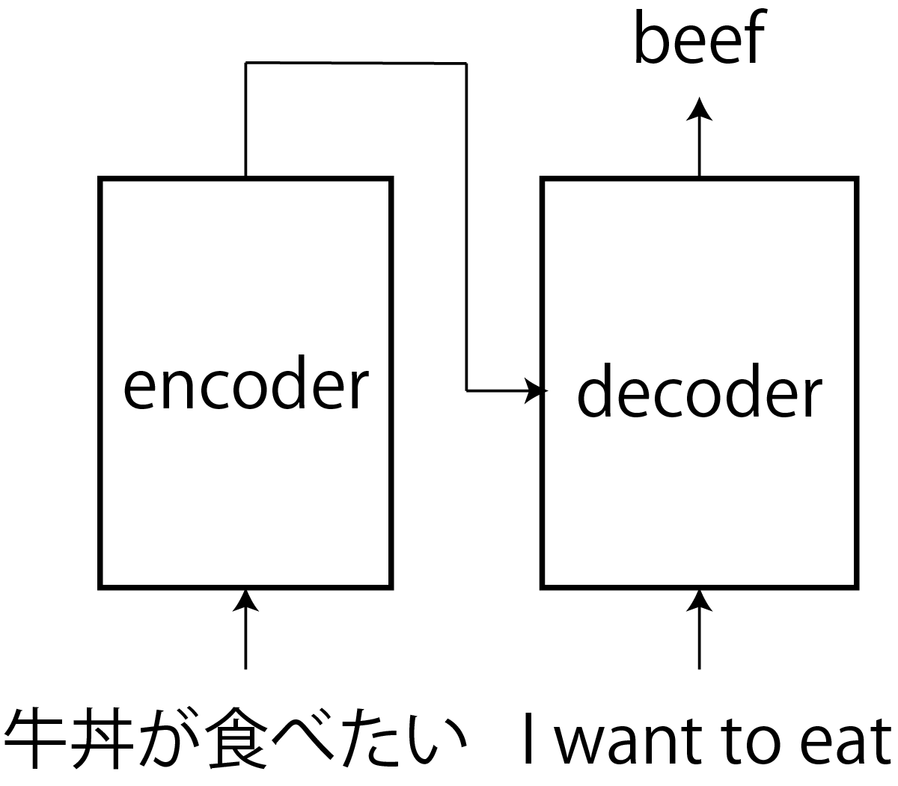

---

### 位置情報の追加

- エンコーダに入力する$E$の各トークンに、文章中での位置情報（位置符号）を付加
    - $H = \sqrt{D}E + P$
        - 位置情報: $P = [\boldsymbol{p}_1\ \boldsymbol{p}_2\ \dots\ \boldsymbol{p}_N]^\top$
- 位置情報のつけかた
    - オリジナルのTransformer: 固定値（次ページ）
    - 学習させる方法も

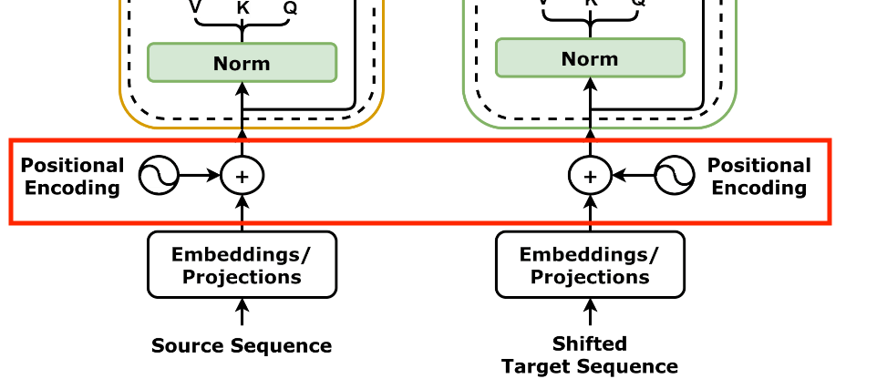

---

### オリジナルのTransformerの位置符号

- 位置情報: $P = [\boldsymbol{p}_1\ \boldsymbol{p}_2\ \dots\ \boldsymbol{p}_N]^\top$
    - $p_i = (p_{i,0} \quad p_{i,1} \quad \cdots \quad p_{i,D})^\top$
       - $p_{i,j} = \begin{cases}
            \sin ( i \beta^{-j/D})  & (i\%2 = 0) \\
            \cos ( i \beta^{-(j-1)/D}) & (i\%2 = 1) 
\end{cases}$
- 例
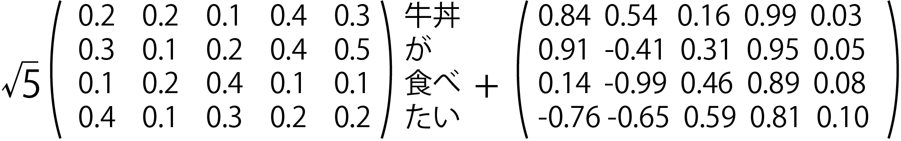
    - $\beta=10$。原著では$\beta = 10000$
- 内積をとると位置が近いほど値が大きい[[山田2023]](https://gihyo.jp/book/2023/978-4-297-13633-8)

---

### 文脈の考慮の必要性

- 必要な例
    - 例1: 「ガラス窓を割ったのは私です。」を英語に翻訳
        - "It's me who broke the ..."まで翻訳したとき、次に注目すべきは壊れるもの（=ガラス）
    - 例2: 右上の丸を月と認識させたい
- 既存の時系列情報や画像を扱うANNは苦手
    - 「近い位置にある=関連性が大きい」と捉えるので
        - 日本語と英語で語順が違っているので難しい
        - 丸が他の手がかりと離れていて難しい

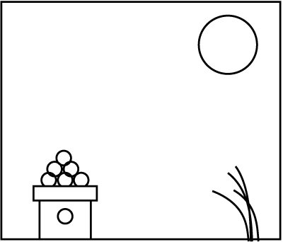

---

### 注意機構（attention機構）

- なにかを出力する際、文脈上、入力のどこに注目するかを
決める（決めるように訓練される）機構
    - glassを出力したい時にはbrokeやtheに注目
    - 丸が分からないので画像の別の特徴も注意して見る
- 注意機構の層がやること
    - 埋め込みを文脈に応じて変えて後段の層に伝達
        - ↑どうやって？（次ページ）

---

### キー・バリュー・クエリを使った注意機構

- クエリ: 問い合わせのこと
    - 例: 翻訳の例のIt's me who broke the
- キー・バリュー: データベース用語
    - キーに値をぶら下げるキーバリュー型データベースなどのたとえ
   -  翻訳前の言語の埋め込みから作成（そうでない場合もあるので次回くわしく）
- クエリにキーが反応して、対応するバリューに引きずられてベクトルの位置が変化
    - 例: クエリ中のbrokeと関連性が深い日本語の単語が反応し、brokeの重みを変更

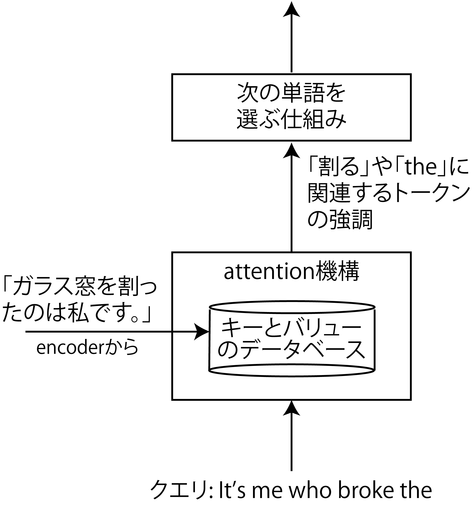

---

### 具体的な計算

- クエリ: $Q= W_\text{Q}H_\text{dec}$という行列
    - 以下、$W_\text{X}$は学習で獲得する行列
- キー: クエリに反応するトークンを選択
    - $K= W_\text{K}H_\text{enc}$を用意して$QK^\top$を計算
- バリュー: 重み付けの値
    - $V= W_\text{V}H_\text{enc}$
- 出力: Softmax$\Big(\dfrac{QK^\top}{\sqrt{D}}\Big)V$

そうしろと人間が言ってるわけではないが、こういう構造を用意してあげるとそういうふうに学習

---

## ここまでのまとめ

- 埋め込み
    - 次元の高いベクトルで、単語やトークンの様々な関係性を表現可能
    - skip-gramなどの学習方法で実用性のある埋め込みが作成可能
- Transformer
    - 一言でいうと、埋め込みに注意機構で文脈を反映させる仕組み
- 参考文献: [[菊田2025]](https://gihyo.jp/book/2025/978-4-297-15078-5)

---

## Transformer（翻訳用途）の構造

- エンコーダ、デコーダで構成される
    - 右図の左: エンコーダ
        - 入力: 翻訳前の文
        （例: これはペンです。）
    - 右図の右: デコーダ
        - 入力: 「翻訳開始」を表すトークンあるいは途中まで翻訳した文（例: This is）
        - 出力: 次の単語（例: a）

順に見ていきましょう

[画像: CC-BY-4.0 by dvgodoy](https://commons.wikimedia.org/wiki/File:Transformer,_full_architecture.png)

---

### エンコーダ

- 濃い黄色の枠が本体
    - 「Nx layers」: 何個も連結するということ
    - 詳しくは次のページ以降で
- 入力（図の下方）: $H_\text{enc} = \sqrt{D}E + P$
    - $E=[\boldsymbol{e}_{w_1}\ \boldsymbol{e}_{w_2}\ \dots\ \boldsymbol{e}_{w_N}]^\top$
        - 文（$D$次元ベクトルで表現されたトークンを並べたもの）
- 出力: デコーダでの仕事に応じて重みの変わった$H_\text{enc}'$
    - 文脈が反映されている

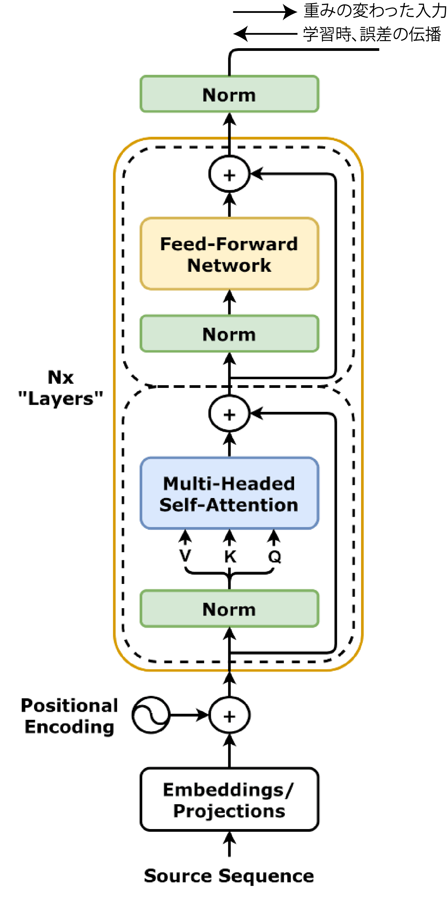

---

### 層正則化（layer normalization）

- 図中に3つある「Norm」
- 各ベクトル$\boldsymbol{h}=(h_1 \ h_2 \ \cdots \ h_D)^\top$の要素を正規化してベクトルごとの影響力を揃える
    - どう正規化するか？
        - 1: $h_{1:D}$の平均値が$0$、標準偏差が$1$に
        - 2: $h_i$ごとに$\gamma_i, \beta_i$（学習対象）というパラメータを用意して$\gamma_ih_i + \beta_i$に変換
            - 要素の位置ごとに重要度が異なるため

---

### 自己注意機構

- 自分自身の情報でトークンのベクトルを変える
    - 文脈が反映される（詳しくは次ページ）
- 仕組み: Q、K、Vをすべて自身への入力から作成
    - クエリ: $Q= W_\text{Q}H$$_\text{enc}$（前回は$H_\text{dec}$だった）
    - キー: $K= W_\text{K}H$$_\text{enc}$（同上）
    - バリュー: $V= W_\text{V}H_\text{enc}$
    - 出力: $H'=$Softmax$\Big(\dfrac{QK^\top}{\sqrt{D}}\Big)V$
- 前回の注意機構は交差注意機構

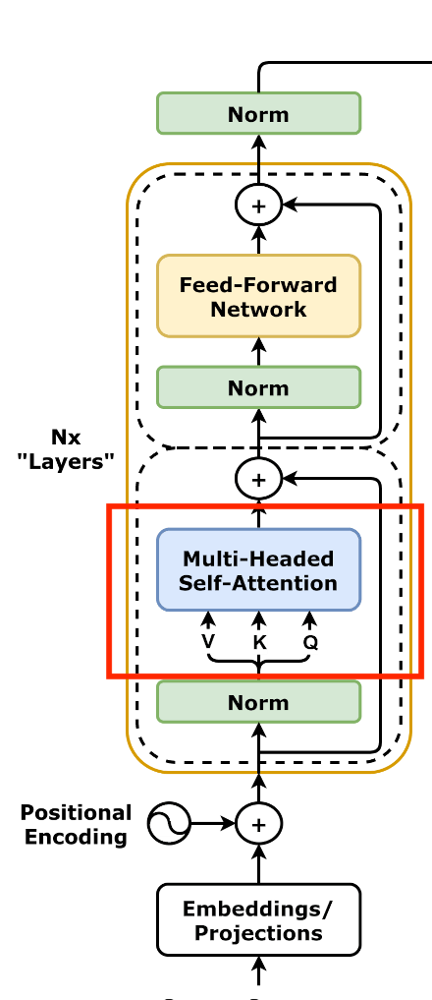

---

### 自己注意機構の補足[[Google2017]](https://research.google/blog/transformer-a-novel-neural-network-architecture-for-language-understanding/)

- 単に代名詞と名詞を関連づけるだけなら、
次の「it」は「dog」か「street」か分からない
    - 1: The animal didn't cross the street because it was too tired. 
        - it: dog
    - 2: The animal didn't cross the street because it was too wide.
        - it: street
- KVQ: クエリ（it）に対して、名詞だけではなく行列$K$で全てのトークンを作用させることで、itがどちらに近いかまでを計算可能に
    - "You shall know a word by the company it keeps!" [[Firth1957]](https://cs.brown.edu/courses/csci2952d/readings/lecture1-firth.pdf)（再掲）

---

### マルチヘッド注意機構

- Transformerの実装では注意機構が複数に分割される
    - $W_\text{K}, W_\text{V}, W_\text{Q}$（$D \times D$行列）が分割される
        - $Q^{(m)}= W_\text{Q}^{(m)}H$
        - $K^{(m)}= W_\text{K}^{(m)}H$
        - $V^{(m)}= W_\text{V}^{(m)}H\quad$（$m=1,2,\dots,M$）
            - $W_X^{(m)}$: $W_X$を横に切った$(D/M) \times D$行列
    - ANN的には、$m$ごとに結合が切れて独立
        - それぞれが文の解釈方法を変える
        （ように学習されるらしい）
- 出力の$Q^{(m)}, K^{(m)}, V^{(m)}$を結合$\rightarrow$元の$D \times D$行列に

---

### フィードフォワード層（全結合層）

- 自己注意機構を通った文が通される
    - 右図の2つの点線の枠のうち上のほう
    - 非線形な活性化関数（オリジナルはReLU）を通して特徴をより強調

---

### その他補足1

- 注意機構もフィードフォワード層もスキップ接続を使用
    - 各層で学習/出力されるのは差分
    - 学習初期に各層にわかりやすい入力をするため
        - 層が深いので必要
- 図に描かれていないがドロップアウト層
が何ヶ所かに使用されている
    - ドロップアウト: 学習の単位（バッチ）ごとに一定割合のニューロンを働かなくする処理
        - 特定のニューロンに特定の役割を背負わせないで過学習を防止

---

### その他補足2

- 活性化関数として、ReLUの代わりにGELU（Gaussian Error Linear Unit）が使用されることも
    - $h(x) = x\cdot \frac{1}{2}\big\{ 1 + \text{erf}(x/\sqrt{2})\big\}$
        - $\text{erf}(a) = \frac{2}{\sqrt{\pi}}\int_0^a e^{-t^2}\text{d}t$
    - 素直に微分可能

（[画像by Ringdongdang CC BY-SA 4.0](https://commons.wikimedia.org/wiki/File:ReLU_and_GELU.svg)）

---

### エンコーダのまとめ

- 次のような挙動を実現するように学習される
    - 文をトークンのベクトルを並べて位置の情報を加えた行列$H_\text{enc}$で受け取る
    - 自己注意機構と全結合層で$H$中の各ベクトルを文脈にあわせて操作
        - ↑繰り返し
    - 文脈の反映された$H'_\text{enc}$を出力
- 受け取る逆伝播誤差がどんなものかは
デコーダ側による

---

### デコーダ（とデーコーダの先）

- 本体は緑の枠内
    - 途中までの作文に対応する行列$H_\text{dec}$を受け取り
- デコーダの先に具体的な仕事をするためのANNが接続される
    - 翻訳の場合は次の単語を予測するための全結合層
    - デコーダはこの仕事がしやすいように$H_\text{dec}$を$H'_\text{dec}$に変更

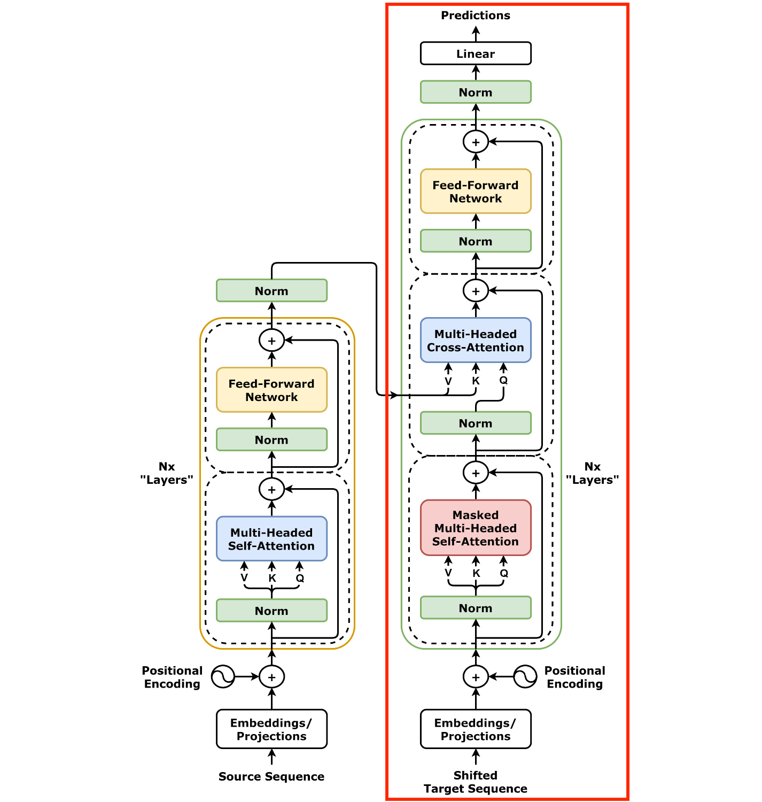

---

### デコーダの本体

- （自己注意機構+交差注意機構+フィードフォワード層）$\times N$
- 自己注意機構
    - 翻訳途中の文の文脈を考慮して$H_\text{dec}$を操作
    - 図中の「Masked」の意味: 文の後半にマスクをかける仕組み
        - 学習の際、完成された翻訳例が入力されてくるので必要に
        - 例: 「This is」の次を考える訓練をするときに、「This is a pen.」が入力されてくるので、$W_X$の「a pen」に対応する要素にマスク
- 交差注意機構
    - デコーダの出力$H'_\text{enc}$を反映

---

### デコーダの先

- 全結合層でデーコーダの入力の次の単語を予測
    - skip-gramのように学習可能
    - 出力は各トークンが次にくる確率
        - トークンの種類だけ次元がある
- この部分の誤差を逆伝播することで学習が進行
    - 損失関数: 交差エントロピー
        - $-\sum_{i=1}^{N_\text{token}} P(\boldsymbol{e}_i)\log Q(\boldsymbol{e}_i)$
        $= - \log Q(\boldsymbol{e}^*)$
            - $P$が正解で$Q$が出力
            - $\boldsymbol{e}^*$: 正解のトークン

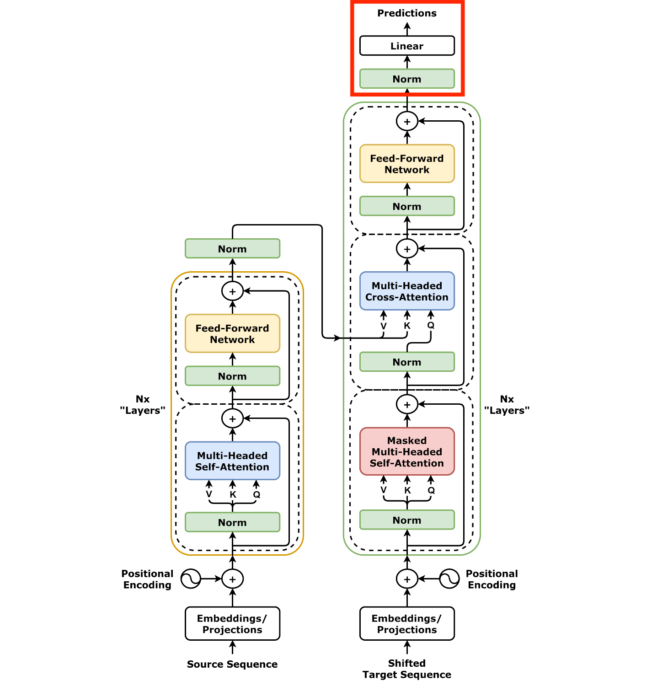

---

### Transformer（翻訳用途）の構造のまとめ

- 結局どんな問題を解いていたのか？$\rightarrow$こういう確率の問題
    - $\Pr\{$次に来る単語$|$翻訳前の文章$,\quad\!\!\!\!$翻訳途中の文章$\}$
- Transformerの工夫
    - 翻訳前の文章、翻訳途中の文章に位置情報を付加
    - 文脈の考慮
        - 翻訳前の文章から注目すべき箇所を自己注意機構で
        発見して埋め込みに反映（エンコーダ）
        - 翻訳途中の文章を自己注意機構にかけて文脈を考慮した上で、
        さらにエンコーダからの文脈を交差注意機構で反映

---

## Transformerの応用

- 感情分析
- 文章生成

（より高度なものは次回以降）

---

### Transformerエンコーダによる感情分析

- Transformerを分類タスクに応用することを考える
    - 入力: 文（例: 今日、100円を拾いました。）
    - 出力: 感情（楽しい、嬉しい、悲しいなど）
- エンコーダで構成可能[[中井2025]](https://gihyo.jp/book/2025/978-4-297-14972-7)
    - 文の先頭に`[CLS]`というトークン（クラストークン）を加えて学習
    - 学習すると出力のクラストークンに分析のための情報が集まるように
- Vision Transformerによる物体認識は基本この構造がこのまま使える（次回）

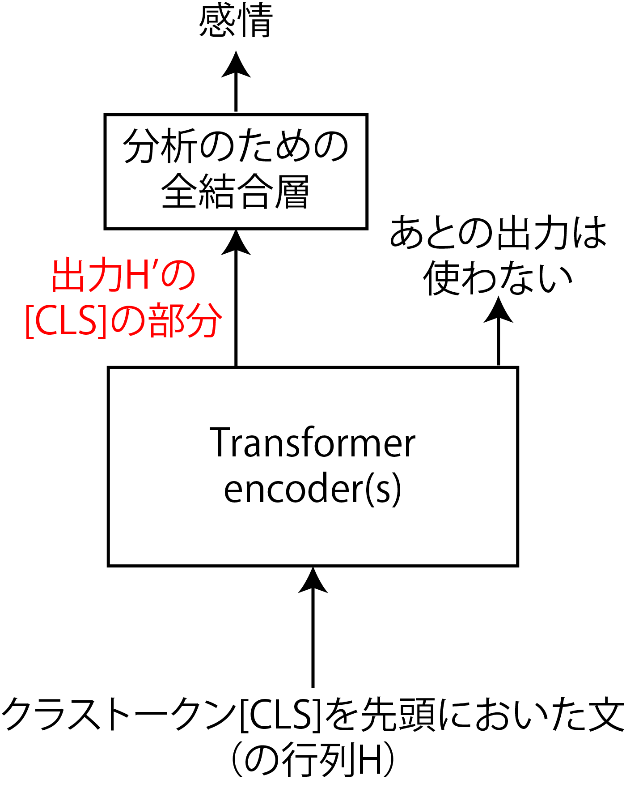

---

### Transformerエンコーダによる文章生成

こちらも[[中井2025]](https://gihyo.jp/book/2025/978-4-297-14972-7)から（4.3.2項）

- 右図の構成で訓練すると文章をランダムに生成していける
    - 文脈が考慮されているので、かなり自然な出力が得られる（内容が正しい保証はなにもなし）
- GPTはデコーダを使用（次回以降にやります）

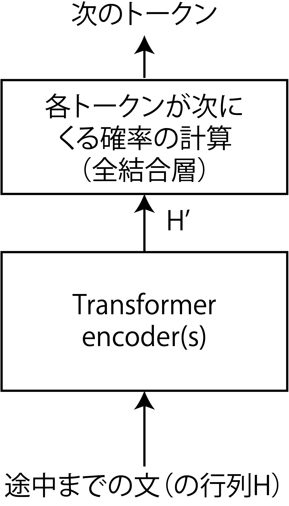

---

## まとめ

- Transformerエンコーダ
    - 埋め込みに文脈を反映
        - 位置情報の付加$\rightarrow$自己注意機構
- Transformerデコーダ
    - エンコーダの機能+交差注意機構で別の言語を文脈に反映可能
    - 学習の際にマスク
- その他の参考文献: [[菊田2025]](https://gihyo.jp/book/2025/978-4-297-15078-5)

