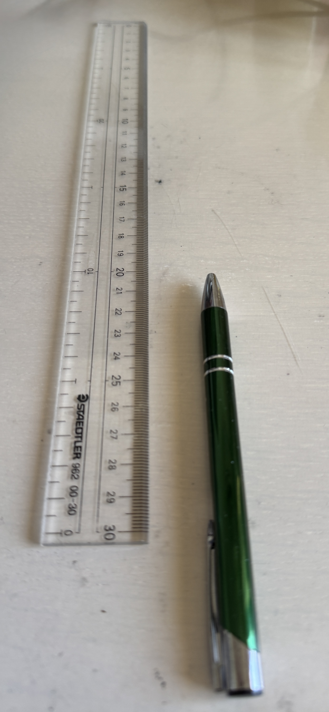
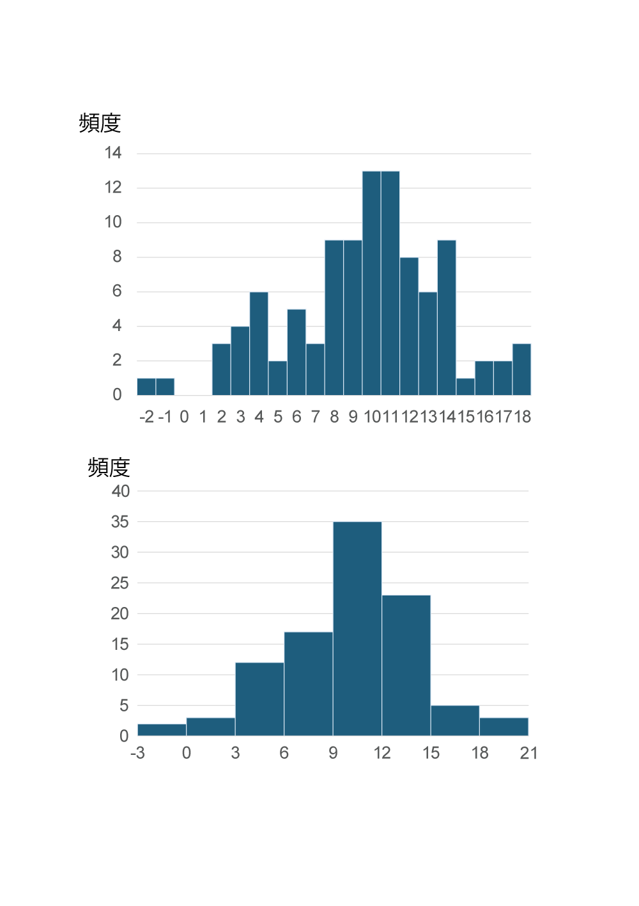
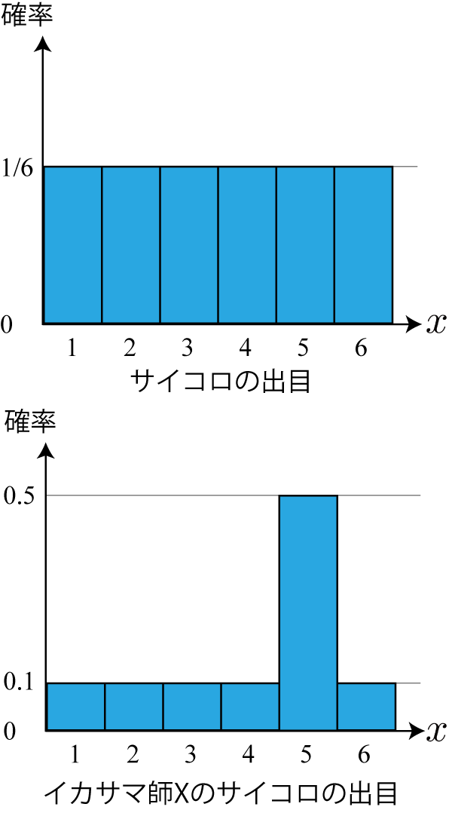
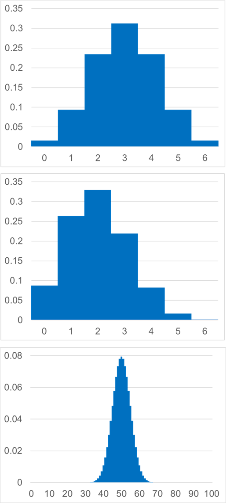
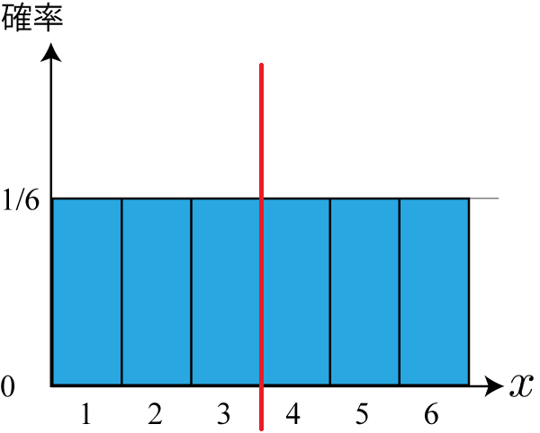
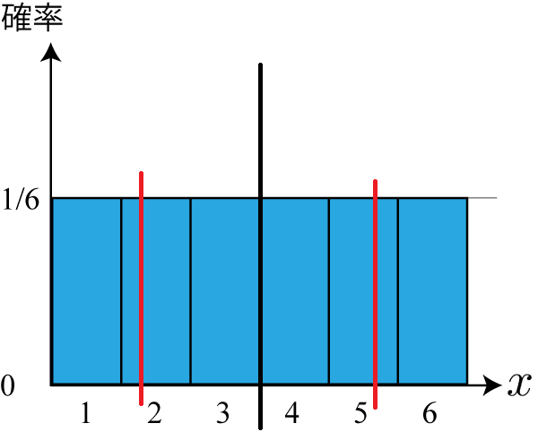
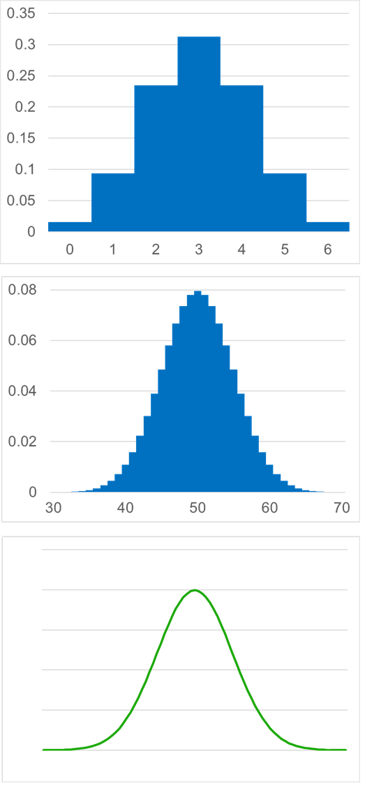
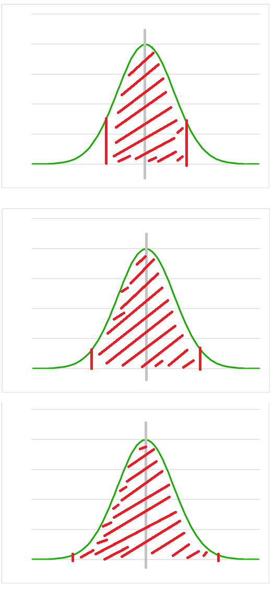

<!-- footer: "機械学習第2回" -->

# 機械学習

## 第2回: 確率統計の基礎

千葉工業大学 上田 隆一

 

This work is licensed under a [Creative Commons Attribution-ShareAlike 4.0 International License](https://creativecommons.org/licenses/by-sa/4.0/).

---

<!-- paginate: true -->

## 今日やること

- 期待値
- 様々な分布

---

## 期待値ってなに

---

### 期待値

- （雑な）定義: なにかばらつく値の平均値を推定、予想した値
    - 問題: 3700円を払い、サイコロの出目に1000をかけただけお金がかえってくるギャンブルがありますが、1回の試行で儲かるお金の期待値は？

---

### 答え

- $1000/6 + 1000\cdot 2/6 + 1000\cdot 3/6 + 1000\cdot 4/6$
$+ 1000 \cdot 5/6 + 1000 \cdot 6/6 - 3700 = 1000(3.5) - 3700$ $= -200$

---

### 意思決定における期待値の意義

- 何かを決めたらどれだけ見返りが戻ってくるかを数値（特にお金）で考えられる
- 例: 誰がボーリング大会の代表になるか決めるために、何ゲームかやって点数を記録しました。誰を選びましょう？
    - 結果
        - Aさん: 134, 93, 123, 110, 98
        - Bさん: 84, 78, 92, 210 
        - Cさん: 42, 138, 134, 99, 145 
    - 本当はもっとゲームをやりたい/最初から選考ルールを決めておきたかったのですが、諸事情があって無理でした。
        - ボーリングよりもマラソンやフィギュアスケートの代表選考にありがち

どうやって選びます？

---

### とりあえず統計で一番基本的な「平均値」で考える

- 平均値: 各数値を足して数値の個数で割ったもの
    * A: 111.6
    * B: 116
    * C: 111.6
        * 一番いいBさんに決定！・・・でいいのか？？？

- 全ゲームのスコア（再掲）
    - A: 134, 93, 123, 110, 98
    - B: 84, 78, 92, 210
    - C: 42, 138, 134, 99, 145

---

### 「中央値」だとどうでしょう？

- 中央値: 数値を小さい/大きい順に並べたときに中央に来る値
  （数値の数が偶数のときは中央の2個の平均値とする）
    * A: 93, 98, 110, 123, 134 -> 110
    * B: 78, 84, 92, 210 -> 88
    * C: 42, 99, 134, 138, 145 -> 134
        * 選ばれる人が変わる
        （こっちのほうが良さそうだけどそれでいいのかな？）
- 全ゲームのスコア（再掲）
    - Aさん: 134, 93, 123, 110, 98
    - Bさん: 84, 78, 92, 210
    - Cさん: 42, 138, 134, 99, 145

---

### 賞金を基準に考えてみる

- 200点とれれば優勝確実、130点とれれば入賞確実だとしましょう
- 次の2つのケースで考えてみましょう
    - ケース1: 優勝賞金10万円、2位以下で入賞の場合5万円
    - ケース2: 優勝賞金10万円、2位以下で入賞の場合1万円
- 再掲
    - Aさん: 134, 93, 123, 110, 98
    - Bさん: 84, 78, 92, 210
    - Cさん: 42, 138, 134, 99, 145

---

### 期待値の計算

- 再掲
    - ケース1: 優勝賞金10万円、2位以下で入賞の場合5万円
    - ケース2: 優勝賞金10万円、2位以下で入賞の場合1万円

|確率|ケース1|ケース2|
|:--:|:----:|:----:|
|Aさん: ほぼ1/5の確率で入賞 | $1/5\times \ \ 50,000 = 10,000$円 | $\ \ 2,000$円|
|Bさん: ほぼ1/4の確率で優勝 | $1/4\times 100,000 = 25,000$円 | $25,000$円|
|Cさん: ほぼ3/5の確率で入賞 | $3/5\times \ \ 50,000 = 30,000$円 | $\ \ 6,000$円 |

（当然ながら）賞金で選考基準が変化

---

### これまでのまとめ

- 結局、なにか見返りを考えないと判断の優劣は決められない
    - 期待値はその基本
    - ただし万能ではない
        - [宝くじの例](https://b.ueda.tech/?page=robot_and_stats_questions#%E5%AE%9D%E3%81%8F%E3%81%98)
- 補足
    - 代表値: 平均値や中央値など、データを説明するために1つだけに集計した値

---

### 期待値の計算

- 基本
    - 事象A, B, C, ..., Eが互いに排反で、A〜Eでない事象の起こる確率が0とすると
    - 期待値 = $\text{Pr}\{\text{A}\}f(\text{A}) + \text{Pr}\{\text{B}\}f(\text{B}) + \cdots \text{Pr}\{\text{E}\}f(\text{E})$
        - $f$が、なにか事象にたいしてお金などを決める関数
    - 数式で書くとややこしいけど、さっきのお金の計算を思い出しましょう
        - [問題](https://b.ueda.tech/?page=robot_and_stats_questions#%E6%9C%9F%E5%BE%85%E5%80%A4%E3%81%AE%E5%BC%8F)（「上の問題」というのはp.12の問題）
- 平均値も期待値
    - $f$を何にするとよいでしょうか？
- 他、計算上の様々な性質、テクニックがありますがそれはまた今度

---

### 時間が余ったときの問題

- [3つのサイコロのうち2つ以上が揃う確率](https://b.ueda.tech/?page=robot_and_stats_questions#%E7%A2%BA%E7%8E%87%E3%81%AE%E9%9B%91%E5%A4%9A%E3%81%AA%E5%95%8F%E9%A1%8C1)
- 上の問題について、3つのサイコロが揃うと1万円、2つのサイコロが揃うと千円もらえるとしたら、掛け金はいくらまで支払いますか?

---

## 様々な分布

---

### 実験

1. ノートか定規を用意
    - ノートの場合は1, 2, 3, 4, 5, ....と罫線に数字を書く
2. 以下を繰り返す
    - ペンを右の写真のようにセット
    - 指で根本を弾いてペン先の位置を記録（四捨五入で）
- なにか傾向が出てくるまでやってみる

---

### 結果の例

- 講師が10を狙って100回試行した結果
- 疑問
    - こういう傾向をどう数学で扱う？
    - なんでこういう形になるんだろう？

---

### 確率分布

- どの事象がどの確率で起こるかをモデル化したもの
    - 数式で表したり、右のように図にしたり
- 確率分布の作り方
    - 前ページのような試行に数式を当てはめる
    - サイコロの話の際、右図のような前提を置く
- 用途の例
    - コンピュータに読み込んで計算、分析に使用
    - 前回、前々回のボウリングの結果になにか数式を当てはめて一般化
    - シミュレーション
    - ・・・

---

### 確率分布を定義するときのルール

- 互いに排反な事象を、抜けなく順番に番号（確率変数、小数も可）をつけて並べた横軸を用意
    - 例1: サイコロの場合
        - 事象「$x$が出る$(x=1, 2, \dots, 6)$」の$x$を確率変数に
        - 「奇数が出る」等の事象は確率変数にならない
    - 例2: コインの場合
        - 表が0、裏が1（0や1にする必然性はない）
- 記号では$P(x)$と表す
    - $\text{Pr}\{X\}$との違いはなんでしょう？

---

### もうひとつの疑問: なんで山型に？

議論してみましょう

* 狙ったところにいかない個別の理由はたくさんある
    - 具体的な理由が気になるけどここでは取り上げません
* 個別ではなく全体の理由
    - 例えば10個の理由A, B, C, ..., Jがあるとして、その理由で発生する誤差を$e_\text{A}, e_\text{B}, ..., e_\text{J}$とする
    - これらの誤差が一斉に正、あるいは負になると大きな誤差が出るけど、そんな偶然が起こる確率は低い
    → 必然的に真ん中に山ができる

---

### 二項分布

- 前ページの現象を説明する確率分布
- コインを$n$枚投げたときに表が$m$枚出る確率
    - 前ページの「誤差が正、負になる」がコインの裏表に相当
    - 表の出る確率を$p$と一般化して計算してみましょう
        - 残念ながら加法定理、乗法定理で分解する方法では
        計算が難しいので原理からどうぞ
- 一般化した数式を考えるのが苦手な人は、
コインを6枚なげて表が$m$枚出る確率を計算のこと

---

### 二項分布の式

- 考え方
    - $n$枚のコインを1枚ずつ投げて、$m$個のコインで表が出る場合の数: $_nC_m$
        - $_nC_m = \dfrac{n!}{(n-m)!m!}$
    - 上記の場合について、ひとつひとつの並びが出る確率: $p^m (1-p)^{n-m}$
    - ひとつひとつの並びが出る事象は互いに排反なので、$p^m (1-p)^{n-m}$を$_nC_m$個かけると求める確率になる
- 上記の考え方で求まる式: $P(m | n, p) =_n\!\!C_m p^m (1-p)^{n-m}$
    - 分布全体は$B(n, p)$と表す

---

### 二項分布の形

- $P(m | n, p) =_n\!\!C_m p^m (1-p)^{n-m}$を絵に描いてみましょう
    - 再掲: $_nC_m = \dfrac{n!}{(n-m)!m!}$
    - $n$は適当にえらんでください
    - 例は次のページ

---

### 二項分布の形の例

- 例
    - 上: $P(m | n=6, p=1/2)$
    - 中: $P(m | n=6, p=1/3)$
        - 表が出にくいので分布が左に寄る
    - 下: $P(m | n=100, p=1/2)$
        - 形状がなめらかに
        - 「すべて表」、「すべて裏」などが滅多に起こらないことが分かる
    - 問題: 100円かけて100枚のコインを投げてすべて表が出たら1億円もらえるとしたら賭けに参加しますか？

---

### 分布と平均値・分散

- 分布の形状には様々な特徴が存在
    - 中心がどこにあるか/どれだけ横に広いか/いくつ山があるか/山がどれだけ鋭いか・・・
- 分布をあらわす重要な数値
    - 平均値: 中心がどこにあるか
    - 分散: どれだけ横に広いか

---

### 分布の平均値

- $P(x)$の平均値: $x$の期待値
    - 例: さいころの目
        * $1 \cdot 1/6 + 2 \cdot 1/6 + \cdots + 6 \cdot 1/6 = 3.5$
- ついでに1: 分布$P(x)$にしたがう$x$の期待値の表記法
    - $\langle x \rangle_P$と書いたり$E_P( x )$と書いたり
        - この資料では前者を使います
- ついでに2: 右のようにある範囲でどこも確率が同じ分布を一様分布と呼びます
        - $U(a,b)$と表記（$a$から$b$までの範囲に確率）

---

### 分布の分散

- 平均値と各値との差の2乗の期待値
    - 例: さいころの目
        * $(1-3.5)^2 \cdot 1/6 + 
        (2-3.5)^2 \cdot 1/6 + 
        (3-3.5)^2 \cdot 1/6$
        $+ (4-3.5)^2 \cdot 1/6 + 
        (5-3.5)^2 \cdot 1/6 + 
        (6-3.5)^2 \cdot 1/6$
        $=$計算が大変
        * $\langle ( x - 3.5)^2 \rangle_P = \langle x^2 -7x + (3.5)^2 \rangle_P$
        $= \langle x^2 \rangle_P -7 \langle x \rangle_P + (3.5)^2 = \langle x^2 \rangle_P -7 \cdot 3.5 + (3.5)^2$
        $= \langle x^2 \rangle_P - (3.5)^2 = \dfrac{1+4+9+16+25+36}{6} -\dfrac{49}{4}$
        $= \dfrac{91}{6} - \dfrac{49}{4} = \dfrac{35}{12}$
- 数字の意味はよくわからない（もとの量を2乗しているため）

---

### 分布の標準偏差

- 標準偏差
    - 分散の正の平方根
    - どれくらい分布が広いかを直感的につかむときに使用
    - サイコロの場合（計算してみましょう）
        * $\sqrt{\langle ( x - 3.5)^2 \rangle_P} = \sqrt{\dfrac{35}{12}} \approx 1.7$
        - 右図の範囲
- 「どれだけ広いか」なら「3」でよくない？
    - それでもよいが、すそのの広い（無限な）分布を扱うときは標準偏差が便利

---

### データの分散と標準偏差

- 分布ではなくデータ$x_1, x_2, \dots, x_n$の分散を求めるときの式
    - $s^2 = \dfrac{1}{n-1}\sum_{i=1}^n (x_i - \bar{x})^2$
        - $\bar{x}$: データの平均値
        - なぜ$n$でなく$n-1$で割るかの大雑把な説明: 平均値をデータ自身から求めており
            - $n$が小さいともっとデータが多い場合の平均値から少しバラつくから、その分だけ値が大きくなる
            - くわしくは「ロボットの確率・統計」に
- 標準偏差は$s^2$の平方根

---

### 計算してみましょう

- データ: 2, 3, 1, 5, 4
    * 答え: 平均値が3なので
        * 分散: $s^2=\{(2-3)^2+(3-3)^2+(1-3)^2+(5-3)^2+(4-3)^2\}/4$
        $=(1+4+4+1)/4=2.5$
        * 標準偏差: $s=\sqrt{2.5}\approx1.58$

---

### ガウス分布（正規分布）

- ペンの例は頻度を10mm、30mm区切りで考えていたけど長さは本来は小数（実数）
    - 二項分布は変数が整数だったけど、
    実数は扱えるのだろうか？（無理）
- 二項分布の$n$を増やしていくとどんなことになるだろうか？
    - ガウス分布に
        - 右下図のような形状に
        - 表裏が出る確率$p$の値にはよらないらしい（講師は未検証です）

---

### ガウス分布の式

- $p(z | \mu, \sigma^2 ) = \frac{1}{\sqrt{2\pi}\sigma} e^{ - \frac{(z - \mu)^2}{2\sigma^2}} = \frac{1}{\sqrt{2\pi}\sigma} \exp\left\{ - \frac{(z - \mu)^2}{2\sigma^2}\right\} = \eta \exp\left\{ - \frac{(z - \mu)^2}{2\sigma^2}\right\}$
   - $\mu$: 平均値、$\sigma$: 標準偏差
   - $e^{...}$と$\exp\{...\}$は同じ意味です。
   - $\eta$: 分布の形に関係がないので定数としていい部分を表す
- $e = 2.718...$なので適当に$\mu, \sigma$に数値を入れて図を描いてみましょう
- 縦軸の数値は確率ではなく確率の密度
    - 今日は疲れていると思うのでまた後日

---

### ガウス分布が出現する場面

- 2項分布とおなじく、不特定多数の原因でなにかの数値がばらつくときに出現
    - 様々な状況で出現
- 例
    - 身長、体重
    - 冒頭のペンの実験（「1cmごと」など範囲ごとではなく、ものさしの値を実数でそのまま集計するとしたがう）
    - ロボットのセンサの出力
    - ・・・（考えてみましょう）

---

### ガウス分布と標準偏差

- ガウス分布では、平均値$\mu$、標準偏差$\sigma$の値にかかわらず、
$\mu \pm n\sigma$の範囲に含まれるデータの割合は決まっている
    - $n=1$: $68.3$%（だいたい7割）
    - $n=2$: $95.5$%
    - $n=3$: $99.7$%（1000に3つ外れる）
- 感覚として持っておくと良い

---

## まとめ

- 前半: 期待値について考えた
    - 機械学習も「期待値を最大化する」ことでどんどん賢くなる
    - 余談: 期待値最大化で人は幸せになれるか？
        - 問題が複雑なので、ひとつのことを最大化すると他が犠牲になりがち（たぶん）
- 後半: ばらつくデータについて考えた
    - 山型にばらつく理由を考察
    - 二項分布、ガウス分布
        - 様々なものが自然に従うという意味で重要
    - 分布の平均値、分散、標準偏差

