<!-- footer: "機械学習第8回" -->

# 機械学習

## 第9回: 画像と人工ニューラルネットワークI

千葉工業大学 上田 隆一

 

This work is licensed under a [Creative Commons Attribution-ShareAlike 4.0 International License](https://creativecommons.org/licenses/by-sa/4.0/).

---

<!-- paginate: true -->

## 今日やること

- CNN
- U-Net
- オートエンコーダ
- 敵対的生成ネットワーク（GAN）
- 変分オートエンコーダ（VAE）
- 拡散モデル（DDPM）
- GAN、VAEの応用

---

## そのまえに問題

- 問題: デジタル画像の犬と猫（とそれ以外）を識別する人工ニューラルネットワークはどう組むといいでしょうか?
    - 人工ニューラルネットワークを関数とみなす
    - 入出力、パラメータはどう表現しますか?

---

### 答えの例1

- $\boldsymbol{y} = \boldsymbol{f}(\boldsymbol{x} | \boldsymbol{w})$
    - $\boldsymbol{x}$: 画素の値を並べたベクトル（すごく多次元）
        - 次元: 縦の画素数$\times$横の画素数$\times$色のチャンネル（RGB: 3、RGBD: 4）
    - $\boldsymbol{y} = ($猫の場合1$,$ 犬の場合1$,$ それ以外の場合1$)$
        - 要素が1つだけ1になるので「ワンホットベクトル」と呼ばれる
    - $\boldsymbol{w}$: パラメータ（これもたくさん）

問題: 微妙なときに言い切っちゃっていいの？

---

### 答えの例3

- $\boldsymbol{y} = \boldsymbol{f}(\boldsymbol{x} | \boldsymbol{w})$
    - $\boldsymbol{x}$、$\boldsymbol{w}$: 同じ
    - $\boldsymbol{y} = (P_\text{猫}, P_\text{犬}, P_\text{それ以外})$
        - $\boldsymbol{y}$は確率分布
- 識別用のANNの出力はこの形式が一般的
    - ひとつに決めたければ確率最大のものを選択

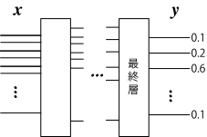

---

## もうひとつ問題

- 学習のときの損失関数はどうする？
    - 前ページの例3で考えてみましょう
    - 出力: $\boldsymbol{y} = (\hat{P}_1, \hat{P}_2, \dots, \hat{P}_N)$
    - 正解: $\boldsymbol{y}^* = (P_1, P_2, \dots, P_N)$
        - 正解については、正解に対応する要素$=1$のワンホットベクトルになることが多い

---

### 一般的な答え

- 交差エントロピーを使用
   - $\mathcal{L}(\boldsymbol{w}) = H(\boldsymbol{y}^*, \boldsymbol{y}) = -\sum_{i=1}^N P_i \log \hat{P}_i$
       - $\log$は自然対数（底が$e$）
   - 数学好きな人への補足: カルバック・ライブラー情報量を最小化するのと等価
- 正解に対する確率が高い場合（例: $0.9$）と低い場合（例: $0.1$）について計算してみましょう
    - 答えは省略
- $\mathcal{L}$の値（損失）が$0$に近づくように$\boldsymbol{w}$を調整していくことがANNの学習の本質

---

### 以前から触れていた話題

- 動物は視覚をどう行動や判断に必要な情報に変えているか
- それをコンピュータで再現できるか

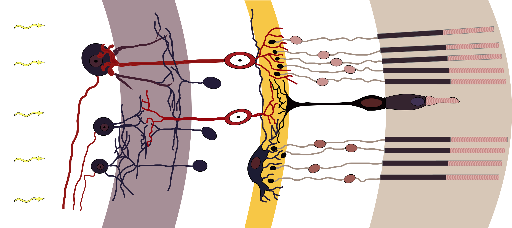（https://commons.wikimedia.org/wiki/File:Retina-diagram.svg, by S. R. Y. Cajal and Chrkl, CC-BY-SA 3.0）

人工ニューラルネットワーク（ANN）でできる?$\rightarrow$できる

---

### もうひとつの話題: なんか自動で絵を描くやつが出現

- 実例は世の中に氾濫しているので各自調査を
- こいつらはどういう仕組み?

---

## 視覚・画像とANN（CNN）

- 映像、画像の特性に特化したANNが存在
    - 画像の特性
       - 2次元（深度があれば3次元、動画でも時間軸を入れると3次元）
       - ある画素の周囲に似た画素がある
- おさらい: ディジタル画像
    - 平面が格子状に分割されて、数字の大小で色の濃さが表される
    （例: 右図。数字はてきとう）
    - カラーの場合はR、G、Bそれぞれについて格子状の数値データ

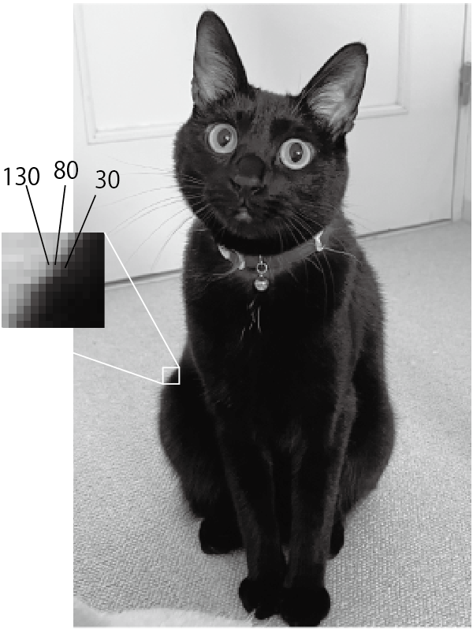

---

### 画像認識の難しさ

- 同じものが大きく写ったり小さく写ったり回転して写ったり
- 変形したり抽象化されたりデフォルメされたり

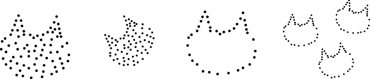

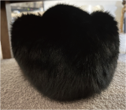

---

### CNN（convolutional neural network）

- テレビ局ではないです
- convolutional: 「畳み込みの」
-  画像の近いところの画素値を入力して
出力するニューロンを多用（右図）
    - 画像の近いところ: $n\times n$画素の正方形領域
    - 小領域の画素の特徴や変化を出力
    - さらに下の層でも畳み込みすることで全体の特徴を捕捉
- 「畳み込み層」と他の層の組み合わせで画像を処理

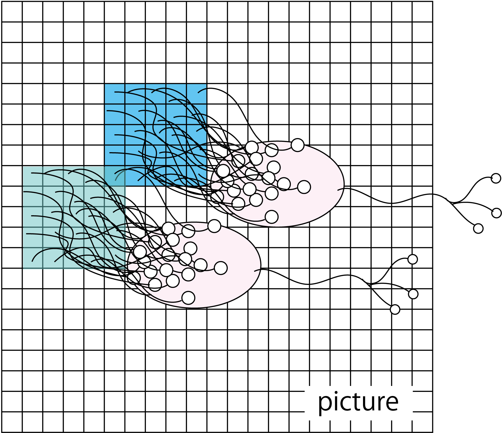

---

### CNNの部品1: 畳み込み層

- 画像の一部（n$\times$n画素の「窓」）領域にフィルタをかけて出力を足し、ひとつの値に置き換えて下流に送る（右上図）
- フィルタを1つずつずらして適用（右下図）$\rightarrow$下流も画像に
    - 下流の画素数を変えたくない場合$\rightarrow$縁をパディング
    - 2つ以上ずらすこともあり（ずらす量のことをストライドという）
- 畳み込みの演算（下図）
    - $\odot$: アダマール積（要素ごとに掛け算）

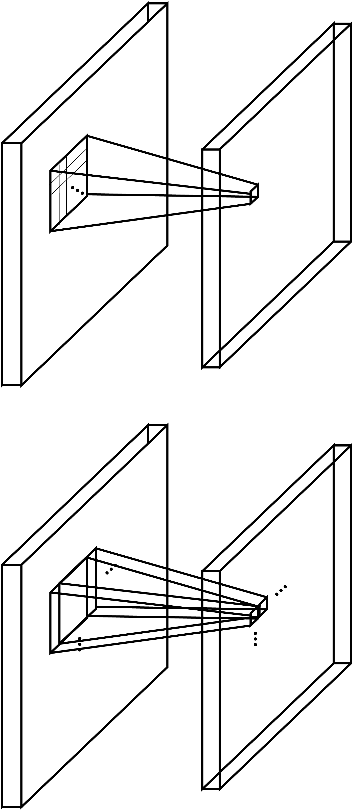

$\qquad\qquad$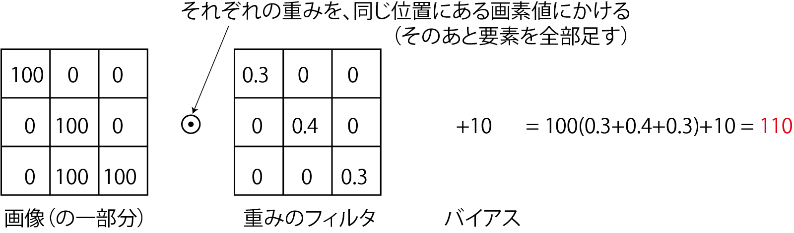

--- 

### フィルタの意味

- フィルタ: 従来の画像処理に使われてきたものと同じ
    - 局所的な特徴（エッジなど）を検出
    - 畳み込み層の学習=フィルタの学習
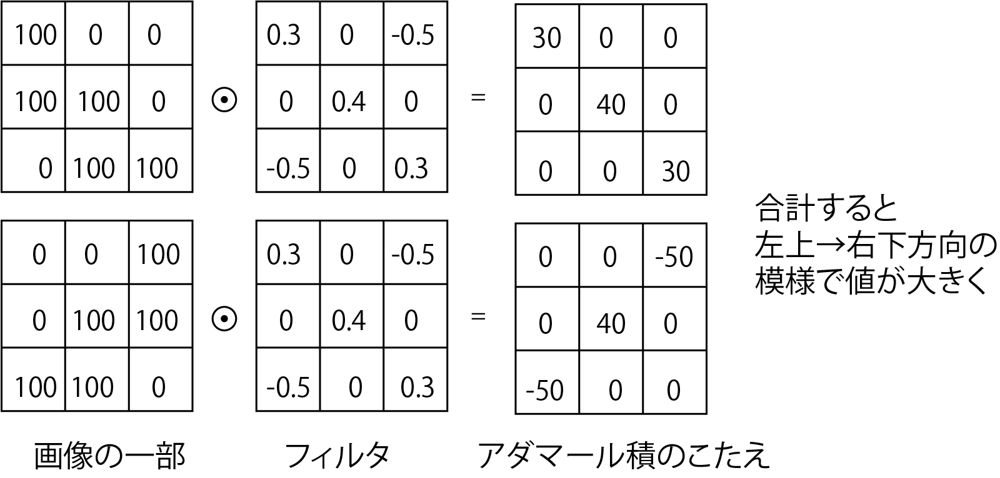

---

### フィルタの計算式

- $y = \sum_{i=1}^n\sum_{j=1}^n w_{(i,j)}x_{(i,j)} + b$
    - $(i,j)$: フィルタの座標系での画素の位置
    - $x_{(i,j)}$: 画素の値
    - $w_{(i,j)}$: 重み（学習対象）
    - $b$: バイアス（学習対象）
        - 前回までは$-b$だったが同じこと
- 2次元になっただけでこれまでと同じ
    - ただし「全結合」ではない
    - アフィン層（+活性化関数層）のことを「全結合層」ということがある

---

### CNNの部品2: プーリング層（サブサンプリング層） 

- 窓のなかで特徴の高い画素だけを残して画素数を減らす層
    - 最大値を残す「maxプーリング」が主に使われる
- 学習はしない
- 画素が減って後段（ものを分類するネットワーク）が学習しやすく
- 写ってる物体の位置のズレに少し強くなる
    - 冒頭の「難しさ」についてはCNNではそんなに解決できてないので学習で様々な大きさ、位置、向きの画像を使う

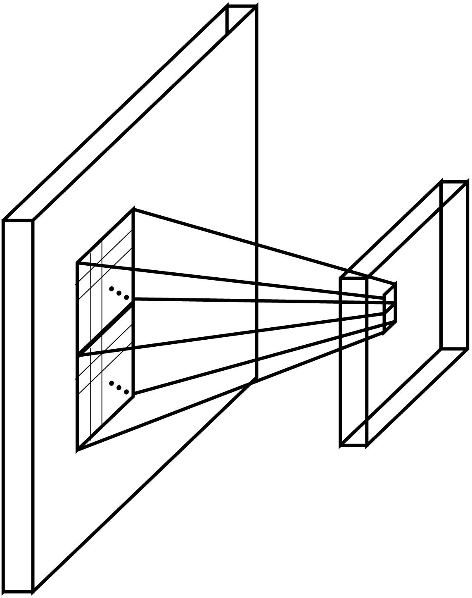

---

### CNNの部品3: ソフトマックス層
（注意: CNN以外にも使われます）

- softmax（softな最大値）: 1つに決めないということ
- 使用例: 画像に映ったものを判別
    - 答えを断定せず確率で出力（例: 犬90%、猫9%、他1%）
    - 実世界は微妙な場面が多いので、1つに決めないで曖昧に出力したほうが都合よい
- 数式
    - 入力$\boldsymbol{x} = (x_1, x_2, \dots, x_n)$に対し$y_i = \eta e^{x_i}$を出力
        - $\eta$は正規化定数

---

### チャンネル

- カラー（RGB）画像を扱う場合
    - 画素の縦横方向の他に3つの「チャンネル」を持つ
        - 画素ごとにベクトルがあると考えても良い
    - RGBそれぞれにフィルタを用意すると出力も3chに
- 1つのチャンネルに複数のフィルタも適用可能
    - 下図[LeNet[LeCun1989]](https://direct.mit.edu/neco/article-abstract/1/4/541/5515/Backpropagation-Applied-to-Handwritten-Zip-Code)の構造（画像: Zhang et al. [CC BY-SA 4.0](https://creativecommons.org/licenses/by-sa/4.0/)）
        - 画像から手書きの数字を識別するCNN（1ch $\rightarrow$ 6ch $\rightarrow$ 16ch）
            

---

### 代表的なCNN

- LeNet: 前ページの構成で手書き文字を識別
    - 畳み込み・プーリング$\rightarrow$全結合層
        - シグモイド関数を活性化関数に使用
- AlexNet: 畳み込みを5層に深く
    - 右図: LeNet（左）とAlexNet（右）の比較
    - LeRUを活性化関数に使用
    - 1000種類の識別
    - [AlexNetの論文](https://proceedings.neurips.cc/paper_files/paper/2012/file/c399862d3b9d6b76c8436e924a68c45b-Paper.pdf)
        - 学習した中間層や認識結果が見られる

<a style="font-size:70%" href="https://commons.wikimedia.org/wiki/File:AlexNet_block_diagram.svg">右図: Zhang et al., CC BY-SA 4.0</a>

---

### CNNのまとめ

- 畳み込み層で模様の特徴を抽出
- LeNet、AlexNet: 画像から物体を識別 
    - CNNにはさらなる用途が

---

## U-Netと潜在空間

- U-Net: CNNの後ろに逆向きのCNNをつけたもの
    - 当初の用途: セグメンテーション
        - 画像に写っているものごとに画像の領域を分割
        （右図: [[三上他 2022]](https://www.jstage.jst.go.jp/article/jrsj/40/2/40_40_143/_article/-char/ja)）
- 「逆向きのCNN」
    - 「転置畳み込み（後から説明）」という操作で画像を大きくしていく（構造は次ページ）

---

### U-Netの構造

- 左半分: CNN（物体の識別のような処理）
- 右半分: 逆向きのCNN（識別結果からの画像の構築）
- スキップ接続を使用
    - 途中で次元が落ちているので単なる差分学習以上の意味

<a style="font-size:70%" href="https://commons.wikimedia.org/wiki/File:Example_architecture_of_U-Net_for_producing_k_256-by-256_image_masks_for_a_256-by-256_RGB_image.png">画像: Mehrdad Yazdani, CC BY-SA 4.0</a>

---

### 転置畳み込み

- 画像の解像度を上げる操作
    - 画像をパディングして大きくし、フィルタを適用$\rightarrow$画像が大きく
    - この操作とスキップ接続で得た元の画像の情報からセグメンテーション
- U-Netについての説明はこれで終わりだが、単にセグメンテーションができる以上にこの構造は重要

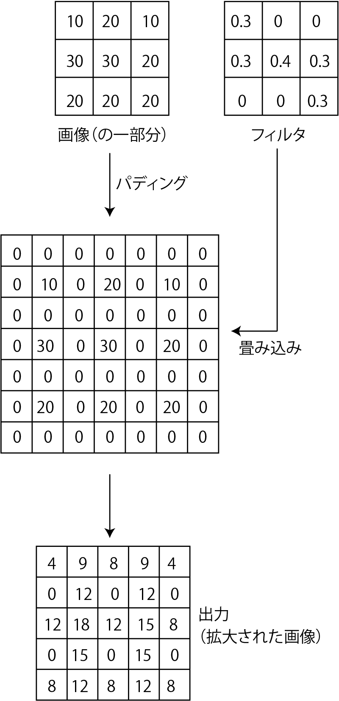

---

## オートエンコーダと潜在空間

---

### オートエンコーダ

- 入力と出力を一致させるように学習されたANN [[Hinton 2006]](chrome-extension://efaidnbmnnnibpcajpcglclefindmkaj/https://www.cs.toronto.edu/~hinton/absps/science.pdf)
    - 損失関数: 入出力の平均二乗誤差（MSE, mean square error）
        - 学習のためのラベル付けは不要（教師無し）
    - 構成はCNNでも全結合でもよいが、U-Net状に中間の次元を小さく
        - 入力側: どんどん情報を落としていく
        - 出力側: どんどん情報を増やしていく
    - 疑問: 何の意味があるの？
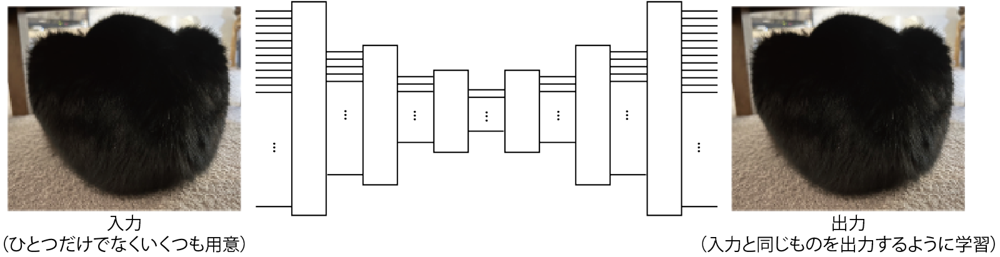

---

### 入力側（エンコーダ）のやっていること

- 入力されたデータの分類
    - （学習がうまくいった場合は）似たような画像から似たような出力が得られる
    - うしろに全結合層（とソフトマックス層）をくっつけて追加で学習させると分類器に
- 右図の例: 出力を2次元まで縮小した場合の
出力の分布の例
（注意: 実用的なものはもっと高次元）
    - 分布している空間を潜在空間と言う

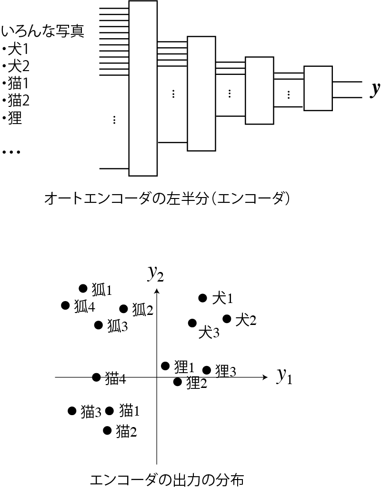

---

### 出力側（デコーダ）のやっていること

- 潜在空間のベクトルからデータを復元
    - 例: 「犬」のベクトルが来たら犬の写真や絵を描画
    - 復元方法（絵の描き方）を学習
        - 転置畳み込みのフィルタなどのパラメータに
    - 復元しやすいようにエンコーダ側が学習される
        - 潜在空間でのベクトルの分布が決まる

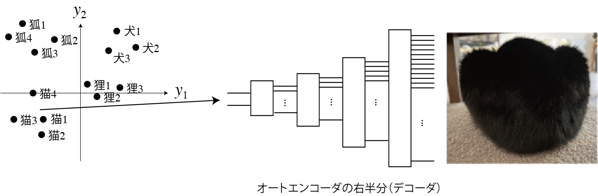

---

### オートエンコーダの利用

- エンコーダとデコーダを分離して利用
- エンコーダ
    - 先に前結合層などを取り付けて分類器に
    - 先に別のデコーダを取り付けると別のものが生成される
- デコーダ
    - 学習に用いたもの以外のエンコーダを取り付けると変換器に
        - 例「犬」と入力$\rightarrow$犬の絵を生成

ちまたで生成AIと言われるものの原型

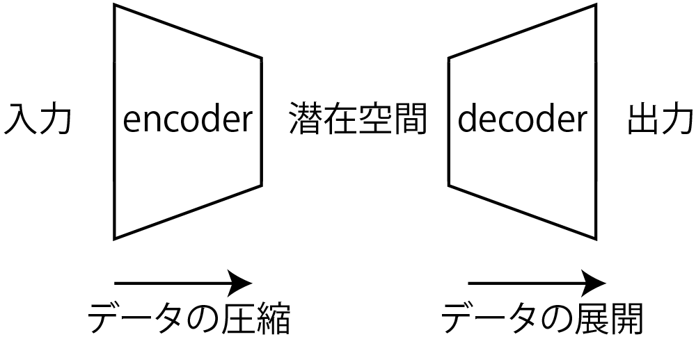

---

## まとめ

- CNNからオートエンコーダまで学習
    - 画像の識別から生成までの流れを見てきた
        - CNNによる物体の識別: エンコーダ+識別器
        - U-Netによるセグメンテーション: オートエンコーダに似た構造
    - 次回以降にいくつかの応用
        - 台形の図がよく出てくる

---
marp: true
---

<!-- footer: "アドバンストビジョン第3回" -->

# アドバンストビジョン

## 第4回: 画像の識別と生成の基礎II

千葉工業大学 上田 隆一

 

This work is licensed under a [Creative Commons Attribution-ShareAlike 4.0 International License](https://creativecommons.org/licenses/by-sa/4.0/).

---

<!-- paginate: true -->

## 今日やること

---

## GAN（generative adversarial networks）[[Goodfellow2014]](https://papers.nips.cc/paper_files/paper/2014/file/f033ed80deb0234979a61f95710dbe25-Paper.pdf)

- 敵対的生成ネットワーク
    - 「絵を描く人工ニューラルネットワーク」のブームの発端
    - それ以外にも音声やソフトウェアを作り出すなどの用途
- 「敵対的」とは何?（人類の敵ではない）
    - ふたつのANNを準備
        - 生成ネットワーク（generator）: 何かを作るANN
        - 識別ネットワーク（discriminator）: 入力が生成ネットワークの生成物かどうかを判断するANN
    - 生成ネットワークと識別ネットワークが互いに競う

---

### ネットワーク構造の例（DCGAN）

- Deep Convlutional GAN（DCGAN）[[Radford 2015]](https://arxiv.org/pdf/1511.06434) <a href="https://www.researchgate.net/figure/The-architecture-of-the-generator-and-the-discriminator-in-a-DCGAN-model-FSC-is-the_fig4_343597759">画像: Zhang et al. CC-BY 4.0</a>
    - 上: 生成ネットワーク（FSC: fractionally-strided convolution)
    - 下: 識別ネットワーク
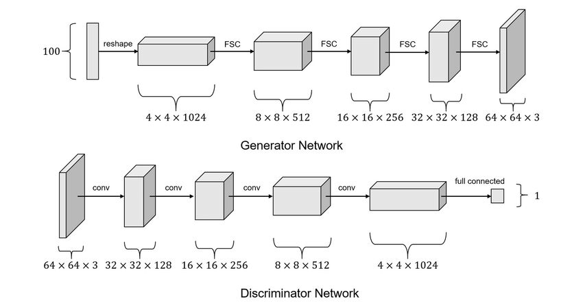

---

### DCGANの生成ネットワーク

- 構造: オートエンコーダのデコーダ
    - 入力: ランダムなベクトル（100次元）
        - 潜在空間のベクトルに相当
            - ↑わからん人は前回のオートエンコーダに戻りましょう
    - 出力: 画像
- 出力の画像は最初はでたらめ
    - ある訓練をすると画像が生成されるように

---

### DCGANの識別ネットワーク

- 構造: エンコーダに似ているが出力は1bit
    - 入力: 生成ネットワークの画像 or 訓練のために用意した画像
    - 出力: 「本物（訓練に用意した画像）」である確率
        - 偽物: 生成ネットワークの出力
- 出力は最初はでたらめ
    - 当てずっぽう

---

### 生成/識別ネットワークを競わせる

- 損失関数（次ページで詳しく）
    - 識別ネットワークが正解したら生成ネットワークの損失
    - 識別ネットワークが不正解だったら識別ネットワークの損失
- 学習の進行
    - 生成ネットワーク: ノイズ画像$\rightarrow$識別ネットワークの確率を下げる模様を生成
$\rightarrow$精緻な画像
    - 識別ネットワーク: 模様に負けない識別性能を得ようとする 
    - [学習が進んでいく様子](https://qiita.com/miya_ppp/items/f1348e9e73dd25ca6fb5)

これで生成ネットワークが画像を出力できるようになる <a href="https://arxiv.org/pdf/1511.06434">例</a>

---

### GANの損失関数

- 生成ネットワークの評価関数（損失関数に$-1$をかけたもの）
    - $V_D(G) = \frac{1}{m}\sum_{i=1}^m \log \{ 1 - D[G(\boldsymbol{z}^{(m)})]\ \}$
        - $G(\boldsymbol{z}^{(i)})$: 生成ネットワークが生成したデータ（$m$個用意）
        - $D(\boldsymbol{x})$: 識別ネットワークの識別結果（確率）
- 識別ネットワークの評価関数
    - $V_G(D)= \frac{1}{m}\sum_{i=1}^m \Big[ \log\{ D(\boldsymbol{\boldsymbol{x}}^{(m)}) \} + \log \{ 1 - D[G(\boldsymbol{z}^{(m)})]\ \} \Big]$
        - $\boldsymbol{x}^{(i)}$: 訓練データ（こちらも$m$個用意）
        - $V_D(G)$に訓練データに対する識別の成績の項も加算

---

## 変分オートエンコーダ[[Kingma 2013]](https://arxiv.org/abs/1312.6114)

- オートエンコーダをより表現力豊かにする方法
- 改善したいオートエンコーダの性質
    - 潜在空間でのベクトルの分布に隙間
        - 訓練データに対応するベクトルの間に
    - 隙間の問題
        - 隙間のベクトルをデコーダに渡すと、中間というよりは重ね合わせのような出力
            - 例: 犬と猫の中間のベクトルから、その中間のような動物の画像を出力したい
            $\rightarrow$単に足して2で割ったような不自然なものに

---

### 変分オートエンコーダでの潜在空間の扱い

- 仮定
    - 潜在空間のベクトル$\boldsymbol{z}$の分布は標準正規分布に従う
        - 空間が無限なのでデータが散らないように縛りを設ける
    - エンコーダへの入力$\boldsymbol{x}$に対し、$P(\boldsymbol{z}|\boldsymbol{x})$の分布も正規分布に従う
        - これは学習のための仮定
- 仮定に基づいて学習すると
    - $\boldsymbol{z}$の隙間があかずに原点付近に集まる
    - $P(\boldsymbol{z})$の分布のなかに$P(\boldsymbol{z}|$物の種別$)$のような分布ができる

---

### 隙間の問題の解決

- デコーダで生成されるデータに隙間ができにくい
    - [[Kingma 2013]](https://arxiv.org/abs/1312.6114)の中の図4
    - [Kingma氏のデモサイトの例](https://dpkingma.com/sgvb_mnist_demo/demo.html)
- ただしGANよりぼやけやすい

---

### 変分オートエンコーダの構造

- 右図
    - エンコーダの先に雑音の層を追加
    - $P(\boldsymbol{z})$を標準正規分布に制限するための項を損失関数に追加
    - 作りは簡単だがベイズ推論の理論が背景に
        - 確率ロボティクスの講義で一部説明

---

### AE、VAE学習の確率的な解釈

- 確率分布$p$の圧縮と復元を学習している
    - なんの分布？: データや画像の数値を並べたベクトル$\boldsymbol{x}$
    - 訓練に使うデータや画像の$\boldsymbol{x}$は、$p$にしたがって選ばれる（$\boldsymbol{x} \sim p$）
        - $p$: 人間の興味で決まる
            - 例: 猫の絵を生成したいなら猫の画像ばかりになるなど
- エンコーダ: $p$を潜在空間の分布$q$に変換
    - AEの場合は$p$からの点を潜在空間に写像
- デコーダ: エンコーダと逆の変換を学習
    - 出力の分布: $p$（誤差あり）

---

### Denoising Diffusion Probabilistic Models（DDPM）[[Ho2020]](https://arxiv.org/abs/2006.11239)

- 一般に（機械学習の文脈で）「拡散モデル」と呼ばれるもの
- 拡散モデル（拡散過程）
    - 集まっているものや模様がだんだん散らばっていく過程を定式化したもの
    - 下の例: 各画素に対し、同じガウス分布に従う雑音を繰り返し足したもの
    

これがなんで生成と関係あるの？

---

### 拡散モデルを使った生成の考え方

- 画像: 人間がなにか意味のある画像だと思う画像の分布$P$からドローされたもの
    - $\boldsymbol{x} \sim P$（$\boldsymbol{x}$: 画素を並べたベクトル）
- $P$の拡散
    - 何度も同じガウス分布状の雑音を何度も足していくと
    最終的にガウス分布$Q$に
$\Longrightarrow$逆（逆拡散過程）をすれば$P$が復元できる（どうやって？）
$\Longrightarrow Q$からノイズをドローして逆に拡散$\rightarrow$$P$から新たな絵がドローできる
 

---

### 理論的な裏付け

- 先ほど用いた拡散過程: 同じガウス分布を$T$回適用
    - 少しずつの雑音であれば、$T$回、同じノイズ除去の処理を繰り返すと元に戻すことができる（時間を巻き戻すことができる）
        - 非平衡熱力学の知見から
- DDPM
    - 「ノイズの除去処理」をANNに学習させる
    $\rightarrow$このANNに雑音を$T$回通すと画像が生成される
    （Stable Diffusionなどに用いられるなど高品質）
    - 集めた画像でノイズの除去処理を訓練

---

### DDPMの学習方法（訓練用のデータの準備）

- 学習データ: 様々な画像$\boldsymbol{x}^{(j)}_0$$\ (j=1,2,\dots,N)$を準備
- 拡散させかたの定義
    - 各画素にガウス分布にしたがうノイズを付加
        - $x_{i+1}^{(j)} \sim \mathcal{N}(\sqrt{1-\beta_i}x_{i}^{(j)}, \beta_i)$
            - $x_{i+1}^{(j)}$: $\boldsymbol{x}_{i+1}^{(j)}$の任意の画素
            - $\beta_i$: 拡散率（原著では$T=1000$までに$0.0001$から$0.02$まで線形に増加）
- 任意の段階の画像を生成できるプログラムを作成
    - $x_{i}^{(j)} \leftarrow \sqrt{\bar{\alpha_i}}x_0^{(j)} + \sqrt{1-\bar{\alpha_i}}\ \varepsilon$
        - $\alpha_i = 1-\beta_i$、$\bar\alpha_i = \prod_{k=1}^i \alpha_k$
        - $\varepsilon \sim \mathcal{N}(0, 1)$

---

### DDPMの学習方法（ANN）

- U-Netを拡張したものを準備
（Transformerを使ったものについては後日）
    - 元の画像からどれだけ拡散したか（時刻）も入力できるように
    - 他にも仕掛け
- 損失関数と学習
    - ノイズ画像の1ステップ前を出力するよう学習
    - 前ページのプログラムで作ったノイズ画像と↑を比較（二乗誤差）
        - 互いに$\boldsymbol{x}_0^{(j)}$の値を引くとノイズ同士の比較に
        - ベイズ推論の難しい式からに二乗誤差がよいと導出される

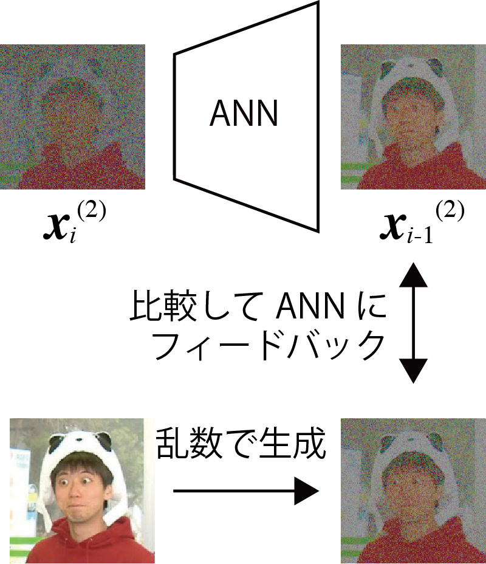

---

### 例

- [実装例](https://qiita.com/pocokhc/items/5a015ee5b527a357dd67)
- 出力例
    - [[Ho2020]](https://arxiv.org/abs/2006.11239)の図14など
    - https://learnopencv.com/denoising-diffusion-probabilistic-models/

---

## GAN、VAEの応用

- CGAN
- pix2pix
- cVAE

---

### 条件付きGAN（Conditional GAN、CGAN）[[Mirza2014]](https://arxiv.org/abs/1411.1784)

- GANの生成ネットワークはランダムにデータを出力するだけ
    - 何を出力するかコントロールしたい
- 条件付きGAN [図](https://www.researchgate.net/figure/Architecture-of-the-Conditional-adversarial-net_fig3_366684170)
    - 生成ネットワークに何を作って欲しいかラベルで指示
        - データのもとになるベクトル$\boldsymbol{z}$と共にラベル$\boldsymbol{y}$を入力
    - 識別ネットワークにも、生成ネットワークの出力と共に$\boldsymbol{y}$を入力
        - 条件$\boldsymbol{y}$に合った生成データか判定
- 補足: ラベルの表現
    - $\boldsymbol{y}=(0,0,\dots,1,\dots,0,0,0)$というone-hot ベクトルがよく用いられる
        - $1$が立っている位置を特定のものと対応づけ
            - 例: 1番目が猫、2番目が犬、など
    - 他のANNでもよく用いられる

---

### pix2pix

- CGANの一種とみなせる
- pix2pix[[Isora 2016]](https://arxiv.org/abs/1611.07004)（構造は論文のFigure 2に）
    - 生成ネットワーク: 入力にノイズではなく画像を入力し、画像を出力させる
        - 入力をX、出力をYとしましょう
    - 識別ネットワーク: XとYのペア、あるいはXと対応する学習用画像Y'のペアを入力して真贋を識別
    $\rightarrow$画像を変換するように学習
- どんなことができるか
    - 線画をカラーの絵や写真のように（図: [[Isora 2016]](https://arxiv.org/abs/1611.07004)）
    - 葉に隠れた枝をつなぐ[[三上2022]](https://www.jstage.jst.go.jp/article/jrsj/40/2/40_40_143/_article/-char/ja)

---

### 条件つき変分オートエンコーダ （Conditional VAE、CVAE）

- CGANと同様、エンコーダとデコーダにラベルも入力
    - デコーダはラベルにしたがってデータを生成できる
- 入力の識別情報が、潜在空間内で必要なくなる
    - [VAEとCVAEの分布の比較の例](https://towardsdatascience.com/conditional-variational-autoencoders-for-text-to-image-generation-1996da9cefcb/)
    - 画像の生成の場合、画像の描き方に関する情報が潜在空間内に分布
    $\rightarrow$より出力にバリエーション

---

## まとめ

- 様々な生成方法
    - 敵対的生成ネットワーク（GAN）
    - 変分オートエンコーダと拡散モデル$\rightarrow$確率分布の利用
- GAN、VAEの応用
    - ラベル付けして生成したいものを指示できる
    - 画像から画像への変換ができる
