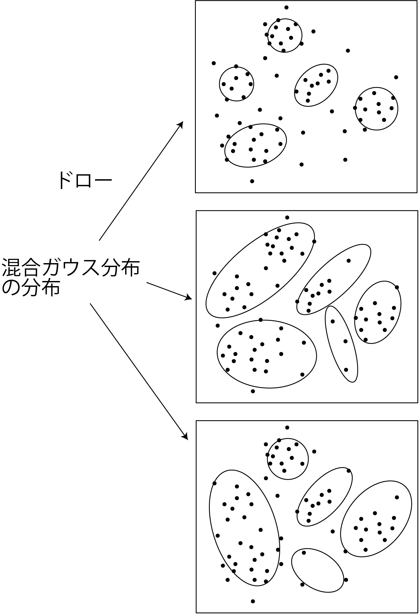

<!-- footer: "機械学習（と統計）第10回" -->

# 機械学習

## 第10回: クラスタリングとベイズ推論

千葉工業大学 上田 隆一

 

This work is licensed under a [Creative Commons Attribution-ShareAlike 4.0 International License](https://creativecommons.org/licenses/by-sa/4.0/).

---

<!-- paginate: true -->

## 今日やること

- 変分推論

---

## 前回のおさらい

- k-means、EM法をやった
    - EM法は確率の考えを導入していたが、第6回でやったような「分布の分布」までは考えられていない

「分布の分布」は考えられるのか?→できる（ただしかなりややこしい）

---

## 第6回のおさらい

- 実験の成功、失敗の結果から、「成功率の分布」を考えた
    - ベータ分布: $p(x) = \eta x^{\alpha-1}(1-x)^{\beta-1}$
    - 実験の結果を1つずつ反映していくと、成功率の分布が変化していった
        - 下図: 成功、成功、失敗、失敗の場合の分布の推移
            - 成功率1/2と決めつけない
    - 分布の変化はベイズの定理で計算できた

---

## 混合ガウス分布のベイズ推定

- 「混合分布の分布」を考える
    - 右図のような様々な分布に確率（の密度）を与える
    - 最尤なものでなく、分布の分布自体を計算
- 第6回との違い
    - パラメータの数が膨大
        - ガウス分布が$n$個（$n$: クラスタの数）
        - 潜在変数が$Nn$個（$N$: データの数）
    - （単純な）ベイズの定理で計算できない
- どうするか?
    - EM法のように少しずつ分布（の分布）を変えていく

---

### 推定対象のパラメータ

- 各ガウス分布のパラメータ: $\boldsymbol{\mu}_j, \Sigma_j, \pi_j$
    - （おさらい）混合ガウス分布:
        - $p(\boldsymbol{x} | \boldsymbol{\mu}_{1:n}, \Sigma_{1:n}, \pi_{1:n})$
        $=  \sum_{j=1}^n \pi_j \mathcal{N}(\boldsymbol{\mu}_j, \Sigma_j)$
        （$\pi_1 + \pi_2 + \dots + \pi_n = 1$）
- 各データ$\boldsymbol{x}_i$（$i=1,2,\dots,N$）の所属$k_{i}$
    - どのガウス分布に所属しているか

---

### パラメータの分布のモデル化（分布の分布）

- 混合比率$\pi_{1:n} = (\pi_1, \pi_2, \dots, \pi_n)$の分布: ディリクレ分布
    - ディリクレ分布: $\text{Dir}(\pi_{1:n} | \alpha_{i:n}) = \eta \pi_1^{\alpha_1-1}\pi_2^{\alpha_2-1}\dots\pi_n^{\alpha_n-1} = \eta \prod_{j=1}^n \pi_j^{\alpha_j - 1}$
        - ベータ分布をコインの裏表だけでなくもっと多くの変数
        （例: さいころなら6）に拡張したもの
        - 様々な混合比率のパターンに確率の密度を与える
    - $\alpha_{1:n}$: $\pi_{1:n}$のばらつきを決めるパラメータ
        - $\alpha_{1:n}$の合計値が大きくなるほど値が定まってくる
            - 合計値が大きくなる=さいころをたくさん投げて出目の傾向が分かってきた状態

---

### パラメータの分布のモデル化（分布の分布。続き）

- 各ガウス分布のパラメータ$\boldsymbol{\mu}_j, \Lambda_j$の分布: ガウス-ウィシャート分布
    - $\Lambda_j$（精度行列）$= \Sigma_j^{-1}$（計算しやすいので考える）
    - ガウス-ウィシャート分布: $p(\boldsymbol{\mu}_j, \Lambda_j) = \mathcal{N}(\boldsymbol{\mu}_j|\boldsymbol{m}_j, (\beta_j \Lambda_j)^{-1})\mathcal{W}(\Lambda_j | W_j, \nu_j)$
        - ウィシャート分布: 精度行列の分布
    - 各ガウス分布の分布を決めるパラメータ: $\boldsymbol{m}_j, \beta_j, W_j, \nu_j$

---

### パラメータの分布のモデル化（分布の分布。続き）

- $k_{i,1:n}$（データ$\boldsymbol{x}_i$がどのクラスタに所属するか）の分布: 次の計算で導出
    - $q(k_{i,1:n}) = \langle p(\boldsymbol{x}_i, k_{i,1:n}, \pi_{1:n}, \boldsymbol{\mu}_{1:n}, \Lambda_{1:n}) \rangle_{\pi_{1:n}, \boldsymbol{\mu}_{1:n}, \Lambda_{1:n}}$
