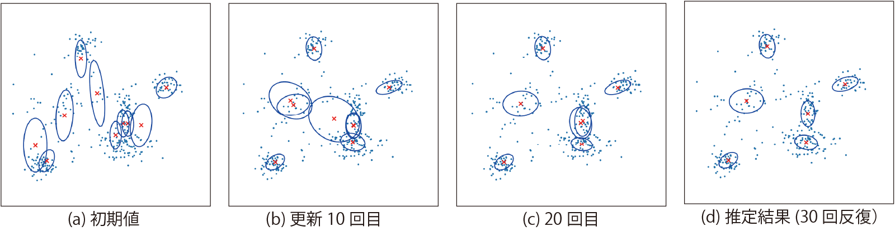

<!-- footer: "機械学習（と統計）第10回" -->

# 機械学習

## 第10回: クラスタリングとベイズ推論

千葉工業大学 上田 隆一

 

This work is licensed under a [Creative Commons Attribution-ShareAlike 4.0 International License](https://creativecommons.org/licenses/by-sa/4.0/).

---

<!-- paginate: true -->

## 今日やること

- 前回つっぱしり過ぎたのでおさらいテストの解説
- 変分推論

---

## 前回のおさらい

- k-means、EM法をやった
    - EM法は確率の考えを導入していたが、第6回でやったような「分布の分布」までは考えられていない

「分布の分布」は考えられるのか?→できる（ただしかなりややこしい）

---

## 第6回のおさらい

- 実験の成功、失敗の結果から、「成功率の分布」を考えた
    - ベータ分布: $p(x) = \eta x^{\alpha-1}(1-x)^{\beta-1}$
    - 実験の結果を1つずつ反映していくと、成功率の分布が変化していった
        - 下図: 成功、成功、失敗、失敗の場合の分布の推移
            - 成功率1/2と決めつけない
    - 分布の変化はベイズの定理で計算できた

---

## 混合ガウス分布のベイズ推定

- 「混合分布の分布」を考える
    - 右図のように分布をドローできるもの
- EM法との違い
    - 最尤なものでなく、分布の分布自体を計算
    - データが入ると分布をベイズの定理で更新
- 問題: 事後確率がベイズの定理一発で計算できない
    - どうするか?$\rightarrow$EM法のように少しずつ分布の分布を変えていく

---

### 推定対象（混合ガウス分布）のパラメータ

「分布の分布」ではなく「分布」のほうの話

- 各ガウス分布のパラメータ: $\boldsymbol{\mu}_j, \Sigma_j, \pi_j$
    - （おさらい）混合ガウス分布:
        - $p(\boldsymbol{x} | \boldsymbol{\mu}_{1:n}, \Sigma_{1:n}, \pi_{1:n})$
        $=  \sum_{j=1}^n \pi_j \mathcal{N}(\boldsymbol{\mu}_j, \Sigma_j)$
        （$\pi_1 + \pi_2 + \dots + \pi_n = 1$）
- 各データ$\boldsymbol{x}_i$（$i=1,2,\dots,N$）の所属$k_{i}$
    - どのガウス分布に所属しているか
    - 潜在変数

---

### 混合ガウス分布の分布のモデル化

- 混合比率$\pi_{1:n}$の分布: ディリクレ分布
    - ベータ分布をコインの裏表だけでなく多変数に拡張したもの
        - 例: さいころなら6
    - $\text{Dir}(\pi_{1:n} | \alpha_{1:n})= \eta \pi_1^{\alpha_1-1}\pi_2^{\alpha_2-1}\dots\pi_n^{\alpha_n-1}$
    $= \eta \prod_{j=1}^n \pi_j^{\alpha_j - 1}$
        - $\alpha_{1:n}$: $\pi_{1:n}$のばらつきを決める
        パラメータ
            - $\alpha_{1:n}$の合計値が大きくなるほど値が定まってくる

---

### 混合ガウス分布の分布のモデル化（続き）

- 各ガウス分布$\mathcal{N}(\boldsymbol{\mu}_j, \Lambda_j^{-1})$の分布:
ガウス-ウィシャート分布
    - $p(\boldsymbol{\mu}_j, \Lambda_j) = \mathcal{N}(\boldsymbol{\mu}_j|\boldsymbol{m}_j, (\beta_j \Lambda_j)^{-1})\mathcal{W}(\Lambda_j | W_j, \nu_j)$
        - ウィシャート分布$\mathcal{W}$: 精度行列$\Lambda_j$の分布
        - 各ガウス分布の分布を決めるパラメータ: $\boldsymbol{m}_j, \beta_j, W_j, \nu_j$

---

### 各データの帰属確率のモデル化

- $i$番目のデータ$\boldsymbol{x}_i$が$j$番目のクラスタに所属する
（$k_i = j$となる）確率を考える
    - $r_{ij}$と表しましょう
    - これは特定の式にせずにテーブル状のデータに

---

### これまでの変数、パラメータ一覧表

|データ|推定したい分布のパラメータ|推定したい分布の分布のパラメータ|
|:---:|:---:|:---:|
|$\boldsymbol{x}_i$|$k_i, \boldsymbol{\mu}_j, \Lambda_j, \pi_j$|$r_{ij}, \boldsymbol{m}_j, \beta_j, W_j, \nu_j, \alpha_j$|
- $i=1,2,\dots,N$（$N$: データの数）
- $j=1,2,\dots,n$（$n$: ガウス分布の数）

---

### 変分推論による解法

難しいので方法だけ

- 推定対象の分布を、パラメータごとに独立な分布の積にして近似
    - $q(\pi_{1:n},\boldsymbol{\mu}_{1:K}, \Lambda_{1:K}, k_{1:N}) = q_1(k_{1:N})q_2(\pi_{1:n},\boldsymbol{\mu}_{1:K}, \Lambda_{1:K})$
         - $q$: 近似の分布
    - $q_1$と$q_2$のどちらかを固定、どちらかを動かして交互にデータに合わせていく
        - $q_1$を動かす: クラスタの再構成
        - $q_2$を動かす: 分布の再構成

---

### 変分推論の手続き

1. 適当に初期のクラスタと混合ガウス分布の分布を決める
    - 確率$r_{ij}$を初期化（クラスタリングに相当）
    - パラメータ$\boldsymbol{m}_{1:n}, \beta_{1:n}, W_{1:n}, \nu_{1:n}, \alpha_{1:n}$の初期値を与える
        - $\boldsymbol{m}'_{1:n}, \beta'_{1:n}, W'_{1:n}, \nu'_{1:n}, \alpha'_{1:n}$としましょう
2. 上記の初期値から、混合ガウス分布の事後分布のパラメータ$\boldsymbol{m}_{1:n}, \beta_{1:n}, W_{1:n}, \nu_{1:n}, \alpha_{1:n}$を計算
    - EM法のMステップに相当（変分Mステップ）
3. 計算した$\boldsymbol{m}_{1:n}, \beta_{1:n}, W_{1:n}, \nu_{1:n}, \alpha_{1:n}$から$r_{ij}$を計算
    - EM法のEステップに相当（変分Eステップ）
- 注意: $\boldsymbol{m}'_{1:n}, \beta'_{1:n}, W'_{1:n}, \nu'_{1:n}, \alpha'_{1:n}$は固定
    - 事前分布を固定して、繰り返し事後分布の解を良くしていく

---

### 変分推論の威力（その1）

とても強力なので2例先に見せます

- 例1: 2次元の点のクラスタリング
    - 右図: 6個のガウス分布を含む混合ガウス分布からランダムに選んだ点
    - このデータのクラスタリング（というより発生した混合ガウス分布の推論）に変分推論を適用するとどうなるか

---

### 推論の推移

- 混合ガウス分布の分布から平均値となる分布を描画
- 10の分布があることを仮定$\rightarrow$不要な分布が消えていく（$\pi_j$の値が0に収束）

---

### 正解との比較

- 共分散行列のずれは多少あるが、正確
    - 人間より正確かもしれない
    - （上限があるものの）数が数えられるのはかなり有用

---

### 変分推論の威力（その2）

- 例2: 1次元のデータの解析
    - 講師が本を書いていて偶然発見
    - 右の分布はガウス分布か?

---

### 変分推論してみると・・・

- もうひとつの分布が埋まっていた
    - このデータは、あるセンサの値を3秒ごとにとったもので、日が出ているときと出ていないときで平均値が違っていた
    - ある意味、人間よりもクラスタリングの解像度が高い

---

## 実世界での使用例1

- ボルトの先端の検出
    - 3次元の位置を1次元に変換してからクラスタリング

---

## 実世界での使用例2

- 物体表面の把持位置の
クラスタリング
    - 法線ベクトルの位置、向きの6次元空間

---

### 変分Mステップ（各データの所属から分布のパラメータを計算）

- 補助の数値を計算
    - $N_j = \sum_{i=1}^N r_{ij}\qquad\qquad$（分布$j$の重み付きデータ数）
    - $\bar{\boldsymbol{x}}_j = \dfrac{1}{N_j} \sum_{i=1}^N r_{ij}\boldsymbol{x}_i\ \quad$（分布$j$の重み付き平均）
    - $\Sigma_j = \dfrac{1}{N_j} \sum_{i=1}^N r_{ij}(\boldsymbol{x}_i - \bar{\boldsymbol{x}}_j)(\boldsymbol{x}_i - \bar{\boldsymbol{x}}_j)^\top$（分布$j$の重み付き共分散行列）
- 事後分布のパラメータを計算
    - $(\alpha_j, \beta_j, \nu_j) =(\alpha_j', \beta_j', \nu_j') + (N_j, N_j, N_j)$（データの個数だけ増大） 
    - $\boldsymbol{m}_j = (\beta_j' \boldsymbol{m}_j' + N_j \bar{\boldsymbol{x}}_j ) /\beta_j\qquad\qquad\qquad$（$\boldsymbol{\mu}_j$の中心の調整）
    - $W^{-1}_j = W'^{-1}_j + N_j \Sigma_j + \dfrac{\beta'_j N_j}{\beta'_j+ N_j} (\bar{\boldsymbol{x}}_j - \boldsymbol{m}_j')(\bar{\boldsymbol{x}}_j - \boldsymbol{m}_j')^\top$
      　　　  （各ガウス分布の共分散行列の調整）

---

### 変分Eステップ（分布のパラメータから各データの所属を計算）

- $k_{1:N}$の分布: 次の計算で導出
    - $P(k_{1:N}) = \langle p(\boldsymbol{x}_i, k_{i,1:n}, \pi_{1:n}, \boldsymbol{\mu}_{1:n}, \Lambda_{1:n}) \rangle_{\pi_{1:n}, \boldsymbol{\mu}_{1:n}, \Lambda_{1:n}}$
- 計算結果: 次の$r_{ij}$が、$k_i = j$になる確率
    - $r_{ij} = \eta \rho_{ij}$
        - $\log_e \rho_{ij} = -\dfrac{1}{2} d \beta_j^{-1} -\dfrac{1}{2} \nu_j(\boldsymbol{x}_i - \boldsymbol{m}_j)^\top W_j (\boldsymbol{x}_i - \boldsymbol{m}_j)$
         $\quad+ \dfrac{1}{2} \sum_{j=1}^d \psi\left(\dfrac{\nu_j + 1 - j}{2}\right) + \dfrac{1}{2}\log_e | W_j | + \eta'$
        $\quad+\psi(\alpha_j) - \psi\left( \sum_{j=1}^K \alpha_j \right)$
        - 式中の変数はすべて一時的に値が決まっているか既知なので計算可能
            - $d$: $\boldsymbol{x}$の次元
            - $\psi$: ディガンマ関数という関数（高級な言語にはライブラリあり）

---

## まとめ

- 変分推論
    - 混合分布とベイズ推論でクラスタリングや、あるデータの原因を調査
    - EM法より強力

