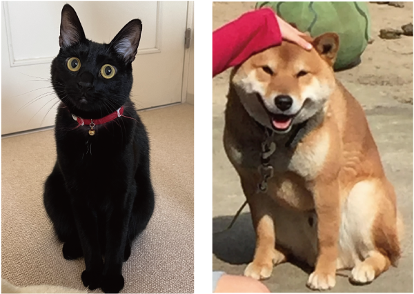

<!-- footer: "機械学習（と統計）第11回" -->

# 機械学習

## 第11回: 人工ニューラルネットワークの基礎

千葉工業大学 上田 隆一

 

This work is licensed under a [Creative Commons Attribution-ShareAlike 4.0 International License](https://creativecommons.org/licenses/by-sa/4.0/).

---

<!-- paginate: true -->

## 今日やること

- 人工ニューラルネットワークってなに？

---

## 人工ニューラルネットワークってなに？

- まずは問題
    - なんで犬とか猫とか我々は認識できるのか?
    - 入出力はどうなってるの?
        - 入力は第1回に見せた通り（下図）
        - 犬・猫などの名前は出力
        - 途中はどうなっているのか?

（https://commons.wikimedia.org/wiki/File:Retina-diagram.svg, by S. R. Y. Cajal and Chrkl, CC-BY-SA 3.0）

