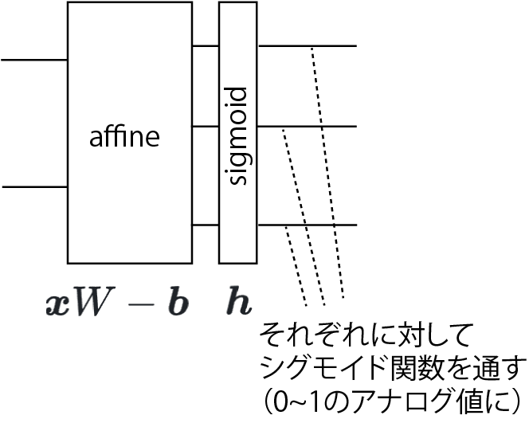

<!-- footer: "機械学習（と統計）第11回" -->

# 機械学習

## 第11回: 人工ニューラルネットワークの基礎

千葉工業大学 上田 隆一

 

This work is licensed under a [Creative Commons Attribution-ShareAlike 4.0 International License](https://creativecommons.org/licenses/by-sa/4.0/).

---

<!-- paginate: true -->

## 今日やること

- 人工ニューラルネットワークってなに？

---

## 人工ニューラルネットワークってなに？

- まずは問題
    - なんで犬とか猫とか我々は認識できるのか?
        - 脳がやっているということは知っている
        - 脳に神経があることも知っている
    - 脳や神経は具体的にどういう構造なのか?

（https://commons.wikimedia.org/wiki/File:Retina-diagram.svg, by S. R. Y. Cajal and Chrkl, CC-BY-SA 3.0）

---

### 神経細胞

- 信号を伝える細胞
- 信号を伝える仕組み
   1. 樹状突起に化学物質をある量受けると電圧が発生
   （発火）
       - 視細胞のように他の刺激で発火するものも
   2. 電圧が軸索を伝って、その先のシナプスから化学物質を放出
   3. 他の細胞が発火

（図: public domain）

---

### （人工でない）ニューラルネットワーク

- 脳: 神経細胞が集まって回路を形成
    - 計算をしている（後述）
    - ニューラルネットワークというのはこれのこと
- 脊髄: 神経が背骨を伝わり体の隅々へ
    - もともと脳ではなくこちらが本体
    - 反射などの計算はここで
- 末端: 回路の先端が筋肉につながっていてスイッチに

（右図：CC BY-NC-SA 4.0, 脳科学辞典から）

---

## 神経細胞の「計算」

- スイッチの役割
    - 複数の細胞から信号を受信
    - 信号の総量がある一定値を超えると電圧が発生
    - 電圧: 軸索$\rightarrow$シナプス
    $\rightarrow$別の複数の細胞
- どうやってこんな仕組みで計算できるんでしょう?
    - 身近に似たものはないか?
    - 議論してみましょう

---

### 神経細胞を単純化したモデル

- 右図のような構造に簡略化（人工ニューロン）
    - 他の$n$個の細胞から信号を受け取る
        - $x_{1:n}$: 他の細胞からの信号の強さ
        - $w_{1:n}$: 信号を受け取った値にかける「重み」
    - ひとつの値だけ信号$y$を出す
        - $x = w_1 x_1 + w_2 x_2 + \dots + w_n x_n \ge b$
        なら$1$
            - $b$: 閾値（バイアスとも）
        - 接続先は複数だが同じ値を送信
- 他の細胞も同様にモデル化すると$x_{1:n}$も$0, 1$になってディジタル回路に

---

### 人工ニューロンで回路を組んでみる

- 問題: 2つの数字$x_1$と$x_2$の符号が同じかどうかを調べる
    - 値が0の場合は正としましょう
    * 答え

---

### （人工）ニューラルネットワーク

- 神経細胞は前ページのように組み合わせてプログラムできる
- [人の脳には860個の神経細胞](https://www.riken.jp/press/2018/20180326_1/index.html)
    - 860億個が組み合わさってさまざまな計算をしているのでいろいろできる
        - 目から入った光で猫がいたら「猫！」と叫ぶ（目→脳→口の筋肉）
        - 手を動かして目の前のお菓子をとる（目→脳→腕や手の筋肉）
        - カレーの匂いがしたらよだれが出る（鼻→脳→よだれを出す器官）
        - 講義中にゲームをする（？）
- コンピュータでも人工ニューロンで計算すれば or 人工ニューロンを実現するようなコンピュータを作れば、脳の計算が可能$\Longrightarrow$人工ニューラルネットワーク

---

### 人工ニューラルネットワークの正体

- やってることは単なる行列の演算
- 先ほどの例の一番左の「層」
    - 入力: $\boldsymbol{x} = (z_1 \ z_2)$と表現
    - 重み: $W = \begin{pmatrix}1 & 0 \\ 0 & 1 \end{pmatrix}$
        - 上、下のニューロンがそれぞれ$z_1, z_2$しか使わないという意味
    - 出力の計算: $\boldsymbol{x}' = \boldsymbol{h}(\boldsymbol{x}W - \boldsymbol{b})$
        - $\boldsymbol{b}$は閾値: $\boldsymbol{b} = (0 \ 0)$
        - $\boldsymbol{h}$は閾値処理

---

### あとは繰り返し

- 1層目（再掲）
    - 入力: $\boldsymbol{x} = (x_1 \ x_2)$
    - $W = \begin{pmatrix}1 & 0 \\ 0 & 1 \end{pmatrix}$、$\boldsymbol{b} = (0 \ 0)$
- 2層目
    - 入力（1層目の出力）: $\boldsymbol{x}' = (x_1' \ x_2')$
    - $W = \begin{pmatrix}1 & -1 \\ 1 & -1 \end{pmatrix}$、$\boldsymbol{b} = (1.1 \ -0.9)$
- 3層目
    - 入力（2層目の出力）: $\boldsymbol{x}'' = (x_1'' \ x_2'')$
    - $W = \begin{pmatrix}1 \\ 1 \end{pmatrix}$、$\boldsymbol{b} = (0.9)$

---

### レイヤーでの表現

- 入出力を線でつなぎ、演算を箱で表現
- これまで使ってきた例だと1層分が2層に
     - 重みの反映（と閾値の引き算）で1層
         - アフィンレイヤー
     - 閾値処理で1層
         - ステップ関数レイヤー
- 注意: 右の図ではあまり入出力の数が変わってないが、実際はアフィンレイヤーの前後で変わる

---

### 残った問題: どう学習するか?

- 動物は生まれたときにある程度プログラミングされた状態だが・・・
    - そのあと成長しても神経細胞は基本的に増えない
    - 猫を識別するにはニューラルネットワークに変更を加えないといけない
    - 頭を開けて配線するわけにはいかない

どうやるの?みなさんは普段どうしてます?（話し合ってみましょう）

---

### 学習の方法: パラメータを変える

- 例題: $x_1 + 2 x_2 + 3 x_3 \ge 3$なら$1$を出力、そうでなければ$0$を出力する人工ニューロン
    - 最初、パラメータはあてずっぽ（右図上）
- 基本的な方法
    1. 何か入力して出力と正解の「ずれ」を観測する
        - 例えば上のニューロンに$(x_1, x_2, x_3) = (1, 0, 0)$を入れると$1$が出てくる（$0$が出てきてほしいのに）
    2. ずれを小さくするようにパラメータを変える
        - この場合はたとえば$w_1 = 1.9$とすると$0$に

これを全ニューロンに対してやる（以後はレイヤー表記）

---

### パラメータをどう変えるか?

- 案1: 出力を間違えたらあてずっぽで変える
    $\rightarrow$たくさんパラメータがあると正解は無理
- 案2: ずれが小さくなるようにパラメータを変える
    - $\rightarrow$少し$W$や$\mathcal{b}$を変えても$\boldsymbol{h}$に$0$か$1$にされるので効果が分からない
        - ちょっと変えたらちょっとでもいいので
        誤差が減ってほしい
        （どうすればいいか議論してみましょう）

---

### 対策

- 方法1: 出力をアナログ値に（次のページ）
- 方法2: たくさん入力して期待値をとる
    - バッチ、ミニバッチと呼ばれる方法で方法1と共に使われる

---

### シグモイド関数で微妙にアナログに

- $y = \dfrac{1}{1 + e^{-x}}$という関数を使用
- シグモイド関数のグラフ
    - 青線
    - 緑はこれまでのステップ関数
    

これでパラメータを少し変えると出力も少し変わるのでずれの修正ができる

---

### 次なる問題: ずれに対してどれだけパラメータを修正するか

- 誤差逆伝播法
    - 出力側の誤差をどんどん入力側に送っていく
        - 誤差の大きさは、そのニューロン（層）の影響を考えて加減する
        
    - 送られてきた誤差が小さくなる方向にパラメータを変える

---

### 単純な例

- 送る誤差の大きさ
    - ある層で誤差が$\alpha$倍になるなら、$\alpha$かけて上流に送る
        - 上の層での値の違いが$\alpha$倍だけ影響するので
    - 右図上: 1入力1出力の単純なレイヤー
        - $9/10$が入力されて$17/10$を出力
        $\rightarrow$誤差$1/3$が返ってきた
        （出力$17/10$はもっと小さいべき）
        - $w=2$なので$2$倍して誤差を送信（$2/3$を返す）
- パラメータの修正（計算式の根拠は次ページ）
    - $w = 2$$- \alpha 9/10\cdot 1/3$（重みが減る）
    - $b = 1/10$$+ \alpha 1/3$（閾値が上がる）

---

### アフィンレイヤーの誤差逆伝播

