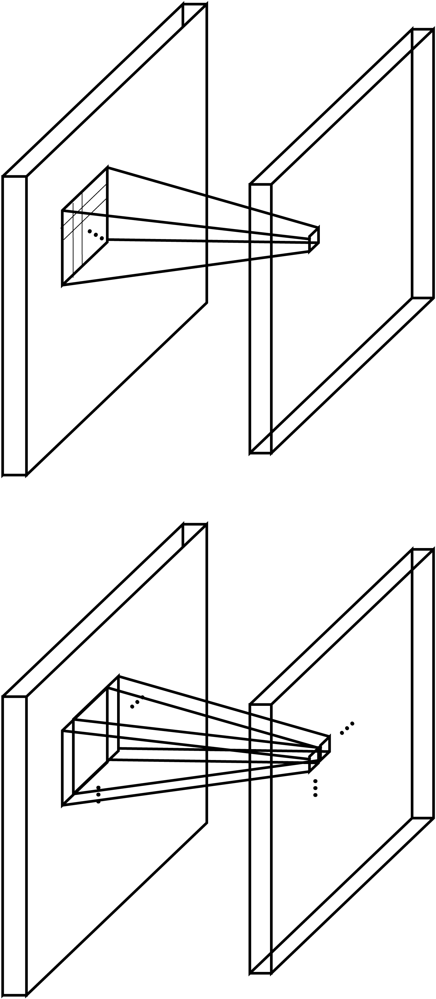
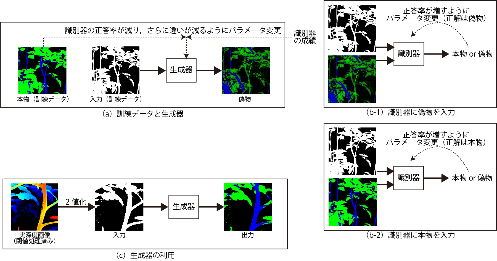

<!-- footer: "機械学習（と統計）第12回" -->

# 機械学習

## 第12回: 画像と人工ニューラルネットワーク

千葉工業大学 上田 隆一

 

This work is licensed under a [Creative Commons Attribution-ShareAlike 4.0 International License](https://creativecommons.org/licenses/by-sa/4.0/).

---

<!-- paginate: true -->

## 今日やること

- CNN
- GAN

---

## 以前から触れていた話題

- 動物は視覚をどう行動や判断に必要な情報に変えているか
- それをコンピュータで再現できるか

（https://commons.wikimedia.org/wiki/File:Retina-diagram.svg, by S. R. Y. Cajal and Chrkl, CC-BY-SA 3.0）

人工ニューラルネットワーク（ANN）でできる?$\rightarrow$できる

---

## もうひとつの話題: なんか自動で絵を描くやつが出現

実例は各自いろんなところで調査を

- こいつらはどういう仕組み?
    - 最近のは言語も駆使している（次回）
    - ちょっと古いけど基礎をやりましょう

---

## 視覚・画像とANN

- 映像、画像の特性に特化したANNが存在
    - 特性
       - 2次元（深度があれば3次元、動画でも時間軸を入れると3次元）
       - ある画素の周囲に似た画素がある
- おさらい: ディジタル画像
    - 平面が格子状に分割されて、数字の大小で色の濃さが表される
    （例: 右図。数字はてきとう）
    - カラーの場合はR、G、Bそれぞれについて格子状の数値データ

---

## 画像認識の難しさ

- 同じものが大きく写ったり小さく写ったり回転して写ったり
- 変形したり抽象化されたりデフォルメされたり

---

## CNN（convolutional neural network）

- テレビ局ではないです
- convolutional: 「畳み込みの」
-  画像の近いところの画素値を入力して
出力するニューロンを多用（右図）
    - 画像の近いところ: $n\times n$画素の正方形領域
    - 小領域の画素の特徴や変化を出力
    - さらに下の層でも畳み込みすることで全体の特徴を捉える
- 「畳み込み層」と他の部品を組み合わせて画像を処理させる

---

### CNNの部品1: 畳み込み層

- 概要
    - 画像の一部（n$\times$n画素の「窓」）領域の画素値をひとつの値に置き換えて下流に送る（上図）
    - 窓を1つずつ（2つ以上のときもある）ずらして同じ演算
    $\rightarrow$下流も画像に
- 値の置き換え方法
    - 各画素に重み付けして足し、一定値（バイアス）を足す
        - 層の目的によって重みの付け方を変える
        - 下流の画素数を変えないために画像の縁をパディングすることがある
- 学習対象: 重み付け（n$\times$nのデータ: フィルタ）とバイアス

---

### CNNの部品2: プーリング層 

- 窓のなかで特徴の高い画素だけを残して画素数を減らす層
    - 最大値を残す「maxプーリング」が主に使われる
- 学習はしない

---

### CNNの部品3: ソフトマックス層
（注意: CNN以外にも使われます）

- softmax（softな最大値）: 1つに決めないということ
- 使用例: 画像に映ったものを判別
    - 答えを断定せず確率で出力（例: 犬90%、猫9%、他1%）
    - 実世界は微妙な場面が多いので、1つに決めないで曖昧に出力したほうが都合よい
- 数式
    - 入力$\boldsymbol{x} = (x_1, x_2, \dots, x_n)$に対し$y_i = \eta e^{x_i}$を出力
        - $\eta$は正規化定数

---

### CNNの部品4: ReLU層

（注意: CNN以外にも使われます）

- ReLU: Rectified Linear Unit
    - 従来シグモイドが使われていた箇所に新たに使われるようになった活性化関数
        - 右図の赤線: ReLU
        - 青線: シグモイド
- ReLUを使うと性能があがる場合が
報告されて流行、定着

---

### CNNの構成

<a style="font-size:80%" href="https://commons.wikimedia.org/wiki/File:Comparison_image_neural_networks.svg">画像: Cmglee, CC BY-SA 4.0</a>

- 例: 画像に写っているものが何かを答えるための構成
    - Dense: アフィンレイ
    ヤーのこと
    - flatten: 配列状のデータを1列にすること
- [AlexNetの論文](https://proceedings.neurips.cc/paper_files/paper/2012/file/c399862d3b9d6b76c8436e924a68c45b-Paper.pdf)
    - 学習した中間層や認識結果が見られる

---

## GAN（generative adversarial networks）

- 敵対的生成ネットワーク
    - 「絵を描く人工ニューラルネットワーク」のブームの発端
    - それ以外にも音声やソフトウェアを作り出すなどの用途
- 「敵対的」とは何?（人類の敵ではない）
    - ふたつのANNを準備
        - 生成ネットワーク（generator）: 何かを作るANN
        - 識別ネットワーク（discriminator）: 入力が生成ネットワークの生成物かどうかを判断するANN
    - 生成ネットワークと識別ネットワークが互いに競う（次ページ）
- [元の論文](https://papers.nips.cc/paper_files/paper/2014/file/f033ed80deb0234979a61f95710dbe25-Paper.pdf)

---

### 生成/識別ネットワークの競い方

- 準備: 生成ネットワークが生成を目指すべき「本物」のデータを用意
    - こんな絵を描いて欲しいという絵の見本（たくさん準備）
- 識別ネットワーク
    - 本物と生成ネットワークの生成物（便宜的に偽物と呼ぶ）を入力され、
    本物か偽物かを判別
    - 判別結果の誤差から自身を学習
- 生成ネットワーク
    - 識別ネットワークの判別結果の誤差から学習
        - より見破られにくい偽物を作って識別ネットワークに挑戦

---

### 生成ネットワーク

- 基本的な仕組み
    - 入力: ランダムなノイズの画像
    - 出力: 識別ネットワークを騙す画像
- なんでこれで画像ができるのか?
    - ノイズ画像のもやもやを何かに関連づけているらしい
    - 最初は識別ネットワークもポンコツなので少し模様ができると騙せる
    - 参考: 拡散モデル（次のページ）
- 参考になるサイト: https://qiita.com/miya_ppp/items/f1348e9e73dd25ca6fb5
 

---

### GANの応用

- [pix2pix](https://arxiv.org/pdf/1611.07004): 入力にノイズではなく画像を入力$\rightarrow$画像を変換するように学習
- 研究での使用（深度カメラに映った植物の茎と葉を分別）
    - 
 
---

### 拡散モデル

- GANと同じく画像を生成する技術
    - [Stable Diffusion](https://stablediffusionweb.com/ja/app/image-generator)の理論的な背景（の半分）
        - もう半分（言葉による指示）は来週
- 画像生成するANNの作り方
    - ANNに画像のノイズを消す訓練をさせる
    - ランダムなノイズ画像を入力すると元の画像を無理やり想像して画像を生成する

---

## まとめ

- CNN、GAN、拡散モデルなど画像を扱うANNを勉強
    - 他、vision transformerなど2, 3年に一度、画期的な手法が発表されている
        - transformerは次回
