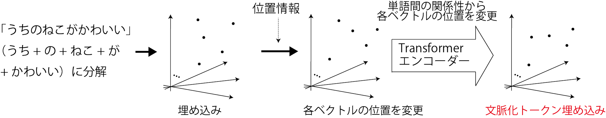
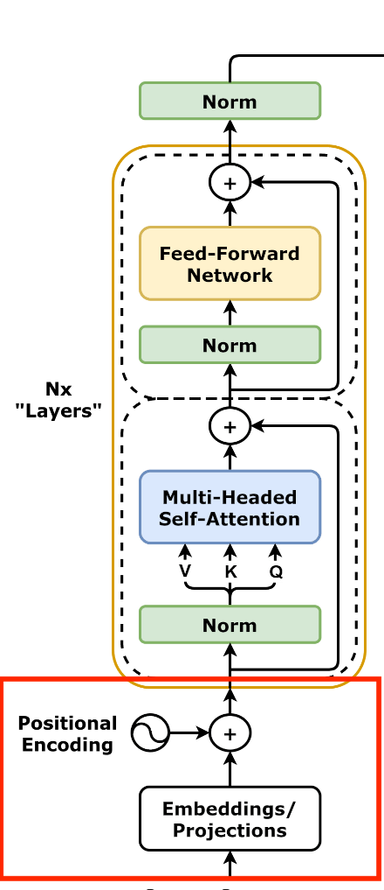

<!-- footer: "機械学習（と統計）第13回" -->

# 機械学習

## 第13回: 言語と人工ニューラルネットワーク

千葉工業大学 上田 隆一

 

This work is licensed under a [Creative Commons Attribution-ShareAlike 4.0 International License](https://creativecommons.org/licenses/by-sa/4.0/).

---

<!-- paginate: true -->

## 今日やること

- 機械学習での言葉の扱い方
- Transformer

---

## 機械学習での言葉の扱い方

- 単語の埋め込み
    - 各単語を数百〜数千次元のベクトルに置き換え
    - 近い単語は似たベクトルに（=内積の値を大きく）
        - 例（適当。上記のように次元はもっと必要）
            - おじさん$= (0.9, 0.32, 0.07)$
            - おばさん$= (0.7, 0.55, 0.08)$
            - 不動産$= (0.1, 0.05, 0.88)$
- 埋め込むと類似度が内積で計算できる
    - 次元が大きいので様々な切り口で類似度を計算可能
- これらのベクトルや、それらを作ることを「埋め込み」と呼んでいる （どうやって作るか考えてみましょう）

---

## 埋め込みの方法（例: skip-gram）

- [word2vec](https://arxiv.org/pdf/1301.3781)というモデル群のなかのひとつ
- 右図のような人工ニューラルネットワーク
    - ある単語$w$について、任意の文の左右の$j$単語前/後に単語$w'$がある確率を学習
- 入力: $\mathcal{v} = (0\ 0\ \cdots\ 1\ 0\ \cdots\ 0)$
    - ある単語について、その単語に対応する要素が$1$になったベクトル（one-hotベクトル）
    - 単語の種類だけ次元がある
- 出力: $j$の位置ごとに、入力と同じ次元のベクトルで、各単語が存在する確率を出力

これでどうやって埋め込みを作る？

---

## skip-gramで埋め込みを作る

- 学習: 大量の文章から$X$と$U_j$を学習
- 学習済み行列$X$=埋め込み
    - $X=[\boldsymbol{x}_{w_1}\ \boldsymbol{x}_{w_2}\ \dots\ \boldsymbol{x}_{w_N}]^\top$という行列
    - ある単語$w_i$のone-hotベクトル$\boldsymbol{v}_{w_i}$を入力すると、$\boldsymbol{x}_{w_i}$が得られる
    $\rightarrow$これが埋め込みのベクトル
- $U_j$も使われることがある

---

### 埋め込みができればコンピュータが文章を認識する?

・・・ことはできない

- 最尤な単語をskip-gramで予想して並べていけばそれっぽい文は作れるけど、たぶん無意味な文ができる
    - [マルコフ連鎖ジェネレータ](https://lorem.sabigara.com/?source=ginga-tetsudo&format=plain&sentence_count=5)のようなもの
- 単純な埋め込みには限界
    - 語順に関する情報は、完全にはない
    - 文脈依存な情報を持っていない
        - 同音異義語に1つのベクトル$\rightarrow$区別してない
            - 例: チンチラ（げっ歯類にも猫にもいる）

どうしましょう？

<a href="https://commons.wikimedia.org/wiki/Chinchilla_lanigera#/media/File:Chinchilla_lanigera_(Wroclaw_zoo)-2.JPG">写真上 by Guérin Nicolas（CC BY-SA 3.0）</a>
<a href="https://commons.wikimedia.org/wiki/File:Chinchilla_cat_(3228221937).jpg">写真下 by allen watkin（CC BY-SA 2.0）</a>

---

### どうすればいいか?

- 埋め込みに語順と文脈の情報を付加してやるとよい
    - 前ページのスライドを逆に考えると、そういうことになる
- Transformer（のエンコーダ）
    - 入力: 埋め込みに位置情報を加えて変更したもの
    - 出力: 文脈化トークン埋め込み
        - 各単語の関係性（文脈）に応じて各ベクトルの位置を変更
        - 次の単語の予測などにより有用な埋め込み（使い方はあとで）

---

### Transformer

- 翻訳のためにGoogleで開発された
    - [使ってみましょう](https://translate.google.co.jp/?hl=ja&sl=en&tl=ja&op=translate)
- 正体: 右のような構造のニューラルネットワーク（あとから細かく見ていきます）
    - GPT（Generative Pre-trained Transformer）などはこれの応用
    - その他言葉を扱うアプリケーションもだいたいこれの応用
- 画像にも応用されている
    - ViT（Vision Transformer）

[画像: CC-BY-4.0 by dvgodoy](https://commons.wikimedia.org/wiki/File:Transformer,_full_architecture.png)

---

## Transformerのエンコーダ: 入力

- 入力: 文
    - トークン（単語をより細かく文を区切ったもの）
    に分けて、埋め込みのベクトルに変換
        - $E=[\boldsymbol{e}_{w_1}\ \boldsymbol{e}_{w_2}\ \dots\ \boldsymbol{e}_{w_N}]^\top$という行列に
- 文への位置情報の付加（右図Positional Encoding）
    - 行列$H = \sqrt{D}E + P = [\boldsymbol{h}_{w_1}\ \boldsymbol{h}_{w_2}\ \dots\ \boldsymbol{h}_{w_N}]^\top$を作成
       - $D$: ベクトルの次元（正規化のため）
       - $P$にはトークンが文の何番目にあるかの情報が入る
           - 単純に「何番目か」ではなく三角関数を使ったややこしもの

とりあえずこれで入力に位置情報が加わる

---

### Transformerのエンコーダ: 文脈情報の付加1

- 自己注意機構という仕組みで文脈の情報を付加
    - 行列$W_Q, W_K, W_V$という3つの行列を使う
        - これらの行列は学習の対象で、ここでは学習が済んでいると仮定
    - $H$のなかのベクトル$\boldsymbol{h}_i$に対して次のベクトルを作成
        - $\boldsymbol{k}_i = W_K\boldsymbol{h}_i$（キー埋め込み）
        - $\boldsymbol{v}_i = W_V\boldsymbol{h}_i$（バリュー埋め込み）
        - $\boldsymbol{q}_i = W_Q\boldsymbol{h}_i$（クエリ埋め込み）
    - 3つのベクトルを使う自己注意機構なので特に
    「キー・クエリ・バリュー注意機構」と呼ばれる方法（次のスライドに続く）

---

### Transformerのエンコーダ: 文脈情報の付加2

- $\boldsymbol{k}_i, \boldsymbol{v}_i, \boldsymbol{q}_i$から、文脈を考慮した埋め込みベクトルを計算
    - 手順
        - $i$番目のトークンと$j$番目のトークンの関連性の強さを次のように計算
            - $s_{ij} = \boldsymbol{q}_i^\top \boldsymbol{k}_j/\sqrt{D}$（内積）
        - $s_{ij}$をソフトマックス関数で合計1に正規化
            - $\alpha_{ij} = e^{s_{ij}}/\sum_{j'=1}^Ne^{s_{ij'}}$
        - 次の$\boldsymbol{o}_i$を$i$番目のトークンの埋め込みベクトルとして出力
            - $\boldsymbol{o}_i = \sum_{j=1}^N \alpha_{ij} \boldsymbol{v}_j$

---

### Transformerのエンコーダ: 文脈情報の付加3

- $\boldsymbol{o}_i$をフィードフォワード層に通す
    - このあと2層のニューラルネットワークを通ってさらに文脈が強化された文脈化トークン埋め込みに

- 全体で$O=[\boldsymbol{o}_{w_1}\ \boldsymbol{o}_{w_2}\ \dots\ \boldsymbol{o}_{w_N}]^\top$という行列が出力される

---

## エンコーダの出力を使った翻訳

- 問題の定式化: 条件付き確率の問題にする
（例: 日本語から英語への翻訳）
    - 問題1: 先頭のトークンを選ぶ
        - $p(w_1 |$私 は 牛丼 を 食べ ます 。$)$
    - 問題2: 2番目のトークンを選ぶ
        - $p(w_2 |$私 は 牛丼 を 食べ ます 。, I$)$
    - 問題3: 3番目のトークンを選ぶ
        - $p(w_3 |$私 は 牛丼 を 食べ ます 。, I eat$)$
- Transformerのデコーダがこれを解く
$\Rightarrow$どうやって?

---

### デコーダ側の処理1

- 自己注意機構で翻訳途中の文の文脈を埋め込みに反映
    - 途中の文なので計算のときに少し細工が必要だけど、
    エンコーダと同じ

---

### デコーダ側の処理2: 交差注意機構

- もとの言語の文脈を翻訳中の文に持ち込む
    - クエリ埋め込み$\boldsymbol{q}_i = W_Q\boldsymbol{h}_i$だけデコーダの埋め込みから計算
    - キー埋め込み、バリュー埋め込みは、エンコーダ側の出力から計算

---

### デコーダ側の処理3: 次の単語の出力

- 全単語について次の単語になる確率を計算して、
その確率が最も高いものを出力
    - 文脈がしっかり考慮されているので、かつての
    マルコフ連鎖ジェネレータのようにはならない
    - その文脈に最もふさわしい単語が出てくる

---

## Transformerの応用例

---

### GPT（Generative Pre-trained Transformer）

- 途中の文から次の単語を予測
    - デコーダだけで構成
- ChatGPTの一部に使われる

[画像: CC0 (public domain)](https://commons.wikimedia.org/wiki/File:Full_GPT_architecture.svg)

---

### ChatGPT

- GPTを使ってテキスト（人の質問や発言）に答える
    - （構造に関する決定的な文献なし）

---

### Vision Transformer (ViT）

- Transformerを画像に転用
    - 画像をブロック状に切り取って、各ブロックを1行のデータにして単語のように扱う
    - 右図: 画像を9分割してそれぞれを単語扱い
- 画像をブロック状に扱うのはCNNと同じだが、そのあとが違う
    - CNNは遠くのブロックの関係性を見るのが苦手

[画像: CC-BY-4.0 by Daniel Voigt Godoy](https://commons.wikimedia.org/wiki/File:Vision_Transformer.png)

---

### Contrastive Language-Image Pre-training (CLIP)

- テキストと画像の関連性を学習したモデル
- [図](https://en.wikipedia.org/wiki/Contrastive_Language-Image_Pre-training)
- 学習方法
    1. 画像と画像の内容を説明する文を準備
    2. ViTを使って画像をエンコーディング
    3. Transformerを使って文をエンコーディング
    4. エンコーディングされたデータ（埋め込み）同士の相関を学習
$\rightarrow$画像から文、文から画像などの変換が可能

---

### Segment Anything

- プロンプトの指示で画像から特定の部分を切り出す（セグメンテーション）
- ViTを使う

---

### Stable Diffusion

- プロンプトを画像に変換
    - プロンプトから画像のタネを作るためにCLIPを利用
    - 画像を復元するときにも注意機構
- [図](https://medium.com/data-science/what-are-stable-diffusion-models-and-why-are-they-a-step-forward-for-image-generation-aa1182801d46)

---

## まとめ

- 埋め込み
    - 次元の高いベクトルで、単語やトークンの様々な関係性を表現可能
    - skip-gramなどの学習方法で実用性のある埋め込みが作成可能
- Transformer
    - 埋め込みに文脈を反映させる仕組み
