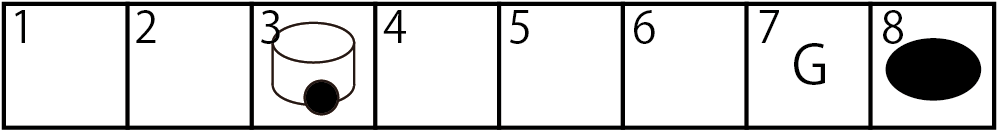
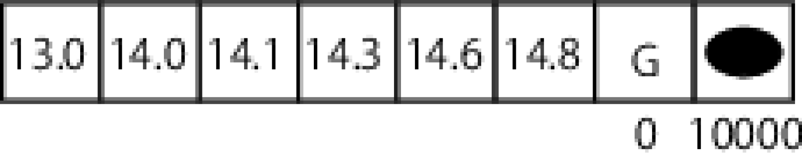

<!-- footer: "機械学習（と統計）第14回" -->

# 機械学習

## 第14回: 強化学習

千葉工業大学 上田 隆一

 

This work is licensed under a [Creative Commons Attribution-ShareAlike 4.0 International License](https://creativecommons.org/licenses/by-sa/4.0/).

---

<!-- paginate: true -->

## 今日やること

- なにかを実行するということはどういうことかを考える

---

## 自分がやってることの根拠

- あります?
    - なんで朝飯食ったのか?
    - なんで朝飯はそれを食ったのか?
    - なんで大学来たのか
    - なんで講義受けているのか/講義の途中にゲームやるのか・やらないのか
- たぶん以下の理由でやってる
    - そうすると良いことがありそうだから
        - 良いこと: 楽しいなども含む
    - そうしないと悪いことがありそうだから

---

### 行動決定のモデル

- 「なにか行動をするといいことがある」を機械学習に取り入れるには？
    - 数値化の必要あり
- いいこと（2種類）
    - その時その時に良いことがある（なにか食べているとき）
    - 行動の結果、よい状態になる
- 記号
    - 状態$\boldsymbol{x}$: 世の中の全変数を並べたベクトル（超膨大）
    - 行動$a$: 状態を変えるなにか
    - 報酬$r$: 行動$a$の結果もらえる（行動ごとにもらえる）
    - 終端状態$\boldsymbol{x}_\text{f}$とその価値$V(\boldsymbol{x}_\text{f})$
        - 一連の行動が終わった状態と、その状態の良さ

---

### 「よい行動」

- 状態$\boldsymbol{x}$、行動$a$、報酬$r$、終端状態の価値$V(\boldsymbol{x}_\text{f})$でどう表現するか？
- こたえ: 一連の行動がおわったときの$r$と$V(\boldsymbol{x}_\text{f})$の和
    - たとえばある状態$\boldsymbol{x}_\text{f}$に行きつくのに10回行動が必要だった$\Rightarrow$
    $r_1 + r_2 + \dots + r_{10} + V(\boldsymbol{x}_\text{f})$
- あくまで主観
    - ひとそれぞれ。何をやってもいつか死ぬので難しい話
- 授業中の行動をモデル化してみましょう！
    - 話を聞くか、寝るか、ゲームをするか、ほかの勉強をするか・・・
        * その場のいいことは$r$が大きい
        * 最終的にいいことは$V(\boldsymbol{x}_\text{f})$が大きい
        * 最終的にあとに残るのは$\boldsymbol{x}_\text{f}$のみ（薬物依存とか）

---

### 数値ひとつで行動が決められるのか？

- 行動は同時にできず1つしか選べない
    - なんらかの原因・理由があって今その行動をしているので
    - 選んだ行動はなんらかの点数付けの上で選ばれていると解釈することは可能

---

### 強化学習

- $r_1 + r_2 + \dots + r_i + V(\boldsymbol{x}_\text{f})$がよりよくなる行動を
コンピュータやロボットに選ばせるように学習させる仕組み
- 学習するもの: $\Pi$: 方策
    - ある状態$\boldsymbol{x}$でどの行動$a$を選ぶかを決める関数
    - $a = \Pi(\boldsymbol{x})$
- 損失関数
    - $J(\Pi | \boldsymbol{x}) = \left\langle r_1 + r_2 + \dots + r_i + V(\boldsymbol{x}_\text{f}) \right\rangle_{\Pi}$
        - $\boldsymbol{x}$: 最初の状態

---

### 簡単な例題で考えましょう

- タイルワールド（右図）のQ学習を扱う
- こんな問題
    - ロボットは右か左どちらかを選択してサイコロを振って出たマスだけ移動
        - 端より先には行けず、そこに停留
    - ゴール or 穴のマスに止まれば終了
- 記号などの定義: 右図
    - 以後は報酬、価値に$-1$をかけて「損失$\ell = -r$」で考えます
- ある場所から出発したときに、損失の期待値を最小化したい（どうしましょう？）

---

### 一番よい方策（最適方策）

- おそらくこれ（とにかく穴をさけたほうがよい）
    - $\boldsymbol{x}^{(1)}$以外では「左」を選択
    - $\boldsymbol{x}^{(1)}$で「右」を選択
- 最適方策:
    - $\Pi(\boldsymbol{x}^{(i)}) = \begin{cases}\text{右}\quad(i=1)\\\text{左}\quad(i=2,3,\dots,6)\end{cases}$

これをどうやってコンピュータに解かせましょう？

---

### 問題の性質

- ある状態に対し、そこからスタートしたときの損失関数の期待値が計算可能
    - 損失関数（再掲）: $J(\Pi | \boldsymbol{x}) = \left\langle r_1 + r_2 + \dots + r_i + V(\boldsymbol{x}_\text{f}) \right\rangle_{\Pi}$
    - 右図: 計算したもの
- $\boldsymbol{x}$は最初の状態でなくてもよい
    - 別の状態からスタートしても、ある時点で$\boldsymbol{x}$にいたら、以後の$J$の期待値は右図の計算した値
- 損失関数の期待値を状態の関数にできる

---

### 行動決定のモデル

- これも確率で考える
    - $a \sim \Pi(a | \boldsymbol{x})$
        - $a$: 機械のなんらかの出力や動物・人間の行動を漠然と記号化したもの
        - $\boldsymbol{x}$: 世の中の全変数を並べたベクトル（超膨大）
            - 実際には行動と独立でない変数だけしかいらない
        - $\Pi$: 方策
            - 行動を決めているプログラムや脳の一部
- 例
    - $\boldsymbol{x}$: 昨夜酒飲んでて4時間しか寝てない
    - $\Pi($大学に行く$|\boldsymbol{x}) = 0.3$、$\Pi($そのまま布団で寝る$|\boldsymbol{x}) = 0.6$、
    $\Pi($とりあえず飲みなおす$|\boldsymbol{x}) = 0.1$

---

### 「良い方策」行動の定義

- 行動の結果に点数をつける$\rightarrow$良い点数をとれる$\Pi$が良い方策と考える
    - $J(\Pi) = \left\langle \left\langle R(\boldsymbol{x},a,\boldsymbol{x}') \right\rangle_{p(\boldsymbol{x}' | a, \boldsymbol{x})} \right\rangle_{\Pi(a| \boldsymbol{x})}$
        - $\boldsymbol{x}'$: 行動$a$のあとの状態
        - $p(\boldsymbol{x}'|a, \boldsymbol{x})$: 状態遷移分布
            - $\boldsymbol{x}$で行動$a$をとったときの、次の状態$\boldsymbol{x}'$の分布
        - $R$: 報酬関数（損失関数にマイナスをつけたもの）
            - $\boldsymbol{x}$で行動$a$をとって$\boldsymbol{x}'$に状態が変化したことに対する評価
- 前のページの例で$R$を考えてみましょう
    - 注意: 報酬関数はあくまで主観で、ひとそれぞれ
        - 社会的にうまくいかないのは$\Pi$のせいではなく$R$のせいと考えましょう

---

### 問題

- 「教員がトイレに駆け込んだ状況$\boldsymbol{x}$においてテストでカンニングをするかどうか」で$J, \Pi, p, R$の式の様々なバージョンを考えてみましょう
    - $J(\Pi) = \left\langle \left\langle R(\boldsymbol{x},a,\boldsymbol{x}') \right\rangle_{p(\boldsymbol{x}' | a, \boldsymbol{x})} \right\rangle_{\Pi(a| \boldsymbol{x})}$
- 例（$J$の計算はお任せします）
    * ある人の方策: $\Pi($する$|\boldsymbol{x})=0.01, \Pi($しない$|\boldsymbol{x})=0.99$
        * するかしないかどっちかを選ぶときは片方の確率を$1$にする
    * 状態遷移: $P($ばれる$|$する$, \boldsymbol{x}) = 0.5, P($ばれない$|$する$, \boldsymbol{x}) = 0.5,$
    $P($ばれない$|$しない$, \boldsymbol{x}) = 1$
    * 報酬関数: $R(\boldsymbol{x},$する$,$ ばれる$) = -10000,$
    $R(\boldsymbol{x},$する$,$ ばれない$) = 80, R(\boldsymbol{x},$しない$,$ばれない$) = 60$

---

## 多段の行動決定

- 行動決定の難しいところ: 「その先」がある
    - そのときは良くてもあとでひどい目に遭うなど、先のことを考えて行動したほうがいい場合が多い
    - 先のことが考えられていない例
        - ギャンブルでお金を溶かして少しずつ横領を繰り返している
        - カンニングを含む安易な方法でテストを
        乗り切っていて勉強が身につかない
        - なんらかの依存症（自分では抜け出せないので人を頼りましょう）

---

### 多段の行動（状態遷移）のモデル

- このワンセットの繰り返し（$i=0,1,2,\dots$）
    - $a_{i+1} \sim \Pi(a | \boldsymbol{x}_i)$: 　　  　　状態$\boldsymbol{x}_i$から行動$a_{i+1}$を選択
    - $\boldsymbol{x}_{i+1} \sim p(\boldsymbol{x} |a_{i+1}, \boldsymbol{x}_i)$:　　状態が$\boldsymbol{x}_{i+1}$に遷移
    - $r_{i+1} = R(\boldsymbol{x}_i, a_{i+1}, \boldsymbol{x}_{i+1})$: 報酬を観測
- このような行動の履歴（エピソード）が残っていく
    - $\boldsymbol{x}_0, a_1, \boldsymbol{x}_1, r_1, a_2 \boldsymbol{x}_2, r_2, \dots, a_t, \boldsymbol{x}_t, r_t$
        - $t$: 現時刻

---

### 多段の行動の評価

終わりのあるタスクを考えましょう

- エピソードに対する評価: $\sum_{i=1}^T r_i + V(\boldsymbol{x}_T)$
    - 最初の項: $r_1, r_2, \dots, r_T$の和（報酬の積算）
    - 2番目の項: 最後の「ご褒美」（正式には価値）
        - 最後の状態（終端状態）に対して与える（例:「大学に合格した状態」）
- 方策に対する評価
	- $J(\Pi| \boldsymbol{x}_0) = \left\{\sum_{i=1}^T r_i + V(\boldsymbol{x}_T)\right\}$の期待値
    $=\left\langle \sum_{i=1}^T R(\boldsymbol{x}_{i-1}, a_i, \boldsymbol{x}_i) + V (\boldsymbol{x}_T)\right\rangle_{\Pi}$
	    - この値が一番よくなるのが「いい方策」
	    - $\boldsymbol{x}_0$はコントロールできないので条件に

---

### ここで問題

- ずっと報酬がマイナスで最後に良いことがあるという
タスクの例を考えてみましょう
    - その例で、$T$が大きいとどうなるでしょうか？
* ありがちな話
    - その場での報酬の高い行動をとる（=苦痛を避ける）
    - 原因: 将来のエピソードが不確か
* ちなみに: 終わりのないタスクに対して↓こういう式を使うこともある
    - $\sum_{i=1}^\infty \gamma^i r_i$（$0 < \gamma < 1$）
        - 未来に観測される報酬や価値を低く見積もる
            - $\gamma$が小さすぎると刹那的に

---

### ずーっと報酬がマイナスの例

- 長距離のロボットの移動
    - 移動中は電気を食う/汚れる/時間がかかる
- 勉強
    - つらい/遊べない

---

### 遠い目標に前向きになるにはどうしたらいいか？

- 実は人工知能の研究者が取り組んできた課題
    - ロボットや知能（エージェント）が途中でぐずってタスクを完遂できない
    - 人間と同じ（たぶん人間にも難問）
- ひとつの解: その場の報酬$r$ではなく、その状態の価値を計算できるようにする

---

### 「状態の価値」

- この関数について、今度は$\Pi$を固定することを考える
	- $J(\Pi| \boldsymbol{x}_0) = \left\langle \sum_{i=1}^T R(\boldsymbol{x}_{i-1}, a_i, \boldsymbol{x}_i) + V (\boldsymbol{x}_T)\right\rangle_{\Pi}$
- 様々な初期状態$\boldsymbol{x}_0$に対して期待値が決まる
    - 終端状態に対しては$V$の値が固定されている
    - 他の状態の期待値は何度も試行して統計をとると決まる
$\Longrightarrow$終端状態の価値を拡張して、その状態の価値$V(\boldsymbol{x})$を考える
	    - $V^\Pi(\boldsymbol{x}) = \left\langle \sum_{i=1}^T R(\boldsymbol{x}_{i-1}, a_i, \boldsymbol{x}_i) + V (\boldsymbol{x}_T)\right\rangle_{\Pi}$
	        - ここで$\boldsymbol{x}=\boldsymbol{x}_0$
- $V^\Pi$: 方策$\Pi$に対する状態価値関数と呼ばれる

---

### 状態の価値、状態価値関数の性質

- ある状態の価値は、その状態からタスクの終了までの報酬の積算と終端状態の価値の和
    - つらいタスクでも終端状態の価値が織り込まれている
        - 例
            - ロボットならばゴールまでの時間や必要な燃料
            - 勉強ならばテストで測られる達成度、資格など
        - $\Longrightarrow$（もし適切に計算できれば）直近の報酬が悪くても方策に真面目にしたがって価値が高くなるように行動をしていけばゴールに近づく
