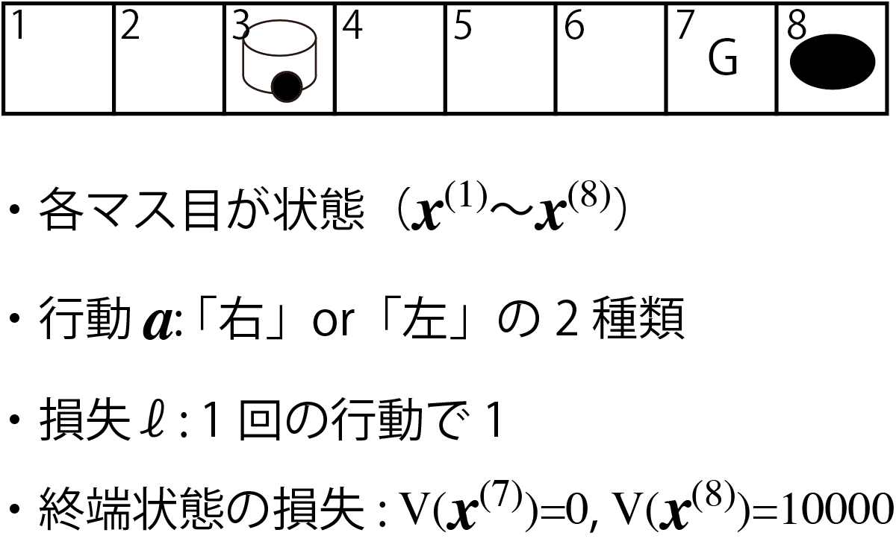
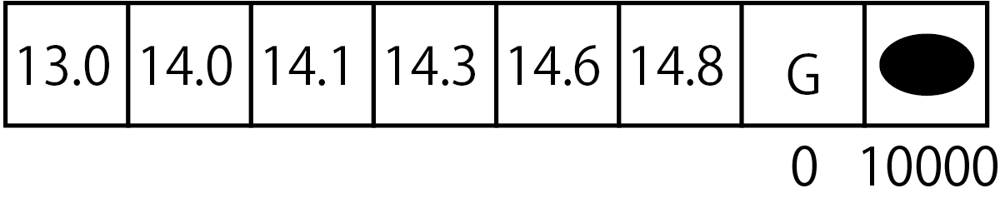
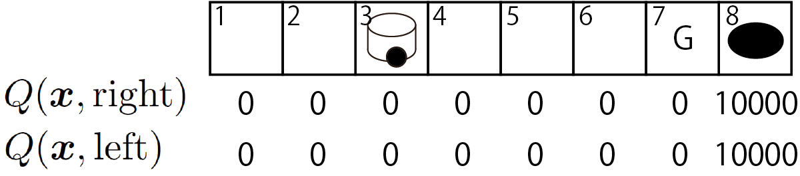
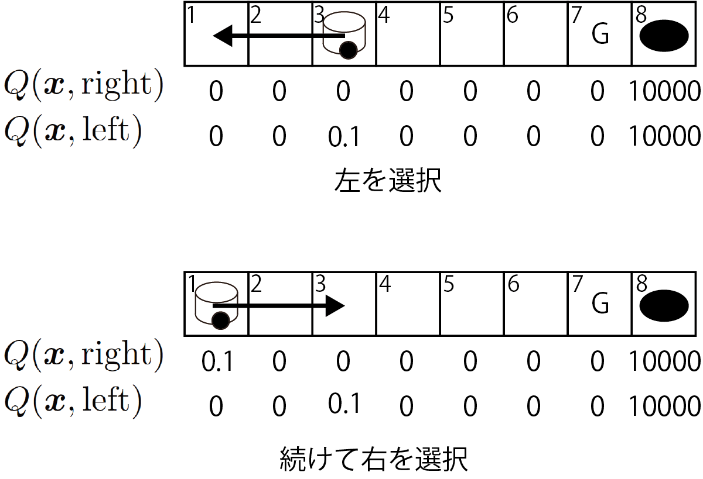
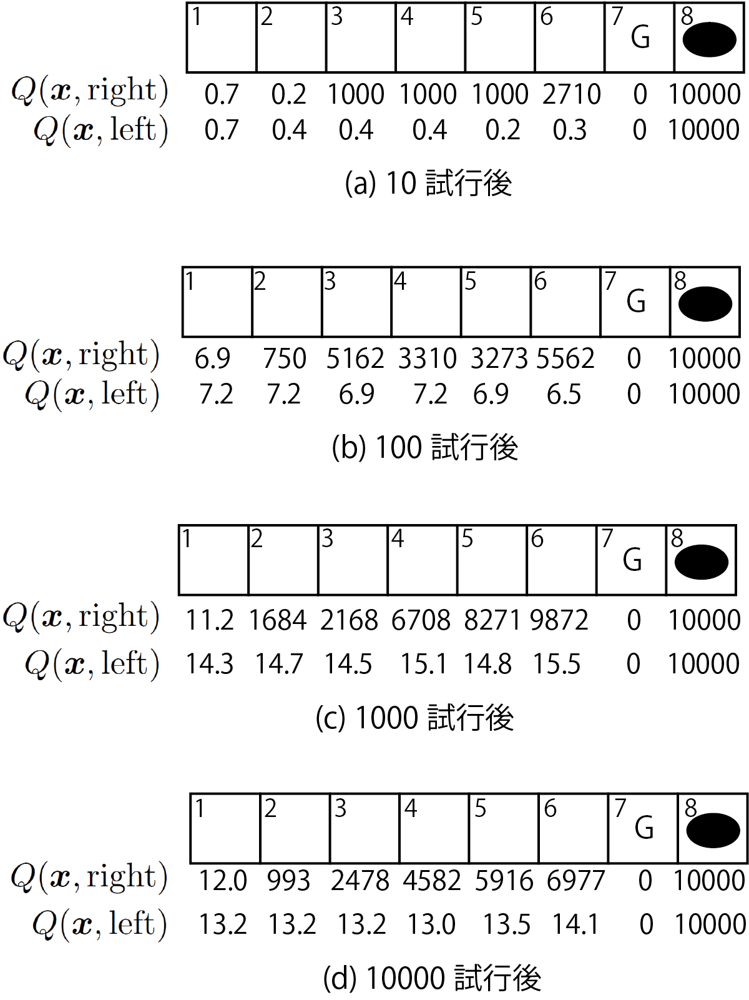
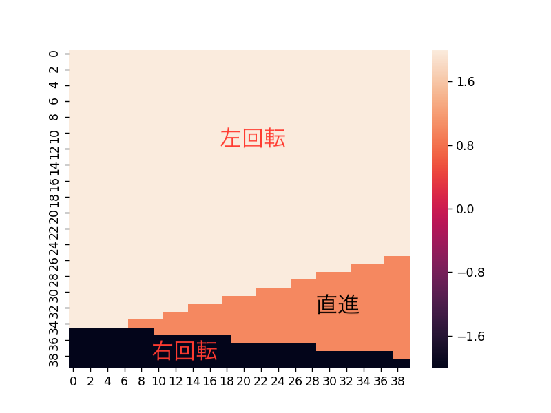
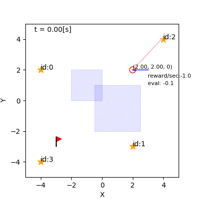

<!-- footer: "機械学習（と統計）第14回" -->

# 機械学習

## 第14回: 強化学習

千葉工業大学 上田 隆一

 

This work is licensed under a [Creative Commons Attribution-ShareAlike 4.0 International License](https://creativecommons.org/licenses/by-sa/4.0/).

---

<!-- paginate: true -->

## 今日やること

- なにかをやるということはどういうことかを考える
- Q学習

---

## 自分がやってることの根拠

- あります?
    - なんで朝飯食ったのか?
    - なんで朝飯はそれを食ったのか?
    - なんで大学来たのか
    - なんで講義受けているのか/講義の途中にゲームやるのか・やらないのか
- たぶん以下の理由でやってる
    - そうすると良いことがありそうだから
        - 良いこと: 楽しいなども含む
    - そうしないと悪いことがありそうだから

---

### 行動決定のモデル

- 「なにか行動をするといいことがある」を機械学習に取り入れるには？
    - 数値化の必要あり
- いいこと（2種類）
    - その時その時に良いことがある（なにか食べているとき）
    - 行動の結果、よい状態になる
- 記号
    - 状態$\boldsymbol{x}$: 行動に関係する変数を並べたベクトル
    - 行動$a$: 状態を変えるなにか
    - 損失$\ell$: 行動$a$の結果被る（行動は疲れる）
    - 終端状態$\boldsymbol{x}_\text{f}$とその価値$V(\boldsymbol{x}_\text{f})$
        - 一連の行動が終わった状態と、その状態の良さ

---

### 「よい行動」

- 状態$\boldsymbol{x}$、行動$a$、損失$\ell$、終端状態の価値$V(\boldsymbol{x}_\text{f})$でどう表現するか？
- こたえ: 一連の行動がおわったときの$\ell$と$V(\boldsymbol{x}_\text{f})$の和
    - たとえばある状態$\boldsymbol{x}_\text{f}$に行きつくのに10回行動が必要だった$\Rightarrow$
    $\ell_1 + \ell_2 + \dots + \ell_{10} + V(\boldsymbol{x}_\text{f})$
- あくまで主観
    - ひとそれぞれ。何をやってもいつか死ぬので難しい話
- 授業中の行動をモデル化してみましょう！
    - 話を聞くか、寝るか、ゲームをするか、ほかの勉強をするか・・・
        * その場のいいことは$\ell$がマイナスに（報酬）
        * 最終的にいいことは$V(\boldsymbol{x}_\text{f})$が大きい
        * 最終的にあとに残るのは$\boldsymbol{x}_\text{f}$のみ（薬物依存とか）

---

### 数値ひとつで行動が決められるのか？

- 行動は同時にできず1つしか選べない
    - なんらかの原因・理由があって今その行動をしているので
    - 選んだ行動はなんらかの点数付けの上で選ばれていると解釈することは可能

---

### 強化学習

- $r_1 + r_2 + \dots + r_i + V(\boldsymbol{x}_\text{f})$がよりよくなる行動を
コンピュータやロボットに選ばせるように学習させる仕組み
- 学習するもの: $\Pi$: 方策
    - ある状態$\boldsymbol{x}$でどの行動$a$を選ぶかを決める関数
    - $a = \Pi(\boldsymbol{x})$
- 損失関数
    - $J(\Pi | \boldsymbol{x}) = \left\langle r_1 + r_2 + \dots + r_i + V(\boldsymbol{x}_\text{f}) \right\rangle_{\Pi}$
        - $\boldsymbol{x}$: 最初の状態

---

### 簡単な例題で考えましょう

- タイルワールド（右図）のQ学習を扱う
- こんな問題
    - ロボットは右か左どちらかを選択してサイコロを振って出たマスだけ移動
        - 端より先には行けず、そこに停留
    - ゴール or 穴のマスに止まれば終了
- 記号などの定義: 右図
- ある場所から出発したときに、損失の期待値を最小化したい（どうしましょう？）

---

### 一番よい方策（最適方策）

- おそらくこれ
（とにかく穴をさけたほうがよい）
    - $\boldsymbol{x}^{(1)}$以外では「左」を選択
    - $\boldsymbol{x}^{(1)}$で「右」を選択
- 最適方策:
    - $\Pi(\boldsymbol{x}^{(i)}) = \begin{cases}\text{右}\quad(i=1)\\\text{左}\quad(i=2,3,\dots,6)\end{cases}$
- これをどうやってコンピュータに解かせましょう？

---

### 問題の性質

- ある状態に対し、そこからスタートしたときの損失関数の期待値が計算可能
    - 損失関数: $J(\Pi | \boldsymbol{x}) = \left\langle \sum_{j=1}^{i} r_j + V(\boldsymbol{x}_\text{f}) \right\rangle_{\Pi}$
    - 右図: 計算したもの
- $\boldsymbol{x}$は最初の状態でなくてもよい
    - 別の状態からスタートしても、ある時点で$\boldsymbol{x}$にいたら、以後の$J$の期待値は右図の計算した値
    - 過去のことはこれからの行動選択には無関係
- 損失関数の期待値を状態の関数にできる
    - 終端状態の価値を拡張して
    関数$V^\Pi(\boldsymbol{x})$（状態価値関数）を考える

---

### 状態価値関数の性質

- 方策にしたがって行動をとったときに次の関係
    - $V^\Pi(\boldsymbol{x}) = \big\langle \ell(\boldsymbol{x}, a, \boldsymbol{x}')  + V^\Pi(\boldsymbol{x}' )\big\rangle_{P(\boldsymbol{x}' | \boldsymbol{x}, a)}$
        - $\boldsymbol{x}$: ある状態
        - $a$: 行動
        - $\boldsymbol{x}'$: 行動をとったあとの状態
        （複数の候補あり）
    - $\ell(\boldsymbol{x}, a, \boldsymbol{x}')$: 行動に対する損失の関数
- 右の例: 左端の2つの状態が分かりやすい
    - 問題: 左から3つめの状態について計算を
- もし別の行動をとって右辺のほうが左辺よりよかったら$\Rightarrow$もっと良い方策がある

---

### 方策の改善

こういう方法が考えられる

- 最初に適当な$V$を設定
- $V^\Pi(\boldsymbol{x})$と$\big\langle \ell(\boldsymbol{x}, a, \boldsymbol{x}')  + V^\Pi(\boldsymbol{x}' )\big\rangle_{P(\boldsymbol{x}' | \boldsymbol{x}, a)}$を比較
- 後者のほうがよければ
    - $\Pi(\boldsymbol{x})$の行動を変える
    - $V^\Pi(\boldsymbol{x})\longleftarrow \big\langle \ell(\boldsymbol{x}, a, \boldsymbol{x}')  + V^\Pi(\boldsymbol{x}' )\big\rangle_{P(\boldsymbol{x}' | \boldsymbol{x}, a)}$
    - ※ただし、偶然良かっただけかもしれないので慎重に

これが強化学習の原理

---

## Q学習

- 先ほどの原理でロボットを
学習させてみましょう
- ただし、行動価値関数というものを考える
    - $Q(\boldsymbol{x}, a)$: $\boldsymbol{x}$で$a$をとるときの
    状態$\boldsymbol{x}$の価値
    - $V(\boldsymbol{x}) = \max_a Q(\boldsymbol{x}, a)$
- まず、$Q$を初期化（右図）

---

### 値の更新

- ロボットに適当に動いてもらって$Q$の値を更新
- 更新式
	- もとの$Q$の値を少しだけ変更
	- $Q(\boldsymbol{x}, a)\longleftarrow\alpha q(\boldsymbol{x}, a) + (1-\alpha) Q(\boldsymbol{x}, a)$
        - $\alpha$: 学習率（右図の例だと$\alpha=0.1$）
	    - $q(\boldsymbol{x}, a) = \ell + V(\boldsymbol{x}')$
	        - $V(\boldsymbol{x}') = \min_{a'} Q(\boldsymbol{x}', a')$

---

### 方策の工夫

- 方策が完全にランダムだとゴールに着かず
学習が進まない
- そのときに一番良い行動しかとらないと
別の可能性が探れない
    - 例: 右図のようになってしまうと$\boldsymbol{x}^{(3)}, \boldsymbol{x}^{(6)}$で左が選ばれなくなり学習が進まない
    - こういうことは日常でないだろうか？
- $\Rightarrow$方策を次のように確率的に
（$\varepsilon$グリーディー方策）
    - 確率$(1-\varepsilon)$で$Q$値が一番良い行動をとる
    - 確率$\varepsilon$でランダムに行動選択

---

### 学習の実行例

- 100試行までには最適方策が得られている
- $V$、$Q$はなかなか収束しない

---

### 少し大きな問題

- 右のロボットが、水たまりを避けてゴールに
行くように学習させたい
    - いまのところ水たまりに一直線

