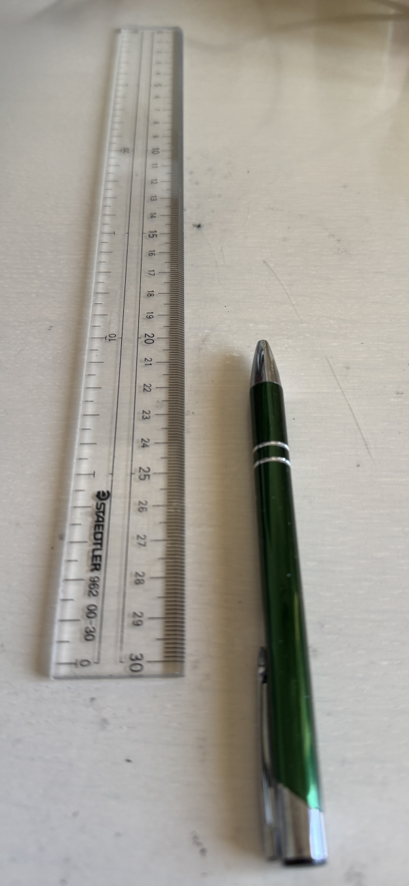
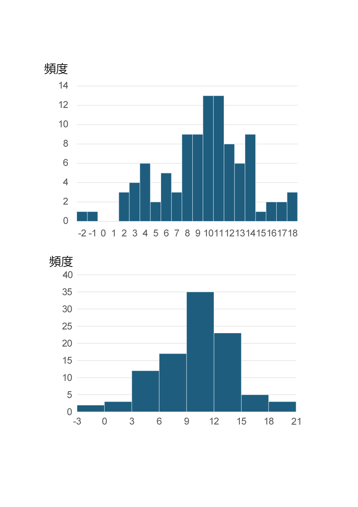
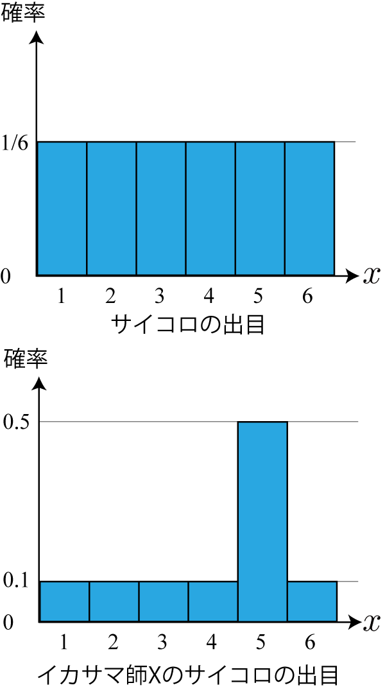
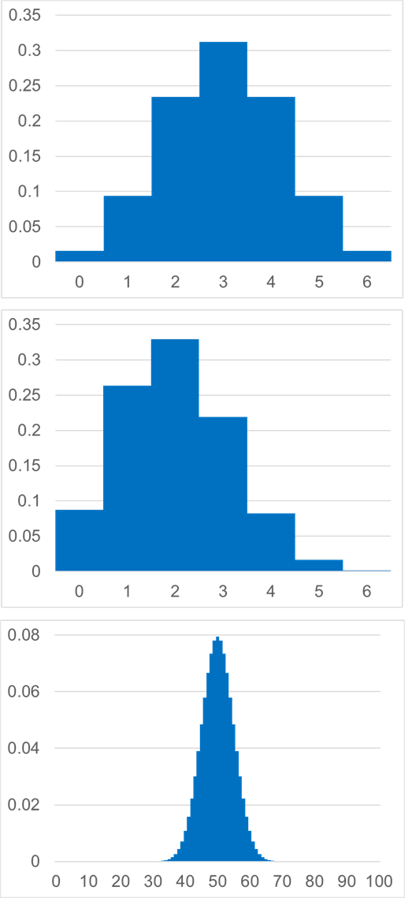
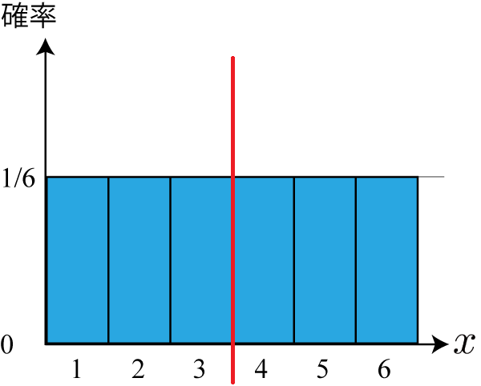

<!-- footer: "機械学習（と統計）第3回" -->

# 機械学習

## 第3回: 様々な分布I

千葉工業大学 上田 隆一

 

This work is licensed under a [Creative Commons Attribution-ShareAlike 4.0 International License](https://creativecommons.org/licenses/by-sa/4.0/).

---

<!-- paginate: true -->

## 今日やること

- 二項分布
- 分布の平均値と分散
- ガウス分布

---

### 実験

1. ノートか定規を用意
    - ノートの場合は1, 2, 3, 4, 5, ....と罫線に数字を書く
2. 以下を繰り返す
    - ペンを右の写真のようにセット
    - 指で根本を弾いてペン先の位置を記録（四捨五入で）

- なにか傾向が出てくるまでやってみましょう
    - 本当は結果を見ながら試行したらダメなんだけど
    - 何回か練習してからやりましょう

---

### 結果の例

- 講師が10を狙って100回試行した結果
- 疑問
    - こういう傾向をどう数学で扱う？
    - なんでこういう形になるんだろう？

---

### 確率分布

- どの事象がどの確率で起こるかをモデル化したもの
    - 数式で表したり、右のように図にしたり
- 確率分布の作り方
    - 前ページのような試行に数式を当てはめる
    - サイコロの話の際、右図のような前提を置く
- 用途の例
    - コンピュータに読み込んで計算、分析に使用
    - 前回、前々回のボウリングの結果になにか数式を当てはめて一般化
    - シミュレーション
    - ・・・

---

### 確率分布を定義するときのルール

- 互いに排反な事象を、抜けなく順番に番号（確率変数、小数も可）をつけて並べた横軸を用意
    - 例1: サイコロの場合
        - 事象「$x$が出る$(x=1, 2, \dots, 6)$」の$x$を確率変数に
            - 注意: 「3が出る」と「奇数が出る」を並べてはいけない
    - 例2: コインの場合
        - 表が0、裏が1（0や1にする必然性はない）
- 記号では$P(x)$と表す
    - $\text{Pr}\{X\}$との違いはなんでしょう？

---

### もうひとつの疑問: なんで山型に？

- 狙ったところにいかない個別の理由はたくさんある
    - 具体的な理由が気になるけどここでは取り上げません
- 個別ではなく全体の理由
    - 例えば10個の理由A, B, C, ..., Jがあるとして、その理由で発生する誤差を$e_\text{A}, e_\text{B}, ..., e_\text{J}$とする
    - これらの誤差が一斉に正、あるいは負になると大きな誤差が出るけど、そんな偶然が起こる確率は低い

→ 必然的に真ん中に山ができる

---

### 二項分布

- 前ページの現象を説明する確率分布
- コインを$n$枚投げたときに表が$m$枚出る確率
    - 前ページの「誤差が正、負になる」がコインの裏表に相当
    - 表の出る確率を$p$と一般化して計算してみましょう
        - 残念ながら加法定理、乗法定理で分解する方法では
        計算が難しいので原理からどうぞ

---

### 二項分布の式

- 考え方
    - $n$枚のコインを1枚ずつ投げて、$m$個のコインで表が出る場合の数: $_nC_m$
        - $_nC_m = \dfrac{n!}{(n-m)!m!}$
    - 上記の場合について、ひとつひとつの並びが出る確率: $p^m (1-p)^{n-m}$
    - ひとつひとつの並びが出る事象は互いに排反なので、$p^m (1-p)^{n-m}$を$_nC_m$個かけると求める確率になる
- 上記の考え方で求まる式: $P(m | n, p) =_n\!\!C_m p^m (1-p)^{n-m}$
    - 分布全体は$B(n, p)$と表す

---

### 二項分布の形

- $P(m | n, p) =_n\!\!C_m p^m (1-p)^{n-m}$を絵に描いてみましょう
    - 再掲: $_nC_m = \dfrac{n!}{(n-m)!m!}$
    - 例は次のページ

---

### 二項分布の形の例

- 例
    - 上: $P(m | n=6, p=1/2)$
    - 中: $P(m | n=6, p=1/3)$
        - 表が出にくいので分布が左に寄る
    - 下: $P(m | n=100, p=1/2)$
        - 形状がなめらかに
        - 「すべて表」、「すべて裏」などが滅多に起こらないことが分かる
    - 問題: 100円かけて100枚のコインを投げてすべて表が出たら1億円もらえるとしたら賭けに参加しますか？

---

### 分布と平均値・分散

- 分布の形状には様々な特徴が存在
    - 中心がどこにあるか
    - どれだけ横に広いか
    - いくつ山があるか
    - 山がどれだけ鋭いか・・・
- 第1回で「データを1つの数値であらわす代表値」を扱ったが分布にもある
    - 分布を数式であらわすときにも利用
- 分布をあらわす重要な数値
    - 平均値: 中心がどこにあるか
    - 分散: どれだけ横に広いか

---

### 分布の平均値

- $P(x)$の平均値: $x$の期待値
    - 例: さいころの目
        - $1 \cdot 1/6 + 2 \cdot 1/6 + \cdots + 6 \cdot 1/6 = 3.5$

