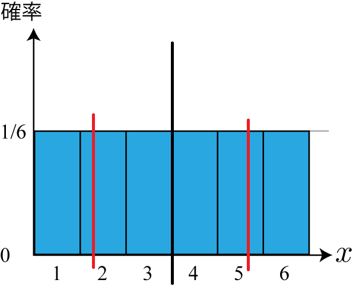
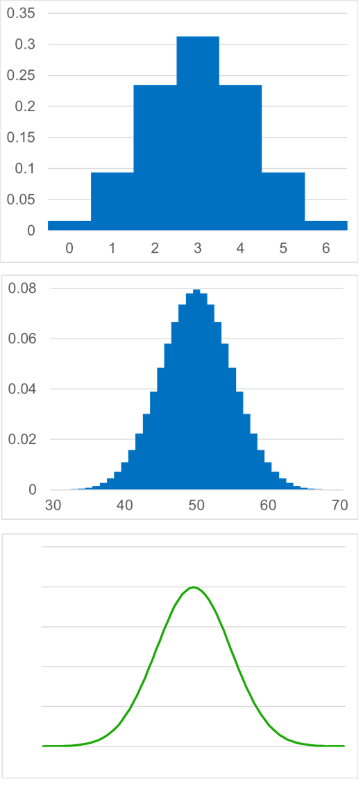

<!-- footer: "機械学習（と統計）第3回" -->

# 機械学習

## 第3回: 様々な分布I

千葉工業大学 上田 隆一

 

This work is licensed under a [Creative Commons Attribution-ShareAlike 4.0 International License](https://creativecommons.org/licenses/by-sa/4.0/).

---

<!-- paginate: true -->

## 今日やること

- 二項分布
- 分布の平均値と分散
- ガウス分布

---

### 実験

1. ノートか定規を用意
    - ノートの場合は1, 2, 3, 4, 5, ....と罫線に数字を書く
2. 以下を繰り返す
    - ペンを右の写真のようにセット
    - 指で根本を弾いてペン先の位置を記録（四捨五入で）

- なにか傾向が出てくるまでやってみましょう
    - 本当は結果を見ながら試行したらダメなんだけど
    - 何回か練習してからやりましょう

---

### 結果の例

- 講師が10を狙って100回試行した結果
- 疑問
    - こういう傾向をどう数学で扱う？
    - なんでこういう形になるんだろう？

---

### 確率分布

- どの事象がどの確率で起こるかをモデル化したもの
    - 数式で表したり、右のように図にしたり
- 確率分布の作り方
    - 前ページのような試行に数式を当てはめる
    - サイコロの話の際、右図のような前提を置く
- 用途の例
    - コンピュータに読み込んで計算、分析に使用
    - 前回、前々回のボウリングの結果になにか数式を当てはめて一般化
    - シミュレーション
    - ・・・

---

### 確率分布を定義するときのルール

- 互いに排反な事象を、抜けなく順番に番号（確率変数、小数も可）をつけて並べた横軸を用意
    - 例1: サイコロの場合
        - 事象「$x$が出る$(x=1, 2, \dots, 6)$」の$x$を確率変数に
            - 注意: 「3が出る」と「奇数が出る」を並べてはいけない
    - 例2: コインの場合
        - 表が0、裏が1（0や1にする必然性はない）
- 記号では$P(x)$と表す
    - $\text{Pr}\{X\}$との違いはなんでしょう？

---

### もうひとつの疑問: なんで山型に？

- 狙ったところにいかない個別の理由はたくさんある
    - 具体的な理由が気になるけどここでは取り上げません
- 個別ではなく全体の理由
    - 例えば10個の理由A, B, C, ..., Jがあるとして、その理由で発生する誤差を$e_\text{A}, e_\text{B}, ..., e_\text{J}$とする
    - これらの誤差が一斉に正、あるいは負になると大きな誤差が出るけど、そんな偶然が起こる確率は低い

→ 必然的に真ん中に山ができる

---

### 二項分布

- 前ページの現象を説明する確率分布
- コインを$n$枚投げたときに表が$m$枚出る確率
    - 前ページの「誤差が正、負になる」がコインの裏表に相当
    - 表の出る確率を$p$と一般化して計算してみましょう
        - 残念ながら加法定理、乗法定理で分解する方法では
        計算が難しいので原理からどうぞ

---

### 二項分布の式

- 考え方
    - $n$枚のコインを1枚ずつ投げて、$m$個のコインで表が出る場合の数: $_nC_m$
        - $_nC_m = \dfrac{n!}{(n-m)!m!}$
    - 上記の場合について、ひとつひとつの並びが出る確率: $p^m (1-p)^{n-m}$
    - ひとつひとつの並びが出る事象は互いに排反なので、$p^m (1-p)^{n-m}$を$_nC_m$個かけると求める確率になる
- 上記の考え方で求まる式: $P(m | n, p) =_n\!\!C_m p^m (1-p)^{n-m}$
    - 分布全体は$B(n, p)$と表す

---

### 二項分布の形

- $P(m | n, p) =_n\!\!C_m p^m (1-p)^{n-m}$を絵に描いてみましょう
    - 再掲: $_nC_m = \dfrac{n!}{(n-m)!m!}$
    - 例は次のページ

---

### 二項分布の形の例

- 例
    - 上: $P(m | n=6, p=1/2)$
    - 中: $P(m | n=6, p=1/3)$
        - 表が出にくいので分布が左に寄る
    - 下: $P(m | n=100, p=1/2)$
        - 形状がなめらかに
        - 「すべて表」、「すべて裏」などが滅多に起こらないことが分かる
    - 問題: 100円かけて100枚のコインを投げてすべて表が出たら1億円もらえるとしたら賭けに参加しますか？

---

### 分布と平均値・分散

- 分布の形状には様々な特徴が存在
    - 中心がどこにあるか
    - どれだけ横に広いか
    - いくつ山があるか
    - 山がどれだけ鋭いか・・・
- 第1回で「データを1つの数値であらわす代表値」を扱ったが分布にもある
    - 分布を数式であらわすときにも利用
- 分布をあらわす重要な数値
    - 平均値: 中心がどこにあるか
    - 分散: どれだけ横に広いか

---

### 分布の平均値

- $P(x)$の平均値: $x$の期待値
    - 例: さいころの目
        * $1 \cdot 1/6 + 2 \cdot 1/6 + \cdots + 6 \cdot 1/6 = 3.5$
- ついでに1: 分布$P(x)$にしたがう$x$の期待値の表記法
    - $\langle x \rangle_P$と書いたり$E_P( x )$と書いたり
        - この資料では前者を使います
- ついでに2: 右のようにある範囲でどこも確率が同じ分布を一様分布と呼びます
        - $U(a,b)$と表記（$a$から$b$までの範囲に確率）

---

### 分布の分散

- 平均値と各値との差の2乗の期待値
    - 例: さいころの目
        * $(1-3.5)^2 \cdot 1/6 + 
        (2-3.5)^2 \cdot 1/6 + 
        (3-3.5)^2 \cdot 1/6$
        $+ (4-3.5)^2 \cdot 1/6 + 
        (5-3.5)^2 \cdot 1/6 + 
        (6-3.5)^2 \cdot 1/6$
        $=$計算が大変
        * $\langle ( x - 3.5)^2 \rangle_P = \langle x^2 -7x + (3.5)^2 \rangle_P$
        $= \langle x^2 \rangle_P -7 \langle x \rangle_P + (3.5)^2 = \langle x^2 \rangle_P -7 \cdot 3.5 + (3.5)^2$
        $= \langle x^2 \rangle_P - (3.5)^2 = \dfrac{1+4+9+16+25+36}{6} -\dfrac{49}{4}$
        $= \dfrac{91}{6} - \dfrac{49}{4} = \dfrac{35}{12}$
- 数字の意味はよくわからない（もとの量を2乗しているため）

---

### 分布の標準偏差

- 標準偏差
    - 分散の正の平方根
    - どれくらい分布が広いかを直感的につかむときに使用
    - サイコロの場合
        * $\sqrt{\langle ( x - 3.5)^2 \rangle_P} = \sqrt{\dfrac{35}{12}} \approx 1.7$
        - 右図の範囲
- 「どれだけ広いか」なら「3」でよくない？
    - それでもよいが、すそのの広い分布を扱うときは標準偏差が便利

---

### ガウス分布（正規分布）

- ペンの例は頻度を10mm、30mm区切りで考えていたけど長さは本来は小数（実数）
    - 二項分布は変数が整数だったけど、
    実数は扱えるのだろうか？（無理）
- 二項分布の$n$を増やしていくとどんなことになるだろうか？
    - ガウス分布に
        - 右下図のような形状に
        - $p$の値にはよらないらしい（講師は未検証です）

---

### ガウス分布の式

- $p(z | \mu, \sigma^2 ) = \frac{1}{\sqrt{2\pi}\sigma} e^{ - \frac{(z - \mu)^2}{2\sigma^2}} = \frac{1}{\sqrt{2\pi}\sigma} \exp\left\{ - \frac{(z - \mu)^2}{2\sigma^2}\right\}$
   - $\mu$: 平均値、$\sigma$: 標準偏差
   - $e^{...}$と$\exp\{...\}$は同じ意味です。
- $e = 2.718...$なので適当に$\mu, \sigma$に数値を入れて図を描いてみましょう
- 縦軸の数値は確率ではなく確率の密度
    - 今日は疲れていると思うのでまた後日

---

### ガウス分布が出現する場面

- 2項分布とおなじく、不特定多数の原因でなにかの数値がばらつくときに出現
    - 非常に多い

---

### ガウス分布と標準偏差

- ガウス分布では、平均値$\mu$、標準偏差$\sigma$の値にかかわらず、
$\mu \pm n\sigma$の範囲に含まれるデータの割合は決まっている
    - $n=1$: $68.3$%（だいたい7割）
    - $n=2$: $95.5$%
    - $n=3$: $99.7$%（1000に3つ）
- 感覚として持っておくと良い
