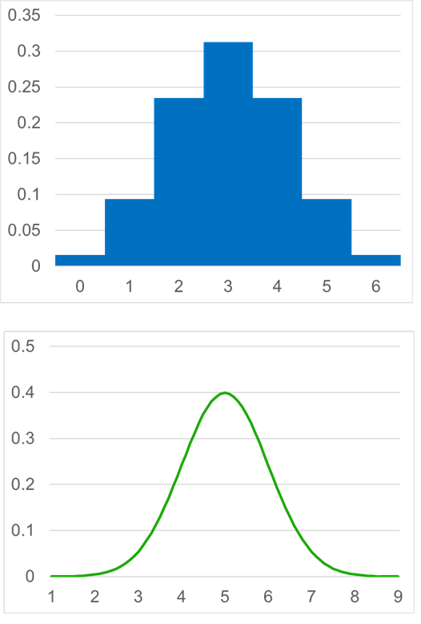
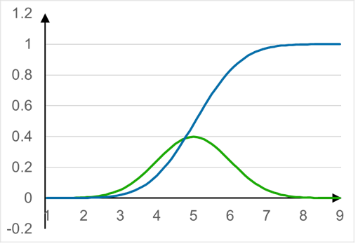
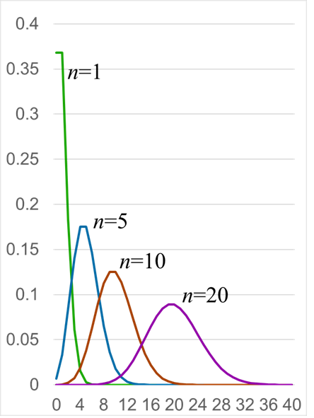
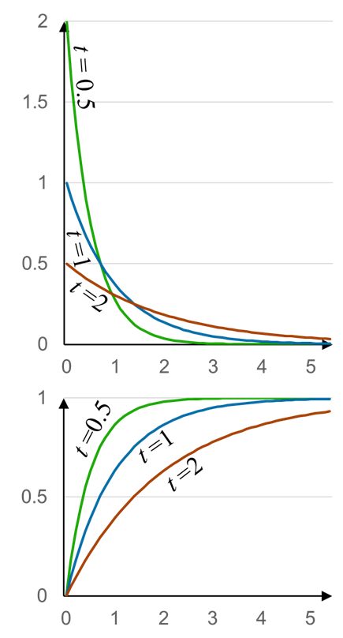
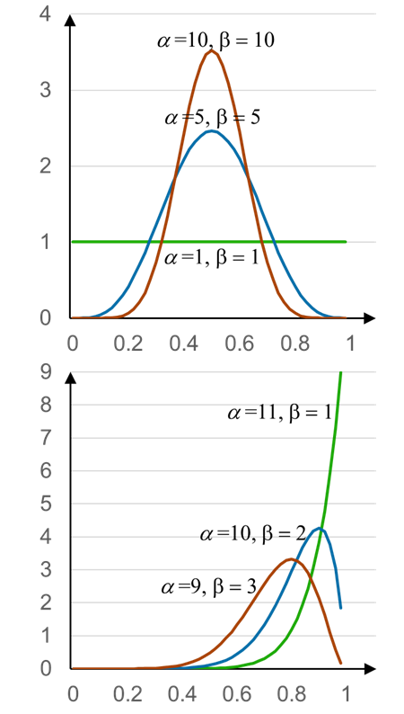
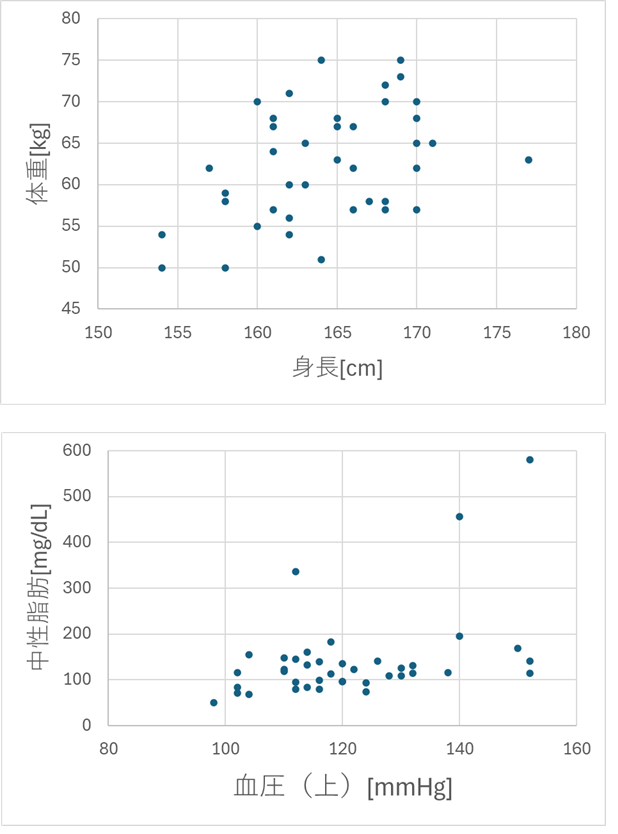

<!-- footer: "機械学習（と統計）第4回" -->

# 機械学習

## 第4回: 様々な分布II

千葉工業大学 上田 隆一

 

This work is licensed under a [Creative Commons Attribution-ShareAlike 4.0 International License](https://creativecommons.org/licenses/by-sa/4.0/).

---

<!-- paginate: true -->

## 今日やること

- 離散型確率分布と連続型確率分布の違い
- 二項分布、ガウス分布以外の重要な分布について確認
    - ポアソン分布
    - 指数分布
    - ベータ分布
- 多次元の分布

式も重要ですけど現象との関係に注目しましょう

---

## 離散、連続

- 確率変数が整数のときと実数（小数）のときがある
    - 二項分布: 整数（離散型確率分布）
    - ガウス分布: 実数（連続型確率分布）
- 両者の共通点と相違
    - 共通していること: 確率の合計は1
    - 違うところ
        - 離散型の場合は各変数の確率を足せば1に
        - 連続型の場合は積分しないといけない
            - グラフの縦軸は確率ではなく密度
            - 変数の範囲$\times$密度$=$確率（次ページ）

---

### 連続型確率分布からの確率の求め方

- 実のところ積分する機会は少ない（安心）
- 累積分布関数（の表）を使用
    - $\text{Pr}\{$変数の値が$x$以下$\}$のグラフや表
    - 例: 右図の青色の線
        - ガウス分布の累積分布
        - 緑色の線（ガウス分布の確率密度関数）の積分値
- [表の例](https://unit.aist.go.jp/mcml/rg-orgp/uncertainty_lecture/normsdist.html)（左側からの積分値になっている）
- もちろん確率密度関数から表計算ソフトで求めてもよい（右図はExcelで描画）

---

### 問題

- [前ページの表](https://unit.aist.go.jp/mcml/rg-orgp/uncertainty_lecture/normsdist.html)を使って、ガウス分布にしたがう変数が、ガウス分布の$2\sigma～3\sigma$の範囲に入る確率を計算してみましょう
    - 当該範囲は両側にあるので注意
* 答え: $2(0.02275-0.00135)=0.0428$

---

## さまざまな分布

- いろんな自然、社会現象に現れる分布を見ていきましょう

---

### ポアソン分布

- ある事象が一定時間に起こる回数がしたがう分布
    - 式: $P(x) = \dfrac{n^x e^{-n}}{x!}  = \eta \dfrac{n^x}{x!}$
        - $n$: ある期間にその事象が起こる回数
- 事象の例
   - 1ヶ月以内の地震の数など
- 分布の形
    - $n$が大きいとガウス分布に近づく
        - なんででしょう？
            * 大量のコインを投げて何枚表になるでしょうかという問題と等価になる

---

### 問題

- 問題: 年1回大きな地震が起こる地域で、次の3つの確率を求めてみましょう
    - ある年に起こらない確率
    - 1回起こる確率
    - 3回以上起こる確率
- ポアソン分布の式（再掲）: $P(x) = \dfrac{n^x e^{-n}}{x!}$
    - $0! = 1$に注意
- 答え
    * $P(0) = e^{-1} = 0.36789744... \approx 0.37$
    * $P(1) = e^{-1} = 0.36789744... \approx 0.37$（きっちり1回の年は4割もない）
    * $\text{Pr}(3$回以上$) = 1 - \left\{P(0) + P(1) + P(2)\right\}$
    $\qquad\qquad\qquad= 1 - (e^{-1} + e^{-1} + e^{-1}/2) \approx 0.08$

---

### 指数分布

- ある事象が起こってから次に起こるまでの間隔がしたがう分布
    - 例: 地震と地震の間の時間間隔
    - ポアソン分布と表裏一体（違いはちゃんと説明できるようにしましょう）
- 確率密度関数: $P(x) = \dfrac{1}{t}\exp\left\{-\dfrac{x}{t}\right\}$
    - $t$: 間隔の平均値（$1/t$: ポアソン分布の$n$）
- 累積分布関数: $\text{Pr}\{$値が$x$以下$\} = 1 - \exp(-x/t)$

---

### 問題

- 1年に1回地震が起こるとき、半年以内に起こる確率は$0.5$より大きい？
- ヒント: 累積分布関数（再掲）
    - $1 - \exp(-x/t)$
* 答え
    * $1 - \exp(-1/2)= 1 - 1/\sqrt{e} \approx 0.393$
        * $0.5$より小さい

---

### ベータ分布

- 式: $p(x) = \dfrac{ x^{\alpha-1}(1-x)^{\beta-1}}{B(\alpha,\beta)} = \eta x^{\alpha-1}(1-x)^{\beta-1}$
    - $B$はベータ関数というややこしい関数
- コインの表、裏がそれぞれ$(\alpha-1)$、$(\beta-1)$回出たときに、表が出る確率の分布
    - 投げるほど分布が尖っていく
        - 数学的な解釈: ある確率に収束していく
        - 生物的な解釈: ある確率なのではないかとだんだん確信していく

---

## 多次元の分布

- 世の中の状態、現象は互いに絡み合っている
    - 例: 身長の高い人は（そうでない場合もあるけど）体重も重い
- 次の資料で関係していそうな項目を見つけてみましょう
    - [日本病院薬剤師会のサイトにあるデータ](https://www.jshp.or.jp/activity/zasshi-toko/kaiseki-6.xls)（Excelファイル）

---

### 関係のありそうな項目

