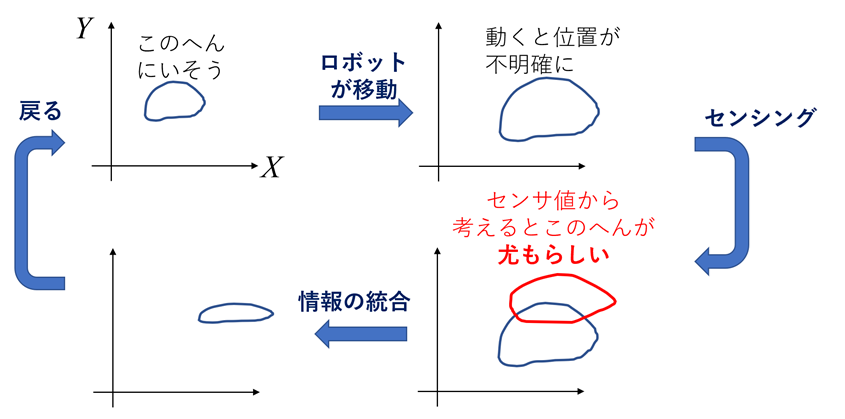

<!-- footer: "機械学習（と統計）第5回" -->

# 機械学習

## 第5回: 連想ゲームとベイズの定理

千葉工業大学 上田 隆一

 

This work is licensed under a [Creative Commons Attribution-ShareAlike 4.0 International License](https://creativecommons.org/licenses/by-sa/4.0/).

---

<!-- paginate: true -->

## 今日やること

- クイズ
- ベイズの定理

---

## クイズ

- なんのことをいっているのでしょう？ヒントをひとつずつ出すので候補をいろいろ書いてみてください。
    * 上に卵が乗っていることがある
    * スープに入っている
    * 日本人はズルズルいわせて食べる
    * 白い

---

### クイズの答えと、答えより重要なこと

- たぶん「うどん」が正解
    - ほかにあるかもしれませんが
- 答えよりも重要なこと: 我々の頭のなかはどうなってる？
    - 脳細胞がなにをやっているかはこの講義の範囲を超える
    - なんとなく「確率」を使ってないでしょうか？
    （どうやって使っているか議論してみましょう）

---

### 連想ゲームと確率の計算

- たとえばこの状態のとき、「白い」を教えられたらどうなるか
    - うどん: 40%
    - そば: 60%（ 関東なのでそば強めで👈これもあとから議論）
- 「白い」を教えられたあとの確率は条件付き確率（2回目で出てきたやつ）
で表記できる
    - Pr$\{$うどん$|$白い$\}$
    - Pr$\{$そば$|$白い$\}$

表記はできるけど計算は？

---

### これで計算できる（理屈はあとで）

- 乗法定理とよく似ているが違う式で計算
    - $\text{Pr}\{$うどん$|$白い$\} =\eta\text{Pr}\{$白い$|$うどん$\}\text{Pr}\{$うどん$\}$
    - $\text{Pr}\{$そば$|$白い$\} =\eta\text{Pr}\{$白い$|$そば$\}\text{Pr}\{$そば$\}$
    - $\eta$は上記2つの確率の和が1になる確率
- 以下の数値で計算してみましょう
    - $\text{Pr}\{$うどん$\} = 0.4$、$\text{Pr}\{$そば$\} = 0.6$
    - $\text{Pr}\{$白い$|$うどん$\} = 0.99$、$\text{Pr}\{$白い$|$そば$\} = 0.1$
        - 補足: 白いそばもある
    - 答えは次ページ

---

### 答え

- とりあえず$\eta$以外を計算
    - $\text{Pr}\{$うどん$|$白い$\} =\eta 0.99 \cdot 0.4= 0.396\eta$
    - $\text{Pr}\{$そば$|$白い$\} =\eta 0.1 \cdot 0.6 = 0.06\eta$
- $0.396\eta + 0.06\eta = 1 \Longrightarrow \eta = 1/0.456$
- したがって
    - $\text{Pr}\{$うどん$|$白い$\} =0.396\eta = 0.396/0.456 \approx 0.87$
    - $\text{Pr}\{$そば$|$白い$\} = 0.06\eta = 0.06/0.456 \approx 0.13$

「白い」という情報でうどんがそばを逆転

---

## ベイズの定理

- さっき使った式を一般化すると
    - 答えの候補: $A_1, A_2, \dots, A_n$
    - $\text{Pr}\{A_i$が答え$|$新たな情報$\} =\eta\text{Pr}\{$新たな情報$|A_i\}\text{Pr}\{A_i$が答え$\}$
        - $\eta = \sum_{i=1}^n \text{Pr}\{$新たな情報$|A_i\}\text{Pr}\{A_i$が答え$\}$
- 確率分布版
    - $P(x|y) = \eta P(y|x)P(x) = \dfrac{P(y|x)P(x)}{\sum_{x'}P(y|x')P(x')}$
        - $\sum_{x'}$は$x'$に全通りの$x$を入れて足したもの

 

ぱっと見ただけだと難しそうだけど情報を扱う上で自然な式

---

### 乗法定理とベイズの定理

- ベイズの定理は乗法定理から導出できる
    - $\text{Pr}\{A$かつ$B\} = \text{Pr}\{A|B\}\text{Pr}\{B\}$
    - $\text{Pr}\{A$かつ$B\} = \text{Pr}\{B|A\}\text{Pr}\{A\}$
- 右辺から（どうなるでしょうか?）
    * $\text{Pr}\{A|B\}\text{Pr}\{B\} = \text{Pr}\{B|A\}\text{Pr}\{A\}$
    $\Longrightarrow$ $\text{Pr}\{A|B\} = \dfrac{\text{Pr}\{B|A\}\text{Pr}\{A\}}{\text{Pr}\{B\}}= \eta\text{Pr}\{B|A\}\text{Pr}\{A\}$

---

### 式を見た上でもう1問

- 人をたずねて知らない10階建のビルで迷って何階にいるかわからなくなりました。とりあえずその人のいる2階は床の色が青だそうですが、いまいるところは床が赤色です。各階にいる確率はどうなるでしょうか?

 

答えはなんとなく分かるはずなので、ベイズの定理で説明を

答えは次のページ

---

### 答え

- $n$階にいる確率を表す確率分布$P(n) = 1/10$を考えると、まず次が成り立つ
    - $P(n|$床が赤色$) = \eta \text{Pr}\{$床が赤色$|n\}P(n) = \eta \text{Pr}\{$床が赤色$|n\}/10$
- 次も成り立つ（$x$は$0$でない確率）ので上の式に代入
    - $\text{Pr}\{$床が赤色$|n\} =\begin{cases}0 & (n = 2) \\ x & (n \neq 2)\end{cases}$ 
    $\Longrightarrow$ $P(n|$床が赤色$) =\begin{cases}0 & (n = 2) \\ \eta x/10 & (n \neq 2)\end{cases}$ 
- $P(1|$床が赤色$), P(2|$床が赤色$), \dots, P(10|$床が赤色$)$の和は1なので、
    - $P(n|$床が赤色$) =\begin{cases}0 & (n = 2) \\ 1/9 & (n \neq 2)\end{cases}$ 

※人間だと別のものを見たらすぐ何階か分かるが、ロボットの場合はこうやって位置を求めることがある

---

### ベイズの定理の実用

- ロボットの位置推定
    - センサの値と場所の比較をする
    
    - [実例1](https://www.youtube.com/watch?v=jXYEA2ptgnA)、[実例2](https://www.youtube.com/watch?v=Dgd2tOCEYno)

---

### さらに問題（答えは提示しません）

- コインを投げて表裏を当てる遊びをしています。ここ3回、すべて表が出ていますが、次の回に表が出る確率はどれだけでしょうか?

---

### さらにさらに問題

- 信じると絶対に風邪をひかないという宗教を信じている人が風邪をひきました。風邪をひかないという考えは変わるでしょうか?

---

## ベイズの定理による推論の構造

- 「事前知識」に新しい情報と解釈が入って知識が更新される
    - 知識: 確率分布
        - 事前知識: 事前分布
        - 更新された知識: 事後分布
        - 知識の解釈: 尤度

---

### ものごとに対する人間の推論

- ベイズの定理を計算しているかは不明だが、解いている問題は同じ
    - 重要: ベイズの定理以上の推論は不可能
- 人の思考回路をいろいろ解釈できる（要議論）
    - 洗脳が解けない: 事前確率が尖っているから/
    0だから/尤度がおかしい
- 勉強についてもモデルかできる
    - 尤度がフラット（理解に必要な前提知識がついてない/関心がない）
    - 事後分布の変化が小さく成長に気づいてない

同様のことは機械学習でも起こる

---

### ベイズの定理の注意

- 情報をどんどん追加していくことができるが、同じデータや互いに独立でないデータを入れてはならない
    - 事象A, Bの起こる確率に$\text{Pr}\{$AかつB$|$C$\} = \text{Pr}\{$A$|$C$\}\text{Pr}\{$B$|$C$\}$の関係が必要（Cは尤度に反映されているなんらかの条件）
- よくない例（不当に分布が鋭くなる）
    - うどんの例で「白い」を2回情報として入れると計算がおかしくなる
    - 洗脳（みんな同じことを言うけど原因は教祖1人）
- よくある例
    - 同じ原因の雑音が乗ったセンサデータをロボットに入力し続ける
    $\rightarrow$ロボットが勘違いする
    - 先生に聞けばいいことを学生間で情報を回しているうちに集団で間違える
        - 勝手になんか怖い先生にされているとか

---

### 尤度

- この式（ベイズの定理）の赤い部分
    - $\text{Pr}\{\circ\circ$は$\times\times$$|$新たな情報$\} =\eta$$\text{Pr}\{$新たな情報$|\circ\circ$は$\times\times$$\}$$\text{Pr}\{\circ\circ$は$\times\times\}$
    - 「$\circ\circ$は$\times\times$だ」と仮定したときに「新たな情報」がどれだけ「尤も（もっとも）らしい」かを数値化
- おさらい
    - $\text{Pr}\{$白い$|$うどん$\} = 0.99$、$\text{Pr}\{$白い$|$そば$\} = 0.1$
        - 「白い」が新しい情報で、「うどん」と「そば」が未定だった
- 尤度（=知識を受け入れるときの解釈）の根拠は?
    - ある場合とない場合がある（次回は「ある場合」）
    - うどん/そばについては根拠は特にない
        - $0.99$、$0.1$は講師が「経験で」なんとなく決めたもの（あとで議論）

---

### 尤度の表記、性質

- $\text{Pr}\{$新たな情報$|\circ\circ$は$\times\times$$\}$: 「新たな情報」は確定しているので、「$\circ\circ$は$\times\times$」のほうをいろいろ変えると値が変わる$\Longrightarrow$条件のほうが変数になっている
    - おさまりが悪い
- $\text{L}\{\circ\circ$は$\times\times|$新たな情報$\}= \text{Pr}\{$新たな情報$|\circ\circ$は$\times\times\}$を考える
    - これが尤度の明示的な表現方法
- 尤度は確率の要件を満たさなくてよい
    - 例: $\text{Pr}\{$白い$|$うどん$\} = 0.99$、$\text{Pr}\{$白い$|$そば$\} = 0.1$は足しても1にならない
    - 確率で扱われているのは「新たな情報」の方
    - それでもベイズの定理は成立（なぜか考えてみましょう）

---

### 事前分布の解釈

- ある時点での知識の積み重ねや知識・意識の偏り
    - さきほどの例: 
        - うどん: 40%、そば: 60%
        - 関西だとおそらく逆転
- ある時点でのベイズの定理の結果

     

人によって異なる

---

### 議論

- これは数学なんだろうか?
    - 尤度の根拠がはっきりしない場合がある
    - 事前分布は人によって違う
        
- 議論してみましょう
    - 数学なのにあんまり厳密じゃなさそうなのにこれでいいのか?
    - 逆にこれだからいいことは?

---

### 知能の研究的によいところ（自然なところ）

- エージェント（要は個々の人や人工知能）の癖を扱える
- 尤度や事前分布が決まれば、その前提の上で正しい事後確率を計算できる
 
- 統計学での議論は興味のある人が各自調べましょう

---

## まとめ

- ベイズの定理
    - ある情報を知りたい情報の確率分布に反映させる方法（原理?）
        - 「学習」というものの本質?
    - 情報定理から導出できる
    - 尤度関数が媒介
    - まだそこまで便利だとは思えないかもしれない
- 時間が余ったときの問題
    - [どこにいるのかを当てるゲーム](https://b.ueda.tech/?page=robot_and_stats_questions#%E3%81%A9%E3%81%93%E3%81%AB%E3%81%84%E3%82%8B%E3%81%AE%E3%81%8B%E3%82%92%E5%BD%93%E3%81%A6%E3%82%8B%E3%82%B2%E3%83%BC%E3%83%A0)
