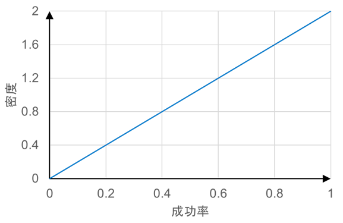
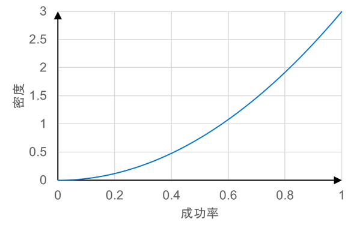
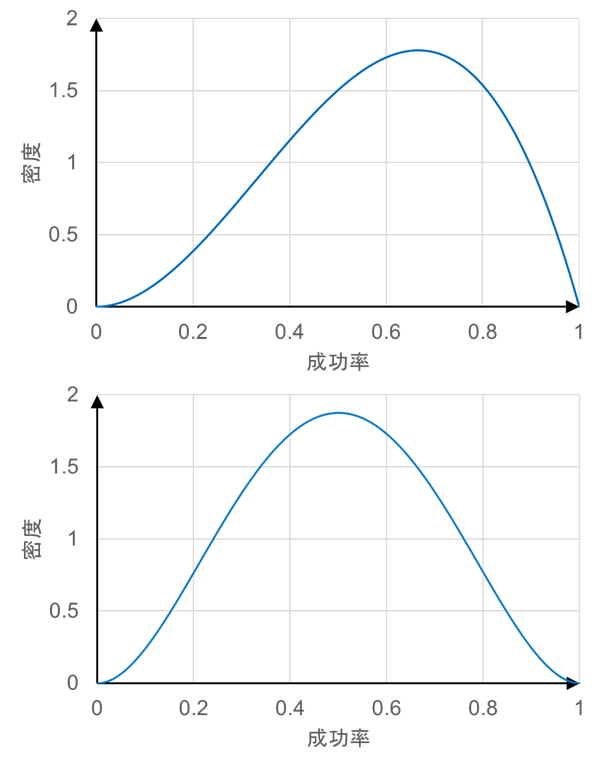

<!-- footer: "機械学習（と統計）第6回" -->

# 機械学習

## 第6回: 推定値のあいまいさ

千葉工業大学 上田 隆一

 

This work is licensed under a [Creative Commons Attribution-ShareAlike 4.0 International License](https://creativecommons.org/licenses/by-sa/4.0/).

---

<!-- paginate: true -->

## 今日やること

- 実験結果のベイズ的な考え方
- 共役

---

### ベータ分布（再掲）

- 式: $p(x) = \dfrac{ x^{\alpha-1}(1-x)^{\beta-1}}{B(\alpha,\beta)} = \eta x^{\alpha-1}(1-x)^{\beta-1}$
    - $B$はベータ関数というややこしい関数
- コインの表、裏がそれぞれ$(\alpha-1)$、$(\beta-1)$回出たときに、表が出る確率の分布
    - 投げるほど分布が尖っていく
        - 数学的な解釈: ある確率に収束していく
        - 生物的な解釈: ある確率なのではないかとだんだん確信していく

今日はこれを掘り下げます

---

### 問題

- 題材: ボールを投げて頭上の籠に入れる玉入れロボットを作りました。これから実験で籠に入る確率を求めます。
     
- 最初の問題: まず1回試行したら成功しました。成功率はどれだけでしょうか?
    - 話し合ってみましょう

---

### 最初の1回の計算方法

- まず、成功率を$t$としましょう
- 試行前、偏見がなければ$t$の分布（確率$t$の密度）はこうなる
    - $p(t) = 1$（注意: 確率が$1$なのではなく、密度が$1$で積分すると$1$になる）
- ベイズの定理のために尤度を考える
    - $\text{Pr}($成功$|t) = t$、$\text{Pr}($失敗$|t) = 1-t$
- ベイズの定理
    - $p(t|$成功$) = \eta\text{Pr}($成功$|t)p(t)=\eta t=2t$

---

### 最初の1回のポイント

- 成功したんだから成功率が$0$ということはない
- 最初成功したからといって次に成功するとは限らない
    - ただし、今の時点では次も成功する可能性は高い

 
 

グラフがこれらのことを示している

---

### 次の問題

- 続けて試行したらまた成功しました。確率分布はどうなるでしょうか？
- 現在の分布: 
    - $p(t|$成功$) = \eta\text{Pr}($成功$|t)p(t)=\eta t=2t$
- 求めたい分布: 
    - $p(t|$成功, 成功$)$
- 尤度
    - $\text{Pr}($成功$|t) = t$、$\text{Pr}($失敗$|t) = 1-t$

---

### 答え

- ベイズの定理を使う
    - $p(t|$成功, 成功$) = \eta\text{Pr}($成功$|t)p(t|$成功$)$
    $=\eta t2t = 2\eta t^2 = 3t^2$
- グラフから
    - $1$に近い成功率の可能性がより高まる
    - $0$に近い成功率の可能性も残っている
- 問題: 成功率$0.5$以下の確率は?

---

### さらに

- 3回目、4回目の試行が失敗でした。
成功率の分布は?
- 求めたい分布: $p(t|$成功, 成功, 失敗, 失敗$)$
- 尤度: $\text{Pr}($失敗$|t) = 1-t$
- 答え（定数は$\eta$に吸収）
    * $p(t|$成功, 成功, 失敗$)$
    $=\eta\text{Pr}($失敗$|t)p(t|$成功, 成功$)$
    $=\eta t^2(1-t)$（上図）
    * $p(t|$成功, 成功, 失敗, 失敗$)$
    $=\eta\text{Pr}($失敗$|t)p(t|$成功, 成功, 失敗$)$
    $=\eta t^2(1-t)^2$（下図）

---

### 結局

- $n$回成功、$m$回失敗の場合の成功率の分布: 
    - $p(t|$成功$n$回, 失敗$m$回$) = \eta t^n(1-t)^m$
    - ↑ベータ分布
    - $n, m$が増えていくとだんだん分布が尖って動かなくなってくる（余裕があれば計算してみましょう）
- 重要なこと
    - 試行から単純に計算した成功率は$n/(n+m)$だが、「真の」成功率は確定せず、分布となる
    - ある程度実験しないと確からしい成功率は得られない

---

### ベイズの定理から分かる日常の教訓

（繰り返しになるけど）人間の頭がベイズの定理を厳密に解いているかは分からないが、ベイズの定理を超えて真実を知ることがは原理的に不可能なので・・・

- 何かが1、2回起こったことで、次どうなるかを決めつけてはいけない
    - 日常的にやってませんか?
- 試行を重ねると判断が正しくなっていく
    - 年寄りの話しは基本よく聞いたほうがいい
    - が、しかし、頑固になってしまっているので、途中でルールが変わってしまったことに気付かないと年寄りは間違えたことを言うようになる

---

### ベイズの定理と機械学習

- いまやった分布の更新は、機械学習の基本的な原理
    - 知識が入るごとに何かの分布が変化して尖っていく
    - 知識が入るまえは平たい分布
- 確率の確率分布を考える
    - 「成功率」とは確率なので「確率の確率分布」を考えていたことに
        - 混乱しやすいので分からなくなったら頭の整理が必要

---

## 共役

---

### ベイズの定理の事前・事後確率

- ベイズの定理の計算は事前確率$p(x)$と事後確率$(x|y)$が同じ分布だと簡単
    - ベイズの定理: $p(x|y) = \eta p(y|x)p(x)$
    - 前半の例は両方ベータ分布だった
        - 知識が入ったら$m$と$n$の値だけを更新すればよい（すごく簡単）
- 同じにならないときがある
    - 尤度$p(y|x)$の形による

---

### 事前・事後確率が同じになる組み合わせ（一部）

|$x$の分布（事前・事後分布）|$y$の分布（尤度のもとになる分布）|
|:---:|:---:|
|ベータ分布|ベルヌーイ分布|
|ガウス分布|ガウス-ガンマ分布|
|多次元ガウス分布|ガウス-ウィシャート分布|
|ディリクレ分布|多項分布|
|ガンマ分布|ポアソン分布|

- 分布について
    - ベルヌーイ分布: 前半で扱ったコインの裏表の確率を表す単純な分布
    - 他の分布については各自調査を
- 現象の性質が自然に上記表に当てはまることもあるが、便宜的に使うこともある

