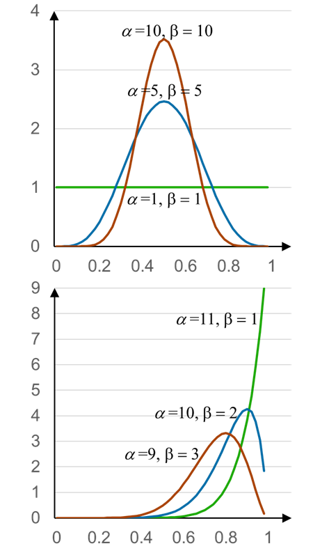

<!-- footer: "機械学習（と統計）第6回" -->

# 機械学習

## 第6回: 推定値のあいまいさ

千葉工業大学 上田 隆一

 

This work is licensed under a [Creative Commons Attribution-ShareAlike 4.0 International License](https://creativecommons.org/licenses/by-sa/4.0/).

---

<!-- paginate: true -->

## 今日やること

- 共役

---

### ベータ分布（再掲）

- 式: $p(x) = \dfrac{ x^{\alpha-1}(1-x)^{\beta-1}}{B(\alpha,\beta)} = \eta x^{\alpha-1}(1-x)^{\beta-1}$
    - $B$はベータ関数というややこしい関数
- コインの表、裏がそれぞれ$(\alpha-1)$、$(\beta-1)$回出たときに、表が出る確率の分布
    - 投げるほど分布が尖っていく
        - 数学的な解釈: ある確率に収束していく
        - 生物的な解釈: ある確率なのではないかとだんだん確信していく

今日はこれを掘り下げます

---

### 問題

- 題材: ボールを投げて頭上の籠に入れる玉入れロボットを作りました。これから実験で籠に入る確率を求めます。
     
- 最初の問題: まず1回試行したら成功しました。成功率はどれだけでしょうか?
    - 話し合ってみましょう

---

### 最初の1回の計算方法

- まず、成功率を$t$としましょう
- 試行前、偏見がなければ$t$の分布（確率$t$の密度）はこうなる
    - $p(t) = 1$（注意: 確率が$1$なのではなく、密度が$1$で積分すると$1$になる）
- ベイズの定理のために尤度を考える
    - $\text{Pr}($成功$|t) = t$、$\text{Pr}($失敗$|t) = 1-t$
- ベイズの定理
    - $p(t|$成功$) = \eta\text{Pr}($成功$|t)p(t)=\eta t=2t$

---

### 最初の1回のポイント

- 成功したんだから成功率が$0$ということはない
- 最初成功したからといって次に成功するとは限らない
    - ただし、今の時点では次も成功する可能性は高い

 
 

グラフがこれらのことを示している

---

### 次の問題

- 続けて試行したらまた成功しました。確率分布はどうなるでしょうか？
- 現在の分布: 
    - $p(t|$成功$) = \eta\text{Pr}($成功$|t)p(t)=\eta t=2t$
- 求めたい分布: 
    - $p(t|$成功, 成功$)$
- 尤度
    - $\text{Pr}($成功$|t) = t$、$\text{Pr}($失敗$|t) = 1-t$

---

### 答え

- ベイズの定理を使う
    - $p(t|$成功, 成功$) = \eta\text{Pr}($成功$|t)p(t|$成功$)=\eta t2t = 2\eta t^2 = 3t^2$
