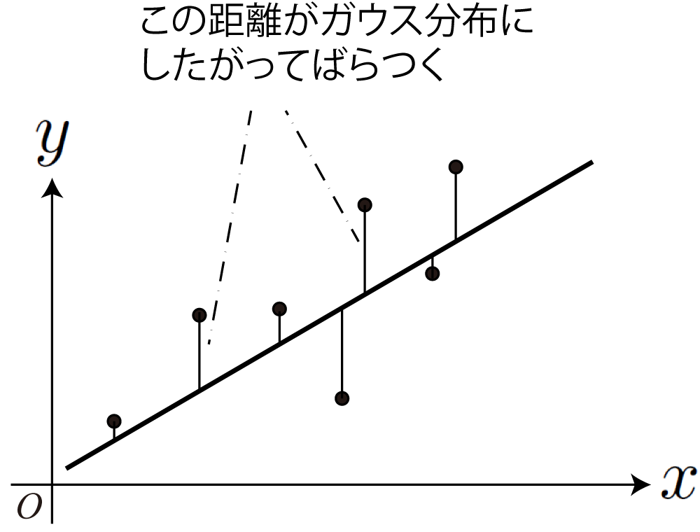

<!-- footer: "機械学習（と統計）第8回" -->

# 機械学習

## 第8回: 法則性の発見+自信のなさの見積もり: ベイズ線型回帰

千葉工業大学 上田 隆一

 

This work is licensed under a [Creative Commons Attribution-ShareAlike 4.0 International License](https://creativecommons.org/licenses/by-sa/4.0/).

---

<!-- paginate: true -->

## 今日やること

- ベイズ線型回帰

---

## 前回のおさらい

- 回帰を勉強した
    - けど、少ないデータでもひとつにグラフを決めてしまう
- なにが足りないか
    - 第6回のようなベイズ的な考えが抜けている
- ベイズ的な考え方をとりいれた回帰がないか?
    - ある

---

## ベイズ線型回帰

- $y = f(x)$の分布を考える
    - 関数の分布ってなに? $\Rightarrow$ パラメータの分布
- 例: $y = w_1 x + w_0$の場合
    - $w_1$と$w_0$の確率分布を考える
    - 右図: $w_1, w_0$それぞれをガウス分布で分布すると考えてサンプリング
        - どちらも平均値$0$、標準偏差$1$
        - データ（黒丸）に合うように、ベイズの定理で$w_1, w_0$の分布を変更していく

---

### ベイズ線型回帰でよくなること

- データ数が少ないときに解を曖昧にしておける
- 事前分布に予測を盛り込める
- パラメータを多めにしておいても不要なものが消えるかもしれない

---

### 回帰のための数式

ややこしいので意味だけ考えましょう

- 例: 当てはめる式: 多項式 $y = w_0 + w_1 x$
- 仮定1: $x_i$に対して、$y_i$は多項式の値$w_0 + w_1 x_i$を
中心に、分散$\lambda^{-1}$でばらつく
    - $y_i \sim \mathcal{N}(w_0 + w_1 x_i| \lambda^{-1})$と表記
        - $\mathcal{N}(\mu, \sigma^2)$: 平均値$\mu$、分散$\sigma^2$のガウス分布
    - 補足: 分散の逆数$\lambda$は精度と呼ばれる

---

### 回帰のための数式（続き）

- 仮定2: $w_0, w_1$も多次元のガウス分布で、最初は大きくばらついている
    - 分布$p(\boldsymbol{w}) = \mathcal{N}(\boldsymbol{w} | \boldsymbol{\mu}, \lambda^{-1}\Lambda^{-1}) \quad$$\leftarrow$これが推定対象
        - $\boldsymbol{w} = (w_0, w_1) = (w_0 \ \ w_1)^\top$
        - $\boldsymbol{\mu} = (\mu_0, \mu_1) = (\mu_0 \ \ \mu_1)^\top$（$w_0, w_1$の平均値）
        - $\Lambda$は$2\times 2$の行列
            - $\lambda\Lambda$: 「精度行列」と呼ばれるもの

---

### 回帰のための数式（続き）

- 仮定3: $\lambda$の値も分からないので確率分布で表現（最初は大きくばらつく）
    - こういう分布: $\text{Gam}(\lambda, a, b) = \eta \lambda^{a-1}e^{-b\lambda}$（ガンマ分布、下図）
        - $\lambda = 10^{-2}$で$y_i$のばらつきの標準偏差が$10$

---

### 回帰の方法（式だけ見せますね）

- $w_0, w_1, \lambda$の事前分布
    - $p_0(\boldsymbol{w}, \lambda) = \mathcal{N}(\boldsymbol{w} | \boldsymbol{\mu}_0, \lambda^{-1}\Lambda^{-1}_0)\text{Gam}(\lambda, a_0, b_0)$
        - $\boldsymbol{\mu}_0, \Lambda_0, a_0, b_0$は分布の形を決めるパラメータ
        （=事前分布のパラメータ）

---

### 回帰の方法（続き）

- データ$(x_1, y_1)$をひとつだけ情報として入れた事後分布
    - $p(\boldsymbol{w}, \lambda | x_1, y_1) = \eta p(x_1, y_1 | \boldsymbol{w}, \lambda)p_0(\boldsymbol{w}, \lambda)= \cdots$
        $= \eta \mathcal{N}\left[ w_1 x_1 + w_0, \lambda^{-1} \right] p_0(\boldsymbol{w}, \lambda)\qquad$（仮定1から）
        $= \cdots$
        $= \mathcal{N}(\boldsymbol{w} | \boldsymbol{\mu}_1, \lambda^{-1}\Lambda^{-1}_1)\text{Gam}(\lambda, a_1, b_1)$
        - $\Lambda_1 = \phi(x_1)\phi(x_1)^\top + \Lambda_0\qquad\qquad$（ここで$\phi(x) = (1 \ \  x)^\top$）
        - $\boldsymbol{\mu}_1 = \Lambda_1^{-1} \{ y_1\phi(x_1) + \Lambda_0 \boldsymbol{\mu}_0 \}$
        - $a_1 = 1/2 + a_0$
        - $b_1 = \left( y_1^2 -  \boldsymbol{\mu}_1^\top \Lambda_1 \boldsymbol{\mu}_1 + \boldsymbol{\mu}_0^\top \Lambda_0\boldsymbol{\mu}_0 \right)/2 + b_0$

---

### ポイント

- 事前確率と事後確率の分布が同じ形
    - 事前確率: $p(\boldsymbol{w}, \lambda | x_0, y_0) = \mathcal{N}(\boldsymbol{w} | \boldsymbol{\mu}_0, \lambda^{-1}\Lambda^{-1}_0)\text{Gam}(\lambda, a_0, b_0)$
    - 事後確率: $p(\boldsymbol{w}, \lambda | x_1, y_1) = \mathcal{N}(\boldsymbol{w} | \boldsymbol{\mu}_1, \lambda^{-1}\Lambda^{-1}_1)\text{Gam}(\lambda, a_1, b_1)$
- $\Lambda_1, \boldsymbol{\mu}_1, a_1, b_1$は既存の数値で計算可能$\rightarrow$事後分布が計算可能
    - 講義だとどうしても原理の話になり、それは重要なのだけど、使うときは前ページの下の4つの式に事前分布のパラメータとデータの値を入力するだけ
    - まず大事なことは、使いどころがどこなのかおさえておくこと

 

今の内容、何をやってたのかグループで議論を

---

### データが多い場合

- データがはいるごとに事後分布を事前分布にして更新
- データ$(x,y)_{1:N}$に対する事後分布:
    - $p_N( \boldsymbol{w}, \lambda) = \eta \mathcal{N}(\boldsymbol{w} | \boldsymbol{\mu}_N, \lambda^{-1}\Lambda_N^{-1} ) \text{Gam}(\lambda | a_N, b_N)$
        - $\Lambda_N = \sum_{i=1}^N \boldsymbol{\phi}(x_i) \boldsymbol{\phi}(x_i)^\top + \Lambda_0$ 
	    - $\boldsymbol{\mu}_N = \Lambda_N^{-1}\left( \sum_{i=1}^N y_i \boldsymbol{\phi}(x_i)+ \Lambda_0\boldsymbol{\mu}_0 \right)$
	    - $a_N = \dfrac{N}{2} + a_0$
	    - $b_N = \dfrac{1}{2}\left( \sum_{i=1}^N y_i^2 -  \boldsymbol{\mu}_N^\top \Lambda_N \boldsymbol{\mu}_N + \boldsymbol{\mu}_0^\top \Lambda_0\boldsymbol{\mu}_0 \right) + b_0$
            - ここで$\phi(x_i) = (1 \ \ x \ \ x^2 \ \ \dots \ \ x^n)^\top$

これもデータと事前分布のパラメータを当てはめるだけ

---

### さらに$y = w_0 + w_1 x$以外の曲線を当てはめることを考えてみる 

- いろんな関数に係数をかけて足したもの
    - $y = w_0 \phi_0(x) + w_1 \phi_1(x) + w_2 \phi_2(x) + \dots = \boldsymbol{w}\cdot\boldsymbol{\phi}(x)$
        - $\boldsymbol{w} = (w_0 \ \ w_1 \ \ w_2 \ \ \cdots)^\top$
        - $\boldsymbol{\phi}(x) = (\phi_0(x) \ \ \phi_1(x) \ \ \phi_2(x) \ \ \cdots)^\top$
- $y = w_0 + w_1 x$でも難しいのに大丈夫か?$\rightarrow$大丈夫
    - 実は前ページの式がそのまま使える

---

### 例: $y = w_0 + w_1 x^1 + w_2 x^2 + w_3 x^3 + w_4 x^4$

- 少しずつデータを入力して、事後分布から関数（多項式）をサンプリング
    - データが増えるにしたがって関数のばらつきが減る
    - データ（2次関数からサンプリング）にしたがい、高次のパラメータが$0$へ

